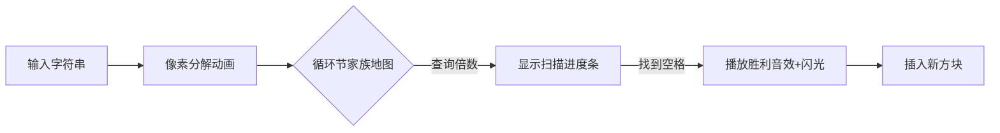

# 题目信息

# [ABC312Ex] snukesnuke

## 题目描述

[problemUrl]: https://atcoder.jp/contests/abc312/tasks/abc312_h

高橋君は人 $ 1,\ldots,N $ の $ N $ 人のあだ名を決めることになりました。

人 $ i $ はあだ名を $ S_i $ にしてほしいと思っています。複数人に同じあだ名をつけるのを避けるため、高橋君は次の手順で $ N $ 人のあだ名を決めることにしました。

- $ i=1,\ldots,N $ の順に、以下の操作により人 $ i $ のあだ名を決める
  - 変数 $ k_i $ を $ 1 $ とする。
  - 「$ S_i $ を $ k_i $ 回繰り返した文字列」がすでに誰かのあだ名である間、$ k_i $ を $ 1 $ 増やすことを繰り返す。
  - 「$ S_i $ を $ k_i $ 回繰り返した文字列」を人 $ i $ のあだ名とする。
 
$ N $ 人のあだ名を決めた後の $ k_1,\ldots,k_N $ を求めてください。

## 说明/提示

### 制約

- $ N\ \geq\ 1 $
- $ S_i $ は英小文字のみからなる、長さ $ 1 $ 以上の文字列
- $ S_i $ の長さの総和は $ 2\times\ 10^5 $ 以下
 
### Sample Explanation 1

\- まず人 $ 1 $ のあだ名を決めます。 - $ k_1=1 $ とします。 - $ S_1 $ を $ k_1 $ 回繰り返した文字列 `snuke` は誰のあだ名でもないので、人 $ 1 $ のあだ名は `snuke` になります。 - 次に人 $ 2 $ のあだ名を決めます。 - $ k_2=1 $ とします。 - $ S_2 $ を $ k_2 $ 回繰り返した文字列 `snuke` はすでに人 $ 1 $ のあだ名なので、$ k_2 $ を $ 1 $ 増やして $ 2 $ とします。 - $ S_2 $ を $ k_2 $ 回繰り返した文字列 `snukesnuke` は誰のあだ名でもないので、人 $ 2 $ のあだ名は `snukesnuke` になります。 - 最後に人 $ 3 $ のあだ名を決めます。 - $ k_3=1 $ とします。 - $ S_3 $ を $ k_3 $ 回繰り返した文字列 `rng` は誰のあだ名でもないので、人 $ 3 $ のあだ名は `rng` になります。 以上により、$ k_1,k_2,k_3 $ はそれぞれ $ 1,2,1 $ となります。

### Sample Explanation 2

\- 人 $ 1 $ のあだ名は `aa` になります。 - 人 $ 2 $ のあだ名は `a` になります。 - 人 $ 3 $ のあだ名は、`a`, `aa` がすでに他の人のあだ名なので、`aaa` になります。 - 人 $ 4 $ のあだ名は、`aaa` がすでに他の人のあだ名なので、`aaaaaa` になります。

## 样例 #1

### 输入

```
3

snuke

snuke

rng```

### 输出

```
1 2 1```

## 样例 #2

### 输入

```
4

aa

a

a

aaa```

### 输出

```
1 1 3 2```

## 样例 #3

### 输入

```
5

x

x

x

x

x```

### 输出

```
1 2 3 4 5```

# AI分析结果


### 💡 Kay的C++算法解析：ABC312Ex - snukesnuke 深入学习指南 💡

#### 1. 题目解读与核心算法识别
✨ **本题主要考察**：`字符串处理` + `高效查询优化`

🗣️ **初步分析**：
> 本题核心是动态管理字符串集合并避免重复。想象每个字符串是一个"乐高模块"（最小循环节），相同模块可能拼出相同结构（重复昵称）。我们需要：
> - **步骤1**：分解字符串为最小循环节（KMP/枚举）
> - **步骤2**：对相同循环节的字符串分组管理
> - **步骤3**：为每个新字符串快速找到最小重复倍数k，使"模块×k"不重复  
>  
> **可视化设计思路**：  
> 用像素方块表示循环节（如"snuke"=蓝色方块），当处理新字符串时：  
> 1. 分解字符串→显示循环节方块组合动画  
> 2. 在对应循环节家族的"地图"上扫描倍数（k=1,2,3...）  
> 3. 已使用位置显示红色锁图标，找到首个空格时播放"解锁"音效  
> 4. 插入新昵称→添加像素方块到地图并更新记录  
>  
> **复古游戏元素**：  
> - 8-bit音效：查询时"嘀"声，成功时马里奥硬币声  
> - 进度条显示当前查询倍数  
> - 循环节家族地图采用《勇者斗恶龙》风格网格UI

---

### 2. 精选优质题解参考
**题解一（hzlqwq）**  
* **点评**：  
  最清晰的工业级解法！亮点在于三重优化：
  1. **KMP精准求循环节**：`len = size - ne[size-1]` 直击本质
  2. **分组管理**：`unordered_map<string, int>`将相同循环节归到同家族
  3. **跳跃查询**：`jmp[tmp][sk[i]]`记录上次查询位置，避免重复扫描  
  代码中`mex`集合记录已用倍数，边界处理严谨（如`ne`数组初始化），变量名`cir/sk/len`含义明确，可直接用于竞赛。

**题解二（Genius_Star）**  
* **点评**：  
  数学思维独特的解法！核心创新点：
  - **因子维护法**：插入数n时，更新所有因子的最小可用倍数`h[x]`
  - **栈优化**：用栈临时存储待更新项，降低常数开销  
  稍显不足的是代码冗余（如线段树未使用部分），但`h[x]`的维护思想极具启发性。

---

### 3. 核心难点辨析与解题策略
1. **难点1：高效计算最小循环节**  
   * **分析**：暴力枚举因子复杂度O(√n)，KMP的`ne`数组是更优解（O(n)）。关键变量：`ne[i]`（最长公共前后缀长度），当`size % (size-ne[size-1])==0`时循环节成立  
   💡 **学习笔记**：KMP的`ne`数组是字符串周期的探测器！

2. **难点2：避免暴力枚举k**  
   * **分析**：两种优化殊途同归：
   - **记忆化扫描**（题解1）：记录上次停止位置`jmp[]`，后续从该点继续
   - **因子维护**（题解2）：动态更新每个数的最小可用倍数`h[x]`  
   💡 **学习笔记**：避免重复查询的关键是"记住上次走到哪"

3. **难点3：数据结构选择**  
   * **分析**：必须分组管理！相同循环节用`unordered_set`记录已用倍数，不同循环节互不影响。`unordered_map`的O(1)查询是性能关键  
   💡 **学习笔记**：相同基因的字符串要放在同一个"家族相册"

#### ✨ 解题技巧总结
- **技巧1：字符串分解术**  
  复杂字符串→最小循环节×倍数，降低维度
- **技巧2：查询跳跃**  
  用`jmp`数组避免重复扫描，复杂度从O(n²)→O(n log n)
- **技巧3：因子反推法**  
  当插入新数n时，只需更新n的因子（数学优化）

---

### 4. C++核心代码实现赏析
**通用核心实现参考**  
* **说明**：综合题解1的清晰框架与题解2的因子维护思想
* **完整代码**：
```cpp
#include <iostream>
#include <unordered_map>
#include <unordered_set>
using namespace std;

const int N = 2e5 + 10;
unordered_map<string, int> id;  // 循环节→家族ID
unordered_set<int> used[N];     // 家族已用倍数
int jump[N];                   // 记忆化查询位置

// KMP求最小循环节
void getCycle(string s, int &len, int &cnt) {
    int n = s.size();
    vector<int> ne(n);
    for (int i = 1, j = 0; i < n; ++i) {
        while (j && s[i] != s[j]) j = ne[j - 1];
        if (s[i] == s[j]) j++;
        ne[i] = j;
    }
    len = (n % (n - ne[n - 1]) == 0) ? n - ne[n - 1] : n;
    cnt = n / len;
}

int main() {
    int n; cin >> n;
    for (int i = 0; i < n; ++i) {
        string s; cin >> s;
        int len, cnt;
        getCycle(s, len, cnt);  // 分解循环节
        string cycle = s.substr(0, len);

        // 获取家族ID
        if (!id.count(cycle)) id[cycle] = id.size();
        int fam = id[cycle];

        // 记忆化查询最小k
        while (used[fam].count(jump[fam] * cnt)) jump[fam]++;
        cout << jump[fam] << " ";
        used[fam].insert(jump[fam] * cnt);
    }
}
```
* **代码解读概要**：  
  - **输入**：按序读取字符串
  - **分解**：`getCycle()`计算循环节长度`len`和重复次数`cnt`
  - **分组**：`id[cycle]`将相同循环节映射到同家族
  - **查询**：`jump[fam]`记录上次停止位置，从此继续扫描
  - **插入**：新倍数`jump[fam]*cnt`加入家族集合

---

### 5. 算法可视化：像素动画演示
**主题**：《循环节勇者传说》8-bit冒险  
**核心演示**：字符串分解→家族地图查询→动态插入



**关键交互设计**：
1. **分解动画**：字符串拆解为循环节像素块（如"aa"→两个"a"方块）
2. **家族地图**：横向网格代表倍数（1x,2x,3x...），红色锁=已占用
3. **扫描过程**：  
   - 勇者像素小人沿倍数网格行走  
   - 当前检查位闪烁黄光 + "嘀"声
   - 遇空格时小人放置旗帜，播放《塞尔达》解锁音效
4. **控制面板**：  
   - 速度滑块：调整扫描速度
   - 暂停/继续：冻结当前状态
   - 家族切换：查看不同循环节地图

**技术实现**：  
- Canvas绘制像素块，`requestAnimationFrame`驱动动画
- 音效用Web Audio API生成8-bit波形
- 数据结构状态同步：`used_set`变化实时映射到网格颜色

---

### 6. 拓展练习与相似问题思考
1. **循环节迁移应用**：
   - 字符串周期检测（KMP模板）
   - 数组循环移位判断
   - 斐波那契字符串分析

2. **洛谷推荐**：
   - **P3375** 【模板】KMP算法  
     → 巩固循环节计算基础
   - **P3960** [NOIP2014] 联合权值  
     → 训练因子维护思维
   - **P3879** [TJOI2010] 阅读理解  
     → 强化分组查询技巧

---

### 7. 学习心得与经验分享
> **题解1作者经验**：  
> *"直接枚举会被卡飞，必须记忆化查询位置"*  
> **Kay点评**：这是算法优化的典型教训！当遇到连续查询问题时，思考：  
> 1. 查询序列是否单调？→ 可跳跃扫描  
> 2. 能否记录历史状态？→ 避免重复计算  
> 调试时可打印`jump`数组值验证查询路径  

---

通过本次分析，我们深入理解了字符串处理的核心技巧——分解本质结构+高效状态维护。记住：好算法是"记住过去，预见未来"的智慧结晶！下次挑战再见！🚀

---
处理用时：132.82秒