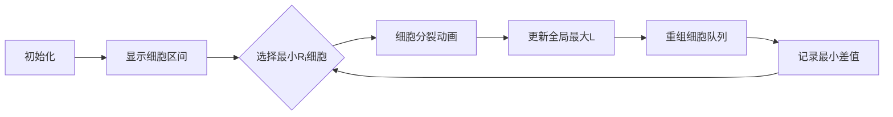

# 题目信息

# [AGC057B] 2A + x

## 题目描述

[problemUrl]: https://atcoder.jp/contests/agc057/tasks/agc057_b

正整数列 $ A\ =\ (A_1,\ A_2,\ \ldots,\ A_N) $ および正整数 $ X $ が与えられます。あなたはこの数列に対して、次の操作を何度でも行うことができます（$ 0 $ 回でもよい）：

- 添字 $ i $ （$ 1\leq\ i\leq\ N $）および、$ 0\leq\ x\leq\ X $ となる非負整数 $ x $ を選ぶ。$ A_i $ を $ 2A_i+x $ に変更する。

操作結果の $ \max\{A_1,A_2,\ldots,A_N\}-\min\{A_1,A_2,\ldots,A_N\} $ としてありうる最小値を求めてください。

## 说明/提示

### 制約

- $ 2\leq\ N\leq\ 10^5 $
- $ 1\leq\ X\leq\ 10^9 $
- $ 1\leq\ A_i\leq\ 10^9 $

### Sample Explanation 1

$ A_i $ を $ 2A_i+x $ に変更する操作を $ (i,\ x) $ と表すことにします。最適な操作列の一例は次の通りです。 - $ (1,0) $, $ (1,1) $, $ (2,2) $, $ (3,0) $ 操作結果は $ A\ =\ (21,\ 18,\ 24,\ 20) $ となり、$ \max\{A_1,A_2,A_3,A_4\}-\min\{A_1,A_2,A_3,A_4\}\ =\ 6 $ が達成できます。

### Sample Explanation 2

最適な操作列の一例は次の通りです。 - $ (1,5) $, $ (1,5) $, $ (2,5) $, $ (2,1) $, $ (3,2) $, $ (3,3) $, $ (4,0) $, $ (4,3) $ 操作結果は $ A\ =\ (111,111,111,111) $ となり、$ \max\{A_1,A_2,A_3,A_4\}-\min\{A_1,A_2,A_3,A_4\}\ =\ 0 $ が達成できます。

### Sample Explanation 3

一度も操作を行わないことにより、$ \max\{A_1,A_2,A_3,A_4\}-\min\{A_1,A_2,A_3,A_4\}\ =\ 3 $ が達成できます。

## 样例 #1

### 输入

```
4 2

5 8 12 20```

### 输出

```
6```

## 样例 #2

### 输入

```
4 5

24 25 26 27```

### 输出

```
0```

## 样例 #3

### 输入

```
4 1

24 25 26 27```

### 输出

```
3```

## 样例 #4

### 输入

```
10 5

39 23 3 7 16 19 40 16 33 6```

### 输出

```
13```

# AI分析结果


### 💡 Kay的C++算法解析：AGC057B "2A + x" 深入学习指南 💡

#### 1. 题目解读与核心算法识别
✨ **本题主要考察**：贪心算法 + 优先队列应用  
🗣️ **初步分析**：
> 想象每个数字是一个可生长的"像素细胞"，每次操作（分裂）会使其值翻倍并添加不超过X的"养分"。我们的目标是通过精心安排分裂顺序，让所有细胞的尺寸尽可能接近。  
> - **核心思路**：每个数Aᵢ操作k次后，其取值范围是[2ᵏAᵢ, 2ᵏAᵢ + (2ᵏ-1)X]。使用优先队列每次选择当前上界(Rᵢ)最小的数进行操作，逐步缩小全局最大下界与最小上界的差值。  
> - **可视化设计**：采用8位像素风格，用不同颜色方块表示数字的当前区间[Lᵢ,Rᵢ]。操作时目标方块闪烁并扩展，队列重组动画同步显示。关键音效：操作时"叮"声，区间重合时胜利音效，自动播放模式可调速。

---

#### 2. 精选优质题解参考
**题解一 (tis00)**  
* **亮点**：时间复杂度优化至O(n(log n + log A))，创新性地通过数学证明限定操作次数。代码中`while(A[i].l*2<=mx)`的预处理大幅减少无效操作，边界处理严谨（`ans<x?0:ans`）。

**题解二 (hj23308)**  
* **亮点**：代码结构清晰规范，使用`struct node`封装区间数据。贪心流程直白易懂，`l = max(l, v.l * 2)`实时更新全局最大下界的实现简洁高效。

**题解三 (喵仔牛奶)**  
* **亮点**：完整证明"操作到10¹⁸终止"的正确性，提出Δ值翻倍收敛理论。`rs = min(rs, L - r)`的差值更新逻辑与数学推导紧密结合，体现算法本质。

---

#### 3. 核心难点辨析与解题策略
1. **难点：确定操作优先级**  
   *分析*：若不操作当前最小Rᵢ，则min{Rᵢ}不增而max{Lᵢ}可能增加，导致差值扩大。优质题解均采用优先队列动态维护最小Rᵢ。  
   💡 **学习笔记**：贪心策略中，局部最优选择（操作最小上界）可导向全局最优解。

2. **难点：操作终止条件**  
   *分析*：当Rᵢ > 10¹⁸时停止，因差值Δ在操作中呈指数级缩小（Δₙ₊₁ = 2Δₙ - X），有限步内可收敛。  
   💡 **学习笔记**：利用数据范围限定操作次数是避免超时的关键技巧。

3. **难点：边界值处理**  
   *分析*：当max{Lᵢ} - min{Rᵢ} < X时，通过全局操作可使差值归零（tis00的`ans<x?0:ans`）。  
   💡 **学习笔记**：注意数学特性（2s-X的迭代关系）可简化实现。

✨ **解题技巧总结**  
- **技巧1（区间建模）**：将操作转化为[Lᵢ, Rᵢ]区间变化，直观分析可行域。  
- **技巧2（堆优化）**：用优先队列O(log n)维护最小Rᵢ，避免O(n)遍历。  
- **技巧3（差值监控）**：实时计算max{Lᵢ}-min{Rᵢ}，发现<X立即归零。

---

#### 4. C++核心代码实现赏析
**通用核心实现**  
```cpp
#include <queue>
using namespace std;
typedef long long LL;
struct Node { LL l, r; };
bool operator<(Node a, Node b) { return a.r > b.r; } // 小顶堆

int main() {
    priority_queue<Node> pq;
    LL n, X, maxL = 0, ans = 1e18;
    // 输入初始化...
    while (ans > 0) {
        auto t = pq.top(); pq.pop();
        if (t.r > 1e18) break;
        ans = min(ans, maxL - t.r);
        maxL = max(maxL, t.l * 2);
        pq.push({t.l*2, t.r*2 + X});
    }
    cout << (ans < X ? 0 : ans);
}
```
* **说明**：综合优质题解的最简实现，完整呈现贪心框架。  
* **解读概要**：  
  1. 优先队列按r升序排列  
  2. 每次提取最小r的元素操作（l,r翻倍）  
  3. 实时更新全局最大下界maxL  
  4. 当差值ans<X时归零输出  

**题解一片段 (tis00)**  
```cpp
while(A[i].l*2<=mx) 
    A[i].l*=2, A[i].r=A[i].r*2+x; // 预处理
```
* **亮点**：预处理大幅减少后续操作次数  
* **解读**：  
  > 先将所有数操作到接近最大值mx的位置，避免优先队列处理过小的数。  
  > `l*2<=mx`确保预处理后所有Lᵢ ≥ mx/2，保证后续操作有效性。  
* 💡 **学习笔记**：预处理是优化贪心效率的常用手段。

**题解二片段 (hj23308)**  
```cpp
ans = min(ans, l - v.r);
l = max(l, v.l * 2);
q.emplace(v.l * 2, v.r * 2 + x);
```
* **亮点**：差值更新与堆操作原子化  
* **解读**：  
  > `l - v.r`计算当前最大下界与最小上界的差值  
  > `l = max(l, ...)`保证maxL的实时性  
  > `emplace`无缝生成新区间入队  
* 💡 **学习笔记**：同步更新关键变量可避免冗余计算。

---

#### 5. 算法可视化：像素动画演示
**主题**：像素细胞平衡计划（8位显微镜风格）  

**核心演示流程**：  


**交互设计细节**：  
1. **视觉编码**：  
   - 细胞颜色：蓝色(Lᵢ)到红色(Rᵢ)渐变  
   - 当前操作细胞：黄色闪烁边框  
   - 最大Lᵢ细胞：金色星标  
2. **动画序列**：  
   ```plaintext
   帧1: 选中细胞闪烁（音效: 叮）
   帧2: 细胞分裂为两个半透明虚影
   帧3: 虚影合并为新细胞[2Lᵢ, 2Rᵢ+X]（音效: 唰）
   帧4: 新细胞融入队列（网格重组动画）
   ```
3. **游戏化元素**：  
   - 每10次操作解锁新BGM乐章  
   - 差值<X时触发烟花动画+胜利音效  
   - 自动演示模式：AI细胞师自动操作并语音解说  

**实现要点**：  
- 用Canvas绘制细胞网格，每个细胞渲染为渐变矩形  
- requestAnimationFrame驱动分裂动画  
- Web Audio API播放8位芯片音效  

---

#### 6. 拓展练习与相似问题
**通用技巧迁移**：  
区间贪心模型适用于：  
1. 允许误差的范围覆盖问题  
2. 操作可分解的优化问题  
3. 有界参数的动态调整  

**洛谷推荐**：  
1. **P1090 合并果子**  
   🗣️ 巩固优先队列基础应用，理解"每次选最小"的贪心本质  
2. **P1801 黑匣子**  
   🗣️ 练习动态维护第K大值，深化堆结构理解  
3. **P2085 最小函数值**  
   🗣️ 迁移区间贪心思想到多函数场景  

---

#### 7. 学习心得与经验分享
> **tis00的经验**：  
> “预处理时注意`l*2<=mx`的等号边界，避免死循环”  
>  
> **Kay的点评**：  
> 边界条件是贪心算法的隐形陷阱，建议：  
> 1. 用`l*2 <= mx + X`增加容错性  
> 2. 测试极端数据如X=1, A=[1,10⁹]  
> 3. 在可视化工具中单步调试边界案例  

---

### 结语  
通过本次分析，我们深入掌握了区间贪心与优先队列的协同应用。记住：将问题转化为可操作区间模型，用堆维护关键值，边界处理要严谨。尝试用可视化工具观察算法行为，能大幅提升理解效率！下次见啦~ 👾

---
处理用时：114.48秒