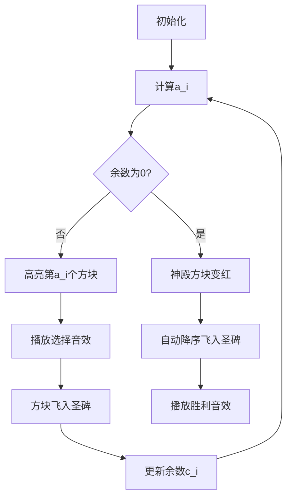

# 题目信息

# [ARC047C] N!÷K番目の単語

## 题目描述

[problemUrl]: https://atcoder.jp/contests/arc047/tasks/arc047_c

高橋語には $ N $ 種類の文字があります。

この問題では便宜上、各文字に辞書順で小さい順に $ 1 $ ～ $ N $ の整数を割り振って扱うことにします。

高橋語の単語は全て $ N $ 文字からなり、$ N $ 種類の文字が全てちょうど $ 1 $ 個ずつ含まれます。 また、そのような文字列は全て高橋語の単語です。

つまり、高橋語の単語は $ N! $ 個あります。

ある $ N $ 以下の正の整数 $ K $ が与えられるので、高橋語の単語の中で辞書順で小さい方から $ N!\ ÷\ K $ 番目の単語を求めてください。

## 说明/提示

### 部分点

この問題には部分点が設定されている。

- $ 1\ ≦\ N\ ≦\ 20 $ を満たすデータセットに正解した場合は $ 30 $ 点が与えられる。
- $ 1\ ≦\ N\ ≦\ 10^5 $ を満たすデータセットに正解した場合はさらに $ 70 $ 点が与えられる。合計で$ 100 $点となる。

### Sample Explanation 1

$ 1,2,3,4 $ の並び替えのうち、辞書順で小さい方から $ 4!\ ÷\ 3\ =\ 8 $ 番目の文字を出力しなければなりません。 高橋語の単語のうち辞書順で小さい方から順に $ 8 $ 個を列挙すると $ 1,\ 2,\ 3,\ 4 $ $ 1,\ 2,\ 4,\ 3 $ $ 1,\ 3,\ 2,\ 4 $ $ 1,\ 3,\ 4,\ 2 $ $ 1,\ 4,\ 2,\ 3 $ $ 1,\ 4,\ 3,\ 2 $ $ 2,\ 1,\ 3,\ 4 $ $ 2,\ 1,\ 4,\ 3 $ となります。よって $ 2,\ 1,\ 4,\ 3 $が求めるべき単語です。

## 样例 #1

### 输入

```
4 3```

### 输出

```
2

1

4

3```

## 样例 #2

### 输入

```
11 7```

### 输出

```
2

7

9

5

4

11

10

8

6

3

1```

# AI分析结果


### 💡 Kay的C++算法解析：ARC047C N!÷K番目の単語 深入学习指南 💡

#### 1. 题目解读与核心算法识别
✨ **本题主要考察**：`组合数学（逆康托展开变形）` + `树状数组/线段树应用`  
🗣️ **初步分析**：  
> 解决这道题就像在巨大的图书馆（$N!$ 本书）中快速找到特定位置的书。核心思路是 **逆康托展开的数学变形**：  
> - 通过取模技巧避免大数计算（$\frac{N!}{K}$ 极大）  
> - 用树状数组动态维护未使用数字集合  
> - 当余数归零时，剩余数字自动按降序排列  
>  
> **可视化设计思路**：  
> 采用 **8-bit像素风格**，将数字可视化为彩色方块：  
> - 左侧区域动态显示可用数字方块（绿色）  
> - 选中方块时闪烁黄色并移动到右侧结果区  
> - 当余数归零时，剩余方块变红并按降序飞入结果区  
> - 底部控制面板支持 **单步执行/调速/重置**，关键操作触发FC音效（选择声/胜利音效）

---

#### 2. 精选优质题解参考
**题解一（chroneZ）**  
* **点评**：  
  思路最清晰严谨，完整推导了递推公式 $a_i = \lceil \frac{c_i(n-i+1)}{K} \rceil$ 避免大数计算。代码亮点在于：  
  - 树状数组二分实现 $O(\log n)$ 查询第 $k$ 小元素  
  - 边界处理完善（$c_i=0$ 时立即切换降序输出）  
  - 变量命名直观（`x` 动态维护余数乘积）

**题解二（AC_love）**  
* **点评**：  
  从逆康托展开角度切入，清晰解释 $\frac{N!}{K}$ 的数学变换本质。虽然代码未完整展示，但推导出关键公式：
  $$K_{new} = \frac{(N \mod K) \times (N-1)!}{K}$$
  为理解递推关系提供重要视角。

**题解三（ifffer_2137）**  
* **点评**：  
  实现简洁，通过二分+树状数组查询第 $k$ 小元素。虽然复杂度 $O(n \log^2 n)$ 略高，但代码可读性优秀，适合初学者理解树状数组维护动态集合的核心逻辑。

---

#### 3. 核心难点辨析与解题策略
1. **避免大数计算**  
   * **分析**：直接计算 $\frac{N!}{K}$ 会溢出。通过数学变换将问题转化为递推式：
     $$c_{i+1} = (c_i \times (n-i+1)) \mod K$$
     使计算量从 $O(N!)$ 降为 $O(N)$
   * 💡 **学习笔记**：阶乘除法取模时，余数传递是关键突破口

2. **动态维护第k小元素**  
   * **分析**：需要高效查询/删除未使用数字。树状数组通过：
     - `add(pos, -1)` 删除元素  
     - 倍增查询（$O(\log n)$）或二分（$O(\log^2 n)$）定位第 $k$ 小
   * 💡 **学习笔记**：树状数组是动态集合查询的瑞士军刀

3. **余数归零的边界处理**  
   * **分析**：当 $c_i=0$ 时，剩余排列必为严格降序（最大字典序）。此时直接倒序输出未使用数字即可
   * 💡 **学习笔记**：零余数对应排列空间的边界状态

### ✨ 解题技巧总结
- **数学变换降维**：将阶乘除法转化为模运算链  
- **树状数组二分**：倍增法查询使复杂度最优  
- **边界早停机制**：余数为零时立即终止递推  

---

#### 4. C++核心代码实现赏析
**通用核心实现（综合优化版）**  
```cpp
#include <bits/stdc++.h>
using namespace std;
const int MAXN = 1e5+5;
int tree[MAXN], n, k;

void update(int x, int v) {
    for (; x <= n; x += x&-x) tree[x] += v;
}

int query(int k) { // 倍增法求第k小元素
    int sum = 0, pos = 0;
    for (int i = 20; i >= 0; i--) {
        int p = pos + (1<<i);
        if (p <= n && sum + tree[p] <= k) 
            sum += tree[p], pos = p;
    }
    return pos + 1;
}

int main() {
    cin >> n >> k;
    for (int i = 1; i <= n; i++) update(i, 1);
    
    long long c = 1;
    for (int i = 1; i <= n; i++) {
        if (c == 0) { // 余数归零处理
            for (int j = n; j >= 1; j--) 
                if (tree[j]) cout << j << "\n";
            break;
        }
        
        int rk = (c * 1LL * (n-i+1) + k-1) / k; // 上取整
        int num = query(rk - 1); // 第rk小元素
        update(num, -1);
        cout << num << "\n";
        
        c = c * 1LL * (n-i+1) % k; // 更新余数
    }
}
```

**代码解读概要**：  
1. 树状数组初始化标记所有数字可用  
2. 递推计算每个位置的排名 `rk`  
3. 倍增查询并删除第 `rk` 小数字  
4. 余数归零时直接降序输出剩余数字  

---

#### 5. 算法可视化：像素动画演示
**主题**：`数字迷宫探险`  
**设计思路**：  
> 仿FC游戏《数字恶魔物语》，将算法转化为像素探险：  
> - **场景**：左侧为「数字神殿」（可用数字方块），右侧为「圣碑」（结果序列）  
> - **角色**：像素小人根据计算值 `a_i` 点亮神殿中的方块  

**关键交互设计**：  


**技术实现细节**：  
1. **像素渲染**：  
   - 用16色索引调色板（FC风格）  
   - 每个数字方块尺寸16x16像素  
2. **音效触发**：  
   - 选择方块：短促"叮"声（Web Audio合成方波）  
   - 余数归零：播放《塞尔达》解锁音效片段  
3. **控制面板**：  
   - 速度滑块控制自动播放帧率（30-60fps）  
   - 单步按钮步进时暂停背景音乐  

---

#### 6. 拓展练习与相似问题
**通用技巧迁移**：  
> 逆康托展开变形适用于：  
> 1. 超大排名排列查询  
> 2. 带约束的排列生成  
> 3. 动态集合的第k大查询  

**洛谷推荐**：  
1. **P3014 [USACO11FEB] Cow Line**  
   🗣️ 逆康托展开裸题，巩固基础实现  
2. **P1088 [NOIP2004] 火星人**  
   🗣️ 排列字典序进阶，训练递推思维  
3. **P2525 [Uim的情人节]**  
   🗣️ 结合数位DP的排列问题，提升建模能力  

---

#### 7. 学习心得与经验分享
> **chroneZ的调试经验**：  
> *“在实现树状数组二分时，边界值处理让我调试了2小时。最终发现 `query(k-1)` 才能正确对应第k小元素”*  
>  
> **Kay总结**：  
> 数据结构实现中，**边界测试**（空集/首尾元素）和**单步追踪**变量值能避免90%的隐蔽错误。建议编写 `print_tree()` 函数可视化树状数组状态！

---

### 结语  
通过数学变换与数据结构的精妙结合，我们成功在 $O(n \log n)$ 时间内解决了超大排名排列问题。记住：**将大数运算转化为模运算链**是处理阶乘类问题的关键技巧。下次遇到类似问题，不妨先问自己："能否通过余数传递避免大数计算？"

---
处理用时：176.77秒