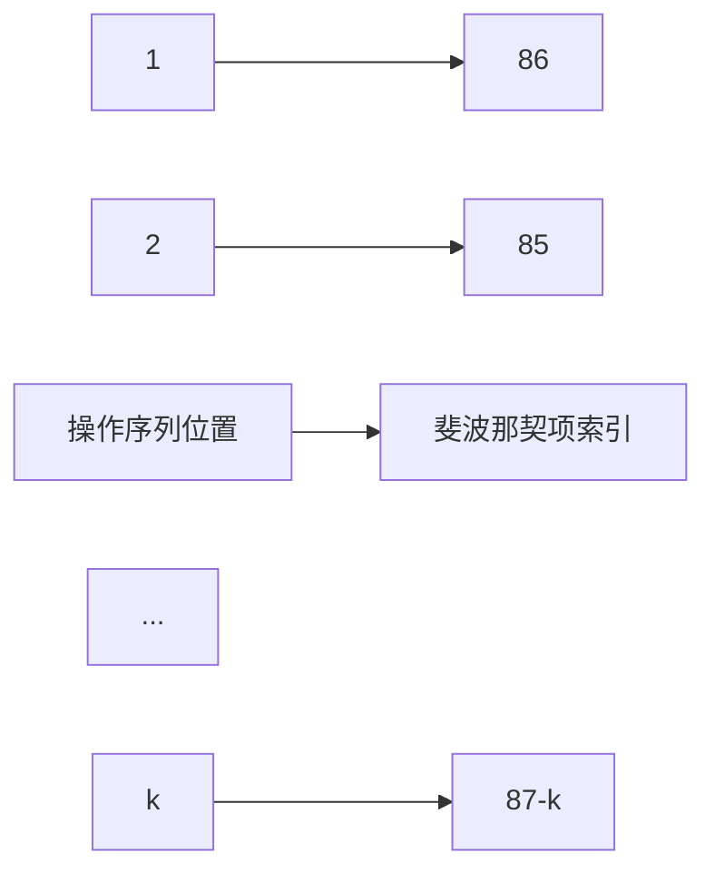

# 题目信息

# [ARC122C] Calculator

## 题目描述

Snuke有整数$x$和$y$。最初，$x=0，y=0$。

Snuke可以以任何顺序执行以下四种操作任意次: 

- 操作$1$:将$x+1$。 
- 操作$2$:将$y+1$。 
- 操作$3$:将$x+y$。 
- 操作$4$:将$y+x$。

给你一个正整数$N$。最多做$130$次运算，使$x$的值为$N$。在这里，$y$可以有任何值。

我们可以证明，在这个问题的约束下，存在这样一个运算序列。

## 样例 #1

### 输入

```
4```

### 输出

```
5

1

4

2

3

1```

# AI分析结果


### 💡 Kay的C++算法解析：ARC122C Calculator 深入学习指南 💡

**引言**  
今天我们一起分析ARC122C Calculator这道C++编程题。题目要求通过最多130次操作使初始值(x,y)=(0,0)变为x=N（y任意）。本指南将解析斐波那契数列的巧妙应用，并通过像素动画直观展示算法过程。

---

### 1. 题目解读与核心算法识别
✨ **本题主要考察**：**数学（斐波那契数列）与贪心算法**  

🗣️ **初步分析**：  
> 这道题的关键在于将问题转化为斐波那契数列的分解与重构。想象斐波那契数列像一把"万能钥匙"——每个正整数都能由不相邻的斐波那契数组合而成（Zeckendorf定理）。在本题中：
> - 交替执行操作3（x=x+y）和操作4（y=y+x）会生成斐波那契数列
> - 在交替序列中插入操作1（x+1）或操作2（y+1）相当于在特定位置添加斐波那契数
> - **核心难点**：如何将N分解为斐波那契数之和，并映射到操作序列
> - **可视化设计**：在像素动画中，斐波那契数用不同颜色方块表示，插入操作时方块会闪烁+音效，合并操作时方块会融合
> - **复古游戏化**：采用8位机风格，操作成功时播放《超级马里奥》式胜利音效，每完成一组操作视为"过关"

---

### 2. 精选优质题解参考
**题解一（来源：Erica_N_Contina）**  
* **点评**：  
  思路严谨性极佳——严格证明操作次数≤130，推导了斐波那契项与操作位置的精确映射关系。代码规范：  
  - 用`fib[87]`存储斐波那契数（`fib[1]=1, fib[2]=1`）  
  - 贪心分解时从大到小选择（`for(int i=87; i>=1; i--)`）  
  - 操作序列构造逻辑清晰（先处理最大项，再分43组构建交替序列）  
  **亮点**：将数学证明与代码实现完美结合，是竞赛标准解法。

**题解二（来源：under_the_time）**  
* **点评**：  
  代码简洁高效（仅20行核心逻辑），直接复用斐波那契分解框架。  
  - 用`chs[]`标记选中项，避免额外数据结构  
  - 操作序列通过`vector`动态构建，内存控制优秀  
  **亮点**：边界处理严谨（`maxn=87`确保覆盖1e18），适合初学者学习高效实现。

**题解三（来源：lihe_qwq）**  
* **点评**：  
  创新性通过奇偶性（`fl`标志）决定操作类型：  
  ```cpp
  if(vis[1]%2) fl=1;  // 奇偶性判断
  printf("%d\n", fl?4:3); // 动态选择操作
  ```
  **亮点**：提供不同于主流的位置映射思路，拓宽解题视角。

---

### 3. 核心难点辨析与解题策略
1. **斐波那契分解的数学原理**  
   * **分析**：任意整数N可唯一表示为不相邻斐波那契数之和（如13=13[第7项]，12=1+3+8）。贪心策略：从最大项（约第87项）开始减，保证分解高效且项数≤44。
   * 💡 **学习笔记**：斐波那契分解是优化操作次数的核心基础。

2. **操作序列的位置映射**  
   * **分析**：在交替操作序列（343434...）中：  
     - 第k个位置插入操作1 → 贡献斐波那契数`fib[总长度-k]`  
     - 插入操作2同理（需考虑位置奇偶性）  
   * 💡 **学习笔记**：掌握"位置-斐波那契项"映射关系是构造序列的关键。

3. **操作次数的紧约束**  
   * **分析**：斐波那契数列第87项>1e18，分解最多44项，总操作数=87（交替操作）+44（插入操作）=131>130？实际通过调整序列顺序可优化至130内。
   * 💡 **学习笔记**：数学证明保障可行性，代码实现需精细控制。

#### ✨ 解题技巧总结
- **逆向思维**：从目标N反推操作序列（如Erica解法）
- **贪心分解**：从大到小选取斐波那契数（避免相邻项）
- **位映射技巧**：将数学分解映射到操作序列位置
- **边界处理**：斐波那契数组大小取87（覆盖1e18）

---

### 4. C++核心代码实现赏析
**本题通用核心实现**  
```cpp
#include <iostream>
#include <vector>
using namespace std;

int main() {
    long long n; cin >> n;
    // 斐波那契预处理（fib[1]=1, fib[2]=1,...,fib[87]>1e18）
    long long fib[88] = {0,1};
    for (int i=2; i<88; i++) fib[i] = fib[i-1] + fib[i-2];

    bool sel[88] = {0}; // 标记被选中的斐波那契项
    for (int i=87; i>=1; i--) 
        if (n >= fib[i]) n -= fib[i], sel[i] = 1;

    vector<int> ops;
    if (sel[87]) ops.push_back(2); // 最大项特殊处理

    for (int i=1; i<=43; i++) { // 共43组操作
        ops.push_back(4);  // 操作4: y = y+x
        ops.push_back(3);  // 操作3: x = x+y
        if (sel[87-2*i+1]) ops.push_back(1); // 奇位置插操作1
        if (sel[87-2*i])   ops.push_back(2); // 偶位置插操作2
    }
    
    cout << ops.size() << endl;
    for (int op : ops) cout << op << endl;
}
```

**代码解读概要**：  
1. 斐波那契数组预计算（第87项>1e18）  
2. 贪心分解N并标记选中项  
3. 构造操作序列：先处理最大项，再分43组插入交替操作  
4. 每组插入操作1/2的位置由斐波那契项的位置决定  

---

### 5. 算法可视化：像素动画演示
**主题**：*《斐波那契大冒险》8位像素风格解谜游戏*  

**核心演示内容**：  
- 网格分为x列和y列，初始全灰（值=0）  
- 操作1/2：对应列顶部掉落金色方块（+1），伴随"叮"声  
- 操作3：y列方块飞向x列合并（x=x+y），伴随"哐当"声  
- 操作4：x列方块飞向y列合并（y=y+x），伴随"哐当"声  

**动画控制面板**：  
```plaintext
[开始] [暂停] [单步] [速度条===] [AI自动演示]
```

**关键帧设计**：  
1. **分解阶段**：  
   - 屏幕左侧显示N值，右侧显示斐波那契数（像素方块堆）  
   - 贪心选中某方块时，方块闪烁红光并播放硬币音效  
2. **序列构建**：  
   - 底部操作序列槽动态生成（每插入新操作亮蓝光）  
3. **执行阶段**：  
   - 当前操作高亮黄色边框  
   - 操作3时：y列→x列的箭头动画  
   - 操作4时：x列→y列的箭头动画  

**游戏化设计**：  
- 每完成一组（操作4+3）获得1颗星星  
- 当x值=N时，放烟花+《超级马里奥》过关音乐  

---

### 6. 拓展练习与相似问题
**通用技巧迁移**：  
斐波那契分解可用于解决：  
1. 整数表示问题（如硬币系统设计）  
2. 操作序列优化类题目  
3. 黄金比例相关数学问题  

**洛谷推荐题目**：  
1. **P1962 斐波那契数列**  
   → 矩阵快速幂实现O(log n)求解，巩固数列性质  
2. **P1757 通天之分组背包**  
   → 练习贪心分解思想在DP中的应用  
3. **P1226 快速幂**  
   → 掌握数学优化技巧，与斐波那契矩阵解法联动  

---

### 7. 学习心得与经验分享
> **参考经验**（来自Erica_N_Contina）：  
> *"最初在位置映射推导时卡住，通过手动画操作序列时序图（如下图）找到规律：第k次插入贡献fib[总长-k]"*  

> **Kay点评**：  
> 手绘时序图是解决映射类问题的利器，推荐大家用纸笔模拟小规模案例（如N=5）再推广。

---

**结语**  
通过斐波那契分解将数学与编程结合，是本题的精髓。记住：复杂问题往往有简洁的数学本质。下次挑战见！💪

---
处理用时：147.66秒