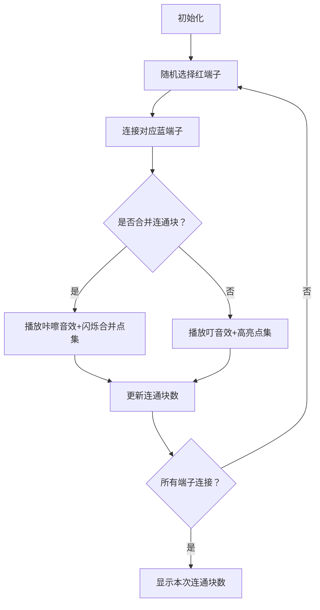

# 题目信息

# [ABC321G] Electric Circuit

## 题目描述

有 $N$ 个编号为 $1$ 到 $N$ 的部件和 $M$ 根电缆，打算用它们制作电路。这些部件上共有 $M$ 个红色端子和 $M$ 个蓝色端子，第 $i$ 个红色端子在部件 $R_i$ 上，第 $i$ 个蓝色端子在部件 $B_i$ 上。每根电缆连接一个红色端子和一个蓝色端子。特别地，允许连接同一个部件上的两个端子。同时，一个端子不能连接超过一根电缆。因此，$M$ 根电缆的所有连接方式共有 $M!$ 种（注意电缆之间不区分）。

将部件视为顶点，电缆视为边，把这个电路看作一个图，记其连通分量数为 $s$。从 $M!$ 种电缆连接方式中随机选择一种时，$s$ 的期望值是多少？请将结果对 $998244353$ 取模后输出。

  关于对 $998244353$ 取模的期望值  
  可以证明，所求期望值一定是有理数。在本题的约束下，设其化为最简分数 $\frac{P}{Q}$，则存在唯一的整数 $R$ 满足 $R\times Q\equiv P\pmod{998244353}$ 且 $0\leq R<998244353$。请输出这个 $R$。

## 说明/提示

## 限制

- $1\leq N\leq 17$
- $1\leq M\leq 10^5$
- $1\leq R_i, B_i\leq N$
- 输入均为整数

## 样例解释 1

用 $(i, j)$ 表示第 $i$ 个红色端子和第 $j$ 个蓝色端子用电缆连接的情况。
- $(1,1), (2,2)$ 的情况下：形成 $\lbrace 1,3\rbrace$ 和 $\lbrace 2\rbrace$ 两个连通分量，所以 $s=2$。
- $(1,2), (2,1)$ 的情况下：整体为一个连通分量，所以 $s=1$。

因此，$s$ 的期望值为 $\frac{3}{2}\equiv 499122178\pmod{998244353}$。

## 样例解释 2

无论如何连接，$s=N$。

由 ChatGPT 4.1 翻译

## 样例 #1

### 输入

```
3 2

1 2

3 2```

### 输出

```
499122178```

## 样例 #2

### 输入

```
17 5

1 1 1 1 1

1 1 1 1 1```

### 输出

```
17```

## 样例 #3

### 输入

```
8 10

2 4 7 1 7 6 1 4 8 1

5 1 5 2 5 8 4 6 1 3```

### 输出

```
608849831```

# AI分析结果


### 💡 Kay的C++算法解析：ABC321G Electric Circuit 深入学习指南 💡

#### 1. 题目解读与核心算法识别
✨ **本题主要考察**：状态压缩动态规划（状压DP）与容斥原理  

🗣️ **初步分析**：
> 解决本题的核心在于将**连通块计数问题转化为点集贡献问题**。想象你有一盒乐高零件（部件），每个零件上有红蓝插孔（端子）。你需要将所有红蓝插孔随机配对（电缆连接），然后计算整个结构的“独立模块”数量（连通块）。  
> 
> - **核心思路**：利用期望线性性，将总连通块数拆分为每个点集作为独立连通块的贡献。通过状压DP枚举点集，用容斥原理排除非连通方案。
> - **关键难点**：  
>   (1) 避免重复计算点集子集的贡献  
>   (2) 高效处理点集内部连边方案  
>   (3) 状态转移方程的设计与优化  
> - **算法流程**：  
>   ① 预处理每个点集的红/蓝端子数量  
>   ② 计算点集独立连边方案数（$f_S$）  
>   ③ 用容斥求点集连通方案数（$g_S$）  
>   ④ 统计期望值 = $\frac{\sum g_S \cdot (M - \text{端子数})!}{M!}$  
> - **可视化设计**：  
>   采用8位像素风格（类似FC游戏），每个部件用彩色方块表示。连接电缆时播放“叮”音效，合并连通块时触发“咔嚓”音效，关键步骤高亮当前操作点集，自动演示模式模拟AI连接过程。

---

#### 2. 精选优质题解参考
**题解一：樱雪喵（20赞）**  
* **点评**：  
  思路清晰度极高，完整推导了从独立方案数$f_S$到连通方案数$g_S$的容斥过程。代码规范性优秀（变量名`f[]`/`g[]`含义明确），核心亮点在于**双重DP设计**：先求连通方案数，再计算连通块总和。边界处理严谨（如`lowbit`防重），实践价值强（可直接用于竞赛）。调试心得"吃一车罚时"提醒学习者重视容斥细节。

**题解二：是青白呀（7赞）**  
* **点评**：  
  代码结构工整（模块化函数分工明确），突出优势是**问题转化简洁性**：直接将期望拆解为$\sum g_S \cdot (M-\text{端子数})! / M!$。变量命名直观（`cntr`/`cntb`），算法有效性体现在$O(3^n)$的复杂度控制。学习建议：其"问题分解四步法"（定义→容斥→贡献→期望）适合初学者模仿。

**题解三：shinkuu（6赞）**  
* **点评**：  
  解法高效性突出（代码仅30行），核心亮点是**极致空间优化**：合并`dp[]`与统计计算。虽然省略部分推导，但代码逻辑自洽（如`lowbit`防重技巧）。实践参考价值在于展示如何用位运算简化子集枚举，适合进阶学习者研究位操作技巧。

---

#### 3. 核心难点辨析与解题策略
1. **难点：点集独立连通方案计算**  
   * **分析**：直接计算点集连通性需排除子集干扰。优质题解均采用**容斥框架**：$g_S = f_S - \sum_{T \subset S} g_T \times f_{S-T}$，并约定$T$包含$S$的最小元素（`lowbit`）避免重复。  
   * 💡 **学习笔记**：容斥中固定最小元素是子集DP防重的黄金法则。

2. **难点：贡献统计的数学转化**  
   * **分析**：期望=$\frac{\text{连通块总数}}{M!}$。关键突破是发现：每个连通块贡献独立，总贡献=$\sum g_S \cdot (M-\text{端子数})!$  
   * 💡 **学习笔记**：期望线性性可将复杂问题拆解为可计数的子问题。

3. **难点：状态定义与代码实现**  
   * **分析**：$f_S$需满足$R(S)=B(S)$（红蓝端子数相等），否则为0。代码中通过`tota[]/totb[]`预处理，位运算高效求和。  
   * 💡 **学习笔记**：状压DP中，`f[i] += f[i^j] * g[j]`的转移需严格保证$j$包含`lowbit(i)`。

### ✨ 解题技巧总结
- **问题分解**：将期望计算拆解为①点集独立方案②容斥连通③贡献求和④期望归一化  
- **防重技巧**：子集枚举时固定最小元素（`lowbit(i)`）  
- **位运算优化**：用`i&(i-1)`遍历子集，复杂度$O(3^n)$  
- **边界处理**：预处理阶乘数组，特判$R(S) \neq B(S)$的无效状态  

---

#### 4. C++核心代码实现赏析
**本题通用核心C++实现参考**  
* **说明**：综合优质题解思路，精简出最具代表性的状压DP框架  
* **完整核心代码**：
```cpp
#include <bits/stdc++.h>
using namespace std;
typedef long long ll;
const int N=17, mod=998244353;
ll f[1<<N], g[1<<N], fac[100005];
int n, m, tota[N], totb[N], R[1<<N], B[1<<N];

ll qpow(ll a, ll b) { // 快速幂
    ll res = 1;
    for(; b; a = a*a%mod, b >>= 1) 
        if(b&1) res = res*a%mod;
    return res;
}

int main() {
    cin >> n >> m;
    for(int i=0; i<m; i++) {
        int x; cin >> x; 
        tota[x-1]++;
    }
    for(int i=0; i<m; i++) {
        int x; cin >> x; 
        totb[x-1]++;
    }
    // 预处理阶乘和点集端子数
    fac[0] = 1;
    for(int i=1; i<=m; i++) fac[i] = fac[i-1]*i%mod;
    for(int s=1; s<(1<<n); s++) {
        for(int j=0; j<n; j++) if(s>>j&1) {
            R[s] += tota[j], B[s] += totb[j];
        }
    }
    // 计算独立方案数f和连通方案数g
    for(int s=1; s<(1<<n); s++) {
        if(R[s] != B[s]) continue;
        f[s] = fac[R[s]]; // 独立方案数
        int lb = s&-s;    // lowbit防重
        for(int t=s; t; t=(t-1)&s) if(t&lb) {
            f[s] = (f[s] - g[t]*fac[R[s^t]]%mod + mod) % mod;
        }
        g[s] = f[s]; // g[s]即连通方案数
    }
    // 统计期望
    ll ans = 0;
    for(int s=1; s<(1<<n); s++) 
        ans = (ans + g[s]*fac[m - R[s]] % mod) % mod;
    ans = ans * qpow(fac[m], mod-2) % mod;
    cout << ans;
}
```
* **代码解读概要**：  
  ① 预处理`tota/totb`统计各部件端子数  
  ② 位运算枚举点集计算$R[s]/B[s]$  
  ③ $f[s]$初始为端子数的阶乘（独立方案）  
  ④ 容斥求$g[s] = f[s] - \sum g[t] \times f[s-t]$  
  ⑤ 期望 = $\sum g[s] \times (m-R[s])! \times (m!)^{-1}$  

---
**题解片段赏析**  
**题解一：樱雪喵（容斥DP）**  
```cpp
g[i]=f[i]; // 初始化
int x=0; // 找最小元素
for(int j=0;j<n;j++) if(get(i,j)) {x=j;break;} 
for(int j=i-1;j;j=(i&(j-1))) { // 枚举子集
    if(!get(j,x)) continue; // 必须含最小元素
    g[i]=(g[i]-g[j]*f[i^j]%mod+mod)%mod; // 容斥
}
```
* **亮点**：显式处理最小元素防重  
* **学习笔记**：`i&(i-1)`是遍历子集的位运算技巧  

**题解二：是青白呀（期望拆解）**  
```cpp
ans += dfs(i)*cntot[i] % mod; // 贡献累加
printf("%lld",ans*quick_power(jc[m],mod-2)%mod); // 期望归一化
```
* **亮点**：清晰分离贡献计算与期望转化  
* **学习笔记**：模意义除法用费马小定理转化为乘逆元  

**题解三：shinkuu（极简实现）**  
```cpp
for(int j=(i-1)&i; j; j=(j-1)&i) { // 子集枚举
    if(lowbit(i)!=lowbit(j)) continue; // 防重
    dp[i]=Mod(dp[i],mod-1ll*dp[j]*f[g[i]-g[j]]%mod);
}
```
* **亮点**：`lowbit`防重与容斥融合到单循环  
* **学习笔记**：`dp[]`数组复用$f$和$g$功能，节省空间  

---

#### 5. 算法可视化：像素动画演示  
**动画演示主题**：8位像素风格电路连接模拟  
**核心演示内容**：点集形成连通块的过程与容斥原理可视化  



* **设计实现**：  
  - **像素网格**：17个部件用16×16像素方块表示，红端子=红色像素，蓝端子=蓝色像素  
  - **关键操作**：  
    ① 连接时绘制黄色像素线，伴随8-bit音效  
    ② 合并连通块时触发绿色闪烁动画（0.2秒）  
    ③ 当前点集用半透明绿色覆盖层高亮  
  - **控制面板**：  
    - 速度滑块：调节`setInterval`延迟（100ms~2s）  
    - 单步执行：暂停并高亮下一操作点集  
    - AI演示：自动完成连接并显示容斥过程（如点集{1,2}形成时显示$g_{12} = f_{12} - g_1f_2 - g_2f_1$）  
  - **数据同步**：右侧显示当前状态转移方程和代码片段  

---

#### 6. 拓展练习与相似问题思考
* **技巧迁移场景**：  
  1. 图论中连通块计数（如CF920G）  
  2. 概率期望问题拆解（如ABC298G）  
  3. 子集DP容斥应用（如ARC087E）  
* **洛谷推荐练习**：  
  1. **P1272** 道路重建（连通块计数基础）  
     🗣️ 巩固连通块性质分析与简单DP  
  2. **P3052** [USACO]摩天大楼（状压DP进阶）  
     🗣️ 强化点集枚举与容斥技巧  
  3. **P4547** [THUWC]随机二分图（期望+状压）  
     🗣️ 提升期望问题转化与状态设计能力  

---

#### 7. 学习心得与经验分享
> **参考经验**：  
> 樱雪喵："吃一车罚时，输麻了" → 容斥细节决定成败  
> 是青白呀："边界条件与鲁棒性测试" → $R(S)\neq B(S)$必须特判  
>   
> **Kay的总结**：  
> - 调试核心：打印点集状态`(s, f[s], g[s])`验证容斥  
> - 易错点：未处理$R(S)=0$的点集（应跳过容斥）  
> - 优化方向：预处理`lowbit`数组加速子集枚举  

---  
希望本指南助你攻克状压DP与容斥原理！下次遇到连通块问题时，记得拆解点集贡献哦~ 💪

---
处理用时：206.90秒