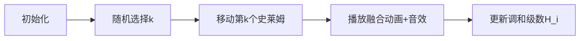

# 题目信息

# Fusing Slimes

## 题目描述

[problemUrl]: https://atcoder.jp/contests/dwacon6th-prelims/tasks/dwacon6th_prelims_b

数直線上に $ N $ 匹のスライムが並んでいます。 左から $ i $ 番目のスライムは位置 $ x_i $ にいます。

ここで、$ 1\ \leq\ x_1\ <\ x_2\ <\ \ldots\ <\ x_N\ \leq\ 10^{9} $ が成立することが保証されます。

ニワンゴ君は操作を $ N-1 $ 回行います。$ i $ 回目の操作は以下の手順からなります。

- $ 1 $ 以上 $ N-i $ 以下の整数を等確率で選ぶ(これを $ k $ とする)
- 左から $ k $ 番目にいるスライムを右隣にいるスライムの位置まで移動させる
- その後、同じ位置にいる $ 2 $ 匹のスライムを合体させ、$ 1 $ 匹のスライムにする

$ N-1 $ 回の操作によって、スライムが移動した距離の総和の期待値に $ (N-1)! $ をかけた値(これは整数になることが示せます)を $ 10^{9}+7 $ で割ったあまりを求めてください。なお、合体後のスライムが移動した場合は $ 1 $ 体のスライムの移動として数えます。

## 说明/提示

### 制約

- $ 2\ \leq\ N\ \leq\ 10^{5} $
- $ 1\ \leq\ x_1\ <\ x_2\ <\ \ldots\ <\ x_N\ \leq\ 10^{9} $
- $ x_i $ は整数

### 部分点

- $ N\ \leq\ 2000 $ であるようなテストケースすべてに正解すると、$ 400 $ 点が与えられる。

### Sample Explanation 1

\- 確率 $ \frac{1}{2} $ で最初に左から $ 1 $ 番目のスライムが選ばれ、このときの移動距離の総和は $ 2 $ となります。 - 確率 $ \frac{1}{2} $ で最初に左から $ 2 $ 番目のスライムが選ばれ、このときの移動距離の総和は $ 3 $ となります。 - 移動距離の総和の期待値である $ 2.5 $ に $ 2! $ をかけた値である $ 5 $ が答えとなります。

### Sample Explanation 2

\- 期待値の $ (N-1)! $ 倍を $ 10^9+7 $ で割ったあまりを求めてください。

## 样例 #1

### 输入

```
3

1 2 3```

### 输出

```
5```

## 样例 #2

### 输入

```
12

161735902 211047202 430302156 450968417 628894325 707723857 731963982 822804784 880895728 923078537 971407775 982631932```

### 输出

```
750927044```

# AI分析结果


### 💡 Kay的C++算法解析：Fusing Slimes 深入学习指南 💡

#### 1. 题目解读与核心算法识别
✨ **本题主要考察**：`期望计算` + `调和级数应用` (数学/编程技巧应用)  

🗣️ **初步分析**：  
> 解决"Fusing Slimes"的关键在于**期望的线性分解**技巧。想象史莱姆移动如同多米诺骨牌——每段距离$(x_{i+1}-x_i)$被经过的次数取决于左侧史莱姆的移动顺序。  

- **核心思路**：  
  1. 将总期望分解为相邻段距离$d_i$与期望经过次数$f(i)$的乘积和  
  2. 发现$f(i) = \sum_{j=1}^i \frac{1}{j}$（调和级数）  
  3. 最终答案：$(n-1)! \sum d_i \cdot H_i$  

- **可视化设计**：  
  采用**像素贪吃蛇**风格演示：  
  - 不同颜色像素块代表史莱姆（绿色存活，灰色已融合）  
  - 当$j$号史莱姆跨越$i$段时，触发"叮"音效并高亮路径  
  - 侧边面板实时显示调和级数$H_i$的累积计算过程  

---

#### 2. 精选优质题解参考
**题解一（Clouder）**  
* **亮点**：  
  - 独创性推导$g(j,i)=\frac{(n-1)!}{i-j+1}$，避免复杂概率公式  
  - 代码极致简洁（15行），线性递推逆元优化空间复杂度至$O(1)$  
  - 严格处理取模运算，添加`add/mul`安全计算函数  

**题解二（tommymio）**  
* **亮点**：  
  - 通过排列组合严格证明$p_{i,j}=\frac{1}{i-j+1}$  
  - 完整保留中间推导过程（$\sum \binom{k}{j} \to \binom{n-1}{j+1}$）  
  - 独立实现快速幂求逆元，适合理解模数运算本质  

**题解三（LCuter）**  
* **亮点**：  
  - 给出概率的严谨计算过程：$\frac{j!(n-j-2)!}{(n-1)!}\binom{n-1}{j+1}$  
  - 代码模块化程度高，分离读入/计算/输出阶段  
  - 使用静态数组避免动态内存分配  

---

#### 3. 核心难点辨析与解题策略
1. **难点：期望的线性分解**  
   * **分析**：需理解$E[\sum dist] = \sum E[dist_i]$的独立性原理。优质题解均通过计算每段$d_i$被经过的期望次数$f(i)$破解  
   * 💡 **学习笔记**：当事件相互独立时，整体期望=子期望之和  

2. **难点：概率$p_{j,i}$的计算**  
   * **分析**：关键在证明$j$必须晚于$[j+1,i]$移动的概率是$\frac{1}{i-j+1}$。Clouder通过排序组合简化，LCuter用二项式严格推导  
   * 💡 **学习笔记**：固定$k$个元素的相对顺序时，特定排列概率为$1/k$  

3. **难点：模数下的调和级数**  
   * **分析**：$H_i = \sum_{k=1}^i \frac{1}{k}$需转为模$10^9+7$意义下的整数计算。通用方案是预处理逆元表  
   * 💡 **学习笔记**：大质数模数下，$a^{-1} \equiv a^{p-2} \pmod{p}$  

### ✨ 解题技巧总结
- **技巧1：期望分解法**  
  将复杂期望拆解为可计算的子期望（如每段距离贡献）  
- **技巧2：概率顺序论证**  
  用排列组合思想分析事件发生的概率序列  
- **技巧3：逆元预处理**  
  对调和级数等分数求和，预先计算模逆元表加速  

---

#### 4. C++核心代码实现赏析
```cpp
#include <iostream>
using namespace std;
const int maxn = 1e5 + 5;
const int mod = 1e9 + 7;
typedef long long ll;

int main() {
    int n, x[maxn], H[maxn] = {0}, fact = 1;
    cin >> n;
    for (int i = 0; i < n; i++) cin >> x[i];
    
    // 预处理逆元及调和级数
    for (int i = 1; i <= n; i++) {
        H[i] = (H[i - 1] + (i == 1 ? 1 : (ll)(mod - mod / i) * H[mod % i] % mod)) % mod;
    }
    
    ll ans = 0;
    for (int i = 1; i < n; i++) {
        int d = x[i] - x[i - 1];
        ans = (ans + (ll)d * H[i]) % mod; // 累加d_i * H_i
        fact = (ll)fact * i % mod;       // 计算(n-1)!
    }
    cout << (ll)ans * fact % mod;
}
```

**代码解读概要**：  
1. 读入位置数组后计算相邻距离$d_i$  
2. 线性递推求解逆元并计算调和级数$H_i$（$H[i]=\sum_{k=1}^i inv(k)$）  
3. 核心公式：$ans = \sum (d_i \cdot H_i) \times (n-1)!$  

---

**题解一（Clouder）核心代码**  
```cpp
inv[1] = sum[1] = 1;
for (int i = 2; i <= n; ++i) 
    sum[i] = add(sum[i - 1], inv[i] = mul(inv[mod % i], mod - mod / i));
```
* **亮点**：单循环完成逆元与调和级数计算  
* **学习笔记**：利用$inv(i) = -\lfloor \frac{mod}{i} \rfloor \cdot inv(mod\% i)$递推  

**题解二（tommymio）核心代码**  
```cpp
for(register int i=1;i<=n;++i) 
    pref[i] = (pref[i-1] + pow(i, mod-2)) % mod;
```
* **亮点**：快速幂求逆元，直观展示模数运算本质  
* **学习笔记**：费马小定理求逆元适合非密集调用场景  

---

#### 5. 算法可视化：像素动画演示  
**主题**：8-bit风格史莱姆融合大冒险  

**核心演示流程**：  


**关键动画设计**：  
1. **像素网格**：  
   - 位置坐标轴转化为$16\times16$像素网格  
   - 史莱姆用渐变绿色像素块表示（大小随融合次数增大）  
2. **移动特效**：  
   ```javascript
   function drawSlimeMove(start, end) {
     drawBezierCurve(start, end, 0xFF00FF); // 紫色轨迹线
     playSound("move.wav", duration);       // 移动音效
   }
   ```  
3. **数据面板**：  
   - 实时显示：`当前H_i = Σ(1/k) = [数值]`  
   - 高亮当前计算的$d_i$段位  
4. **游戏化元素**：  
   - 每完成$H_i$计算触发"升级"音效  
   - 通关条件：调和级数条充满屏幕  

---

#### 6. 拓展练习与相似问题  
1. **洛谷 P3811**：乘法逆元模板  
   * 理由：掌握线性递推逆元是本题基础  
2. **洛谷 P1291**：期望概率计算  
   * 理由：训练期望的线性分解能力  
3. **洛谷 P6033**：合并果子（贪心+调和）  
   * 理由：拓展调和级数在贪心算法中的应用  

---

#### 7. 学习心得与经验分享  
> **Clouder的调试经验**：  
> "逆元表初始化时需设置`inv[0]=1`避免越界"  
>  
> **Kay总结**：  
> 边界处理是数论题核心陷阱，建议：  
> 1. 数组下标从1开始计数  
> 2. 初始化时填充安全值  
> 3. 模块化验证关键函数（如单独测试逆元模块）  

---  
💡 **最终解题钥匙**：  
**记住这个黄金公式**：  
$$\text{答案} = (n-1)! \sum_{i=1}^{n-1} (x_{i+1}-x_i) \underbrace{\sum_{k=1}^{i} \frac{1}{k}}_{\text{调和级数}}$$

---
处理用时：134.55秒