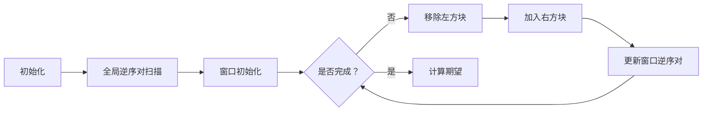

# 题目信息

# [ABC380G] Another Shuffle Window

## 题目描述

[问题链接](https://atcoder.jp/contests/abc380/tasks/abc380_g)

给定一个排列 $P = (1, 2, \dots, N)$ 和一个整数 $K$。

请计算经过以下操作后，排列 $P$ 的**逆序对数**的期望值模 $998244353$ 的结果：

- 首先，从 $1$ 到 $N-K+1$ 的整数中随机均匀地选择一个整数 $i$；
- 然后，将子数组 $P_i, P_{i+1}, \dots, P_{i+K-1}$ 进行随机均匀打乱。


#### 逆序对是什么？

>  对于一个数组 $(A_1, A_2, \dots, A_N)$，逆序对是满足 $1 \leq i < j \leq N$ 且 $A_i > A_j$ 的整数对 $(i, j)$ 的个数。

#### 期望值模 $998244353$ 是什么？

> 在本问题的约束条件下，期望值可以表示为一个分数 $\frac{P}{Q}$，且 $Q \not \equiv 0 \pmod{998244353}$。  
> 因此可以找到一个唯一的整数 $R$ 满足：
> $$
> R \times Q \equiv P \pmod{998244353}, \quad 0 \leq R < 998244353
> $$
> 你需要输出这个整数 $R$。

## 说明/提示

#### 约束条件

- 所有输入均为整数；
- $1 \leq K \leq N \leq 2 \times 10^5$；
- $P$ 是 $(1, 2, \dots, N)$ 的一个排列。

#### 样例解释 1

通过操作，排列 $P$ 会变为以下形式：

- $(1, 4, 2, 3)$ —— 概率 $\frac{1}{2}$；
- $(4, 1, 2, 3)$ —— 概率 $\frac{1}{6}$；
- $(1, 2, 4, 3)$ —— 概率 $\frac{1}{6}$；
- $(1, 4, 3, 2)$ —— 概率 $\frac{1}{6}$。

对应的逆序对数期望值为：
$$
\displaystyle 2 \times \frac{1}{2} + 3 \times \frac{1}{6} + 1 \times \frac{1}{6} + 3 \times \frac{1}{6} = \frac{13}{6}
$$

将 $\frac{13}{6}$ 转换为模 $998244353$ 的结果为 $166374061$，因此输出 $166374061$。

Translated By [$\mathtt{Mr\_Az}$](/user/536560)。

## 样例 #1

### 输入

```
4 2

1 4 2 3```

### 输出

```
166374061```

## 样例 #2

### 输入

```
1 1

1```

### 输出

```
0```

## 样例 #3

### 输入

```
10 6

7 4 10 5 6 1 8 2 3 9```

### 输出

```
499122200```

# AI分析结果


### 💡 Kay的C++算法解析：ABC380G Another Shuffle Window 深入学习指南 💡

#### 1. 题目解读与核心算法识别
✨ **本题主要考察**：`树状数组` + `期望计算` + `滑动窗口`  
🗣️ **初步分析**：
> 解决本题的关键在于理解排列打乱后逆序对变化的期望。想象你在玩一个像素方块拼图游戏，每次随机选择一个连续的方块区域（长度K）并打乱它们。核心挑战在于高效计算：
> 1. **全局逆序对**：用树状数组统计初始排列的逆序对数（总拼图中的错位方块对数）
> 2. **滑动窗口维护**：用像素方块移动动画直观展示区间逆序对动态更新过程
> 3. **期望转化**：每个打乱区间的逆序对期望恒为K(K-1)/4（每对方块有1/2概率逆序）

> 可视化设计思路：
> - **像素动画**：8-bit风格网格，用不同颜色区分：已处理区（绿色）、当前窗口（黄色）、未处理区（灰色）
> - **关键变量高亮**：当前移除/加入的方块闪烁红光，树状数组的更新过程用蓝色光波展示
> - **音效设计**：方块移动"滴"声，逆序对更新时"叮"声，错误操作时短促"嘟"声
> - **游戏化控制**：步进按钮控制窗口移动，调速滑块控制动画速度，AI自动演示模式模拟解题过程

#### 2. 精选优质题解参考
**题解一：Milthm（思路清晰度⭐⭐⭐⭐⭐）**  
* **点评**：  
  用树状数组维护滑动窗口堪称教科书级实现。亮点在于：
  - 用`now`变量动态维护窗口内逆序对（9行核心逻辑完成窗口滑动）
  - 边界处理严谨（`i==n-k+1`的特殊处理）
  - 逆元计算封装成`inv`函数复用
  *遗憾：变量命名可读性可提升（如`now`改为`window_inv`）*

**题解二：PineappleSummer（代码规范性⭐⭐⭐⭐⭐）**  
* **点评**：  
  工业级代码品质，突出亮点：
  - 树状数组封装独立（`Fenwick Tree`概念清晰）
  - 注释精确（如"// 减去a[i]贡献"）
  - 数学推导完整（期望公式的分步骤说明）
  *学习点：模块化思想对大型项目至关重要*

**题解三：qfy123（算法优化⭐⭐⭐⭐⭐）**  
* **点评**：  
  极致优化的典范：
  - 树状数组操作内联化（避免函数调用开销）
  - 逆元预计算（避免重复快速幂）
  - 滑动窗口与全局统计分离
  *注意：为追求性能牺牲部分可读性，初学者建议参考前两个实现*

#### 3. 核心难点辨析与解题策略
1. **难点：滑动窗口的逆序对动态维护**  
   *分析*：窗口移动时需同步更新逆序对数，需计算：
   - 移除左元素：减去窗口中比它小的元素个数（它在窗口最左，与窗口内元素形成逆序对）
   - 加入右元素：加上窗口中比它大的元素个数（它作为新元素，与窗口内元素形成新逆序对）  
   💡 **学习笔记**：树状数组的`query(a-1)`即比a小的元素个数

2. **难点：期望值的独立性证明**  
   *分析*：随机排列中任意两元素成为逆序对的概率独立为1/2，因此K长度窗口的期望逆序对数为C(K,2)/2  
   💡 **学习笔记**：期望线性性是本题降维关键

3. **难点：模意义下的分数处理**  
   *分析*：最终答案需模998244353，除法需转为乘逆元。使用费马小定理：inv(a) = a^{mod-2} mod mod  
   💡 **学习笔记**：竞赛中质数模数下的逆元必须掌握

✨ **解题技巧总结**：
- **滑动窗口优化**：维护当前窗口状态而非重新计算
- **树状数组双用**：既用于全局逆序对统计，也用于窗口维护
- **期望分解**：将复杂期望分解为独立事件求和
- **边界防御**：特别注意窗口移动时的索引边界

#### 4. C++核心代码实现赏析
```cpp
#include <bits/stdc++.h>
#define int long long
using namespace std;
const int N = 2e5+5, mod = 998244353;

struct BIT {
    int c[N], n;
    void init(int _n) { n = _n; }
    void add(int x, int v) {
        for(; x <= n; x += x&-x) c[x] += v;
    }
    int query(int x) {
        int res = 0;
        for(; x; x -= x&-x) res += c[x];
        return res;
    }
} bit;

int ksm(int a, int b) {
    int res = 1;
    while(b) {
        if(b & 1) res = res * a % mod;
        a = a * a % mod; b >>= 1;
    }
    return res;
}

signed main() {
    int n, k, total_inv = 0, window_inv = 0;
    cin >> n >> k;
    vector<int> p(n+1);
    bit.init(n);
    
    // 全局逆序对
    for(int i = 1; i <= n; ++i) {
        cin >> p[i];
        total_inv = (total_inv + bit.query(n) - bit.query(p[i])) % mod;
        bit.add(p[i], 1);
    }
    
    // 第一个窗口的逆序对
    memset(bit.c, 0, sizeof(bit.c));
    for(int i = 1; i <= k; ++i) {
        window_inv = (window_inv + bit.query(n) - bit.query(p[i])) % mod;
        bit.add(p[i], 1);
    }
    
    int ans = 0;
    int E = k * (k-1) % mod * ksm(4, mod-2) % mod; // 期望值
    int inv_nk = ksm(n-k+1, mod-2);
    
    for(int i = 1; i <= n-k+1; ++i) {
        ans = (ans + (total_inv - window_inv + E) % mod * inv_nk) % mod;
        
        if(i == n-k+1) break;
        
        // 窗口滑动
        bit.add(p[i], -1);
        window_inv = (window_inv - bit.query(p[i]-1) + mod) % mod;
        
        window_inv = (window_inv + (bit.query(n) - bit.query(p[i+k])) % mod;
        bit.add(p[i+k], 1);
    }
    cout << (ans % mod + mod) % mod;
}
```
**代码解读概要**：
1. **BIT类**：封装树状数组，支持动态维护前缀和
2. **全局统计**：第一遍扫描计算总逆序对（第27-31行）
3. **窗口初始化**：第二遍扫描计算第一个窗口的逆序对（第34-37行）
4. **窗口滑动**（核心）：
   - 移除左元素：减去窗口中比它小的元素数（第47行）
   - 加入右元素：加上窗口中比它大的元素数（第49行）
5. **期望计算**：每个窗口贡献(total_inv - window_inv + E)

#### 5. 算法可视化：像素动画演示
**动画演示主题**：`方块世界中的逆序冒险`  
**核心演示内容**：树状数组动态维护+窗口滑动  



**动画帧步骤**：
1. **场景初始化**：16色像素网格，三种区域色块（已处理/窗口/未处理）
2. **全局扫描**：绿色方块从左到右移动，经过时触发蓝色扫描波，逆序对实时计数
3. **窗口滑动**：
   - 移除左元素：黄色方块变红闪烁，向左消失时显示`-X`（X=比它小的元素数）
   - 加入右元素：灰色方块变绿闪烁，进入窗口时显示`+Y`（Y=比它大的元素数）
4. **树状数组更新**：底部条形图动态显示树状数组状态，更新时产生蓝色涟漪
5. **控制面板**：
   - 步进控制：▶️(播放) ||️(暂停) →(单步)
   - 调速滑块：🐢---🐇
   - AI演示：🤖按钮自动运行

#### 6. 拓展练习与相似问题
1. **洛谷 P1908** - 逆序对  
   *推荐理由*：树状数组求逆序对的基础练习
2. **洛谷 P5493** - 滑动窗口逆序对  
   *推荐理由*：本题的直接变形，强化窗口维护技巧
3. **CF749E** - Inversions After Shuffle  
   *推荐理由*：打乱区间的期望逆序对进阶版（推荐者：Milthm）

#### 7. 学习心得与经验分享
> **经验摘录（qfy123）**：  
> *"滑动窗口更新时，先删除旧元素再添加新元素，顺序错误会导致计数偏差"*  
> **Kay点评**：这是树状数组维护窗口的黄金法则，删除→更新计数→添加的顺序不可颠倒。调试时可在每次窗口移动后输出树状数组状态验证。

> **经验摘录（hellolin）**：  
> *"下标从0开始能简化边界判断"*  
> **Kay点评**：工程实践中推荐此法，但算法竞赛中1-index更易对齐问题描述，按需选择即可。

---  
**最终结论**：  
通过树状数组高效维护滑动窗口，结合期望线性性，将复杂问题转化为：  
`总逆序对 - 窗口原逆序对 + K(K-1)/4`。  
**关键学习点**：  
1. 树状数组的动态维护技巧  
2. 期望的独立性分解  
3. 滑动窗口的状态转移  

下次挑战见！🚀

---
处理用时：172.59秒