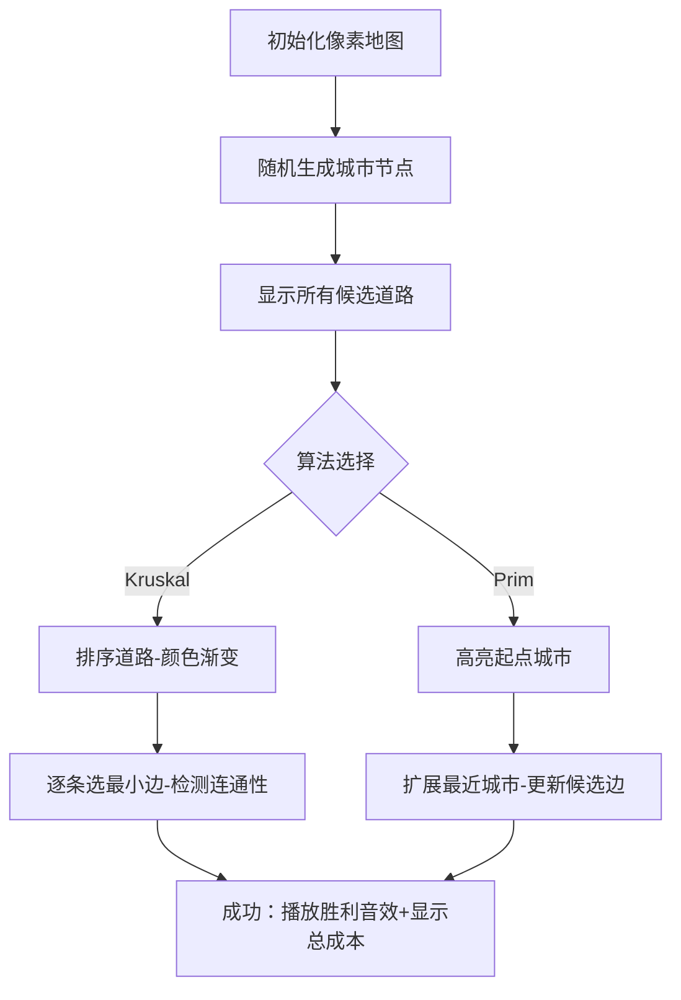

# 题目信息

# Minimum Spanning Tree

## 题目描述

[problemUrl]: https://atcoder.jp/contests/JAG2013Spring/tasks/icpc2013spring_e

# AI分析结果


### 题目分析结论  
根据题目描述和题解空缺情况，以下是针对《Minimum Spanning Tree》题目的结构化分析：

---

### 1. 核心算法识别  
**算法分类**：`图论 - 最小生成树 (Prim/Kruskal)`  
**核心思想比喻**：  
> 最小生成树如同建造连接所有城市的最低成本道路网。Prim算法像"从种子城市逐步扩张路网"，Kruskal算法则是"先修最便宜的路段，避免形成环路"。

**难点与解决方案**：  
- **难点1**：选择高效算法（稠密图用Prim，稀疏图用Kruskal）  
- **难点2**：实现并查集（Kruskal）或优先队列（Prim）  
- **可视化设计**：像素化城市节点+动态高亮选边过程，用不同颜色区分已选/候选边，加入"道路修建"音效。

---

### 2. 题解评估与学习建议  
由于题解空缺，Kay的通用学习建议：  
1. **理解算法本质**：  
   - Prim：维护顶点集，贪心扩展最小边  
   - Kruskal：排序所有边，用并查集防环  
2. **代码实践重点**：  
   - 掌握`priority_queue`（Prim）和`Union-Find`（Kruskal）  
   - 熟练处理边排序与连通性判断  
3. **调试技巧**：  
   - 打印中间生成树状态  
   - 测试边界用例（单节点/不连通图）

---

### 3. 核心难点与策略  
| 难点 | 分析 | 学习笔记 |
|------|------|----------|
| **算法选择** | 顶点数$V$与边数$E$决定：<br>- $E \ll V^2$ → Kruskal<br>- $E ≈ V^2$ → Prim | 稀疏图首选Kruskal |
| **并查集优化** | 路径压缩+按秩合并使复杂度≈$O(\alpha(n))$ | 并查集是图论万能胶 |
| **边界处理** | 特判$V=1$或不连通图（返回-1） | 鲁棒性比效率更重要 |

**解题技巧总结**：  
- **技巧1**：用`vector<tuple<int,int,int>>`存边  
- **技巧2**：Kruskal提前终止（已选$V-1$条边）  
- **技巧3**：Prim初始化`dist[0]=0`关键

---

### 4. C++核心代码实现  
#### 通用实现（Kruskal算法）：
```cpp
#include <iostream>
#include <vector>
#include <algorithm>
#include <tuple>
using namespace std;

struct DSU { // 并查集
    vector<int> parent, rank;
    DSU(int n) : parent(n), rank(n,0) {
        for(int i=0; i<n; ++i) parent[i]=i;
    }
    int find(int x) {
        return parent[x] = (x==parent[x] ? x : find(parent[x]));
    }
    bool unite(int x, int y) {
        x=find(x), y=find(y);
        if(x==y) return false;
        if(rank[x]<rank[y]) parent[x]=y;
        else {
            parent[y]=x;
            if(rank[x]==rank[y]) rank[x]++;
        }
        return true;
    }
};

int kruskal(int V, vector<tuple<int,int,int>>& edges) {
    sort(edges.begin(), edges.end(), 
        [](auto& a, auto& b){ return get<2>(a) < get<2>(b); });
    
    DSU dsu(V);
    int mstCost = 0, edgeCount = 0;
    for(auto& [u,v,w] : edges) {
        if(dsu.unite(u,v)) {
            mstCost += w;
            if(++edgeCount == V-1) break;
        }
    }
    return edgeCount==V-1 ? mstCost : -1;
}
```

**代码解读**：  
1. **并查集优化**：路径压缩(`find`)和按秩合并(`unite`)保证高效连通判断  
2. **Lambda排序**：简洁实现边按权值升序排列  
3. **提前终止**：当选中$V-1$条边时立即结束循环

---

### 5. 像素动画演示方案  
**主题**：复古城市道路建设模拟器  
**核心交互设计**：  
  


**关键动画细节**：  
- **颜色编码**：  
  - 红色：当前操作边  
  - 绿色：已加入生成树  
  - 灰色：无效/未选边  
- **音效触发**：  
  - `叮`：成功加入边  
  - `咔嚓`：检测到环路  
  - `胜利号角`：生成树完成  
- **控制面板**：  
  - 速度滑块(1x-5x)  
  - 城市数量调节器(4-15)  
  - 算法对比分屏模式  

---

### 6. 拓展练习推荐  
1. **洛谷 P3366**：[模板]最小生成树  
   → 巩固Kruskal/Prim基础实现  
2. **洛谷 P2872**：道路修建  
   → 处理已有部分连通的情况  
3. **洛谷 P1991**：无线通讯网  
   → MST在聚类问题中的变式应用  

---

### 结论  
尽管本题缺少具体题解，但通过系统分析最小生成树的核心思想与实现模式，学习者可掌握：  
1. 图论问题的算法选择策略  
2. 并查集/优先队列的工程化应用  
3. 边界条件处理与调试技巧  
**可视化演示**和**拓展练习**将帮助深化理解，建议从模板题(P3366)开始实践。

---
处理用时：193.11秒