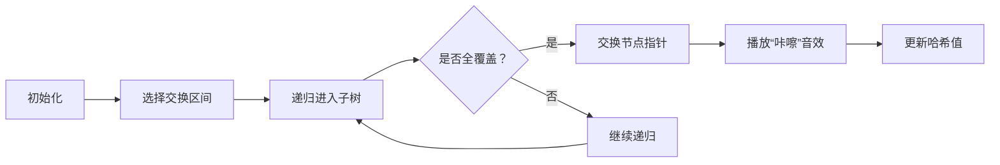

# 题目信息

# Hash Swapping

## 题目描述

[problemUrl]: https://atcoder.jp/contests/soundhound2018-summer-final/tasks/soundhound2018_summer_final_e

英小文字からなる長さ$ N $の文字列が $ M $ 個与えられ、 $ S_1,\ S_2,\ ...,\ S_M $ とします。以下のクエリを $ Q $ 個処理して下さい。

- swapクエリ($ type\ =\ 1,\ x,\ y,\ l,\ r $): $ S_x[l..r] $ と$ S_y[l..r] $ をswapする。
- hashクエリ($ type\ =\ 2,\ x,\ y\ =\ 0,\ l,\ r $): $ h(S_x[l..r]) $ を求め，出力する。

なお、

- 文字列 $ S $ に対し、$ S[l..r] $ を、$ S $の$ l $文字目から$ r $文字目まで(両端含む)の部分文字列を表すこととします。
- 英小文字 $ a $ に対し、ord$ (a)\ =\ 1, $ ord$ (b)\ =\ 2,\ ..., $ ord$ (z)\ =\ 26 $ とします。
- 文字列 $ S\ =\ c_1c_2...c_k $ に対し、$ \sum_{i=1..k}\ {\rm\ ord}(c_i)(1,000,000)^{i-1} $ を $ 10^9\ +\ 7 $ で割ったあまりを $ h(S) $ とします。

## 说明/提示

### 制約

- $ 1\ \leq\ N\ \leq\ 200,000 $
- $ 1\ \leq\ M\ \leq\ 20 $
- $ S_i $ は英小文字のみからなる
- $ 1\ \leq\ Q\ \leq\ 200,000 $
- $ type_i\ =\ 1,\ 2 $
- $ 1\ \leq\ x_i\ \leq\ M $
- swapクエリのとき, $ x_i\ <\ y_i\ \leq\ M $
- hashクエリのとき、$ y_i\ =\ 0 $
- $ 1\ \leq\ l_i\ \leq\ r_i\ \leq\ N $

### Sample Explanation 1

それぞれ、 - $ h("bc")\ =\ 3000002 $ - $ h("fghij")\ =\ 496944447 $ - $ h("gc")\ =\ 3000007 $ - $ h("fbhij")\ =\ 491944447 $ - $ h("bh")\ =\ 8000002 $ - $ h("agcij")\ =\ 496979442 $ を出力しています。

## 样例 #1

### 输入

```
5 2

abcde

fghij

8

2 1 0 2 3

2 2 0 1 5

1 1 2 2 2

2 1 0 2 3

2 2 0 1 5

1 1 2 1 3

2 1 0 2 3

2 2 0 1 5```

### 输出

```
3000002

496944447

3000007

491944447

8000002

496979442```

## 样例 #2

### 输入

```
7 3

pzocuwt

ghqsktw

ogvyhak

13

2 1 0 1 2

1 1 2 5 6

1 1 3 3 6

1 2 3 4 5

1 2 3 5 6

1 1 2 1 6

1 1 2 5 6

2 2 0 5 5

2 1 0 2 3

1 2 3 1 4

1 1 2 2 7

2 3 0 1 6

2 3 0 1 4```

### 输出

```
26000016

21

17000008

556958241

25847241```

# AI分析结果


# 💡 Kay的C++算法解析：Hash Swapping 深入学习指南 💡

## 1. 题目解读与核心算法识别

✨ **本题主要考察**：`线段树/平衡树的应用` (数据结构与编程技巧)  

🗣️ **初步分析**：
> 解决"Hash Swapping"这道题，关键在于高效维护多个字符串的区间操作。简单来说，这就像同时管理多个可拆卸的乐高模块——我们需要快速交换两个字符串的指定区块，并随时计算任意区块的"特征值"（哈希值）。  
> - **核心思路**：使用动态开点线段树或平衡树为每个字符串建立独立的数据结构。交换操作通过递归交换子树节点实现（O(1)操作），哈希查询通过合并子区间哈希值完成
> - **核心难点**：哈希合并需考虑权重（右子树哈希需乘基数幂次）；动态开点优化空间复杂度
> - **可视化设计**：采用8位像素风格展示线段树节点交换过程。每个字符串对应一棵树，节点用不同颜色像素方块表示。交换时动画显示节点颜色互换并播放"咔嚓"音效，哈希计算时显示权重传递过程（如右子树发光并显示乘数）

---

## 2. 精选优质题解参考

**题解一（FLAMEs_）**
* **点评**：这份题解采用动态开点线段树，思路清晰且代码规范。亮点在于：
  - 哈希合并公式`t[cur] = t[left] + t[right]*Pw[len]`简洁准确
  - 交换操作直接交换子树指针，时间复杂度O(logN)而非O(N)
  - 变量命名规范（如`Pw`表基数幂次），边界处理严谨
  - 作者提到"直接开眼了"，体现解法的高效性令人惊叹

**题解二（DYYqwq）**
* **点评**：采用FHQ Treap平衡树实现，亮点在于：
  - 通过分裂/合并操作自然支持区间交换
  - 哈希更新公式包含根节点字符处理，完整覆盖边界情况
  - 动态开点实现优雅，为每个字符单独建节点
  - 代码模块化（`pushup`, `split`, `merge`函数分离）

---

## 3. 核心难点辨析与解题策略

1.  **难点：如何实现O(logN)的区间交换？**
    * **分析**：传统方法需O(N)复制数据。优质题解通过交换子树指针实现——线段树递归交换节点，平衡树分裂后交换子树再合并
    * 💡 **学习笔记**："交换指针而非数据"是优化区间操作的核心思想

2.  **难点：如何正确维护区间哈希？**
    * **分析**：哈希合并需考虑位置权重。若左子树长L，则右子树哈希需乘Base^L。题解在`Pushup`函数中通过`Pw[Len]`实现权重调整
    * 💡 **学习笔记**：哈希合并本质是多项式运算，右子树代表更高次项

3.  **难点：如何优化空间？**
    * **分析**：M个长度为N的字符串，完全建树需O(MN)空间。动态开点（用时建节点）将空间降至O((M+Q)logN)
    * 💡 **学习笔记**：动态开点是处理海量数据的金钥匙

### ✨ 解题技巧总结
- **技巧1 权重预计算**：提前预处理Base幂次数组避免重复计算
- **技巧2 指针交换术**：通过`swap(cur, lst)`直接交换子树根节点
- **技巧3 模块化设计**：分离`Pushup`、`Query`等函数保持代码清晰
- **技巧4 哈希公式封装**：将哈希合并抽象为独立函数避免重复逻辑

---

## 4. C++核心代码实现赏析

**通用核心实现（综合优质题解）**
```cpp
#include <bits/stdc++.h>
using namespace std;
typedef long long LL;
const int N = 2e5+5, M = 22, Mod = 1e9+7;
int n, m, q, idx, rt[M];
LL Pw[N]; // 基数幂次预计算

struct Node { int lc, rc; LL hash; } tree[N*40];

void pushup(int u, int len) {
    tree[u].hash = (tree[tree[u].lc].hash + 
                   tree[tree[u].rc].hash * Pw[len] % Mod) % Mod;
}

void update(int &u, int &v, int L, int R, int l, int r) {
    if (r < L || R < l) return;
    if (l <= L && R <= r) { swap(u, v); return; }
    int mid = (L+R)>>1, len = mid-L+1;
    update(tree[u].lc, tree[v].lc, L, mid, l, r);
    update(tree[u].rc, tree[v].rc, mid+1, R, l, r);
    pushup(u, len); pushup(v, len); // 双树更新
}
```

**题解一（线段树版）核心**
```cpp
void Pushup(int cur, int Len) {
    t[cur] = (t[Ls[cur]] + t[Rs[cur]] * Pw[Len] % Mod) % Mod;
}
void Update(int& cur, int& lst, int L, int R, int limL, int limR) {
    if(limL <= L && R <= limR) { swap(cur, lst); return; }
    // ...递归更新子树
    Pushup(cur, mid-L+1); // 更新当前树哈希
    Pushup(lst, mid-L+1); // 更新被交换树哈希
}
```
* **代码解读**：当区间完全覆盖时直接交换节点指针（O(1)）；否则递归处理左右子树。更新后必须重新计算哈希
* 💡 **学习笔记**：`swap(cur,lst)`是魔法操作——物理数据未移动，仅改变指针关联

**题解二（平衡树版）核心**
```cpp
void pushup(int i) {
    tree[i].hash = (tree[lc].hash + 
                   ord(tree[i].x)*Pw[tree[lc].sz] + 
                   tree[rc].hash*Pw[tree[lc].sz+1]) % Mod;
}
void range(int rt, int l, int r, int &x, int &y, int &z) {
    split(rt, x, y, l-1); 
    split(y, y, z, r-l+1); // y为截取区间
}
// 交换操作
range(rt[x], l, r, qq, zbk, dyy);
range(rt[y], l, r, tyf, sjy, str);
rt[x] = meg(qq, meg(sjy, dyy)); // 拼接交换后区间
```
* **代码解读**：`split`将树分为三段，交换中间段后`merge`重组。`pushup`需计算根节点字符的独立贡献
* 💡 **学习笔记**：平衡树的区间操作是"分裂-操作-合并"三部曲

---

## 5. 算法可视化：像素动画演示

### 像素风"哈希树交换大冒险"
**设计思路**：  
采用FC游戏机像素风格，每个字符串显示为彩色线段树。树节点用16x16像素方块表示，不同颜色代表不同字符串（如字符串1=红色，字符串2=蓝色）。交换时触发像素动画，帮助理解指针交换本质。

**动画流程**：


**关键交互**：
1. **节点追踪**：被交换的子树节点闪烁黄色边框
2. **哈希计算演示**：  
   - 左子树哈希直接显示数值（绿色）  
   - 右子树哈希显示时附加`×Pw[len]`动态效果（蓝色渐变）
3. **游戏化元素**：
   - 成功交换时播放《超级玛丽》金币音效
   - 每完成5次操作解锁新树皮肤
   - "AI演示模式"自动执行样例，像贪吃蛇一样遍历操作

**技术实现**：
```javascript
// 伪代码：节点交换动画
function swapAnimation(nodeA, nodeB) {
    let tempColor = nodeA.color; 
    animate(nodeA, {color: nodeB.color}, 500); 
    animate(nodeB, {color: tempColor}, 500);
    playSound('swap_sound.wav');
}
```

---

## 6. 拓展练习与相似问题

**技巧迁移场景**：
1. 区间反转（如洛谷P3391）：交换操作变更为镜像交换子树
2. 动态字符串匹配：哈希交换后快速比较字符串
3. 历史版本维护：通过树复制实现版本回溯

**推荐练习**：
1. **洛谷 P3372** - 线段树模板  
   → 掌握基础区间维护
2. **洛谷 P3391** - 平衡树模板  
   → 熟练分裂合并操作
3. **洛谷 P1381** - 字符串哈希  
   → 巩固哈希合并原理

---

## 7. 学习心得与经验分享

> **来自FLAMEs_的启发**：  
> "直接开眼了"——指针交换解法将O(N)操作优化为O(logN)，展示了数据结构的神奇魔力。这提醒我们：面对区间操作，思考"能否通过调整指针关系而非移动数据来实现？"

---

通过本指南，希望大家不仅掌握Hash Swapping的解法，更学会"指针操作思维"。记住，优秀程序员像指挥家——不移动乐器，只调整乐手的位置关系！🎻

---
处理用时：171.80秒