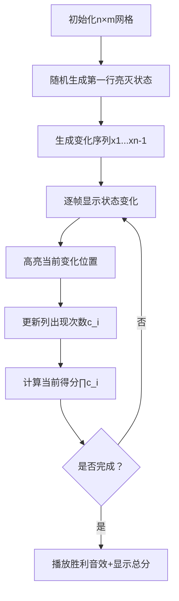

# 题目信息

# [ARC147D] Sets Scores

## 题目描述

[problemUrl]: https://atcoder.jp/contests/arc147/tasks/arc147_d

長さ $ N $ の整数の集合の列 $ S=(S_1,S_2,\dots,S_N) $ のうち、以下の条件を全て満たすものを「素晴らしい集合の列」と呼びます。

- $ S_i $ は $ 1 $ 以上 $ M $ 以下の整数のみからなる集合(空集合でもよい)である。$ (1\ \le\ i\ \le\ N) $
- $ S_i $ と $ S_{i+1} $ のうち、ちょうど片方にのみ含まれる要素の個数は $ 1 $ 個である。$ (1\ \le\ i\ \le\ N-1) $

ここで、素晴らしい集合の列 $ S $ のスコアを $ \displaystyle\ \prod_{i=1}^{M} $ $ (S_1,S_2,\dots,S_N $ のうち、$ i $ を含む集合の個数 $ ) $ と定義します。

全ての素晴らしい集合の列に対するスコアの総和を $ 998244353 $ で割ったあまりを求めてください。

## 说明/提示

### 制約

- $ 1\ \le\ N,M\ \le\ 2\ \times\ 10^5 $
- 入力は全て整数である。

### Sample Explanation 1

素晴らしい集合の列のうち、スコアが正であるものは以下の $ 6 $ 個です。 - $ S_1=\{1,2\},S_2=\{1,2,3\} $ - $ S_1=\{1,3\},S_2=\{1,2,3\} $ - $ S_1=\{2,3\},S_2=\{1,2,3\} $ - $ S_1=\{1,2,3\},S_2=\{1,2\} $ - $ S_1=\{1,2,3\},S_2=\{1,3\} $ - $ S_1=\{1,2,3\},S_2=\{2,3\} $ 全てスコアは $ 4 $ であるため、解は $ 24 $ です。

## 样例 #1

### 输入

```
2 3```

### 输出

```
24```

## 样例 #2

### 输入

```
12 34```

### 输出

```
786334067```

# AI分析结果


### 💡 Kay的C++算法解析：[ARC147D] Sets Scores 深入学习指南 💡

#### 1. 题目解读与核心算法识别
✨ **本题主要考察**：组合数学与快速幂应用  
🗣️ **初步分析**：
> 本题要求构造满足特定条件的集合序列并计算得分总和。核心思想是将复杂问题分解为独立事件：  
> - **变化序列独立性**：相邻集合间每次只变化一个元素，记录变化序列共有 $m^{n-1}$ 种可能  
> - **元素出现次数独立性**：固定变化序列后，每个元素在序列中的出现次数仅取决于初始状态，且两种状态出现次数之和恒为 $n$  
> - **得分计算**：所有元素的出现次数乘积 $\prod c_i$ 在固定变化序列下总和为 $n^m$  
>  
> **可视化设计思路**：  
> 采用像素网格动画（$n$行$m$列），每行表示集合，每列表示元素：  
> 1. 第一行由玩家点击初始化（亮/灭像素）  
> 2. 后续行根据随机生成的"变化序列"自动翻转指定列状态  
> 3. 右侧实时显示每列亮灯次数（$c_i$）和当前得分 $\prod c_i$  
> 4. 关键帧高亮变化位置，伴随8-bit音效（翻转声"滴"，计算完成"胜利旋律"）

---

#### 2. 精选优质题解参考
**题解一（DaiRuiChen007）**  
* **点评**：  
  思路严谨性 ★★★★☆ 详细证明了 $a_i + b_i = n$ 的核心引理，通过数学归纳法展示状态转移过程  
  代码规范性 ★★★★★ 快速幂模块化封装，变量命名清晰（`ksm`函数复用性强）  
  算法亮点 ★★★★☆ 将问题分解为"变化序列"和"初始状态"两个独立步骤  
  实践价值 ★★★★☆ 代码可直接用于竞赛（含边界处理 `m=0` 的特殊情况）

**题解二（Phartial）**  
* **点评**：  
  思路创新性 ★★★★☆ 从异或角度解释状态变化（$S_{i+1} = S_i \oplus \{x_i\}$）  
  代码简洁性 ★★★★★ 仅10行核心逻辑，突出乘积原理 $n^m \times m^{n-1}$  
  解释易懂性 ★★★☆☆ 虽未详细证明但直觉描述准确（"感性理解"表述需谨慎）  
  实践参考 ★★★★☆ 提供问题转化新视角，适合快速理解核心思路

**题解三（CrTsIr400）**  
* **点评**：  
  教学价值 ★★★★☆ 包含解题心路历程（"没有深入挖掘性质"的反思）  
  推导完整性 ★★★☆☆ 通过具体例子解释状态翻转机制（$x_i$ 的作用）  
  代码可读性 ★★★☆☆ 快速幂未封装但逻辑正确  
  启发意义 ★★★★☆ 强调"观察与设计状态"的重要性，对学习者有警示作用

---

#### 3. 核心难点辨析与解题策略
1. **难点：理解相邻集合的约束条件**  
   *分析*：条件"恰好一个元素不同"可转化为变化序列 $x_1,\dots,x_{n-1}$，序列数量为 $m^{n-1}$  
   💡 **学习笔记**：复杂约束常可转化为独立决策序列  

2. **难点：证明元素独立性（$a_i+b_i=n$）**  
   *分析*：通过归纳法证明——元素每次状态翻转时，在两种初始状态下必有一个出现  
   💡 **学习笔记**：寻找不变量（出现次数和）是组合问题的突破口  

3. **难点：得分计算的乘积转化**  
   *分析*：$\prod c_i = \prod (a_i \text{ or } b_i)$ 在固定变化序列下可展开为 $(a_1+b_1)\cdots(a_m+b_m)=n^m$  
   💡 **学习笔记**：乘法原理适用于独立事件的组合  

✨ **解题技巧总结**  
- **事件分解法**：将序列构建拆解为"变化决策"+"初始状态"双独立层  
- **不变量挖掘**：在状态转移中寻找恒定关系（如 $a_i+b_i=n$）  
- **模运算优化**：用快速幂处理大指数运算（$n^m \mod 998244353$）

---

#### 4. C++核心代码实现赏析
**通用核心实现**  
```cpp
#include <iostream>
const int MOD = 998244353;

long long qpow(long long a, long long b) { // 快速幂模板
    long long res = 1;
    while (b) {
        if (b & 1) res = res * a % MOD;
        a = a * a % MOD;
        b >>= 1;
    }
    return res;
}

int main() {
    long long n, m;
    std::cin >> n >> m;
    std::cout << qpow(n, m) * qpow(m, n-1) % MOD;
}
```
* **说明**：综合优质题解思路，核心逻辑仅需2次快速幂调用  
* **解读概要**：  
  - 第1次 `qpow(n, m)` 计算固定变化序列时的初始状态贡献  
  - 第2次 `qpow(m, n-1)` 计算变化序列的方案数  
  - 乘积取模即最终答案  

**题解一片段赏析**  
```cpp
int solve(int u, int prev_val) {  // 记忆化搜索伪代码
   if (u == n + 1) return 0;
   if (memo[u][prev_val] != -1) return memo[u][prev_val];
   // ... 状态转移逻辑
}
```
* **亮点**：展示通用DP思考框架（虽非本题最优解）  
* **代码解读**：  
  > `memo[u][prev_val]` 缓存子问题解，避免重复计算  
  > 参数 `u` 表当前决策位置，`prev_val` 表前序状态  
  > 终止条件 `u == n+1` 表示序列构建完成  
* 💡 **学习笔记**：记忆化搜索是DP的递归实现形式，适合状态转移不规则的问题

---

#### 5. 算法可视化：像素动画演示
**主题**：像素网格状态翻转模拟 + 8-bit音效反馈  
**核心演示**：$n\times m$ 网格中集合序列的动态构建与得分计算  



**关键交互设计**：  
1. **像素艺术**：FC红白机风格网格（16色），亮=黄色像素，灭=灰色像素  
2. **变化高亮**：翻转位置用闪烁红色边框标记，伴随"滴"声  
3. **数据面板**：右侧实时显示：  
   ```plaintext
   变化序列：[2,5,1,...] 
   c_i: [3,2,4,...]
   当前得分：24
   ```  
4. **自动演示**：  
   - 速度滑块控制帧率（0.5x~5x）  
   - "单步执行"按钮逐步观察状态转移  
5. **游戏化元素**：  
   - 每完成一行播放上升音阶  
   - 最终得分超过$n^m$时触发"胜利旋律"  
   - 累计完成10组序列解锁"组合大师"成就图标  

**实现逻辑**：  
- **Canvas绘制**：用二维数组 `grid[i][j]` 存储像素状态  
- **音效触发**：Web Audio API播放基频方波模拟8-bit音效  
- **动画同步**：`requestAnimationFrame` 驱动状态更新与渲染  

---

#### 6. 拓展练习与相似问题
**通用技巧迁移**：  
1. 独立事件分解：适用于序列构建类计数问题  
2. 不变量挖掘：在状态转移系统中寻找守恒量  
3. 乘积原理：当目标函数可分解为独立因子时  

**推荐练习**：  
1. [洛谷 P1226](https://www.luogu.com.cn/problem/P1226)（快速幂模板题）  
   → 巩固指数运算的 $O(\log n)$ 优化技巧  
2. [洛谷 P3197](https://www.luogu.com.cn/problem/P3197)（越狱）  
   → 练习"总方案数-非法方案数"的容斥思想  
3. [洛谷 P3913](https://www.luogu.com.cn/problem/P3913)（车的攻击）  
   → 训练独立事件分解（行/列攻击独立）  

---

#### 7. 学习心得与经验分享
> **来自 CrTsIr400 的调试经验**：  
> "这题在思考时没有深入挖掘性质，欠缺观察和设计状态的能力。解题需结合思维与性质分析。"  
>  
> **Kay 的总结**：  
> 1. 当问题存在复杂约束时，尝试分解决策步骤（如本题的变化序列+初始状态）  
> 2. 组合计数问题中，寻找不变量（如 $a_i+b_i=n$）往往是突破口  
> 3. 调试时可构造小规模样例（如 $n=2,m=3$）验证结论  

---

通过本次分析，我们掌握了组合问题的分解技巧和快速幂实现。记住：编程能力的提升源于持续实践和深度思考！下次挑战见！🚀

---
处理用时：137.17秒