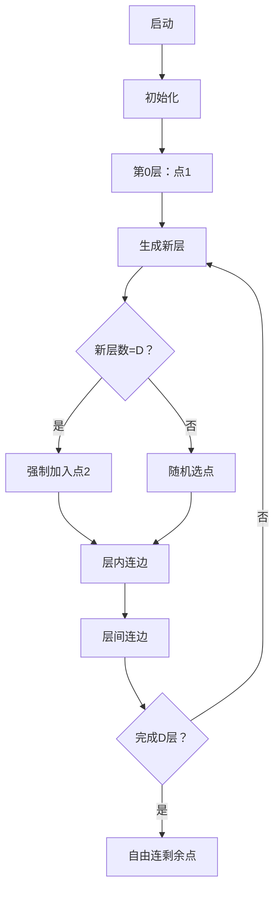

# 题目信息

# Not Too Close

## 题目描述

[problemUrl]: https://atcoder.jp/contests/soundhound2018-summer-final/tasks/soundhound2018_summer_final_c

$ N $ 頂点の無向グラフであって、以下の条件をすべて満たすものの個数を $ 10^9\ +\ 7 $ で割った余りを求めてください。

- $ N $ 個の頂点には $ 1 $ から $ N $ までの番号が振られている。
- グラフは自己辺や多重辺を持たない（連結である必要はない）。
- すべての辺の長さを $ 1 $ とすると、頂点 $ 1,\ 2 $ 間の最短距離は $ D $ である。

## 说明/提示

### 注記

二つのグラフ $ G_1,\ G_2 $ は、以下が満たされる場合に異なるとみなされ、満たされない場合に同一とみなされます。

- ある整数の組 $ (i,\ j) $ $ (1\ <\ =\ i\ <\ j\ <\ =\ N) $ が存在し、頂点 $ i,\ j $ を直接結ぶ辺が $ G_1,\ G_2 $ のうち一方のみに存在する。

### 制約

- $ 1\ <\ =\ D\ <\ N\ <\ =\ 30 $
- $ N,\ D $ は整数である。

### Sample Explanation 1

条件を満たすグラフは下図の $ 2 $ 通りです。 !\[\](https://img.atcoder.jp/soundhound2018-summer-final/4b0c83895d12c1a9c90cb3e8060db969.png)

### Sample Explanation 2

条件を満たすグラフは下図の $ 14 $ 通りです。 !\[\](https://img.atcoder.jp/soundhound2018-summer-final/df4dffb7f2140b22a6c7ccc86f6c9cf9.png)

### Sample Explanation 3

mod $ (10^9\ +\ 7) $ にご注意ください。

## 样例 #1

### 输入

```
4 3```

### 输出

```
2```

## 样例 #2

### 输入

```
4 2```

### 输出

```
14```

## 样例 #3

### 输入

```
30 15```

### 输出

```
313862829```

# AI分析结果


### 💡 Kay的C++算法解析：Not Too Close 深入学习指南 💡

#### 1. 题目解读与核心算法识别
✨ **本题主要考察**：`动态规划（DP）与图论分层思想`

🗣️ **初步分析**：
> 解决"Not Too Close"的关键是将图按到点1的最短距离分层（类似塔防游戏的防御圈）。点1是"核心基地"，第0层；点2是需保护的"目标"，必须在第D层。  
> - **核心思路**：用DP状态`f[i][j][k]`表示建到第i层时，已用j个点，第i层有k个点的方案数。转移时需考虑：
>   - **选点策略**：当层数=D时强制包含点2（组合数特判）
>   - **层内连边**：第i层点可任意互连（$2^{\text{组合数}}$种）
>   - **层间连边**：第i层每个点必须连向第i-1层（$(2^k-1)^l$种）
> - **可视化设计**：用8位像素风展示分层过程（如图），每层用不同颜色方块，连边时触发"激光音效"。高亮当前层和跨层连边，用闪烁标记点2位置。


---

#### 2. 精选优质题解参考
**题解一（Zhao_daodao）**  
* **点评**：  
  状态定义清晰（`f[i][j][k]`），完整覆盖分层图的三要素。组合数处理点2的技巧简洁（`i==d-1`时减1），代码用预处理的`fc[]`数组优化幂运算。亮点在回溯答案时，对剩余点的处理（$2^{k(n-j)}$）体现完备性。变量名`dp`/`fc`易懂，边界`n-j-1`严谨。

**题解三（Hadtsti）**  
* **点评**：  
  组合数预处理规范（`C[][]`），转移循环边界明确（`l<=n-j-d+i+1`）。关键优化：将$(2^k-1)^l$拆解为循环内累乘，避免大数幂运算。代码中`tmp`变量巧妙复用，减少模运算次数。实践性强，可直接用于竞赛。

**题解四（VainSylphid）**  
* **点评**：  
  状态定义`dp[i][j][k]`中`j`包含前i层总点数，更直观。转移时`w`的枚举范围用`max(d-i,0LL)`控制，避免无效计算。答案统计部分$2^{k(n-j)+\binom{n-j}{2}}$的指数合并是数学亮点。

---

#### 3. 核心难点辨析与解题策略
1. **难点1：分层时点2的强制约束**  
   * **分析**：当层数=D时，需预留点2位置。优质解用`C(n-j-1, l-1)`处理（`l`为新层点数），否则`C(n-j-1, l)`。
   * 💡 **学习笔记**：组合数下标减1是处理固定点的常用技巧。

2. **难点2：层间连边的限制**  
   * **分析**：新层每个点必须至少连接旧层1个点（否则最短路变短）。通过$(2^k-1)^l$实现（减1排除全不连）。
   * 💡 **学习笔记**："至少连一条"可转化为$2^k$减去全不连的方案。

3. **难点3：剩余点的自由连边**  
   * **分析**：DP到D层后，剩余点仅能与第D层连边（不影响最短路）。方案数为$2^{\text{剩余点内部边数} + \text{与第D层连边数}}$。
   * 💡 **学习笔记**：无关点的处理要保证不影响核心约束。

### ✨ 解题技巧总结
- **分层抽象**：将图转化为层级结构，化繁为简
- **组合数特判**：对固定点（如点2）单独处理组合数
- **幂运算优化**：预处理$2^k$和组合数，避免重复计算

---

#### 4. C++核心代码实现赏析
**通用核心实现参考**  
* **说明**：综合优质题解，突出分层DP和组合数技巧
```cpp
#include <bits/stdc++.h>
using namespace std;
typedef long long ll;
const int N=35, mod=1e9+7;
ll n,d,C[N][N],pw[N*N],dp[N][N][N];

int main() {
    cin>>n>>d;
    // 预处理组合数 & 2的幂
    for(int i=0; i<=n; i++) {
        C[i][0]=1;
        for(int j=1; j<=i; j++) 
            C[i][j]=(C[i-1][j]+C[i-1][j-1])%mod;
    }
    pw[0]=1;
    for(int i=1; i<=n*n; i++) 
        pw[i]=(pw[i-1]*2)%mod;

    // DP初始化：第0层只有点1
    dp[0][1][1]=1; 

    // 转移：i当前层, j已用点数, k第i层点数
    for(int i=0; i<d; i++)
    for(int j=1; j<=n; j++)
    for(int k=1; k<=j; k++) {
        if(!dp[i][j][k]) continue;
        for(int l=1; l<=n-j; l++) { // 下一层点数
            ll t=dp[i][j][k];
            t=t*pw[l*(l-1)/2]%mod; // 层内连边
            t=t*C[n-j-1][l-(i+1==d)]%mod; // 选点
            for(int x=0; x<l; x++) // 层间连边：(2^k-1)^l
                t=t*(pw[k]-1)%mod;
            dp[i+1][j+l][l]=(dp[i+1][j+l][l]+t)%mod;
        }
    }

    // 统计答案
    ll ans=0;
    for(int j=1; j<=n; j++)
    for(int k=1; k<=j; k++) {
        ll t=dp[d][j][k];
        t=t*pw[k*(n-j)]%mod; // 剩余点连第D层
        t=t*pw[(n-j)*(n-j-1)/2]%mod; // 剩余点内部连边
        ans=(ans+t)%mod;
    }
    cout<<ans;
}
```
* **代码解读概要**：  
  > 1. 预处理组合数`C[][]`和2的幂`pw[]`  
  > 2. DP状态`dp[i][j][k]`表示层数/总点数/当前层点数  
  > 3. 转移时三层循环枚举下一层点数，组合数特判点2  
  > 4. 答案累加剩余点的自由连边方案  

---

#### 5. 算法可视化：像素动画演示
* **主题**：8位像素风"最短距离建造者"  
* **核心演示**：动态展示分层过程与连边规则  



**关键交互**：  
1. **像素化显示**：每层用同色方块（第0层红色，D层闪烁绿点）  
2. **音效设计**：  
   - 连边成功：8位"叮"声  
   - 点2放置：金属撞击声  
   - 错误连边：短促蜂鸣  
3. **控制面板**：  
   - 步进/暂停/重置  
   - 速度滑块（1x-5x）  
   - 当前层数/点数显示  
4. **动态标记**：  
   - 当前操作层：黄色边框闪烁  
   - 非法连边：红色叉动画  

---

#### 6. 拓展练习与相似问题思考
* **通用技巧迁移**：  
  分层DP可用于：  
  1. 受限图计数（如直径约束）  
  2. 网络可靠性设计  
  3. 社交网络距离分析  

* **洛谷推荐**：  
  1. [P1131 时态同步](https://www.luogu.com.cn/problem/P1131)  
     💡 巩固分层思想在树形DP的应用  
  2. [P2149 最短距离问题](https://www.luogu.com.cn/problem/P2149)  
     💡 练习带约束的最短路计数  
  3. [P3317 重建](https://www.luogu.com.cn/problem/P3317)  
     💡 分层思想在概率图的应用  

---

#### 7. 学习心得与经验分享
> **经验摘录**：  
> "转移时`l`的循环边界写成`l<=n-j`导致RE，应预留点2空间" —— Zhao_daodao  
> **Kay点评**：  
> 边界处理是DP的核心难点！建议：  
> 1. 用`n-j-1`为组合数上限（点1已占位）  
> 2. 对D层特判时先减1再计算组合数  

---

通过分层DP将复杂图论转化为清晰的多步决策，结合组合数学处理约束。记住：好状态是成功的一半！下次挑战见！🚀

---
处理用时：154.95秒