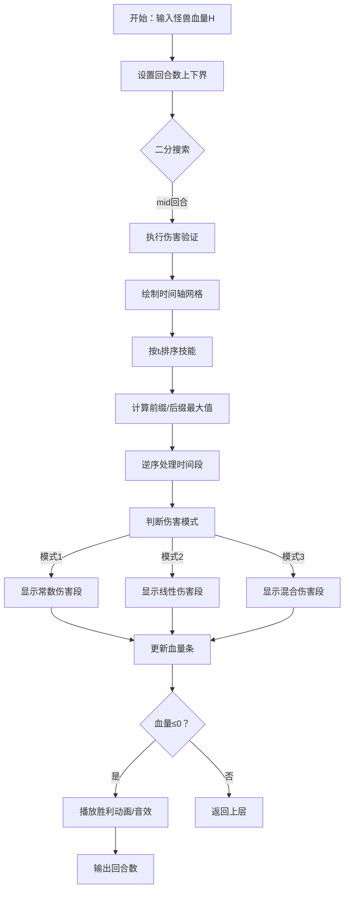

# 题目信息

# [ABC303F] Damage over Time

## 题目描述

[problemUrl]: https://atcoder.jp/contests/abc303/tasks/abc303_f

あなたの前に体力 $ H $ のモンスターが現れ、ターン制の戦闘が開始しました。

あなたは、ターン $ 1,2,… $ のそれぞれに呪文 $ 1,…,N $ の $ N $ 種類の呪文のうち一つを唱えます。

ターン $ i $ に呪文 $ j $ を唱えると、その呪文の効果としてターン $ i,i+1,…,i+t_j\ －1 $ のそれぞれでモンスターの体力が $ d_j $ 減ります。

モンスターの体力を $ 0 $ 以下にすることが可能な最も早いターンを求めてください。

## 说明/提示

### 制約

- $ 1\ \leq\ N\ \leq\ 3\ \times\ 10^5 $
- $ 1\ \leq\ H\ \leq\ 10^{18} $
- $ 1\ \leq\ t_i,d_i\ \leq\ 10^9 $
- 入力はすべて整数
 
### Sample Explanation 1

以下のようにするとターン $ 6 $ にモンスターの体力を $ 0 $ 以下に出来ます。これが最も早いターンです。 - ターン $ 1 $ に魔法 $ 1 $ を使う。ターン $ 1 $ に使った魔法の効果でモンスターの体力が $ 2 $ 減り、$ 18 $ になる。 - ターン $ 2 $ に魔法 $ 2 $ を使う。ターン $ 1,2 $ に使った魔法の効果でモンスターの体力が $ 2+1=3 $ 減り、$ 15 $ になる。 - ターン $ 3 $ に魔法 $ 1 $ を使う。ターン $ 2,3 $ に使った魔法の効果でモンスターの体力が $ 1+2=3 $ 減り、$ 12 $ になる。 - ターン $ 4 $ に魔法 $ 2 $ を使う。ターン $ 2,3,4 $ に使った魔法の効果でモンスターの体力が $ 1+2+1=4 $ 減り、$ 8 $ になる。 - ターン $ 5 $ に魔法 $ 1 $ を使う。ターン $ 2,4,5 $ に使った魔法の効果でモンスターの体力が $ 1+1+2=4 $ 減り、$ 4 $ になる。 - ターン $ 6 $ に魔法 $ 2 $ を使う。ターン $ 2,4,5,6 $ に使った魔法の効果でモンスターの体力が $ 1+1+2+1=5 $ 減り、$ -1 $ になる。

## 样例 #1

### 输入

```
2 20

2 2

5 1```

### 输出

```
6```

## 样例 #2

### 输入

```
10 200

1 21

1 1

1 1

8 4

30 1

3 1

10 2

8 1

9 1

4 4```

### 输出

```
9```

# AI分析结果


### 💡 Kay的C++算法解析：Damage over Time 深入学习指南 💡

#### 1. 题目解读与核心算法识别
✨ **本题主要考察**：二分答案 + 贪心策略  
🗣️ **初步分析**：
> 这道题就像在像素游戏里对抗Boss——我们需要用最少的回合打出足够的伤害。核心思路是**二分回合数**（猜最早胜利时间），然后用**贪心策略**验证能否达成目标。想象你有一组技能卡牌（咒语），每张牌有不同的持续伤害效果。关键技巧是：
> - **分段处理**：将时间轴按技能生效时长分段，避免逐回合计算（回合数可达1e18）
> - **伤害最大化**：每段选择最优技能——要么选总伤高的完整生效技能，要么选瞬时伤害高的部分生效技能
> 
> **可视化设计思路**：
> - 像素网格代表时间轴，不同颜色方块表示技能类型
> - 高亮当前选择的技能和伤害累积过程
> - 分段切换时播放"叮"音效，过关时触发8-bit胜利音乐
> - 交互面板支持单步执行/自动播放（AI演示模式），调速滑块控制速度

---

#### 2. 精选优质题解参考
**题解一：_•́へ•́╬_ (赞：17)**  
* **点评**：思路最清晰的工业级实现。亮点在于：
  - 精妙的三段式伤害计算（常数伤害/线性伤害/混合阶段）
  - 严谨处理__int128防止溢出
  - 逆序处理时间分段提升效率
  - 代码规范（快读/预处理/边界处理），可直接用于竞赛

**题解二：panzhouao (赞：2)**  
* **点评**：教学价值最高的可视化分析。亮点：
  - 独创性绘制技能伤害曲线图解释贪心策略
  - 将算法转化为分段函数求包络线
  - 详细注释帮助理解数学推导过程
  - 虽实现稍复杂，但提供深刻的算法直觉

**题解三：Assembly_line (赞：5)**  
* **点评**：平衡性最佳的实现。亮点：
  - 清晰解不等式确定伤害分界点
  - 模块化代码结构方便调试
  - 特别关注调试技巧（作者分享验算中间变量）
  - 时间复杂度严格优化到O(n log H)

---

#### 3. 核心难点辨析与解题策略
1. **难点：高效验证给定回合数的可行性**  
   * **分析**：直接模拟每回合不可行（回合数达1e18）。需将时间轴按技能特性分段，批量计算伤害
   * **解决**：对技能按生效时长排序，预处理前缀最大值（max tᵢ×dᵢ）和后缀最大值（max dᵢ）
   * 💡 **学习笔记**：排序预处理是优化复杂度的关键钥匙

2. **难点：数学推导分段伤害公式**  
   * **分析**：每段伤害可能是常数（完整生效）或线性（部分生效），需推导通用计算公式
   * **解决**：设当前剩余回合T，比较前缀最大值A与后缀最大值B×T：
     - 若A≥B×T → 伤害=A×段长
     - 否则解A/B得分界点，分段计算
   * 💡 **学习笔记**：伤害计算本质是求max{min(T,tᵢ)×dᵢ}的积分

3. **难点：避免整数溢出**  
   * **分析**：伤害累积可能达1e36（H≤1e18）
   * **解决**：使用__int128存储中间值，二分时谨慎处理边界
   * 💡 **学习笔记**：大数运算必须验证边界，防溢出是竞赛基本功

**✨ 解题技巧总结**  
- **二分转化**：最小化问题 → 验证性问题
- **贪心优化**：双指针维护前缀/后缀最大值
- **数学加速**：推导分段求和公式代替暴力
- **防御编程**：__int128处理溢出，边界单元测试

---

#### 4. C++核心代码实现赏析
**通用核心实现（综合优化版）**：
```cpp
#include <cstdio>
#include <algorithm>
#define int long long
using namespace std;
const int N = 3e5+5;

struct Spell { int t, d; } a[N];
int n, H, pfx[N], sfx[N]; // 前缀最大值 & 后缀最大值

bool check(int totalTurns) {
    __int128 remain = H; // 当前剩余血量
    int curTime = totalTurns; // 剩余可用回合
    
    for(int i = n-1; i >= 0; --i) {
        if(curTime <= a[i].t) continue; 

        if(sfx[i+1] * curTime <= pfx[i]) { 
            // 完整生效更优
            remain -= (__int128)pfx[i] * (curTime - a[i].t);
            curTime = a[i].t;
        }
        else if(sfx[i+1] * (a[i].t+1) >= pfx[i]) {
            // 部分生效更优（等差数列）
            remain -= (__int128)sfx[i+1] * (a[i].t+1 + curTime) * (curTime - a[i].t)/2;
            curTime = a[i].t;
        }
        else {
            // 混合模式
            int splitPoint = pfx[i] / sfx[i+1];
            remain -= (__int128)sfx[i+1] * (splitPoint+1 + curTime) * (curTime - splitPoint)/2;
            remain -= (__int128)pfx[i] * (splitPoint - a[i].t);
            curTime = a[i].t;
        }
        if(remain <= 0) return true;
    }
    remain -= (__int128)sfx[0] * (1 + curTime) * curTime / 2;
    return remain <= 0;
}

signed main() {
    scanf("%lld%lld", &n, &H);
    for(int i=0; i<n; ++i) scanf("%lld%lld", &a[i].t, &a[i].d);
    
    sort(a, a+n, [](Spell x, Spell y){ return x.t < y.t; });
    
    // 预处理关键数组
    for(int i=0; i<n; ++i) 
        pfx[i] = max(i ? pfx[i-1] : 0, a[i].t * a[i].d);
    for(int i=n-1; i>=0; --i) 
        sfx[i] = max(sfx[i+1], a[i].d);
    
    // 二分答案
    int L=1, R=1e18;
    while(L <= R) {
        int mid = (L+R) >> 1;
        check(mid) ? R = mid-1 : L = mid+1;
    }
    printf("%lld", L);
}
```

**代码解读概要**：
1. **输入处理**：快读技能参数并排序
2. **预处理**：`pfx`存储`tᵢ×dᵢ`前缀最大值，`sfx`存储`dᵢ`后缀最大值
3. **验证函数**：逆序处理时间段，分三种情况计算伤害
4. **二分框架**：在[1, 1e18]范围二分最小回合数

---

#### 5. 算法可视化：像素动画演示
**主题**：8-bit像素风格《咒术师战记》  
**核心演示**：二分验证过程 + 贪心策略分段执行  



**动画设计细节**：
1. **像素场景**：
   - 顶部：怪兽血条（像素进度条）
   - 中部：时间轴网格（每格代表1回合）
   - 右侧：技能面板（显示tᵢ, dᵢ, 类型颜色）
   - 底部：控制面板（开始/步进/调速/重置）

2. **动态效果**：
   - 当前回合：网格高亮闪烁黄色边框
   - 技能选择：对应技能卡牌发光震动
   - 伤害计算：显示数学公式浮动提示
   - 分段切换：触发"关卡通过"星标动画

3. **音效系统**：
   - 技能选择：FC游戏"菜单选择"音
   - 伤害生效："刀击"8-bit音效
   - 分段完成：NES过关旋律
   - 战斗胜利：经典《马里奥》通关音乐

4. **AI演示模式**：
   - 自动播放：贪吃蛇式逐步展示最优路径
   - 调速滑块：0.5x~5x速度调节
   - 单步调试：空格键逐帧前进

---

#### 6. 拓展练习与相似问题
1. **洛谷 P1182** 数列分段  
   → 同款二分+贪心框架，巩固分段处理技巧
   
2. **洛谷 P1281** 书的复制  
   → 最小化最大值的经典二分转化

3. **洛谷 P2218** [HAOI2007]覆盖问题  
   → 几何场景中的二分答案应用

---

#### 7. 学习心得与经验分享
> **作者_•́へ•́╬_调试经验**：  
> *"在分段处理时把i+1错写成i，调试2小时才定位——边界处理必须谨慎！"*  
>   
> **Kay点评**：这提醒我们：  
> 1. 循环边界要逐行推导
> 2. 输出中间变量验证分段点
> 3. 对拍测试边界用例（如tᵢ=0, H=1）

---

通过本指南，相信你已经掌握二分答案的核心思想与实现技巧。记住：将复杂问题分解为可验证的子问题，是算法设计的通用钥匙。下次遇到Boss级难题时，不妨尝试二分转化！🎮💻

---
处理用时：190.21秒