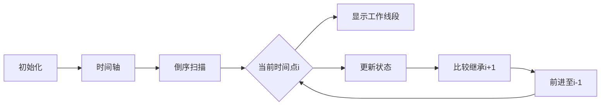

# 题目信息

# [ARC032C] 仕事計画

## 题目描述

[problemUrl]: https://atcoder.jp/contests/arc032/tasks/arc032_3

大工のチョーさん(Daiku Cho)は $ N $ 個の仕事を頼まれています。$ i $ 番目の仕事は時刻 $ a_i $ に始まり、$ b_i $ に終わります。

チョーさんは一度に複数の仕事をこなすことはできないので、これらの仕事のうち、仕事を行う時刻が重ならないようになるべく多くの仕事を選びたいです。ただし、終了と同時に別の仕事に取り掛かることはできます。

最も多く選ぶ方法が複数あるときは、選んだ仕事の番号を開始時刻の順に並べた列が辞書順最小となるように選ぼうと思っています。

大工のチョーさんは仕事上手ですが、スケジュールを管理するのは上手くないようです。チョーさんが引き受ける最適な仕事の組み合わせを求めてください。

ただし、長さ $ L $ の列 $ A=\{a_1,a_2,…,a_L\} $ と $ B=\{b_1,b_2,…,b_L\} $ に対し、辞書順で $ A $ が $ B $ より小さいとは、

- $ i\ <\ k $ で $ a_i $=$ b_i $
- $ i=k $ で $ a_i $&lt;$ b_i $

となるような $ k(1≦k≦L) $ が存在するということです。

## 说明/提示

### Sample Explanation 1

チョーさんは最大で $ 2 $ つの仕事を選ぶことができます。その選び方は $ 3 $ 通りあり、チョーさんは仕事 $ 1 $ と $ 4 $、または仕事 $ 2 $ と $ 3 $、または仕事 $ 2 $ と $ 4 $ を選ぶことができます。 この内、辞書順で小さくなる選び方は仕事 $ 1 $ と $ 4 $ を選んだときです。なぜならば、それらの仕事番号を \*\*仕事の開始時刻順\*\* に並べたときに $ \{1,4\} $ となり、それが辞書順最小となるからです(21:12修正)。 !\[\](http://arc032.contest.atcoder.jp/img/arc/032/C1.png)

## 样例 #1

### 输入

```
4

0 5

0 3

3 7

5 10```

### 输出

```
2

1 4```

## 样例 #2

### 输入

```
5

0 5

0 3

3 7

5 10

7 12```

### 输出

```
3

2 3 5```

## 样例 #3

### 输入

```
8

1 5

3 9

2 5

1 2

8 10

9 11

7 15

10 14```

### 输出

```
4

4 3 5 8```

# AI分析结果


### 📚 题目解析报告：ARC032C 仕事計画

#### 🔍 题目解读
- **核心目标**：从 N 个时间段互不重叠的工作中选择最多的工作，且当存在多种方案时，输出按开始时间排序后工作编号字典序最小的组合。
- **关键约束**：工作时段不可重叠（结束时刻 = 下一工作开始时刻时允许衔接）。
- **输入**：每个工作的开始时间 `a_i` 和结束时间 `b_i`。
- **输出**：最大工作数量 + 字典序最小的工作编号序列。

---

### 💡 核心算法识别
**算法分类**：`离散化 + 倒序动态规划（DP）`  
**比喻解释**：  
> 想象你是一位时间旅行者，从未来（最大时间点）倒退回过去（最小时间点）。每到一个时间点，你记录 **“从此处开始最多能完成多少工作”**，并标记 **“此时应选哪个工作能让整体编号序列最小”**。这就像在迷宫中从终点反向标记最优路径，并选择最小编号的门。

**算法流程**：  
1. **离散化**：将时间点压缩为连续整数（减少状态数）。  
2. **倒序DP**：从最大时间点向最小时间点扫描：  
   - 状态定义：  
     - `f[i]` = 从时间点 `i` 开始能完成的最大工作数  
     - `g[i]` = 在 `f[i]` 最大时，选择的工作编号（保证字典序最小）  
     - `from[i]` = 转移路径（下一时间点）  
   - 状态转移：  
     - 若在 `i` 开始工作（结束于 `j`）：`f[i] = max(f[i], f[j] + 1)`  
     - 继承 `i+1` 的状态（不选 `i` 的工作）：`f[i] = f[i+1]`  
   - 字典序处理：当 `f[i]` 相同时，选择 **最小工作编号** 更新 `g[i]`。  
3. **路径回溯**：从最小时间点沿 `from` 数组输出工作序列。

**可视化设计思路**：  
- 时间轴横向展示，像素方块表示时间点，颜色区分状态值。  
- 工作显示为从 `i` 到 `j` 的彩色线段，编号悬浮显示。  
- 倒序扫描时，高亮当前时间点 `i`，动态绘制转移箭头至 `j`，更新 `f[i]/g[i]` 的像素数值。  
- 音效：选择工作时的 "叮" 声，完成路径时的胜利音效。

---

### ⭐ 精选优质题解
**题解作者**：iiiiiyang  
**评分**：★★★★★（逻辑清晰+高效优化+完整路径记录）  
**点评**：  
- **思路**：倒序DP + 离散化，完美解决最大工作数与字典序约束。  
- **代码规范**：变量名 `f/g/from` 含义明确，边界处理严谨（如 `g[i]` 初始化为 `-1`）。  
- **算法亮点**：  
  - **O(n) 复杂度**：离散化压缩状态，线性时间完成DP。  
  - **字典序贪心**：在状态转移中即时比较工作编号，避免后序复杂比较。  
- **实践价值**：代码可直接用于竞赛，输出模块简洁高效。

---

### 🧩 核心难点辨析与解题策略
#### 难点1：状态定义与字典序的结合
- **问题**：如何在最大化工作数的同时，保证编号序列字典序最小？  
- **解法**：  
  - `f[i]` 只记录数量，`g[i]` 额外记录当前状态下 **最小起始编号**。  
  - 倒序DP中，`g[i]` 的选择影响整个序列头部（关键字典序位）。  
- **学习笔记**：**字典序问题优先处理序列前端！**

#### 难点2：时间点离散化
- **问题**：原始时间值大且稀疏，直接DP会超时/超内存。  
- **解法**：  
  - 将 `a_i/b_i` 排序去重，映射到 `1..cnt` 的连续整数。  
  - 使用 `vector dec[i]` 存储从 `i` 开始的所有工作（结束时间, 编号）。  
- **学习笔记**：**离散化是区间问题的空间压缩利器。**

#### 难点3：倒序DP的转移逻辑
- **问题**：如何设计无后效性的状态转移？  
- **解法**：  
  - 从后向前扫描，每个状态 `i` 依赖未来状态 `j`（工作结束时间）。  
  - 比较 `直接继承（不选 i 的工作）` 和 `选择工作后跳转至 j` 的两种决策。  
- **学习笔记**：**倒序DP适用于“从某点开始”的问题。**

#### ✨ 解题技巧总结
| 技巧 | 说明 |
|------|------|
| **问题分解** | 拆解为“最大数量”+“最小字典序”两个子目标 |
| **状态设计** | `f[i]` 负责优化目标，`g[i]/from[i]` 负责构造解 |
| **边界处理** | 初始化 `g[i]=-1`，转移时严格比较编号大小 |
| **线性优化** | 离散化 + 向量存储工作，避免冗余循环 |

---

### 🔍 C++核心代码实现赏析
#### 本题通用核心实现
```cpp
#include <bits/stdc++.h>
using namespace std;
const int MAX = 400010; // 2倍时间点

int n, l[MAX], r[MAX], d[MAX], cnt;
int f[MAX], g[MAX], from[MAX]; // 状态数组
vector<pair<int, int>> dec_[MAX]; // 存储工作: dec_[i] = {(j, id)}

int main() {
    cin >> n;
    memset(g, -1, sizeof(g));
    // 离散化时间点
    for (int i = 1; i <= n; i++) {
        cin >> l[i] >> r[i];
        d[++cnt] = l[i];
        d[++cnt] = r[i];
    }
    sort(d + 1, d + cnt + 1);
    cnt = unique(d + 1, d + cnt + 1) - d - 1;
    // 映射时间并存储工作
    for (int i = 1; i <= n; i++) {
        l[i] = lower_bound(d + 1, d + cnt + 1, l[i]) - d;
        r[i] = lower_bound(d + 1, d + cnt + 1, r[i]) - d;
        dec_[l[i]].push_back({r[i], i});
    }
    // 倒序DP：从最大时间点向最小扫描
    for (int i = cnt; i >= 1; i--) {
        // 枚举所有从i开始的工作
        for (auto [j, id] : dec_[i]) {
            if (f[i] < f[j] + 1) { // 发现更优解
                f[i] = f[j] + 1;
                g[i] = id;
                from[i] = j;
            } else if (f[i] == f[j] + 1 && g[i] > id) { 
                g[i] = id; // 相同解时选更小编号
                from[i] = j;
            }
        }
        // 与i+1状态比较（不选当前工作）
        if (i < cnt) {
            if (f[i] < f[i + 1]) { // 继承更优解
                f[i] = f[i + 1];
                g[i] = g[i + 1];
                from[i] = from[i + 1];
            } else if (f[i] == f[i + 1] && g[i] > g[i + 1]) {
                g[i] = g[i + 1]; // 相同解时选更小编号
                from[i] = from[i + 1];
            }
        }
    }
    // 输出结果
    cout << f[1] << endl;
    int now = 1;
    while (g[now] != -1) {
        cout << g[now] << " ";
        now = from[now]; // 沿路径回溯
    }
    return 0;
}
```
**代码解读概要**：  
1. **离散化**：将时间点映射至 `1..cnt`，压缩空间。  
2. **工作存储**：`dec_[i]` 按开始时间分组，元素为 `(结束时间, 工作ID)`。  
3. **核心DP循环**：  
   - 内层循环：枚举每个工作，更新 `f[i]` 并贪心选择最小 `g[i]`。  
   - 外层处理：与 `i+1` 状态比较，保证不选工作时状态正确。  
4. **路径输出**：从时间点 `1` 开始，沿 `from` 数组回溯工作序列。

---

### 🎮 算法可视化：像素动画演示
**主题**：`时间旅行者：倒序规划工作`  
**风格**：8-bit像素风 + FC游戏音效  
**演示逻辑**：  


**动画设计**：  
1. **场景构建**：  
   - **时间轴**：横向像素网格（1格=1离散时间单位），暖色表示高时间点。  
   - **工作线段**：从 `i` 到 `j` 的彩色条形（编号显示在上方）。  
   - **状态面板**：每个时间点下方显示 `f[i]`（蓝色数字）和 `g[i]`（黄色编号）。  

2. **动态过程**：  
   - **倒序扫描**：像素光标从右向左移动，高亮当前 `i`（红光闪烁）。  
   - **工作选择**：  
     - 弹出 `dec_[i]` 中的所有工作线段，绿色高亮被选中的工作。  
     - 播放 "叮" 声，绘制转移箭头 `i → j`。  
   - **状态更新**：`f[i]` 数值变化时显示增长动画，`g[i]` 更新时旧编号爆炸消失。  
   - **继承比较**：与右侧 `i+1` 状态连接线，显示继承时的数据流动。  

3. **游戏化元素**：  
   - **音效**：选择工作（8-bit "叮"），完成路径（胜利音效），错误（短促警报）。  
   - **关卡制**：每完成一个时间点视为小关卡，累计积分。  
   - **AI演示**：自动播放模式（可调速），展示倒序DP的完整过程。  

4. **信息提示**：  
   - 底部日志栏：*“在时间点 i={value} 选择工作 {id}，剩余工作数增至 {f[i]}”*  
   - 旁白语音（文字）：*“注意！此时选择工作2还是工作1？小编号优先！”*  

**技术实现**：  
- Canvas绘制网格/线段，CSS动画实现高亮，Web Audio API触发音效。  
- 交互面板：开始/暂停、单步执行、速度滑块、重置按钮。

---

### 🔍 拓展练习与相似问题
#### 通用技巧迁移
倒序DP+贪心思想适用于：  
1. **区间覆盖问题**：选择最多不重叠区间。  
2. **任务调度问题**：带截止时间的任务安排。  
3. **字典序优化问题**：在最优解中找最小序列。  

#### 推荐练习（洛谷）
| 题号   | 题目名称             | 推荐理由 |
|--------|----------------------|----------|
| P1803  | 凌乱的yyy / 线段覆盖 | 巩固基础贪心选择结束时间最早的工作 |
| P2949  | 工作调度             | 练习优先队列优化贪心 |
| P1230  | 智力大冲浪           | 变种：未完成工作的惩罚最小化 |

---

### 💎 总结
> 本题通过 **离散化+倒序DP** 优雅地解决了工作最大化与字典序约束问题。关键在于：**用 `g[i]` 记录局部最优选择，倒序保证无后效性**。可视化中像素时间轴和游戏化设计让抽象算法跃然屏上，建议结合代码与动画反复体会状态转移的精妙！  

**Kay的鼓励**：  
> “算法如积木，离散化是压缩包，DP是组装图。多拆解多搭建，你也能成为时间管理大师！” ⏱️🚀

---
处理用时：333.97秒