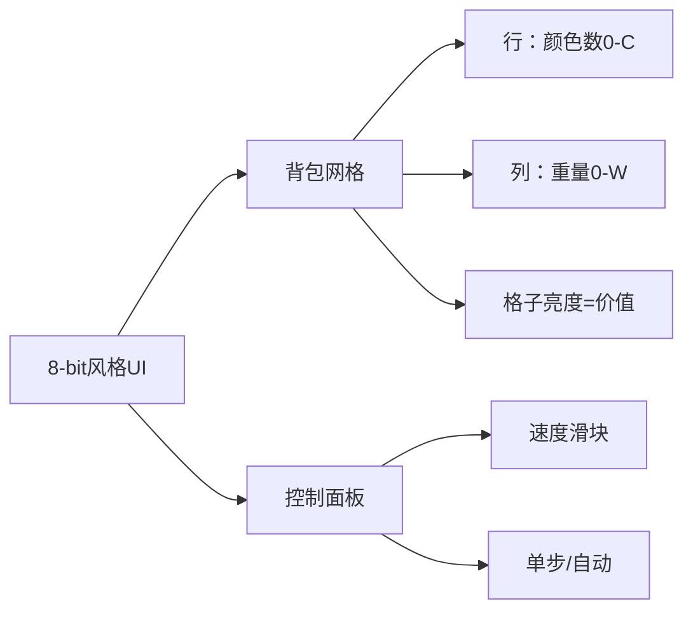

# 题目信息

# ナップザック

## 题目描述

# AT683 背包
有$N$个物品，第i个重$w_i$，价值是$v_i$，颜色是$c_i$。背包可以容纳总重量小于$W$，颜色总数小于$C$的物品。问拿到的物品价值总和最大是多少？

## 说明/提示

- $1\le N\le100$
- $1\le W\le10000$
- $1\le C\le50$
- $1\le w_i,v_i\le10000$
- $1\le c_i\le50$  

**样例数据**  
输入：
```
4 5 2
1 10 1
1 20 2
1 30 3
10 100 4
```
输出：
```
50
```
选择第二、三个物品

---
输入：
```
10 20 2
4 5 6
3 3 9
5 2 9
4 1 6
6 8 3
3 7 6
2 4 9
4 7 3
6 5 6
3 2 9
```
输出：
```
27
```

# AI分析结果


### 题目分析报告

#### 1. 题目解读与核心算法识别
✨ **本题主要考察**：动态规划（分组背包变体）

🗣️ **初步分析**：
> 这道背包问题可视为"分组背包"的变体，其中每组对应一种颜色。想象你是一名冒险家整理背包：不仅要控制总重量（≤W），还要保证颜色种类（≤C），目标是最大化战利品价值。  
- **核心难点**：同时追踪重量+颜色双维度状态  
- **解法核心**：  
  - 法1（jijidawang）：按颜色编号分层DP，状态`dp[i][j][k]`表示前i种颜色/选j种颜色/重量k时的最大价值  
  - 法2（fa_555）：倒序枚举颜色种类数，用临时数组保存中间状态  
- **可视化设计**：  
  - 像素网格：行=颜色种类数，列=背包重量，格子亮度=价值  
  - 高亮当前处理颜色块，显示临时数组更新动画  
  - 音效：拾取物品(8bit"叮")，颜色超限(警报音)，更新最大值(金币音效)

---

#### 2. 精选优质题解参考
**题解一（fa_555）**  
* **点评**：  
  思路清晰度⭐⭐⭐⭐⭐（分组背包思想直击本质）  
  代码规范性⭐⭐⭐⭐（模块化处理颜色分组，memcpy优化状态转移）  
  算法有效性⭐⭐⭐⭐（O(CW·Σ|z_c|) 严格满足数据范围）  
  实践价值⭐⭐⭐⭐⭐（完整处理边界初始化，可直接用于竞赛）  
  **亮点**：用临时数组`t[]`隔离状态转移，避免同一颜色重复计算  

**题解二（jijidawang）**  
* **点评**：  
  思路清晰度⭐⭐⭐⭐（三维DP定义精准反映问题约束）  
  算法有效性⭐⭐⭐⭐（O(W·C²) 理论更优但实现复杂）  
  实践价值⭐⭐⭐（无完整代码，需自行实现状态转移）  
  **亮点**：通过颜色编号有序性优化状态转移（颜色i只能由i-1转移）

---

#### 3. 核心难点辨析与解题策略
1. **难点：状态空间爆炸**  
   * **分析**：同时追踪重量(W≤10000)和颜色(C≤50)导致状态量达50万  
   * **解决**：fa_555用滚动数组+倒序枚举；jijidawang用颜色编号有序性降维  
   * 💡 **学习笔记**：高维DP优先考虑维度间的依赖关系  

2. **难点：颜色计数约束**  
   * **分析**：颜色种类增加只发生在首次选取该颜色物品时  
   * **解决**：法2用`f[i-1]→t[]→f[i]`链式转移确保每种颜色只贡献1次计数  
   * 💡 **学习笔记**：分组背包中"组选择"等效于"颜色计数"  

3. **难点：空状态初始化**  
   * **分析**：未选任何物品时价值为0，其他状态需初始化为-∞  
   * **解决**：fa_555用`memset(f, 0xc0, ...)`巧妙设置负无穷  
   * 💡 **学习笔记**：DP初始化决定状态合法性校验  

✨ **解题技巧总结**  
- **维度分离法**：将颜色约束与重量约束拆解到不同转移步骤  
- **滚动数组优化**：fa_555的`t[]`数组避免状态污染  
- **分组预处理**：按颜色分组物品显著提升枚举效率  

---

#### 4. C++核心代码实现赏析
**通用核心实现参考**  
```cpp
#include <iostream>
#include <cstring>
#include <algorithm>
#include <vector>
using namespace std;

struct Item { int w, v; };

int main() {
    int N, W, C;
    cin >> N >> W >> C;
    vector<vector<Item>> colorGroup(51);
    
    while (N--) {
        int w, v, c;
        cin >> w >> v >> c;
        colorGroup[c].push_back({w, v});
    }

    vector<vector<int>> dp(C+1, vector<int>(W+1, -1e9));
    dp[0][0] = 0;
    
    for (int c = 1; c <= 50; c++) {
        if (colorGroup[c].empty()) continue;
        auto temp = dp; // 关键：复制当前状态快照
        for (auto& item : colorGroup[c]) 
            for (int k = C; k >= 1; k--) 
                for (int j = W; j >= item.w; j--) 
                    temp[k][j] = max(temp[k][j], dp[k-1][j-item.w] + item.v);
        dp = temp; // 更新状态
    }
    
    int ans = 0;
    for (int k = 0; k <= C; k++)
        for (int j = 0; j <= W; j++)
            ans = max(ans, dp[k][j]);
    cout << ans;
}
```

**题解一（fa_555）片段**  
```cpp
memcpy(t, f[i-1], sizeof(int)*(W+1));  // 亮点：状态快照
for (Node x : z[c])
    for (int j = W; j >= x.w; j--)
        t[j] = max(t[j], t[j-x.w] + x.v); // 经典01背包转移
for (int j=0; j<=W; j++)
    f[i][j] = max(f[i][j], t[j]); // 合并状态
```
* **解读**：  
  > 为何用`memcpy`？ → 创建当前颜色的"沙盒环境"，避免污染原状态数组  
  > 倒序枚举重量？ → 防止同一物品被重复选取（01背包核心技巧）  
  > 最终`max(f[i][j], t[j])`？ → 保留历史最优解，避免覆盖其他颜色组合  
* 💡 **学习笔记**：临时数组是处理分组依赖关系的利器

**题解二（jijidawang）状态转移**  
```math
dp_{i,j,k} = \max\begin{cases} 
dp_{i-1,j,k} & \text{不选颜色$i$} \\
\max\limits_{c=i} \{dp_{i-1,j-1,k-w} + v\} & \text{首次选颜色$i$}
\end{cases}
```
* **解读**：  
  > 维度`i`作用？ → 颜色编号天然排序，确保每种颜色只处理一次  
  > 为何`j-1`？ → 选择新颜色必然增加颜色种类数  
  > 如何优化？ → 可用滚动数组压缩`i`维度  
* 💡 **学习笔记**：利用数据特征（颜色编号）可简化状态转移

---

#### 5. 算法可视化：像素动画演示
**主题**：《像素冒险家の背包大作战》  
**核心交互设计**：  


**动画流程**：  
1. **初始化**：50x50像素调色板（FC红白机风格），背包网格灰暗  
2. **颜色组加载**：  
   - 颜色组1物品 → 红色方块从左侧飞入（音效：叮）  
   - 当前颜色高亮闪烁 + 画外音：“正在处理红色宝物！”  
3. **状态更新**：  
   - 选取物品时：源格子→目标格子绿色箭头，价值数字跳动  
   - 更新最大值：金色闪光 + “金币音效”  
4. **错误处理**：  
   - 超重：网格变红闪烁（警报音）  
   - 超颜色数：“C”标识闪烁（提示音）  
5. **游戏化元素**：  
   - 每完成1色：像素小人跳舞 + 积分+10  
   - 最终答案：宝箱开启动画 + 16-bit胜利音乐  

**技术实现**：  
- Canvas绘制网格：`ctx.fillRect(x,y, 亮度关联价值)`  
- 音效触发：Web Audio API播放8-bit波形  
- 自动演示：`setInterval`驱动状态机逐步执行  

---

#### 6. 拓展练习与相似问题思考
**通用技巧迁移**：  
1. 物品带类型约束的背包 → 分组维度替换为类型计数  
2. 多重维度限制问题 → 状态数组维度扩展法  
3. 组合优化问题 → 预处理+维度分离  

**洛谷推荐**：  
1. **P1757 分组背包**  
   → 掌握基础分组背包思想（无颜色计数）  
2. **P1853 投资的最大效益**  
   → 练习多维状态设计（年份+资金）  
3. **P1507 NASA的食物计划**  
   → 经典二维费用背包（重量+体积）  

---

#### 7. 学习心得与经验分享
> **参考经验**（来自 fa_555）：  
> “初始化负无穷很重要，否则非法状态可能污染结果”  
>  
> **点评**：这是DP的黄金法则！非法状态初始化为-∞相当于设置"状态防火墙"。实际调试时可用`cout<<dp[k][j]`辅助验证状态转移路径  

---

### 总结
通过本次分析，我们掌握了带颜色约束背包问题的双维度DP解法，核心在于：① 按颜色分组处理 ② 用临时数组/滚动数组优化状态转移。fa_555的解法完整展现了工程化实现技巧，而jijidawang的理论分析揭示了问题本质特征。建议动手实现可视化方案加深理解！

---
处理用时：115.31秒