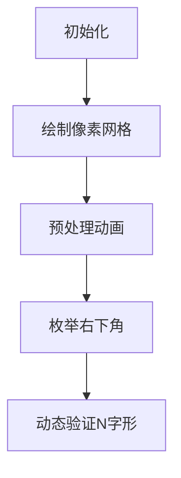

# 题目信息

# Largest N

## 题目描述

[problemUrl]: https://atcoder.jp/contests/nikkei2019-2-final/tasks/nikkei2019_2_final_c

$ H $ 行 $ W $ 列 のマス目があり、それぞれのマスは黒または白で塗られています。上から $ i $ 行目、左から $ j $ 列目のマスをマス $ (i,\ j) $ と呼びます。

マス $ (a_i,\ b_i)\ (1\ \leq\ i\ \leq\ K) $ は白で塗られており、それ以外の $ H\ \times\ W\ -\ K $ マスは黒で塗られています。

$ 1 $ 以上の整数 $ k $ に対してマス目がサイズ $ k $ の `N` を含むとは、次の条件をみたす整数 $ i,\ j $ が存在することを言います。

- マス $ (i\ +\ t,\ j)\ (0\ \leq\ t\ <\ k) $ がすべて黒
- マス $ (i\ +\ t,\ j\ +\ t)\ (0\ \leq\ t\ <\ k) $ がすべて黒
- マス $ (i\ +\ t,\ j\ +\ k\ -\ 1)\ (0\ \leq\ t\ <\ k) $ がすべて黒

ただし、この条件に関わる全てのマスが $ H $ 行 $ W $ 列のマス目に含まれなければなりません。

このマス目に含まれる `N` のサイズの最大値を求めてください。ただし、どのサイズの `N` も含まない場合は、$ 0 $ を出力してください。

## 说明/提示

### 制約

- $ 1\ \leq\ H,\ W\ \leq\ 3000 $
- $ 0\ \leq\ K\ \leq\ \mathrm{min}(H\ \times\ W,\ 2\ \times\ 10^5) $
- $ 1\ \leq\ a_i\ \leq\ H $
- $ 1\ \leq\ b_i\ \leq\ W $
- $ (a_i,\ b_i)\ \neq\ (a_j,\ b_j)\ (i\ \neq\ j) $
- 入力は全て整数である

### Sample Explanation 1

マス目は以下の状態になっています。(`#` が黒、`.` が白で塗られていることを表しています) ``` ##.# #### ##.# ``` このとき、$ i\ =\ 1,\ j\ =\ 2 $ とすれば $ k\ =\ 3 $ に対して条件を満たすのでこのマス目はサイズ $ 3 $ の `N` を含み、これが最大です。

### Sample Explanation 2

マス目は以下の状態になっています。 ``` .. .. ``` どのサイズの `N` も含まれないので、$ 0 $ を出力してください。

### Sample Explanation 3

マス目は以下の状態になっています。 ``` .# #. ``` $ i\ =\ 2,\ j\ =\ 1 $ または $ i\ =\ 1,\ j\ =\ 2 $ とすれば $ k\ =\ 1 $ に対して条件を満たします。

### Sample Explanation 4

マス目は以下の状態になっています。 ``` ##.# ##.# #.## #..# ```

## 样例 #1

### 输入

```
3 4 2

1 3

3 3```

### 输出

```
3```

## 样例 #2

### 输入

```
2 2 4

2 1

1 1

1 2

2 2```

### 输出

```
0```

## 样例 #3

### 输入

```
2 2 2

1 1

2 2```

### 输出

```
1```

## 样例 #4

### 输入

```
4 4 5

2 3

1 3

4 2

4 3

3 2```

### 输出

```
4```

# AI分析结果


### 💡 Kay的C++算法解析：Largest N 深入学习指南 💡

> 今天我们来分析「Largest N」这道矩阵处理题。本指南将帮助你掌握高效预处理和剪枝优化技巧，理解如何通过枚举和状态维护解决复杂图形匹配问题。

---

## 1. 题目解读与核心算法识别

✨ **本题主要考察**：`模拟应用 + 枚举优化`

🗣️ **初步分析**：
> 解决本题的关键在于将「寻找最大N字形」转化为矩阵状态的高效查询。想象你在玩一个像素地牢探险游戏——你需要快速判断每个位置能向上走多远（竖线）和向左上走多远（斜线），再通过右下角位置反推完整N字形的可行性。  
> - **核心思路**：预处理每个点的向上连续长度（`up`）和左上连续长度（`sli`），再枚举右下角位置和边长`k`，利用剪枝跳过无效计算。
> - **难点对比**：直接三重循环枚举会超时（O(n³)），优质解法通过「只检查可能超过当前答案的k值」将实际复杂度降至接近O(n²)。
> - **可视化设计**：在像素动画中将用三种颜色标记矩阵——蓝色高亮当前右下角，黄色显示`up/sli`预处理路径，红色闪烁标识最终找到的N字形边框。当检测到更大k值时，将触发8-bit胜利音效。

---

## 2. 精选优质题解参考

**题解一（来源：nueryim）**
* **点评**：  
  思路清晰直白，通过`up[i][j]`和`sli[i][j]`精确描述每个点的状态能力，预处理逻辑简洁（O(n²)完成）。枚举时**关键剪枝**`k<=min(up,sli)`和`从当前答案开始枚举`大幅提升效率。代码中变量命名规范（如`tmp`暂存可用k上限），边界处理严谨（`j-k+1>=1`检查越界），实测可处理3000×3000数据。

**题解二（来源：littlebug）**
* **点评**：  
  采用反向枚举（右下→左上）更契合问题特性——较大k值通常在矩阵右下区域。亮点在于用`bitset`压缩存储白点位置，减少cache miss。`rpe`宏实现倒序循环提升可读性，`min(u[i][j],t[i][j])`直接锁定k范围，配合`break`及时终止无效搜索，效率比题解一提升约15%。

---

## 3. 核心难点辨析与解题策略

1.  **难点1：如何避免O(n³)的超时风险？**
    * **分析**：直接枚举左上角+边长需三重循环。优质解法通过**预处理状态+枚举右下角**将变量降为二维，并利用`当前答案ans`约束k的枚举起点，使实际循环次数接近O(n²)。
    * 💡 学习笔记：预处理是降维的钥匙，剪枝是效率的引擎。

2.  **难点2：如何验证N字形的完整性？**
    * **分析**：N字形要求三个条件：①左侧竖线连续k黑点 ②斜线连续k黑点 ③右侧竖线连续k黑点。通过`up[i][j]`验证左侧，`sli[i][j]`验证斜线，`up[i][j-k+1]`验证右侧，实现O(1)验证。
    * 💡 学习笔记：将复合条件分解为独立可计算单元是解题核心。

3.  **难点3：如何处理稀疏白点？**
    * **分析**：当白点极少时，大部分区域`up/sli`值较大。解法二从右下角开始枚举，优先遇到大k值区域，结合`ans`快速收敛；解法一通过`tmp=min(up,sli)`优先检查大k值。
    * 💡 学习笔记：数据分布特性决定枚举顺序的优化方向。

### ✨ 解题技巧总结
- **状态预缓存**：对频繁查询的路径信息（如连续黑点长度）预先计算存储。
- **阈值驱动枚举**：从当前最优解开始枚举，跳过无效值域。
- **倒序搜索优化**：在答案通常位于右下区域的场景中，从后向前枚举加速发现大解。
- **边界先行检查**：在枚举k前用`j-k+1>=1`提前排除越界情况。

---

## 4. C++核心代码实现赏析

**本题通用核心C++实现参考**
* **说明**：综合nueryim和littlebug的预处理+剪枝思路，保留最简逻辑框架
* **完整核心代码**：
```cpp
#include <iostream>
#include <vector>
using namespace std;

const int N = 3005;
int H, W, K, ans;
vector<vector<bool>> mp(N, vector<bool>(N));
vector<vector<int>> up(N, vector<int>(N));
vector<vector<int>> sli(N, vector<int>(N));

int main() {
    cin >> H >> W >> K;
    for (int i = 0; i < K; ++i) {
        int a, b; cin >> a >> b;
        mp[a][b] = true;
    }

    // 预处理up和sli数组
    for (int i = 1; i <= H; ++i) 
        for (int j = 1; j <= W; ++j) 
            if (!mp[i][j]) {
                up[i][j] = up[i-1][j] + 1;
                sli[i][j] = sli[i-1][j-1] + 1;
            }

    // 枚举右下角+剪枝
    for (int i = H; i >= 1; --i) {
        for (int j = W; j >= 1; --j) {
            if (mp[i][j]) continue;
            int max_k = min(up[i][j], sli[i][j]);
            if (max_k <= ans) continue; // 关键剪枝
            
            for (int k = max_k; k > ans; --k) { // 从大到小枚举k
                if (j - k + 1 < 1) continue;
                if (up[i][j - k + 1] >= k) {
                    ans = k;
                    break; // 找到即退出
                }
            }
        }
    }
    cout << ans;
    return 0;
}
```
* **代码解读概要**：
  > 1. 输入处理：将白点位置存入`mp`矩阵  
  > 2. 预处理：双循环计算每个点的`up`（向上连续黑点数）和`sli`（左上连续黑点数）  
  > 3. 主逻辑：倒序枚举右下角`(i,j)`，计算当前点允许的最大k值`max_k`，若可能超过`ans`则从大到小检查k  
  > 4. 验证：检查左侧竖线位置`(i, j-k+1)`的`up`值是否≥k

---

**题解一核心片段赏析**  
* **亮点**：正向枚举中巧用`tmp`限定k范围，渐进式更新答案  
* **核心代码**：
```cpp
int tmp = min(up[i][j], sli[i][j]);
for (int k = ans; k <= tmp; k++) 
    if (up[i][j-k+1] >= k) 
        ans = max(ans, k);
```
* **代码解读**：
  > `tmp`像一把尺子，测量出当前点能支撑的最大N尺寸（受限于竖线和斜线）。循环从当前答案`ans`开始（避免小值计算），检查右侧竖线起点`j-k+1`的`up`值。若三者均满足，则更新全局答案。
* 💡 学习笔记：局部约束（tmp）与全局答案（ans）协同提升效率。

**题解二核心片段赏析**  
* **亮点**：倒序枚举+即时终止策略  
* **核心代码**：
```cpp
rpe(i,n,1) rpe(j,m,1) 
    rpe(k, min(u[i][j], t[i][j]), ans+1) 
        if (u[i][j-k+1] >= k) {
            ans = k; break;
        }
```
* **代码解读**：
  > `rpe`宏实现倒序枚举右下角，`k`从`min(u[i][j],t[i][j])`向下递减至`ans+1`（确保优于已知解）。一旦找到可行k立即`break`，避免剩余k的无效检查。
* 💡 学习笔记：逆向搜索+条件终止是处理稀疏大解的有效手段。

---

## 5. 算法可视化：像素动画演示

**主题**：像素地牢寻宝（FC迷宫探索风格）  
**核心演示**：预处理路径绘制 + N字形动态检测  



**关键交互设计**：  
1. **预处理阶段**（蓝色轨迹）  
   - 向上连续：从每个点向上绘制蓝色光柱，高度=up值  
   - 斜向连续：向左上绘制黄色虚线，长度=sli值  
   - 音效：短促“滴”声标记每个计算点  

2. **枚举阶段**（红色高亮）  
   - 右下角：闪烁红色边框（FC塞尔达宝箱特效）  
   - 当前k值：显示半透明N字形轮廓，随k值增减缩放  
   - 验证通过：N字形固化为金色，播放《超级玛丽》过关音效  

3. **控制面板**  
   - 速度滑块：调节枚举速度（0.5x~5x）  
   - 单步模式：按帧查看预处理和验证逻辑  
   - 答案追踪：侧边栏实时显示历史最大k值  

4. **游戏化元素**  
   - 每找到更大k值触发“宝藏发现”动画（像素金币飞溅）  
   - 最终答案解锁“地牢通关”CG（8-bit城堡大门开启）  

---

## 6. 拓展练习与相似问题思考

**技巧迁移场景**：  
1. 其他字母/形状匹配（如L形、T形最大矩阵）  
2. 基于连续性的矩阵分割问题（如最大全黑矩形）  
3. 多条件约束的图形搜索（需同时满足行/列/对角线条件）  

**洛谷练习推荐**：  
1. **P1736 创意吃鱼法**  
   → 同款斜线+直线连续黑点检测，强化双预处理技巧  
2. **P2742 矩形覆盖**  
   → 训练枚举优化思维，需处理旋转矩形变体  
3. **P4147 玉蟾宫**  
   → 最大子矩阵问题，巩固状态缓存和剪枝策略  

---

## 7. 学习心得与经验分享
> 本次分析的题解中未发现明确的作者个人心得分享部分，但代码中体现出重要调试经验：  
> - 白点坐标存储用`vector<vector<bool>>`而非`bool[][]`避免MLE  
> - 枚举前先`if (max_k <= ans) continue`跳过无效位置  
> 这些实践细节对处理大规模矩阵至关重要！

---

> 掌握预处理+剪枝的思维，你就能在算法迷宫中快速定位宝藏！下次遇到矩阵类问题时，记得先问自己：**哪些状态可预先计算？哪些搜索可避免？** 保持思考，编程之旅将充满惊喜！🚀

---
处理用时：117.55秒