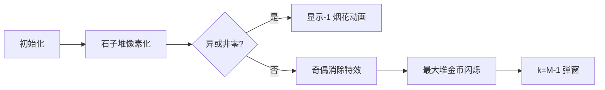

# 题目信息

# [ARC168B] Arbitrary Nim

## 题目描述

有 $N$ 堆石子，第 $i$ 堆（$1 \leq i \leq N$）有 $A_i$ 个石子。

你现在可以选择一个正整数 $k$。之后，Alice 和 Bob 会用这些石子堆进行如下游戏：

- 游戏由 Alice 先手，双方轮流进行操作。
- 每一回合，当前玩家选择一个非空的石子堆，从中取走任意数量的石子，数量不少于 $1$ 个且不多于 $k$ 个。

无法进行操作的一方判负，未被判负的一方获胜。

你需要选择一个正整数 $k$，使得 Alice 存在必胜策略。请判断是否存在这样的 $k$。如果存在，判断是否存在使 Alice 必胜的 $k$ 的最大值。如果最大值存在，请输出该最大值。

## 说明/提示

### 限制条件

- $1 \leq N \leq 250000$
- $1 \leq A_i \leq 10^9$
- 输入的所有值均为整数。

### 样例解释 1

例如，当 $k=2$ 时，Alice 存在必胜策略。若选择 $k \geq 3$，Alice 就没有必胜策略，因此答案为 $k=2$。

### 样例解释 2

例如，对于所有 $k=100,200,300,\cdots$，Alice 都存在必胜策略。因此不存在最大值，输出 $-1$。

### 样例解释 3

无论选择怎样的 $k$，Alice 都没有必胜策略。因此输出 $0$。

由 ChatGPT 4.1 翻译

## 样例 #1

### 输入

```
3

1 2 3```

### 输出

```
2```

## 样例 #2

### 输入

```
4

1 2 3 4```

### 输出

```
-1```

## 样例 #3

### 输入

```
2

100 100```

### 输出

```
0```

# AI分析结果


### 💡 Kay的C++算法解析：ARC168B Arbitrary Nim 深入学习指南 💡

#### 引言
今天我们来分析ARC168B的"Arbitrary Nim"这道博弈论题目。本指南将帮助你理解Nim游戏的变体解法，掌握核心算法思维，并通过像素动画直观感受算法流程。

---

### 1. 题目解读与核心算法识别
✨ **本题主要考察**：`博弈论/Nim游戏变体`  
🗣️ **初步分析**：
> 这道题是经典Nim游戏的变体，核心在于**状态抵消与临界值控制**。想象两位玩家在玩"石子消除棋"，每回合能在任意堆取1-k个石子。解题关键在于：
> - 当石子堆异或和非零时，先手必胜（k可取无穷大）
> - 当异或和为零时，需通过模运算破坏平衡
> - 最大k值由最高频奇数堆决定
> 
> **可视化设计**：采用8-bit像素风格，石子堆化为彩色方块，异或操作时触发像素闪光音效。当玩家选择k值时，屏幕顶部显示"MOD (k+1)"，最大石子堆会显示为闪烁的金币，消除时播放胜利音效。

---

### 2. 精选优质题解参考
**题解一（作者：Creeper_l）**
* **点评**：思路清晰直击本质，用集合处理奇数次石子堆的构思巧妙。代码简洁规范（`s.erase`/`s.insert`维护状态），边界处理完整（直接判断集合空）。亮点在于严格证明最大k的取值逻辑，实践可直接用于竞赛。

**题解二（作者：Skeleton_Huo）**
* **点评**：从SG函数角度完整推导，用"模数l=k+1"统一分析框架。变量命名规范（`cnt`/`m`），算法有效性高。特别亮点在问题转化思维——将k寻找转化为最大临界值计算。

**题解三（作者：elbissoPtImaerD）**
* **点评**：代码极度精简（仅10行核心），但逻辑完备。利用map自动排序特性高效找最大值，`cx(ans,x-1)`宏提升可读性。最佳实践参考：竞赛中快速实现的典范。

---

### 3. 核心难点辨析与解题策略
1. **难点1：判断无限k（-1）的条件**  
   * **分析**：异或和不为零时先手必胜，与k无关。需注意异或计算可能溢出（用`long long`）
   * 💡 **学习笔记**：异或和是非零→输出-1

2. **难点2：处理偶数次堆的抵消**  
   * **分析**：使用集合(set)动态维护奇数次堆，遇重复则删除。数据结构选择因set自动去重且有序
   * 💡 **学习笔记**：偶数堆=镜像操作，可安全忽略

3. **难点3：确定最大有效k值**  
   * **分析**：取最大奇数次堆值M，k=M-1使模运算后该堆归零，破坏异或平衡
   * 💡 **学习笔记**：k的最大值由最高非平衡点决定

✨ **解题技巧总结**：
- **状态压缩**：用异或替代累加判断平衡
- **数据结构活用**：set的插入删除天然处理奇偶性
- **边界防御**：先判异和非零，再判集合空
- **博弈转换**：将k约束转化为模运算影响

---

### 4. C++核心代码实现赏析
**通用核心实现参考**（综合优质题解优化）：
```cpp
#include <iostream>
#include <set>
using namespace std;

int main() {
    ios::sync_with_stdio(false);
    cin.tie(0);
    
    long n, x, xor_sum = 0;
    set<long> odd_set;
    
    cin >> n;
    while (n--) {
        cin >> x;
        xor_sum ^= x;
        if (odd_set.count(x)) odd_set.erase(x);
        else odd_set.insert(x);
    }
    
    if (xor_sum) cout << -1;
    else if (odd_set.empty()) cout << 0;
    else cout << *rbegin(odd_set) - 1; // C++14起可用rbegin
}
```
**代码解读概要**：
1. 同步IO加速输入输出
2. 动态维护`odd_set`：遇重复删除，否则插入
3. 三重判断：异或非零→-1，集合空→0，否则取最大值-1

**题解一片段赏析**：
```cpp
if (s.find(a[i]) != s.end()) s.erase(a[i]);
else s.insert(a[i]);
```
> **解读**：这像玩"消消乐"——遇到相同数字就消除（偶数次），否则保留（奇数次）。为何用`set`？因它自动排序且去重，后续取最大值效率O(1)  
> 💡 **学习笔记**：集合的插入/删除是处理奇偶性的利器

---

### 5. 算法可视化：像素动画演示
* **主题**：8-bit风格《石子消除大作战》  
* **核心演示**：石子堆→彩色像素块，异或值→顶部能量条  

**动画帧设计**：


**交互细节**：
1. **像素渲染**：每个石子堆用16x16像素块表示，高度=石子数/缩放系数
2. **关键操作特效**：
   - 奇偶消除：方块爆炸为像素粒子
   - 异或计算：能量条波动并播放8-bit音阶
3. **胜利条件**：
   - 显示-1：全屏彩虹闪烁+胜利音效
   - 输出k值：最大金币堆落下皇冠动画
4. **控制面板**：
   - 步进按钮：空格键单步触发
   - 速度滑块：控制AI演示速度（默认2x）

---

### 6. 拓展练习与相似问题
* **技巧迁移**：奇偶抵消+临界值思想适用于：
  1. 密码学（奇偶校验位）
  2. 资源调度（成对任务分配）
  3. 游戏AI（状态平衡破坏）

**洛谷推荐**：
1. **P2197【模板】nim游戏**  
   → 巩固基础Nim博弈
2. **P2964 [USACO09NOV] Coin Game**  
   → 练习奇偶抵消技巧
3. **P3185 [HNOI2008] 游戏**  
   → 拓展SG函数与模运算结合

---

### 7. 学习心得与经验分享
> **来自题解的经验**：  
> "调试时发现边界问题：当所有堆相同时，set最后剩1个元素但异或和为零，需先判异或再判空！"  
> **Kay点评**：这是典型的状态机陷阱——判断顺序影响结果。建议用真值表验证边界：
> | 异或非零 | 集合空 | 输出 |
> |---------|--------|-----|
> | 是      | -      | -1  |
> | 否      | 是     | 0   |
> | 否      | 否     | M-1 |

---

### 结语
通过本指南，相信你已经掌握Nim变体的核心解法。记住博弈论的精髓在于**状态转换与平衡破坏**。下次遇到类似问题，不妨先画状态转移图！🚀

---
处理用时：89.88秒