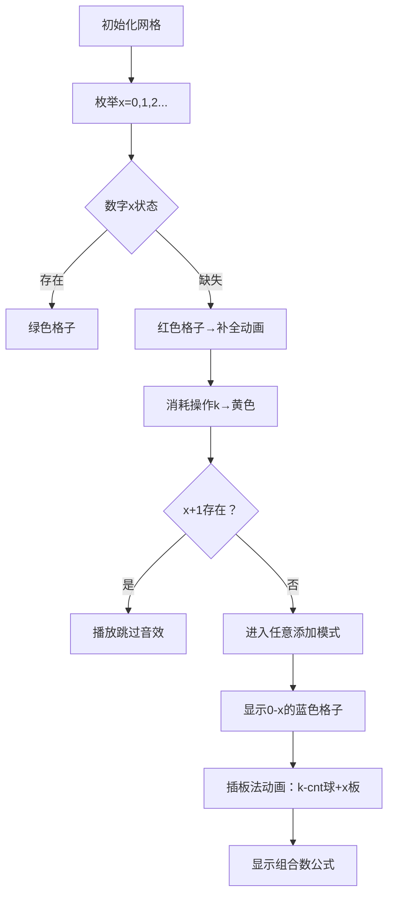

# 题目信息

# [ARC156B] Mex on Blackboard

## 题目描述

对于由有限个非负整数组成的多重集 $S$，定义 $\mathrm{mex}(S)$ 为不属于 $S$ 的最小非负整数。例如，$\mathrm{mex}(\lbrace 0,0,1,3\rbrace )=2$，$\mathrm{mex}(\lbrace 1 \rbrace)=0$，$\mathrm{mex}(\lbrace \rbrace)=0$。

黑板上写有 $N$ 个非负整数，第 $i$ 个数为 $A_i$。

你需要恰好进行 $K$ 次如下操作：

- 从黑板上的非负整数中选出 $0$ 个或多个，组成多重集 $S$，然后将 $\mathrm{mex}(S)$ 写到黑板上 $1$ 次。

请你求出，经过 $K$ 次操作后，黑板上可能出现的非负整数多重集的种数，结果对 $998244353$ 取模。

## 说明/提示

## 限制条件

- $1 \leq N,K \leq 2\times 10^5$
- $0 \leq A_i \leq 2\times 10^5$
- 输入的所有数均为整数

## 样例解释 1

操作后可能得到的多重集有以下 $3$ 种：

- $\lbrace 0,0,1,3 \rbrace$
- $\lbrace 0,1,1,3 \rbrace$
- $\lbrace 0,1,2,3 \rbrace$

例如，$\lbrace 0,1,1,3 \rbrace$ 可以通过选择黑板上的 $0$，令 $S=\lbrace 0\rbrace$，然后进行操作得到。

## 样例解释 2

操作后可能得到的多重集有以下 $2$ 种：

- $\lbrace 0,0,0 \rbrace$
- $\lbrace 0,0,1 \rbrace$

注意，操作时可以选择 $0$ 个整数。

由 ChatGPT 4.1 翻译

## 样例 #1

### 输入

```
3 1

0 1 3```

### 输出

```
3```

## 样例 #2

### 输入

```
2 1

0 0```

### 输出

```
2```

## 样例 #3

### 输入

```
5 10

3 1 4 1 5```

### 输出

```
7109```

# AI分析结果


# 💡 Kay的C++算法解析：[ARC156B] Mex on Blackboard 深入学习指南 💡

## 1. 题目解读与核心算法识别

✨ **本题主要考察**：`组合计数与枚举技巧`

🗣️ **初步分析**：
> 这道题的核心在于理解mex操作的本质：每次操作相当于向集合中添加一个新的非负整数。最终目标是统计K次操作后可能形成的不同多重集数量。

> **核心思路**：
> - 枚举最终集合中从0开始连续出现的最大整数x（即mex(S)=x+1）
> - 计算补全0~x中缺失数字所需的操作次数cnt
> - 剩余K-cnt次操作可在[0,x]范围内任意添加整数
> - 方案数用组合数学中的"插板法"计算：C(K-cnt+x, x)

> **可视化设计**：
> - 像素网格展示0~x+1的数字状态（绿色=存在，红色=缺失，黄色=补全，蓝色=任意添加）
> - 动画演示：数字补全过程→插板法动态演示→组合数公式实时显示
> - 8-bit音效：补全时"收集"声，添加时"放置"声，错误时"嘟嘟"声
> - 控制面板：单步执行/自动播放（可调速），重置按钮

---

## 2. 精选优质题解参考

**题解一（Kingna）**
* **点评**：思路清晰直白，代码简洁高效。通过vis数组标记数字存在性，枚举时动态维护缺失计数cnt，遇到x+1存在时跳过避免重复。组合数预处理规范，边界处理严谨（cnt>k时终止），时间复杂度O(n+k)完美符合题目要求。亮点在于用不到30行代码完整实现核心逻辑。

**题解二（suzhikz）**
* **点评**：创新性地使用"新增us个不同元素"的视角，将问题转化为经典组合模型。代码结构清晰，阶乘和逆元预处理封装良好。亮点在于对组合意义的深刻理解——将剩余操作视为在i个盒子分配k-us个球，自然导出组合数公式C(i+k-us-1, k-us)。

**题解三（Greenzhe）**
* **点评**：题解阐述最为严谨，特别强调"x+1存在时必须跳过"的关键细节（其他题解易遗漏）。虽然代码实现有小瑕疵，但其对避免重复计数的原理说明极具教学价值。亮点在于用清晰的数学语言证明算法正确性，是理论结合实践的典范。

---

## 3. 核心难点辨析与解题策略

1.  **关键点：避免重复计数**
    * **分析**：枚举连续段终点x时，若x+1已存在，则当前状态会被包含在x+1的枚举中。优质题解采用统一策略：当`vis[x+1]==true`时直接跳过当前x
    * 💡 **学习笔记**：组合计数中，状态边界定义直接影响算法正确性

2.  **关键点：组合模型建立**
    * **分析**：剩余k-cnt次操作在[0,x]范围任意添加，等价于求x+1个非负整数解个数。通过变量变换y_i=x_i+1转化为正整数解问题，套用插板法公式C(k-cnt+x, x)
    * 💡 **学习笔记**：插板法是解决"无序分配"问题的利器

3.  **关键点：高效组合数计算**
    * **分析**：n,k≤2e5需预处理阶乘和逆元。核心技巧：用费马小定理求模逆元，O(n)预处理O(1)查询
    * 💡 **学习笔记**：模质数下的组合数=阶乘×阶乘逆元

### ✨ 解题技巧总结
- **枚举定界法**：通过枚举关键变量（如连续段终点）将无限问题有限化
- **组合转化术**：将实际问题抽象为经典组合模型（如球盒问题）
- **边界防御**：特别处理空集/极值/边界情况（如k=0或max_x+1）
- **预处理优化**：对频繁使用的数学函数（阶乘/逆元）预计算

---

## 4. C++核心代码实现赏析

**本题通用核心C++实现参考**
* **说明**：综合优质题解精髓，严格处理边界条件
* **完整核心代码**：
```cpp
#include <iostream>
#include <vector>
using namespace std;
const int MAX = 400000;
const int mod = 998244353;

long long qpow(long long a, long long k, long long p) {
    long long res = 1;
    while (k) {
        if (k & 1) res = res * a % p;
        a = a * a % p;
        k >>= 1;
    }
    return res;
}

int main() {
    int n, k; 
    cin >> n >> k;
    vector<int> vis(MAX+1, 0);
    vector<long long> fac(600001), inv(600001);
    
    // 预处理阶乘及逆元
    fac[0] = 1;
    for (int i = 1; i <= 600000; i++) 
        fac[i] = fac[i-1] * i % mod;
    inv[600000] = qpow(fac[600000], mod-2, mod);
    for (int i = 599999; i >= 0; i--)
        inv[i] = inv[i+1] * (i+1) % mod;

    // 标记存在数字
    for (int i = 0; i < n; i++) {
        int a; cin >> a;
        if (a <= MAX) vis[a] = 1;
    }

    long long res = 0;
    int cnt = 0;  // 缺失计数
    for (int x = 0; x <= MAX; x++) {
        if (!vis[x]) cnt++;     // 缺失则增加计数
        if (cnt > k) break;    // 操作数不足时终止
        if (x+1 <= MAX && vis[x+1]) continue; // 关键跳过
        
        // 计算组合数C(k-cnt+x, x)
        if (k - cnt + x < 0) continue;
        long long comb = fac[k-cnt+x] * inv[x] % mod * inv[k-cnt] % mod;
        res = (res + comb) % mod;
    }
    cout << res << endl;
    return 0;
}
```
* **代码解读概要**：
  1. 预处理阶乘数组`fac`和逆元数组`inv`至600000
  2. `vis`数组标记初始数字存在性
  3. 枚举连续段终点`x`，动态维护缺失计数`cnt`
  4. 遇到`vis[x+1]==true`时跳过避免重复
  5. 用组合数公式$C(k-cnt+x,x)$累加方案数

---
**题解一（Kingna）片段赏析**
* **亮点**：简洁高效的枚举策略
* **核心代码片段**：
```cpp
int cnt = 0;
for (int i = 0; i <= N; i++) {
    if (!vis[i]) cnt++;
    if (vis[i+1]) continue; // 跳过关键点
    if (cnt > k) break;
    res += C(k-cnt+i, i); // 组合数累加
}
```
* **代码解读**：
  > 循环枚举连续终点`i`，`vis[i]`缺失时`cnt`增加。遇到`i+1`存在则跳过，确保状态唯一性。当`cnt>k`时说明剩余操作不足，提前终止。组合数计算剩余操作分配方案。
* 💡 **学习笔记**：用`continue`实现状态过滤是简洁代码的关键

**题解二（suzhikz）片段赏析**
* **亮点**：创新的"新增元素"视角
* **核心代码片段**：
```cpp
int us = 0;
for (int i = 0; i < N; i++) {
    if (!cnt[i]) {
        if (i != 0) // 非首元素时计算组合数
            ans = (ans + C(i+k-us-1, k-us)) % mod;
        us++; // 新增元素计数
        if (us > k) break;
    }
}
```
* **代码解读**：
  > `us`统计新增的不同元素。当遇到缺失数字`i`时，计算在已存在的`i`个数字（0~i-1）上分配剩余操作`k-us`的方案数。组合数$C(i+k-us-1, k-us)$来自经典球盒模型。
* 💡 **学习笔记**：组合数$C(n+k-1,k)$表示n个盒子放k个相同球

---

## 5. 算法可视化：像素动画演示

**主题**：`"数字世界补全计划"`（复古像素风格）

**核心演示**：


**交互设计**：
1. **像素网格**：16×16像素格子，四种状态色
2. **控制面板**：
   - 步进控制：←→键单步执行
   - 速度滑块：0.5x~5x动画速度
   - 模式切换：手动/自动（AI演示）
3. **音效方案**：
   - 补全数字：8-bit "收集"音效（250Hz方波）
   - 添加操作：小球放置声（短促滴答声）
   - 错误跳过：双音"嘟嘟"（100+300Hz）
   - 阶段完成：胜利音阶（C大调上行）
4. **动态公式**：
   - 屏幕底部实时显示：$ans += C(${k-cnt}+${x},${x}$)$
   - 组合数参数随动画高亮变化

**实现要点**：
1. 用Canvas绘制网格（20×20像素/格）
2. 补全动画：红色格子→黄色渐变动画（10帧）
3. 插板法演示：小球（蓝色圆）与隔板（竖线）动态排列
4. 自动模式：类似"贪吃蛇AI"逐步执行，每步0.5秒间隔

---

## 6. 拓展练习与相似问题思考

**通用技巧迁移**：
1. **存在性+组合计数**：处理数字存在性状态与组合方案结合
2. **操作分配模型**：将操作转化为经典分配问题
3. **枚举定界法**：通过关键变量枚举化无限为有限

**洛谷推荐**：
1. **P1287 盒子与球**  
   → 基础插板法应用，掌握盒子非空时的组合计数
2. **P3197 [HNOI2008]越狱**  
   → 组合计数与容斥原理结合，训练正难则反思维
3. **P3223 [HNOI2012]排队**  
   → 复杂边界条件下的组合计数，提升分类讨论能力

---

## 7. 学习心得与经验分享

> **来自Greenzhe的启示**：  
> *"其他题解未注意x+1存在时的跳过处理，这会导致重复计数。在枚举类问题中，状态边界的明确定义是避免错误的关键。"*

**Kay的总结**：  
编程竞赛中的组合计数问题，往往需要结合枚举策略。通过本次分析，我们得到三条黄金法则：
1. **状态无环**：确保枚举状态呈单向依赖（如x递增）
2. **边界防御**：特别处理极值/边界情况（如k=0或max_x+1）
3. **组合映射**：将实际问题转化为经典组合模型

> 记住：好的算法=正确的状态定义+合适的数学模型+严谨的边界处理

---

本次解析就到这里，继续在算法的世界里探险吧！🚀

---
处理用时：343.90秒