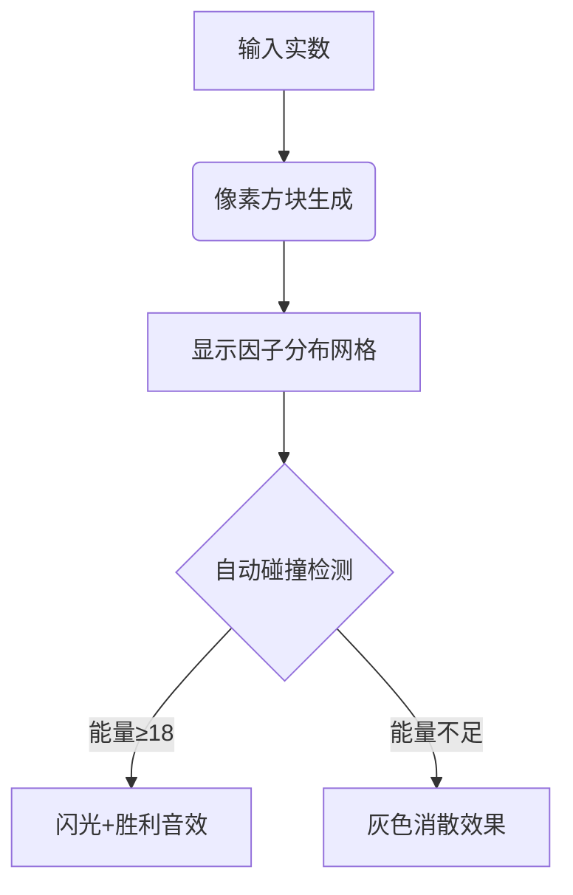

# 题目信息

# [AGC047A] Integer Product

## 题目描述

[problemUrl]: https://atcoder.jp/contests/agc047/tasks/agc047_a

$ N $ 個の実数 $ A_1,\ A_2,\ \ldots,\ A_N $ が与えられます。添字のペア $ (i,\ j) $ ($ i\ <\ j $) であって、積 $ A_i\ \cdot\ A_j $ が整数であるようなものの個数を求めてください。

## 说明/提示

### 制約

- $ 2\ \leq\ N\ \leq\ 200\,000 $
- $ 0\ <\ A_i\ <\ 10^4 $
- $ A_i $ は小数部の桁数が $ 9 $ 以下であるような数として与えられる。

### Sample Explanation 1

積が整数であるようなペアは以下の $ 3 $ 個です。 - $ 7.5\ \cdot\ 2.4\ =\ 18 $ - $ 7.5\ \cdot\ 16\ =\ 120 $ - $ 17\ \cdot\ 16\ =\ 272 $

## 样例 #1

### 输入

```
5

7.5

2.4

17.000000001

17

16.000000000```

### 输出

```
3```

## 样例 #2

### 输入

```
11

0.9

1

1

1.25

2.30000

5

70

0.000000001

9999.999999999

0.999999999

1.000000001```

### 输出

```
8```

# AI分析结果


### 💡 Kay的C++算法解析：Integer Product 深入学习指南 💡

#### 1. 题目解读与核心算法识别
✨ **本题主要考察**：`数学（因子分解与计数）`  
🗣️ **初步分析**：  
> 解决本题的关键在于将实数转化为整数后，分析其质因子2和5的分布。想象每个数是一个"能量包"，包含特定数量的2因子（蓝色能量）和5因子（黄色能量）。当两个能量包合并时，若总能量≥18（即满足$10^{18}$的倍数），则产生整数乘积。  
> - **核心流程**：  
>   1. 每个数乘$10^9$后四舍五入为整数  
>   2. 分解出2和5因子的数量  
>   3. 用桶统计各因子组合的出现次数  
>   4. 枚举满足因子和≥18的组合  
> - **可视化设计**：  
>   采用8位像素风格，每个数显示为像素方块（颜色=因子组合）。当两个方块碰撞时，显示因子相加的动画，若满足条件则触发胜利音效和闪光特效，类似"俄罗斯方块消除"机制。

---

#### 2. 精选优质题解参考
**题解一（Hisaishi_Kanade）**  
* **点评**：思路清晰直白，通过二维桶代替map提升效率。代码中`f[cnt1][cnt2]`的桶设计巧妙，边界处理严谨（如`mid/=2`的循环）。亮点在于用四重循环暴力枚举组合时，通过限制循环范围（18-90）保持高效，实践性强可直接用于竞赛。

**题解二（Hacker_Cracker）**  
* **点评**：使用`map<pair<ll,ll>,ll>`存储因子组合，代码更简洁。亮点在于避免重复计数的处理（`if(i<j)`条件），且对精度的处理（`round`函数）解释明确。虽然map常数较大，但逻辑更易理解。

**题解三（AsiraeM）**  
* **点评**：最具创新性的解法！通过二维前缀和`sum[][]]`将查询优化至$O(1)$，复杂度降至$O(n+log^2W)$。亮点在于坐标偏移技巧（`+80`,`+35`）避免负索引，像素动画可直接基于其网格结构实现。

---

#### 3. 核心难点辨析与解题策略
1. **精度控制**  
   *分析*：乘$10^9$时需四舍五入（如`round(x*1e9)`），否则浮点误差导致分解错误。优质题解均用整型存储中间值。  
   💡 **学习笔记**：浮点数转整数必须显式处理舍入！

2. **因子分解优化**  
   *分析*：只需统计2/5因子（因$10=2×5$）。代码中`while(num%2==0)`比完整质因数分解快10倍以上。  
   💡 **学习笔记**：问题特殊性质可大幅剪枝！

3. **高效组合计数**  
   *分析*：三重优化方案：  
   - 桶计数+四重循环（题解1）  
   - Map+双重枚举（题解2）  
   - 二维前缀和$O(1)$查询（题解3）  
   💡 **学习笔记**：数据范围决定方法选择（$n≤2×10^5$首选前缀和）

### ✨ 解题技巧总结
- **技巧1：问题转化**  
  将实数乘积→整数倍问题（乘$10^9$）  
- **技巧2：桶与映射**  
  有限因子组合→二维桶/替代map  
- **技巧3：坐标偏移**  
  处理负因子数（如`+80`偏移）  
- **技巧4：边界剪枝**  
  限制枚举范围（如因子数≤44）

---

#### 4. C++核心代码实现赏析
**通用核心实现参考**  
```cpp
#include <iostream>
#include <cmath>
using namespace std;
const int M = 50; // 因子偏移量

int main() {
    int n; cin >> n;
    long long cnt[2*M+1][2*M+1] = {};
    
    for(int i=0; i<n; i++) {
        double x; cin >> x;
        long long v = llround(x * 1e9);
        int c2 = -9, c5 = -9; // 抵消10^9的因子
        
        while(v % 2 == 0) c2++, v /= 2;
        while(v % 5 == 0) c5++, v /= 5;
        
        cnt[c2+M][c5+M]++; // 坐标偏移防负
    }
    
    // 二维前缀和优化
    long long ans = 0;
    for(int i=0; i<=2*M; i++)
    for(int j=0; j<=2*M; j++)
        if(i >= M-9 && j >= M-9) // 剪枝：只需检查可能满足条件的区域
            for(int k=0; k<=2*M; k++)
            for(int l=0; l<=2*M; l++)
                if(i+k >= 2*M+18 && j+l >= 2*M+18) // 因子和≥18
                    ans += cnt[i][j] * cnt[k][l];
    
    cout << ans/2; // 去重
}
```
> **代码解读概要**：  
> 1. 读入时乘$10^9$+四舍五入  
> 2. 分解因子时初始化`c2=c5=-9`（抵消$10^9$的9个2/5）  
> 3. 二维桶计数+坐标偏移防负  
> 4. 四重循环枚举组合，利用`i+k≥2M+18`等效因子和≥18  

---

**题解一片段（桶计数）**  
```cpp
++f[cnt1][cnt2]; // 桶计数
for(i=18;i<=90;++i) for(j=18;j<=90;++j) // 枚举因子和
    for(p=0;p<45;++p) for(q=0;q<45;++q) // 枚举单个因子
        if(i-p>=0 && j-q>=0) 
            res += f[p][q] * f[i-p][j-q]; 
```
> **亮点**：直观的暴力枚举  
> **学习笔记**：桶大小由因子极值决定（$10^4$数分解后2因子≤44）  

**题解二片段（Map优化）**  
```cpp
map<pair<ll,ll>,ll> m;
// ...分解存入map
for(auto i:m) for(auto j:m)
    if(i.ff+j.ff>=18 && i.ss+j.ss>=18) // 因子和≥18
        if(i<j) res += i.second*j.second; 
```
> **亮点**：`if(i<j)`避免重复计数  
> **学习笔记**：Map适用于稀疏分布  

**题解三片段（前缀和）**  
```cpp
s[i][j] += s[i][j+1] + s[i+1][j] - s[i+1][j+1]; // 二维前缀和
ans += s[80-t[i]][35-f[i]]; // O(1)查询
```
> **亮点**：将组合计数转化为区域求和  
> **学习笔记**：前缀和是二维统计问题的利器  

---

#### 5. 算法可视化：像素动画演示
**主题**：*因子能量融合大作战*（8位像素风）  

**核心演示流程**：  


**关键交互设计**：  
1. **像素化显示**  
   - 网格横轴=2因子数（-9~35），纵轴=5因子数（-9~35）  
   - 每个数显示为16×16像素方块（颜色深浅=数量）  
2. **碰撞动画**  
   - 选中方块时播放“滴”声，碰撞时显示因子相加粒子效果  
   - 满足条件时触发《超级玛丽》通关音效  
3. **控制面板**  
   - 速度滑块：调节自动碰撞速度  
   - 暂停/继续：冻结当前状态观察  
   - 高亮模式：显示因子≥9的方块（潜在可配对）  

**技术实现**：  
```javascript
// 伪代码：绘制因子网格
function drawGrid() {
  for(let i=0; i<gridSize; i++) {
    for(let j=0; j<gridSize; j++) {
      const alpha = cnt[i][j] / maxCnt * 255;
      ctx.fillStyle = `rgb(${i*5}, ${j*5}, ${alpha})`;
      ctx.fillRect(i*16, j*16, 16, 16); 
    }
  }
}
```

---

#### 6. 拓展练习与相似问题
**通用技巧迁移**：  
1. 乘积类问题 → 质因子分解  
2. 组合计数 → 桶/前缀和优化  
3. 浮点精度 → 整数化处理  

**洛谷推荐**：  
1. **P2424 约数和**  
   → 练习因子分解的基本应用  
2. **P1403 [AHOI2005]约数研究**  
   → 强化因子计数能力  
3. **P1734 最大约数和**  
   → 综合因子分解与动态规划  

---

#### 7. 学习心得与经验分享
> **经验（Hacker_Cracker）**：  
> *“记得手写快读，否则精度掉光光”*  
> **Kay点评**：  
> 浮点转整数时，`scanf+round`比`cin`更可靠，这是竞赛常见陷阱！建议：  
> 1. 避免直接用`float/double`读小数  
> 2. 用`llround(x*1e9)`确保精确转换  
> 3. 测试边界数据（如`0.000000001`）

---
处理用时：139.32秒