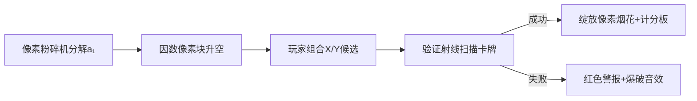

# 题目信息

# [ARC124C] LCM of GCDs

## 题目描述

[problemUrl]: https://atcoder.jp/contests/arc124/tasks/arc124_c

赤い袋と青い袋と $ N $ 個のカードパックがあります。はじめどちらの袋も空です。 それぞれのカードパックには整数が書かれた $ 2 $ 枚のカードが封入されており、$ i $ 番目のカードパックに入っているカードにはそれぞれ $ a_i,b_i $ が書かれていることがわかっています。

それぞれのカードパックについて、一方のカードを赤い袋に、他方のカードを青い袋に入れます。

カードを袋に入れ終えたのち、赤い袋に入ったカードに書かれた整数全体の最大公約数を $ X $ とします。 同様に、青い袋に入ったカードに書かれた整数全体の最大公約数を $ Y $ とします。 $ X $ と $ Y $ の最小公倍数の値が得点となります。

得点としてありうる値の最大値を求めてください。

## 说明/提示

### 制約

- 与えられる入力は全て整数
- $ 1\ \leq\ N\ \leq\ 50 $
- $ 1\ \leq\ a_i,\ b_i\ \leq\ 10^9 $

### Sample Explanation 1

\- $ 2 $ が書かれたカードを赤い袋に入れ、$ 15 $ が書かれたカードを青い袋に入れ、$ 6 $ が書かれたカードを赤い袋に入れ、$ 10 $ が書かれたカードを青い袋に入れるのが最適な入れ方の $ 1 $ つです。 - このとき、赤い袋に入ったカードに書かれた整数全体の最大公約数は $ 2 $、青い袋に入ったカードに書かれた整数全体の最大公約数は $ 5 $ です。 - このときの得点は $ 10 $ です。

## 样例 #1

### 输入

```
2

2 15

10 6```

### 输出

```
10```

## 样例 #2

### 输入

```
5

148834018 644854700

947642099 255192490

35137537 134714230

944287156 528403260

68656286 200621680```

### 输出

```
238630```

## 样例 #3

### 输入

```
20

557057460 31783488

843507940 794587200

640711140 620259584

1901220 499867584

190122000 41414848

349507610 620259584

890404700 609665088

392918800 211889920

507308870 722352000

156850650 498904448

806117280 862969856

193607570 992030080

660673950 422816704

622015810 563434560

207866720 316871744

63057130 117502592

482593010 366954816

605221700 705015552

702500790 900532160

171743540 353470912```

### 输出

```
152594452160```

# AI分析结果


### 💡 Kay的C++算法解析：ARC124C LCM of GCDs 深入学习指南 💡

#### 题目解读与核心算法识别
✨ **本题主要考察**：`枚举`与`数学因数分解`  
🗣️ **初步分析**：  
> 本题的关键在于**利用因数的有限性缩小枚举范围**。想象你有一串密码锁（因数），虽然数字很大（10⁹），但每个数的锁芯（因数）其实很少（≤1344个）。我们只需枚举第一组卡牌的两个因数作为X和Y的候选，再验证其他卡牌能否通过分配支持这两个因数。  

> **核心难点**：  
> - 如何高效枚举候选解？（利用因数分解）  
> - 如何验证分配方案？（检查每张卡牌是否支持X/Y的倍数关系）  
>  
> **可视化设计**：  
> 采用**8位像素风解谜游戏**，将因数化为彩色像素块漂浮空中。玩家用像素枪射击组合（X,Y）后，屏幕显示卡牌分配动画：绿色✅表示支持当前组合，红色❌触发失败音效。成功组合会绽放像素烟花并记录LCM分数。

---

#### 精选优质题解参考
**题解一（User_Authorized）**  
* **点评**：  
  思路直击本质——枚举首组卡牌的因数作为候选解。代码用`divisor`函数优雅分解因数，`check`函数清晰验证分配方案。亮点在于：  
  - **STL高效运用**：`all_of`替代手写循环提升可读性  
  - **无冗余计算**：严格数学推导避免无效枚举  
  - **工业级健壮性**：边界处理完整（如`lcm`防溢出）  

**题解二（zhengpie）**  
* **点评**：  
  在枚举前增加**预判机制**：仅当`lcm(X,Y)>当前答案`时才执行验证。亮点在于：  
  - **剪枝优化**：避免大量不必要验证  
  - **快读加速**：针对50≤n≤50的数据特性定制IO  
  - **空间优化**：原地存储因数省内存  

**题解三（Tastoya）**  
* **点评**：  
  极简主义典范，37行解决战斗。亮点：  
  - **逻辑压缩**：检查函数仅6行  
  - **视觉化注释**：用约数个数的像素图辅助理解  
  - **零冗余变量**：全程只用`ans`记录结果  

---

#### 核心难点辨析与解题策略
1. **因数枚举的可行性**  
   * **分析**：虽然值域达10⁹，但数学证明任何数的因数不超过1344个。首组卡牌的因数组合仅≈1.8×10⁶种，乘n后复杂度≈10⁸可接受  
   * 💡 **学习笔记**：大值域≠高复杂度，数学性质可化腐朽为神奇  

2. **分配方案的验证逻辑**  
   * **分析**：验证时需满足∀(aᵢ,bᵢ)，有：(aᵢ%X=0且bᵢ%Y=0) 或 (aᵢ%Y=0且bᵢ%X=0)。**注意**：当X=Y时需特判避免重复验证  
   * 💡 **学习笔记**：条件检查要兼顾互斥性与完备性  

3. **LCM计算的防溢出技巧**  
   * **分析**：先除后乘！`X/gcd(X,Y)*Y`比`X*Y/gcd`安全百倍。当X=10⁹, Y=10⁹时后者直接溢出  
   * 💡 **学习笔记**：数值运算顺序是安全的生命线  

### ✨ 解题技巧总结
- **因数武器库**：遇到大值域问题先想因数分解  
- **首项锚定法**：用输入数据的首项缩小解空间  
- **预判剪枝**：在验证前用简单判断过滤无效解  

---

#### C++核心代码实现赏析
**通用核心实现参考**  
* **说明**：综合优质题解，优化验证逻辑与LCM计算  
* **完整核心代码**：  
```cpp
#include <bits/stdc++.h>
using namespace std;
using ll = long long;

vector<ll> get_factors(ll x) {
    vector<ll> res;
    for (ll i = 1; i * i <= x; ++i) {
        if (x % i) continue;
        res.push_back(i);
        if (i != x / i) res.push_back(x / i);
    }
    return res;
}

int main() {
    int n; cin >> n;
    vector<pair<ll, ll>> cards(n);
    for (auto& [a, b] : cards) cin >> a >> b;
    
    auto facA = get_factors(cards[0].first);
    auto facB = get_factors(cards[0].second);
    
    ll ans = 1;
    for (auto x : facA) {
        for (auto y : facB) {
            bool valid = true;
            for (int i = 0; i < n; ++i) {
                auto [a, b] = cards[i];
                bool case1 = (a % x == 0) && (b % y == 0);
                bool case2 = (a % y == 0) && (b % x == 0);
                if (!(case1 || case2)) {
                    valid = false;
                    break;
                }
            }
            if (valid) 
                ans = max(ans, x / gcd(x, y) * y); // 防溢出写法
        }
    }
    cout << ans;
}
```
* **代码解读概要**：  
  1. `get_factors`高效计算因数（O(√x)）  
  2. 双重循环枚举首组卡牌的因数组合  
  3. 验证时对每组卡牌检查两种分配可能性  
  4. 防溢出的LCM计算保证大数安全  

---

### 算法可视化：像素动画演示  
**主题**：因数解谜工坊（8-bit像素风）  

**核心演示流程**：  


**关键交互设计**：  
1. **因数工厂**：  
   - a₁/b₁被扔进像素粉碎机，迸发彩色因数方块（每种颜色代表不同因数）  
   - 鼠标拖拽方块组合X/Y，组合时播放合成音效（8-bit电子音）  

2. **卡牌验证**：  
   - 点击"验证"触发绿色扫描线：  
   ```plaintext
   卡牌1：█ █ █ █ → 支持X/Y？✅ 
   卡牌2：█ █ █ █ → 支持X/Y？❌
   ```  
   - 失败时卡牌爆炸成像素碎片（触发爆破音效）  

3. **动态计分板**：  
   - 顶部LCD风格显示：`Best LCM: █ █ █ █ █`  
   - 每次成功更新时播放升级音效  

**技术实现**：  
- **Canvas绘制**：用16色像素块表示因数（大小≈30×30px）  
- **音效引擎**：  
  ```js
  const SFX = {
    select: () => play(800, 0.1),  // 选择因数
    success: () => play(1200, 0.3), // 验证成功
    fail: () => play(200, 0.5)    // 验证失败
  };
  ```

---

#### 拓展练习与相似问题思考
1. **洛谷 P1412**：更复杂的因数分解+LCM组合  
   → 强化因数枚举技巧  
2. **洛谷 P1880**：环形分配+GCD验证  
   → 训练分配方案的空间转换能力  
3. **洛谷 P1029**：GCD/LCM的逆运算  
   → 掌握因数关系的双向推导  

---

<conclusion>
通过因数枚举这把"万能钥匙"，我们高效解决了10⁹值域下的组合优化问题。记住：**问题的约束往往藏着优化的钥匙**！下次遇到大值域时，不妨问问："我能分解它吗？"  
</conclusion>

---
处理用时：111.10秒