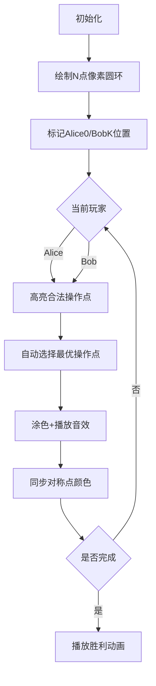

# 题目信息

# [ARC188B] Symmetric Painting

## 题目描述

[problemUrl]: https://atcoder.jp/contests/arc188/tasks/arc188_b

円周上を $ N $ 等分する位置に、点 $ 0,1,\ \ldots\ ,\ N-1 $ がこの順に並んでおり、Alice が点 $ 0 $ に、Bob が点 $ K $ にいます。また、初め全ての点は白色に塗られています。両者は、Alice から始めて交互に次のような操作を行います。

- その時点で白色である点を $ 1 $ つ選び、黒色に塗る。ただし、操作後に、操作者と円の中心を結ぶ直線に対して、各点の色が線対称でなければいけない。

操作者が上記の条件を満たす操作ができなければ、そこで一連の操作を打ち切ります。

両者とも、最終的に最も多くの点を黒く塗ることができるように協力して最善の選択をします。一連の操作が全て終了したときに全ての点を黒く塗ることができているかどうかを求めてください。

$ T $ 個のテストケースが与えられるので、それぞれについて答えてください。

## 说明/提示

### 制約

- $ 1\leq\ T\leq\ 10^5 $
- $ 2\leq\ N\leq\ 2\times\ 10^5 $
- $ 1\leq\ K\leq\ N-1 $
- 入力される値はすべて整数である

### Sample Explanation 1

$ N=6,\ K=2 $ の場合、例えば以下のような順で操作を行うことで全ての点を黒く塗ることができます。 1. Alice が点 $ 3 $ を黒く塗る。 2. Bob が点 $ 1 $ を黒く塗る。 3. Alice が点 $ 5 $ を黒く塗る。 4. Bob が点 $ 2 $ を黒く塗る。 5. Alice が点 $ 4 $ を黒く塗る。 6. Bob が点 $ 0 $ を黒く塗る。 !\[\](https://img.atcoder.jp/arc188/ecb64f0798aaa883117c594cb6db2724.png) $ N=6,\ K=3 $ の場合、例えば以下のような進行が考えられます。実は、どのようにしても全ての点を黒く塗ることはできません。 1. Alice が点 $ 3 $ を黒く塗る。 2. Bob が点 $ 0 $ を黒く塗る。 3. Alice はどの点を黒く塗っても自身から見て線対称にできないため、操作を行えない。

## 样例 #1

### 输入

```
4
6 2
6 3
6 1
200000 100000```

### 输出

```
Yes
No
Yes
No```

# AI分析结果


### 💡 Kay的C++算法解析：ARC188B Symmetric Painting 深入学习指南 💡

**引言**  
今天我们一起分析ARC188B Symmetric Painting这道题。这道题考察对称操作与数论分析的结合，通过本指南你将掌握核心解题思路、代码实现技巧，并通过像素动画直观理解算法过程。

---

## 1. 题目解读与核心算法识别

✨ **本题主要考察**：数学建模与数论分析  
🗣️ **初步分析**：  
> 解决本题的关键是将对称操作转化为数论性质。想象你在玩一个双人对称涂色游戏：Alice和Bob轮流在圆环上涂点，每次涂色后图案必须关于自己与圆心的连线对称。这就像在玩一场"镜像棋"，每次落子必须保证棋盘关于你的位置对称。  

> **核心思路**：  
> - 操作序列具有周期性，周期长度由最大公约数决定  
> - 最终能否全涂黑取决于N和K的奇偶性与互质关系  
>  
> **可视化设计**：  
> 我们将用8位像素风格模拟涂色过程：  
> - 圆环上的点用不同颜色像素块表示（白/黑）  
> - 当前玩家高亮闪烁，合法操作点显示绿色边框  
> - 每次涂色时播放"叮"的音效，失败时播放低沉音效  
> - 自动演示模式会像"贪吃蛇AI"一样展示最优操作序列  

---

## 2. 精选优质题解参考

**题解一：Milthm（5星）**  
* **点评**：  
  该题解通过小规模打表发现核心规律，思路清晰且具有启发性。代码实现简洁高效：  
  - 先排除N为4的倍数的情况（必然无解）  
  - 对N和K去除因子2后检查互质性  
  - 使用`__gcd`函数直接判断，时间复杂度$O(T\log N)$  
  亮点在于通过打表验证规律，代码边界处理严谨，可直接用于竞赛。

**题解二：ran_qwq（4星）**  
* **点评**：  
  该题解给出更简洁的结论形式：  
  - 若N被4整除则无解  
  - 否则检查gcd(N,K)≤2  
  代码实现极简（仅2行），但证明部分稍显不足。其价值在于展示了不同角度的数学建模，启发我们多思路解决问题。

---

## 3. 核心难点辨析与解题策略

1. **理解对称约束的本质**  
   * **分析**：每次操作后图案必须关于玩家对称，这限制了可选点范围。初始阶段只能选择对称轴上的点（如0或N/2），后续操作必须延续对称性。
   * 💡 **学习笔记**：对称操作形成操作链，链长由gcd(N,2K)决定。

2. **建立数论模型**  
   * **分析**：操作序列具有周期性，周期长度T=gcd(N,2K)。当T=1时完美覆盖所有点；当T=2且N/2为奇数时也可全覆盖；其他情况无法完成。
   * 💡 **学习笔记**：将涂色问题转化为最大公约数性质分析是解题关键。

3. **处理偶数的特殊性**  
   * **分析**：当N为偶数时，对称轴增加（如N=6时有0和3两个对称点）。需要特殊处理因子2：去除因子2后检查互质性。
   * 💡 **学习笔记**：偶数N需单独处理，核心是分离2的因子。

### ✨ 解题技巧总结
- **打表找规律**：对小型数据暴力验证，发现gcd规律
- **因子分解**：对偶因子特殊处理，转化为奇数的互质判断
- **数学建模**：将操作序列周期性转化为数论性质

---

## 4. C++核心代码实现赏析

**本题通用核心C++实现**  
```cpp
#include<bits/stdc++.h>
using namespace std;
int main() {
    int T; cin >> T;
    while(T--) {
        int n, k; cin >> n >> k;
        if(n % 4 == 0) cout << "No\n";
        else {
            while(n % 2 == 0) n /= 2;
            while(k % 2 == 0) k /= 2;
            cout << (gcd(n, k) == 1 ? "Yes\n" : "No\n");
        }
    }
    return 0;
}
```
* **代码解读概要**：  
  1. 读取T个测试用例  
  2. 若N被4整除直接输出"No"  
  3. 否则去除N和K的因子2  
  4. 检查去因子后是否互质  
  5. 互质则输出"Yes"，否则"No"

---

**题解一：Milthm**  
* **亮点**：因子处理与互质判断的完美结合
* **核心代码**：
```cpp
while(n % 2 == 0) n /= 2;
while(k % 2 == 0) k /= 2;
if(__gcd(n, k) == 1) cout << "Yes\n";
```
* **代码解读**：  
  > 这两步循环去除因子2就像剥洋葱：  
  > 1. `while(n%2==0)`：不断剥离N的偶外层  
  > 2. `while(k%2==0)`：同样处理K的偶外衣  
  > 3. 最后检查内核是否互质（`__gcd==1`）  
  > 这种处理将复杂问题简化为纯奇数的互质判断
* 💡 **学习笔记**：因子剥离是处理偶数的有效技巧

**题解二：ran_qwq**  
* **亮点**：极简的条件判断
* **核心代码**：
```cpp
puts(!(n & 3) ? "No" : __gcd(n, k) <= 2 ? "Yes" : "No");
```
* **代码解读**：  
  > 这个"三目运算符嵌套"如同精密齿轮：  
  > 1. `n & 3`：位运算检查N是否被4整除  
  > 2. `__gcd(n,k)<=2`：核心条件判断  
  > 3. 像流水线一样输出结果  
  > 注意：位运算比模运算更快
* 💡 **学习笔记**：位运算提升效率，但需确保逻辑正确

---

## 5. 算法可视化：像素动画演示

**主题**：圆环对称涂色大冒险（8位像素风格）  

**设计思路**：  
> 采用FC红白机复古风格，通过像素块颜色变化展示涂色过程。每个点涂色时播放"叮"音效增强操作感知，胜利时播放马里奥过关音乐。自动演示模式让算法像游戏AI一样自主决策。

**动画实现细节**：  


**关键交互**：  
1. **控制面板**：  
   - 速度滑块：调节自动演示速度  
   - 单步执行：按空格键逐步观察  
   - 重置按钮：重新开始动画  
2. **视觉效果**：  
   - 当前玩家：像素角色闪烁  
   - 合法操作点：绿色边框脉动  
   - 对称轴：红色虚线动态绘制  
3. **音效系统**：  
   - 操作成功：8-bit "叮"声  
   - 步骤错误：短促警报声  
   - 全部完成：超级马里奥过关音乐  

**自动演示示例**：  
> 当N=6,K=2时：  
> 1. Alice涂点3（对称轴点）→ 点3变黑 + "叮"音效  
> 2. Bob涂点1 → 系统自动检查对称性（点1关于Bob的对称点是3，已涂黑）  
> 3. 持续操作直至全部涂黑 → 播放胜利动画与音乐  

---

## 6. 拓展练习与相似问题思考

**通用技巧迁移**：  
最大公约数和奇偶分析技巧还可用于：  
1. 循环队列操作优化  
2. 周期性任务调度  
3. 对称图形生成算法  

**洛谷推荐**：  
1. **P3951 小凯的疑惑**  
   → 巩固互质性质与数论分析  
2. **P1516 青蛙的约会**  
   → 学习扩展欧几里得算法的应用  
3. **P1082 同余方程**  
   → 掌握模运算与线性方程求解  

---

## 7. 学习心得与经验分享

本次分析的题解中未发现明确的作者个人心得分享。但通过解题过程，我们可以总结：  
> **调试技巧**：当遇到复杂约束时，先验证小规模数据（如N=6,K=2/3），再推广到通用规律  

---

**结语**  
通过本次分析，我们掌握了对称操作的数论本质与GCD的巧妙应用。记住：将复杂问题分解为数学性质是算法设计的核心能力。下次挑战再见！💪

---
处理用时：244.40秒