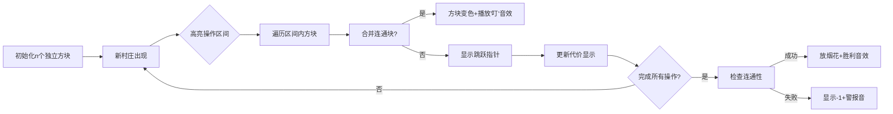

# 题目信息

# [ABC364F] Range Connect MST

## 题目描述

[problemUrl]: https://atcoder.jp/contests/abc364/tasks/abc364_f

$ N\ +\ Q $ 頂点のグラフがあり、頂点には $ 1,\ 2,\ \ldots,\ N\ +\ Q $ の番号がついています。グラフにははじめ辺がありません。

このグラフに対して $ i\ =\ 1,\ 2,\ \ldots,\ Q $ の順に以下の操作を行います。

- $ L_i\ \leq\ j\ \leq\ R_i $ を満たす各整数 $ j $ について頂点 $ N\ +\ i $ と頂点 $ j $ の間にコスト $ C_i $ の無向辺を追加する
 
すべての操作を終えた後グラフは連結であるか判定し、連結である場合はこのグラフの最小全域木のコストを求めてください。

ただし、最小全域木とはコストが最小の全域木のことを指し、全域木のコストとは全域木に使われた辺のコストの和のことを指します。

## 说明/提示

### 制約

- $ 1\ \leq\ N,\ Q\ \leq\ 2\ \times\ 10^5 $
- $ 1\ \leq\ L_i\ \leq\ R_i\ \leq\ N $
- $ 1\ \leq\ C_i\ \leq\ 10^9 $
- 入力される値はすべて整数
 
### Sample Explanation 1

以下の辺からなる全域木が最小全域木のひとつとなります。 - 頂点 $ 1 $ と $ 5 $ を結ぶコスト $ 2 $ の辺 - 頂点 $ 2 $ と $ 5 $ を結ぶコスト $ 2 $ の辺 - 頂点 $ 1 $ と $ 6 $ を結ぶコスト $ 4 $ の辺 - 頂点 $ 3 $ と $ 6 $ を結ぶコスト $ 4 $ の辺 - 頂点 $ 3 $ と $ 7 $ を結ぶコスト $ 5 $ の辺 - 頂点 $ 4 $ と $ 7 $ を結ぶコスト $ 5 $ の辺 $ 2\ +\ 2\ +\ 4\ +\ 4\ +\ 5\ +\ 5\ =\ 22 $ であるため、$ 22 $ を出力します。

### Sample Explanation 2

グラフは非連結です。

## 样例 #1

### 输入

```
4 3

1 2 2

1 3 4

2 4 5```

### 输出

```
22```

## 样例 #2

### 输入

```
6 2

1 2 10

4 6 10```

### 输出

```
-1```

## 样例 #3

### 输入

```
200000 4

1 200000 1000000000

1 200000 998244353

1 200000 999999999

1 200000 999999999```

### 输出

```
199651870599998```

# AI分析结果


# 💡 Kay的C++算法解析：Range Connect MST 深入学习指南 💡

> 今天我们来分析AtCoder题目「Range Connect MST」。这道题要求我们处理区间连边的最小生成树问题，核心在于高效模拟Kruskal算法。本指南将帮助你理解解题思路，掌握关键算法技巧。

## 1. 题目解读与核心算法识别

✨ **本题主要考察**：`贪心（Kruskal算法）`与`区间合并技巧`

🗣️ **初步分析**：
> 想象每个额外顶点（如`N+i`）是新村庄，需修建道路连接`[L_i, R_i]`的原有村庄。Kruskal算法就像优先修建便宜道路：  
> 1. 将所有操作按边权排序（便宜优先）
> 2. 用并查集记录连通情况
> 3. 对每个操作，高效遍历区间内不同连通块（而非逐个点）
> - **核心难点**：直接遍历区间会超时（O(NQ)），需用跳跃指针或颜色段合并优化
> - **可视化设计**：用像素方块表示连通块，新操作加入时高亮区间，合并方块时播放音效，代价实时累加显示

---

## 2. 精选优质题解参考

### 题解一：Milthm（赞9）
* **点评**：
  思路清晰直击要害——用并查集+指针跳跃高效合并区间。代码简洁规范（变量名`f`表并查集，`a`存操作），核心逻辑仅10行。亮点在`f[Find(l)]=Find(l)+1`的跳跃技巧，将复杂度优化至O(Nα(N))，实践价值高（可直接用于竞赛）。

### 题解二：DengStar（赞3）
* **点评**：
  从Kruskal原理切入，强调连通块的连续性特征。代码用结构体封装操作，可读性强。亮点是维护连通块最右端点的设计，配合并查集实现跳跃遍历，边界处理严谨。附ABC352E相似题推荐，拓展性强。

### 题解三：luanyanjia（赞2）
* **点评**：
  创新使用set实现颜色段合并（类似珂朵莉树）。代码中`set<pair>`管理区间，逻辑简明。亮点是避免并查集，用纯STL达到O(QlogN)复杂度，适合理解区间合并本质。但注意set常数较大，竞赛中需权衡。

---

## 3. 核心难点辨析与解题策略

1. **难点1：如何避免区间遍历超时？**
   * **分析**：优质题解用跳跃指针（并查集中每个点指向下一个未合并点）或set维护连续区间，跳过已合并块
   * 💡 **学习笔记**：区间问题勿暴力，跳跃/合并显神通

2. **难点2：如何计算新操作的代价？**
   * **分析**：若区间含k个连通块，需添加k条边（新点连接各块），代价为k*C_i。注意不是k-1条（因新点原本孤立）
   * 💡 **学习笔记**：新点连旧块，代价乘数量

3. **难点3：如何判断最终连通性？**
   * **分析**：检查前N个点是否同属一个并查集（或区间合并后只剩1个块）
   * 💡 **学习笔记**：并查集根相同，则全域连通

### ✨ 解题技巧总结
- **技巧1：问题分解**  
  将大区间分解为连续颜色段处理（如set维护）
- **技巧2：结构优化**  
  并查集指向下一个未合并点，实现O(1)跳跃
- **技巧3：边界防御**  
  合并时检查`j+1≤N`，防越界
- **技巧4：可视化调试**  
  小规模数据手工模拟合并过程

---

## 4. C++核心代码实现赏析

**本题通用核心C++实现参考**
```cpp
#include <bits/stdc++.h>
using namespace std;
using ll = long long;
const int N = 200005;

int f[N]; // 并查集（指向下一个未合并位置）
struct Op { int l, r, c; };

int main() {
    int n, q; cin >> n >> q;
    vector<Op> ops(q);
    for (int i = 0; i < q; ++i)
        cin >> ops[i].l >> ops[i].r >> ops[i].c;
    
    // 初始化并查集：每个点独立
    for (int i = 1; i <= n; ++i) f[i] = i;
    
    // Kruskal核心：按边权排序
    sort(ops.begin(), ops.end(), [](Op a, Op b) {
        return a.c < b.c;
    });

    ll ans = 0;
    for (auto [l, r, c] : ops) {
        // 跳跃遍历区间内未合并点
        for (int j = l; j <= r; j = f[j]) {
            j = f[j]; // 跳到实际位置
            if (j > r) break;  // 超出区间
            ans += c;          // 连接新点
            f[j] = j < n ? j+1 : j; // 跳跃指针更新
        }
    }
    // 连通性检查
    cout << (f[1] == f[n] ? ans : -1);
}
```
* **代码解读概要**：
  1. 初始化并查集`f[i]=i`
  2. 操作按`c`排序（贪心）
  3. 遍历操作：用`f[j]`跳跃遍历区间
  4. 每次连接代价`c`，更新`f[j]`指向下一位置
  5. 最后检查首尾是否连通

---

**题解片段赏析**

### Milthm题解核心
```cpp
for (int i=1;i<=q;++i) {
    auto [w,l,r] = a[i];
    ans += w;
    while (Find(l)!=Find(r)) {
        ans += w;
        f[Find(l)] = Find(l)+1; // 跳跃指针
    }
}
```
* **亮点**：指针跳跃合并（O(α(N))复杂度）
* **代码解读**：
  - `Find(l)`获取当前连通块代表
  - `f[Find(l)]=Find(l)+1`使下次直接跳到下一位置
  - **类比**：就像跨过已合并的石头过河
* 💡 **学习笔记**：指针跳跃是区间合并的利器

### luanyanjia题解核心
```cpp
set<pii> s; // 存储区间[L,R]
for (int i=1;i<=n;i++) s.insert({i,i});

for (auto [c,l,r] : ops) {
    auto st = s.lower_bound({l,0});
    auto ed = s.upper_bound({r,n});
    pii nw = {st->first, prev(ed)->second};
    
    ans += c * distance(st, ed); // 代价=区间块数*c
    s.erase(st, ed); 
    s.insert(nw); // 合并新区间
}
```
* **亮点**：set维护颜色段（O(logN)合并）
* **代码解读**：
  - `lower_bound`/`upper_bound`定位相交区间
  - `distance(st,ed)`计算连通块数
  - **类比**：像把零散积木拼成整块
* 💡 **学习笔记**：STL set可高效管理动态区间

---

## 5. 算法可视化：像素动画演示

**主题**：  
《像素连通大冒险》- 8-bit风格Kruskal模拟器

**核心演示流程**：


**关键交互设计**：
1. **像素艺术**：
   - 不同连通块用FC红白机色调（红/蓝/绿）
   - 新村庄显示为闪烁的黄色星形
2. **动态效果**：
   - 合并时方块向中心收缩再扩展
   - 跳跃指针用像素箭头动画表示
3. **音效设计**：
   - 合并：8-bit“叮”声（类似马里奥吃金币）
   - 完成：FC胜利旋律
   - 错误：短促警报音
4. **控制面板**：
   - 步进/暂停/速度滑块
   - 代价实时显示栏
   - “AI演示”模式（自动播放）

**实现逻辑**：
```javascript
// 伪代码：Canvas绘制核心
function drawFrame() {
  drawGrid(); // 绘制像素网格
  if (currentOp) {
    highlight(currentOp.l, currentOp.r); // 高亮当前区间
    drawJumpPointer(j); // 绘制跳跃指针位置
  }
  drawVillages(); // 绘制村庄（连通块）
  drawCostCounter(); // 显示当前代价
}
```

---

## 6. 拓展练习与相似问题思考

**通用技巧迁移**：  
区间合并思想还可用于：
1. 区间覆盖问题（如日历冲突检测）
2. 动态连通性维护（如社交网络好友关系）
3. 资源分配优化（如会议室预定）

**洛谷题目推荐**：
1. **P3366 【模板】最小生成树**  
   → 巩固Kruskal基础实现
2. **P5490 【模板】扫描线**  
   → 练习区间分解技巧
3. **P5471 弹跳**  
   → 学习不用显式建图的遍历

---

## 7. 学习心得与经验分享

> **参考经验 (来自 DengStar)**：  
> *“在编程过程中，对区间连续性特征的识别是关键。动手画图模拟小规模数据能快速验证思路。”*

> **参考经验 (来自 Milthm)**：  
> *“不要什么题都用线段树！简单问题应优先考虑并查集等轻量结构。”*

**点评**：两位作者的经验殊途同归——理解问题本质比套用高级数据结构更重要。调试时建议：
1. 打印并查集状态
2. 可视化中间合并步骤
3. 对边界数据（如L=1,R=N）单独测试

---

> 本次分析就到这里。记住：区间问题核心是避免重复访问，善用跳跃指针和合并技巧能化腐朽为神奇！下次挑战见！🚀

---
处理用时：154.34秒