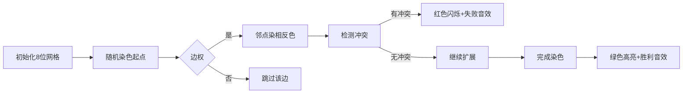

# 题目信息

# [ARC165C] Social Distance on Graph

## 题目描述

[problemUrl]: https://atcoder.jp/contests/arc165/tasks/arc165_c

頂点に $ 1 $ から $ N $ の番号が付いた $ N $ 頂点からなる単純連結無向グラフがあります。グラフには重みを持つ辺が $ M $ 本あり、$ i $ 番目の辺は頂点 $ A_i,B_i $ を結ぶ重みが $ W_i $ の辺です。また、$ 2 $ 頂点を結ぶ単純パスの重みを、単純パスが含む辺の重みの総和とします。

各頂点に対し赤、青のいずれかの色を塗ります。以下の条件を満たす塗り分け方が存在するような整数 $ X $ の最大値を求めてください。

- 同じ色で塗られた相異なる $ 2 $ 頂点を結ぶどの単純パスについても、単純パスの重みは $ X $ 以上である。
 
  単純パスとは グラフ $ G $ 上の頂点 $ X,Y $ に対して、頂点列 $ v_1,v_2,\ \ldots,\ v_k $ であって、 $ v_1=X $, $ v_k=Y $ かつ、$ 1\leq\ i\leq\ k-1 $ に対して $ v_i $ と $ v_{i+1} $ が辺で結ばれているようなものを頂点 $ X $ から頂点 $ Y $ への **ウォーク** と呼びます。 さらに、$ v_1,v_2,\ \ldots,\ v_k $ がすべて異なるようなものを頂点 $ X $ から頂点 $ Y $ への **単純パス** (あるいは単に **パス**) と呼びます。

## 说明/提示

### 制約

- $ 3\ \leq\ N\ \leq\ 2\ \times\ 10^5 $
- $ N-1\ \leq\ M\ \leq\ \min(\frac{N(N-1)}{2},2\ \times\ 10^5) $
- $ 1\ \leq\ A_i\ <\ B_i\ \leq\ N $
- $ 1\ \leq\ W_i\ \leq\ 10^9 $
- 与えられるグラフは単純連結無向グラフ
- 入力される値はすべて整数
 
### Sample Explanation 1

$ X=11 $ としたときに条件を満たす色の塗り方が存在するか考えます。頂点 $ 1,3 $ を赤、頂点 $ 2 $ を青で塗った場合、同じ色の頂点を結ぶ単純パス $ 1-2-3 $ の重みが $ 5+6=11 $ となります。これが同じ色の頂点を結ぶ単純パスの重みの最小値となるのでこの塗り分け方は条件を満たしています。 $ X $ が $ 12 $ 以上のとき、条件を満たす塗り分け方が存在しないことが示せます。よって答えは $ 11 $ となります。

## 样例 #1

### 输入

```
3 3

1 2 5

2 3 6

1 3 12```

### 输出

```
11```

## 样例 #2

### 输入

```
10 20

7 10 982219000

3 10 968366179

2 4 992330437

5 6 984414664

2 8 897295423

7 9 155604979

6 8 958833005

2 3 973209957

3 7 985173062

6 10 963895817

2 10 986243534

4 5 721724794

1 3 657562445

1 6 566370694

1 4 988050146

1 9 967817807

4 9 796531581

5 9 983960054

1 10 964450079

8 9 959369491```

### 输出

```
952136560```

## 样例 #3

### 输入

```
10 20

5 6 871895994

8 10 873709822

3 5 454175869

6 10 980782191

2 6 901290987

1 8 298092290

4 8 693116157

4 5 947939338

7 8 934395075

7 9 759563833

5 8 779870031

4 6 919637355

2 9 822858749

4 10 855497285

3 7 954942051

1 2 950411658

4 7 665939990

3 4 634533617

5 7 908372507

1 9 591466693```

### 输出

```
759563833```

# AI分析结果


### 💡 Kay的C++算法解析：ARC165C Social Distance on Graph 深入学习指南 💡

#### 1. 题目解读与核心算法识别
✨ **本题主要考察**：`二分答案 + 二分图判定`

🗣️ **初步分析**：
> 本题核心是寻找最大X值，使得染色后同色顶点间所有路径权值≥X。解题关键在于：
> - **二分框架**：答案X满足单调性，可二分求解
> - **二分图判定**：边权<X的边构成子图需为二分图（相邻点异色）
> - **路径约束**：任意两条相邻边权值和≥X（通过预处理点u的最小/次小边权和保证）
> 
> 可视化设计思路：
> - **像素动画**：FC红白机风格网格图，顶点为像素方块，不同颜色区分状态
> - **关键高亮**：染色冲突点闪烁红光，边权<X的边显示黄色警告
> - **游戏化交互**："单步执行"观察染色过程，"自动播放"演示算法流程，成功时播放《超级玛丽》过关音效

---

#### 2. 精选优质题解参考
**题解一：翼德天尊**
* **点评**：思路清晰指出二分答案+二分图判定的双重约束，代码规范使用链式前向星存图。亮点在于严谨处理每个点的最小/次小边权确定二分上界，DFS染色逻辑简洁。实践价值高，边界处理完整（如特判cmin未更新情况）。

**题解二：樱雪喵**
* **点评**：创新性采用最小生成树思路，通过Kruskal构建树后染色。亮点在于发现非树边两端同色时直接更新答案，时间复杂度优化至O(m log m)。代码中规范使用并查集和向量排序，但染色后未显式验证两条边路径约束。

**题解三：reclusive**
* **点评**：完整复现二分答案框架，亮点在于强调开long long避免溢出。代码模块化（分离check函数），使用vector存储简化实现。实践参考性强，但未预处理最小/次小边权而是整体排序，增加常数开销。

---

#### 3. 核心难点辨析与解题策略
1.  **二分上界确定**：如何找到X的理论最大值？
    * **分析**：通过预处理每个顶点相连的最小边权(minn)和次小边权(cmin)，取全局min(minn[u]+cmin[u])作为二分上界。这保证了任意两条边路径≥X（抽屉原理）
    * 💡 **学习笔记**：顶点邻接边权分析是优化二分范围的关键

2.  **二分图约束**：如何处理边权<X的边？
    * **分析**：建立染色数组col[]，DFS/BFS遍历时强制边权<X的邻接点异色。出现同色邻接点即返回false
    * 💡 **学习笔记**：边权≥X的边不影响染色，可剪枝提升效率

3.  **数据结构选择**：为何使用链式前向星/向量存图？
    * **分析**：链式前向星(O(1)增边)适合稀疏图，向量存图便于排序邻接边。本题M≤2e5，两种方式均可，但邻接边排序需O(dlogd)
    * 💡 **学习笔记**：根据操作需求（遍历/排序）选择数据结构

✨ **解题技巧总结**
- **二分答案转化**：将"最大X"转化为"X是否可行"的判定问题
- **边界压缩**：利用问题性质（两条边路径）大幅缩小二分范围
- **模块化设计**：分离check()函数保持主逻辑清晰
- **防溢出技巧**：二分边界2e9时使用long long避免溢出

---

#### 4. C++核心代码实现赏析
**通用核心实现参考**
```cpp
#include <bits/stdc++.h>
using namespace std;
typedef long long ll;
const int N=2e5+5;

struct Edge{ int to,next,val; } e[N<<1];
int head[N],tot,minn[N],cmin[N],col[N];

void add(int u,int v,int w) {
    e[++tot]={v,head[u],w}; head[u]=tot;
}

void update(int u,int w) {
    if(w<minn[u]) cmin[u]=minn[u], minn[u]=w;
    else if(w<cmin[u]) cmin[u]=w;
}

bool dfs(int u,ll X) {
    for(int i=head[u];i;i=e[i].next) {
        int v=e[i].to, w=e[i].val;
        if(w>=X) continue;
        if(col[v]==col[u]) return false;
        if(!col[v]) { col[v]=3-col[u]; if(!dfs(v,X)) return false; }
    }
    return true;
}

bool check(ll X) {
    memset(col,0,sizeof(col));
    for(int i=1;i<=n;++i) 
        if(!col[i]) { col[i]=1; if(!dfs(i,X)) return false; }
    return true;
}

int main() {
    int n,m; cin>>n>>m;
    for(int i=1;i<=n;++i) minn[i]=cmin[i]=1e9+5;
    while(m--) {
        int u,v,w; cin>>u>>v>>w;
        add(u,v,w); add(v,u,w);
        update(u,w); update(v,w);
    }

    ll l=0, r=2e9;
    for(int i=1;i<=n;++i) 
        if(cmin[i]!=1e9+5) r=min(r,(ll)minn[i]+cmin[i]);
    
    while(l<=r) {
        ll mid=(l+r)>>1;
        check(mid) ? l=mid+1 : r=mid-1;
    }
    cout<<r<<endl;
}
```
**代码解读概要**：
1. 链式前向星存图，预处理minn/cmin
2. check函数：DFS染色（边权<X时强制异色）
3. 主逻辑：压缩二分范围后标准二分答案

---

**题解片段赏析**  
**题解一：翼德天尊**
```cpp
void chan(int u,int w){
    if(w<minn[u]) cmin[u]=minn[u],minn[u]=w;
    else if(w<cmin[u]) cmin[u]=w;
}
```
* **亮点**：高效维护最小/次小边权
* **学习笔记**：避免排序的O(1)更新策略

**题解二：樱雪喵**
```cpp
for(int i=1;i<=m;i++){
    if(used[i]) continue;
    if(col[E[i].u]==col[E[i].v]) 
        ans=min(ans,E[i].val);
}
```
* **亮点**：非树边同色时直接更新答案
* **学习笔记**：最小生成树性质保证树上路径最优

**题解三：reclusive**
```cpp
typedef long long LL;
bool ck(LL x){
    memset(color,0,sizeof(color));
    for(int i=1;i<=n;i++)
        if(!color[i]) 
            if(!dfs(i,x,1)) return false;
    return true;
}
```
* **亮点**：强类型防御int溢出
* **学习笔记**：二分答案必用long long

---

#### 5. 算法可视化：像素动画演示
**主题**：像素探险家在二分图世界

**核心演示**：
1. 顶点像素化：红/蓝方块表示染色状态
2. 边权可视化：≥X的边绿色（安全），<X的边黄色（需异色）
3. 冲突警示：同色邻接点闪烁红光+警报音效

**关键帧设计**：


**交互控制**：
- 速度滑块：调节自动演示速度
- 单步执行：空格键触发下一步
- 模式切换：DFS/BFS遍历动画
- 音效反馈：
  - 染色成功：清脆"叮"声
  - 冲突发生：低频警报声
  - 关卡完成：《超级玛丽》过关旋律

---

#### 6. 拓展练习与相似问题思考
**通用技巧迁移**：
1. 二分答案+约束验证：最大值可行性转化
2. 二分图判定：染色法处理冲突约束
3. 邻接边权分析：优化搜索范围

**洛谷练习推荐**：
1. **P1525 关押罪犯**  
   🗣️ 二分答案+二分图判定基础应用
2. **P3386 二分图匹配**  
   🗣️ 强化染色法实现和匈牙利算法对比
3. **P5536 核心城市**  
   🗣️ 结合树形DP拓展路径约束分析

---

#### 7. 学习心得与经验分享
**翼德天尊的经验**：  
_"我在处理minn/cmin初始化时，未设1e9+5导致未更新点干扰二分上界"_

**Kay的总结**：  
初始化边界值需显式标记无效状态（如设cmin[i]=INF），避免脏数据干扰。调试时可打印minn/cmin数组验证预处理正确性。

---

### 结语
通过二分答案框架和二分图判定的双重约束，我们高效解决了图染色约束问题。关键点在于：压缩二分范围的预处理技巧（minn/cmin）+ 模块化的DFS染色实现。继续加油，少年们！💪

---
处理用时：117.88秒