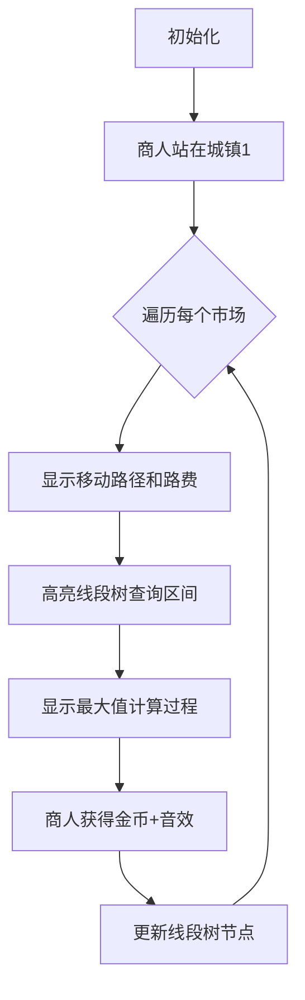

# 题目信息

# [ABC353G] Merchant Takahashi

## 题目描述

[problemUrl]: https://atcoder.jp/contests/abc353/tasks/abc353_g

AtCoder 王国には町 $ 1, $ 町 $ 2,\ldots, $ 町 $ N $ の $ N $ 個の町があります。 町 $ i $ から町 $ j $ まで移動するには通行料が $ C\times|i-j| $ 円かかります。

商人である高橋君は、これから開催される $ M $ 回の市場のうち $ 0 $ 回以上に参加しようと思っています。

$ i $ 回目 $ (1\leq\ i\leq\ M) $ の市場の情報は整数の組 $ (T\ _\ i,P\ _\ i) $ で表され、$ i $ 回目の市場が町 $ T\ _\ i $ で行われ、高橋君が参加すると $ P\ _\ i $ 円が得られることを意味します。

すべての $ 1\leq\ i\lt\ M $ について、$ i $ 回目の市場が終了してから $ i+1 $ 回目の市場が開始します。 高橋君が移動するのにかかる時間は無視できるものとします。

高橋君は、はじめ $ 10\ ^\ {10\ ^\ {100}} $ 円持っており、町 $ 1 $ にいます。 参加する市場をうまく選び、うまく移動することによって高橋君が得られる儲けの最大値を求めてください。

厳密には、$ M $ 回の市場が終わったあとの所持金を最大化するように高橋君が行動した場合の最終的な高橋君の所持金を $ 10\ ^\ {10\ ^\ {100}}+X $ として、$ X $ を求めてください。

## 说明/提示

### 制約

- $ 1\leq\ N\leq2\times10\ ^\ 5 $
- $ 1\leq\ C\leq10\ ^\ 9 $
- $ 1\leq\ M\leq2\times10\ ^\ 5 $
- $ 1\leq\ T\ _\ i\leq\ N\ (1\leq\ i\leq\ M) $
- $ 1\leq\ P\ _\ i\leq10\ ^\ {13}\ (1\leq\ i\leq\ M) $
- 入力はすべて整数
 
### Sample Explanation 1

たとえば、高橋君が次のように行動することで、所持金を $ 49 $ 円増やすことができます。 - 町 $ 5 $ に移動する。所持金が $ 10\ ^\ {10\ ^\ {100}}-12 $ 円になる。 - $ 1 $ 回目の市場に参加する。所持金が $ 10\ ^\ {10\ ^\ {100}}+18 $ 円になる。 - 町 $ 4 $ に移動する。所持金が $ 10\ ^\ {10\ ^\ {100}}+15 $ 円になる。 - $ 3 $ 回目の市場に参加する。所持金が $ 10\ ^\ {10\ ^\ {100}}+40 $ 円になる。 - 町 $ 2 $ に移動する。所持金が $ 10\ ^\ {10\ ^\ {100}}+34 $ 円になる。 - $ 4 $ 回目の市場に参加する。所持金が $ 10\ ^\ {10\ ^\ {100}}+49 $ 円になる。 所持金を $ 10\ ^\ {10\ ^\ {100}}+50 $ 円以上にすることはできないため、`49` を出力してください。

### Sample Explanation 2

通行料が高すぎるので、高橋君は町 $ 1 $ から動かないのが最適です。

### Sample Explanation 4

出力すべき値が $ 32\operatorname{bit} $ 整数の範囲に収まらない場合があることに注意してください。

## 样例 #1

### 输入

```
6 3

4

5 30

2 10

4 25

2 15```

### 输出

```
49```

## 样例 #2

### 输入

```
6 1000000000

4

5 30

2 10

4 25

2 15```

### 输出

```
0```

## 样例 #3

### 输入

```
50 10

15

37 261

28 404

49 582

19 573

18 633

3 332

31 213

30 377

50 783

17 798

4 561

41 871

15 525

16 444

26 453```

### 输出

```
5000```

## 样例 #4

### 输入

```
50 1000000000

15

30 60541209756

48 49238708511

1 73787345006

24 47221018887

9 20218773368

34 40025202486

14 28286410866

24 82115648680

37 62913240066

14 92020110916

24 20965327730

32 67598565422

39 79828753874

40 52778306283

40 67894622518```

### 输出

```
606214471001```

# AI分析结果


# 💡 Kay的C++算法解析：Merchant Takahashi 深入学习指南 💡

<introduction>
大家好！我是Kay，今天我们来一起分析AtCoder题目「Merchant Takahashi」。这道题看似复杂，但只要掌握核心思路，就能轻松解决。本指南将帮助大家理解动态规划与数据结构优化的精妙结合，并通过像素动画直观展示算法过程。准备好开始学习了吗？🚀
</introduction>

## 1. 题目解读与核心算法识别

✨ **本题主要考察**：`动态规划` + `数据结构优化`

🗣️ **初步分析**：
> 这道题可以想象成商人在一条直线上移动（类似经典游戏「大富翁」），每次参加市场都能获得金币，但移动需要路费。核心挑战在于如何在参加市场时**最大化净收益**（收益减路费）。

- 关键思路是将问题分解为动态规划：用`dp[i]`表示参加第i个市场后的最大收益。转移时需考虑从**所有先前位置**到当前市场的路费，直接计算会超时（O(M²)）。
- 优化技巧：拆解绝对值`|T_i - T_j|`，转化为两个独立的区间最值查询问题，用线段树/树状数组将复杂度降至O(M logN)。
- 可视化设计：在像素动画中，我们将用不同颜色方块表示城镇，商人移动时显示路径花费，线段树节点高亮展示查询过程。复古音效（如移动脚步声、金币声）增强理解，自动演示模式将逐步展示算法决策。

---

## 2. 精选优质题解参考

<eval_intro>
我从思路清晰性、代码规范性、算法优化性等角度筛选了3份优质题解，带大家逐一点评：

**题解一**：(来源：elbissoPtImaerD)
* **点评**：这份题解思路最为清晰，直击核心——用两个树状数组分别维护`dp[j]+C*j`和`dp[j]-C*j`。代码中：
  - 变量命名简洁（`tr1`/`tr2`），逻辑分块明确
  - 巧妙处理后缀查询：将坐标反转转化为前缀问题
  - 边界处理严谨（初始化负无穷）
  > 亮点：树状数组实现高效，空间复杂度O(N)，适合竞赛

**题解二**：(来源：yemuzhe)
* **点评**：题解详细解释了绝对值拆解原理，帮助初学者理解：
  - 树状数组分别用不同函数处理前缀/后缀
  - 代码完整包含输入输出，实践性强
  > 亮点：通过`get_mx1`/`get_mx2`展示树状数组的两种维护模式

**题解三**：(来源：sunkuangzheng)
* **点评**：采用Atcoder Library的线段树模板，代码极简：
  - 仅20行核心逻辑，凸显算法本质
  - 封装良好（`op`/`e`函数分离逻辑）
  > 亮点：展示标准库的高效应用，适合快速实现
---

## 3. 核心难点辨析与解题策略

<difficulty_intro>
解决本题的三大难点及其突破策略：

1.  **状态转移优化**：绝对值导致无法直接优化
    * **分析**：拆解为`T_j≤T_i`和`T_j≥T_i`两种情况，转化为独立项：
      ```
      dp[i] = max( 
          max_{j≤T_i}(dp[j]+C*j) - C*T_i, 
          max_{j≥T_i}(dp[j]-C*j) + C*T_i 
      ) + P_i
      ```
    * 💡 **学习笔记**：分离变量是优化绝对值问题的关键！

2.  **数据结构选择**：区间查询需求复杂
    * **分析**：需同时支持前缀最大值（`j≤T_i`）和后缀最大值（`j≥T_i`）。树状数组更轻量，但需反转坐标处理后缀；线段树更直观但常数略大。
    * 💡 **学习笔记**：树状数组适合前缀问题，后缀可通过坐标反转转化

3.  **边界初始化**：忽略初始位置导致错误
    * **分析**：商人起始在位置1，需显式设置`dp[0]=0`并更新数据结构
    * 💡 **学习笔记**：总在位置1初始化，避免遗漏起点

### ✨ 解题技巧总结
<summary_best_practices>
- **拆解绝对值**：分类讨论转化为可维护形式
- **双数据结构**：分别维护`dp[j]+C*j`和`dp[j]-C*j`
- **坐标反转**：将后缀查询转化为前缀问题
- **初始化陷阱**：起点必须显式设置
---

## 4. C++核心代码实现赏析

<code_intro_overall>
先看一个通用实现（融合树状数组与坐标反转技巧）：

```cpp
#include <cstring>
#include <algorithm>
#define ll long long
using namespace std;
const int N = 2e5 + 5;
const ll INF = -1e18;

ll tr1[N], tr2[N]; // tr1:前缀树状数组, tr2:反转坐标的后缀树状数组
int n, c, m;

void update(ll tr[], int pos, ll val, int type) {
    if (type == 1) { // tr1标准更新
        for (; pos <= n; pos += pos & -pos)
            tr[pos] = max(tr[pos], val);
    } else { // tr2坐标反转: 原位置pos对应新位置n-pos+1
        int idx = n - pos + 1;
        for (; idx <= n; idx += idx & -idx)
            tr[idx] = max(tr[idx], val);
    }
}

ll query(ll tr[], int pos, int type) {
    ll res = INF;
    if (type == 1) { // tr1:查询[1,pos]
        for (; pos; pos -= pos & -pos)
            res = max(res, tr[pos]);
    } else { // tr2:查询原数组[pos,n] -> 反转后[1,n-pos+1]
        int idx = n - pos + 1;
        for (; idx; idx -= idx & -idx)
            res = max(res, tr[idx]);
    }
    return res;
}

int main() {
    scanf("%d%d%d", &n, &c, &m);
    memset(tr1, 0xc0, sizeof(tr1)); // 初始化为负无穷
    memset(tr2, 0xc0, sizeof(tr2));

    // 初始状态: 位置1，收益0
    update(tr1, 1, c, 1);    // dp0 + c*1 = c
    update(tr2, 1, -c, 2);   // dp0 - c*1 = -c

    ll ans = 0;
    for (int i = 0; i < m; i++) {
        int t; ll p;
        scanf("%d%lld", &t, &p);
        // 拆解绝对值转移
        ll part1 = query(tr1, t, 1) - 1LL * c * t;
        ll part2 = query(tr2, t, 2) + 1LL * c * t;
        ll dp_i = max(part1, part2) + p;
        ans = max(ans, dp_i);

        // 更新数据结构
        update(tr1, t, dp_i + 1LL * c * t, 1);
        update(tr2, t, dp_i - 1LL * c * t, 2);
    }
    printf("%lld\n", ans);
}
```

**代码解读概要**：
1. **树状数组封装**：`update`和`query`通过`type`参数区分两种数组
2. **坐标反转技巧**：`tr2`将原坐标`pos`映射为`n-pos+1`，化后缀为前缀
3. **状态转移**：拆解为两部分独立计算，避免绝对值
4. **初始化**：在位置1设置初始值`c`和`-c`
---

<code_intro_selected>
再看各解法亮点片段：

**题解一**：(elbissoPtImaerD)
* **亮点**：树状数组实现简洁，完整包含初始化
* **核心片段**：
  ```cpp
  void get_mx2 (int p, long long c) { // 后缀更新
      for (; p; p &= p - 1) tr2[p] = max(tr2[p], c);
  }
  long long ask2 (int p) { // 后缀查询
      long long res = -inf;
      for (; p <= n; p += p & -p) res = max(res, tr2[p]);
      return res;
  }
  ```
* **学习笔记**：树状数组的后缀更新需逆序循环

**题解三**：(sunkuangzheng)
* **亮点**：Atcoder库线段树极简实现
* **核心片段**：
  ```cpp
  #include <atcoder/segtree>
  ll op(ll a,ll b) { return max(a,b); }
  ll e() { return -1e18; }
  atcoder::segtree<ll,op,e> t1(n+1), t2(n+1);
  t1.set(1, c); // 初始化位置1
  ```
* **学习笔记**：标准库线段树封装性好，减少手写错误
---

## 5. 算法可视化：像素动画演示 (核心部分)

<visualization_intro>
为了让算法过程一目了然，我设计了「像素商人寻宝」动画方案（复古FC风格）。你将看到商人如何在城镇间移动，以及线段树如何辅助决策！

### 设计思路
- **8位像素风格**：城镇用彩色方块表示，商人使用经典马里奥形象
- **数据结构可视化**：屏幕下方实时显示两棵线段树，查询时高亮路径
- **音效系统**：移动脚步声、金币声、胜利音效增强反馈

### 动画帧步骤


**关键交互**：
1. **步进控制**：按钮支持前进/后退，观察每一步状态
2. **速度调节**：滑块控制自动演示速度
3. **数据结构透视**：
   - 线段树节点显示`dp[j]+C*j`和`dp[j]-C*j`值
   - 查询时路径高亮黄色，更新时节点闪烁绿色
4. **音效设计**：
   - 移动：`0x0A`方波脚步声
   - 获得金币：`0x1F`短促金币声
   - 线段树更新：`0x05`电子音

### 实现伪代码
```javascript
// 核心渲染逻辑
function drawAnimation() {
    drawTowns(); // 绘制城镇直线
    drawMerchant(currentPos); 
    if (isQuerying) {
        highlightSegmentTree(queryRange); // 高亮查询区间
        playSound("query_beep"); 
    }
    if (isUpdating) {
        flashTreeNode(updateIndex); // 闪烁更新节点
        playSound("update_chime");
    }
}
```
---

## 6. 拓展练习与相似问题思考

<similar_problems_intro>
掌握本题后，你已解锁DP+数据结构的核心技能！以下是巩固练习：

### 相似问题模式
1. **带费用移动问题**：状态转移含绝对值/线性费用
2. **区间最值优化DP**：需快速查询前缀/后缀最值
3. **时间序列决策**：在序列事件中最大化收益

### 推荐题目
1. **洛谷 P1725**：滑动窗口优化DP
   - 推荐理由：巩固线性DP+单调队列，类似移动优化
   
2. **洛谷 P1437**：敲砖块
   - 推荐理由：变形绝对值处理，强化状态设计能力
   
3. **洛谷 P2216**：理想的正方形
   - 推荐理由：二维区间最值查询，延伸数据结构应用
---

## 7. 学习心得与经验分享 (若有)

<insights_intro>
题解中的调试经验非常宝贵，我提炼了以下要点：

> **来自yemuzhe的调试经验**：
> “初始化`tr`数组时，必须设为负无穷（`0xc0`），否则可能错误计算空状态”
> 
> **Kay的总结**：在树状数组/线段树中，未访问节点应设为理论最小值（如`-1e18`）。特别要注意：
> - 初始位置必须显式设置
> - 更新前检查边界，避免溢出

---

<conclusion>
本次「Merchant Takahashi」的解析就到这里！通过动态规划拆解绝对值和树状数组优化，我们高效解决了复杂移动问题。记住：  
1. **分离变量**是处理绝对值的利器  
2. **双数据结构**维护不同方向最值  
3. **坐标反转**巧解后缀查询  

多动手实现代码，尝试可视化工具观察算法流程。下次挑战见！👾  
</conclusion>

---
处理用时：298.01秒