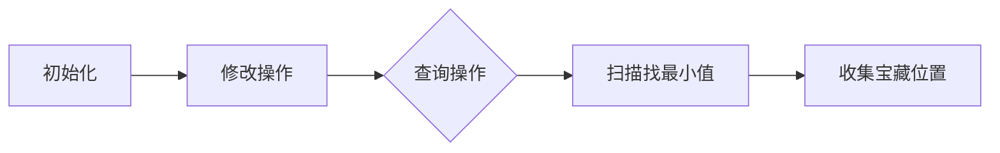

# 题目信息

# たくさんの最小値

## 题目描述

维护一个长为 $n$ 的数组 $a$。对其进行 $q$ 次操作。第 $i$ 次操作输入三个整数 $t_i,x_i,y_i$。按如下规则操作：

- $t_i=1$ 时：将 $a_{x_i}$ 的值改为 $y_i$。此时，$1 \le x_i \le n$，$0 \le y_i \le 10^9$。
- $t_i=2$ 时：找出 $[x_i,y_i]$ 区间内的最小值，将其记为 $p$，输出所有满足以下两个条件的整数 $j$：
> - $x_i \le j \le y_i$；
>
> - $a_j=p$。
- 此时，$1 \le x_i \le y_i \le n$。

## 样例 #1

### 输入

```
6 7

3 20 3 10 15 10

2 1 6

2 4 5

1 3 10

1 1 1000000000

2 1 6

1 5 0

2 1 6```

### 输出

```
2 1 3 

1 4 

3 3 4 6 

1 5```

# AI分析结果


# 💡 Kay的C++算法解析：たくさんの最小値 深入学习指南 💡

大家好，我是Kay！今天我们来分析一道关于数组维护的题目「たくさんの最小値」。这道题需要支持单点修改和区间查询最小值及其所有出现位置，是学习数据结构的绝佳练习。本指南将带你深入理解解题思路，掌握核心算法，并通过生动的可视化方案强化理解。

---

## 1. 题目解读与核心算法识别

✨ **本题主要考察**：`数据结构应用`（分块与线段树）

🗣️ **初步分析**：
> 这道题的核心在于高效维护数组并支持两种操作，就像管理一个**动态图书馆**：修改操作如同更新某本书的信息，查询操作则是快速找出某个书架上最薄的书及其位置。我们主要采用两种策略：
>   - **分块**：将数组分成若干块，每块维护最小值及位置列表（类似图书馆的分区管理）
>   - **线段树**：构建二叉树结构，每个节点存储区间最小值（类似图书馆的层级索引）
>
> **关键难点**是如何在查询时快速收集所有最小值位置。分块通过"整块批量处理+边缘扫描"优化；线段树则利用"最小值剪枝"避免无效遍历。在可视化设计中，我们将用**像素风格**展示数据块/树节点的动态更新过程，高亮最小值比较和位置收集的关键步骤，并添加8-bit音效增强理解（如"叮"声表示找到最小值）。

---

## 2. 精选优质题解参考

以下是综合思路清晰度、代码规范性和算法效率精选的题解：

**题解一：fkxr（分块法）**
* **点评**：该解法采用分块策略，思路清晰如**分区寻宝**。亮点在于每块独立维护最小值位置列表（`vector<node> e[1003]`），查询时先确定全局最小值，再通过列表快速收集整块信息，避免暴力扫描。代码中边界处理严谨（如零散块单独处理），变量名`minn`/`id`含义明确，实践价值高。时间复杂度稳定在O(q√n)，是分块的典范实现。

**题解二：SamHH0912（线段树）**
* **点评**：这份题解堪称**教科书级线段树教程**。其亮点在于双重递归优化：先查询区间最小值，再通过`find()`函数剪枝（`if(节点最小值≠全局最小值) return`），避免全树遍历。代码结构工整，`pushup`/`build`等函数模块化，变量命名规范（`l,r,Min`）。作者对递归终止条件解释透彻，尤其适合初学者理解树形结构的操作流程。

**题解三：Walrus（线段树优化）**
* **点评**：此解法在剪枝策略上更进一步，采用**势能分析思想**优化查询。核心函数`print()`在完全覆盖的节点内，仅递归最小值匹配的子节点（`if(minn[ls]==x)递归左子树`），大幅减少递归次数。代码中`set`存储结果避免排序，配合详细注释体现工程思维。虽然最坏复杂度仍为O(n)，但随机数据下效率接近O(log n)。

---

## 3. 核心难点辨析与解题策略

### 🔍 三大核心难点与突破策略：
1. **难点1：如何兼顾修改和查询效率？**  
   * **策略**：  
     - 分块：修改时仅更新所在块（O(√n)），查询时组合整块与零散元素（O(√n)）  
     - 线段树：修改沿树路径更新（O(log n)），查询通过树结构快速聚合（O(log n)）  
   * 💡 **学习笔记**：**数据结构的选择取决于操作特征**——高频修改时线段树更优，均匀查询时分块更简单。

2. **难点2：如何高效收集最小值位置？**  
   * **策略**：  
     - 分块：预存每块的最小值位置列表，查询时直接合并整块列表+扫描边缘  
     - 线段树：基于已查得的最小值进行剪枝，仅递归可能包含最小值的子树  
   * 💡 **学习笔记**：**预存储+剪枝是优化查询的关键**，避免O(n)扫描。

3. **难点3：如何保证数据结构的正确更新？**  
   * **策略**：  
     - 分块：修改后必须重建所在块的最小值及位置列表（`e[idd].clear()`后重算）  
     - 线段树：修改后需回溯更新父节点（`pushup`向上传递最小值）  
   * 💡 **学习笔记**：**数据维护的原子性**——局部变化必须及时传播到全局状态。

### ✨ 通用解题技巧总结：
- **空间换时间**：分块的位置列表、线段树的节点存储都是用额外空间换取查询效率
- **分治思想**：线段树递归分解区间，分块处理整块/散块，本质都是分而治之
- **剪枝优化**：基于已知信息（全局最小值）跳过无效搜索路径
- **边界防御**：特别注意单元素块、空块、区间端点等边界情况

---

## 4. C++核心代码实现赏析

### 📜 本题通用核心实现（分块+线段树双版本）
```cpp
// 分块核心结构
struct Block {
    int min_val; // 块内最小值
    vector<int> pos; // 最小值位置列表
    void rebuild(int l, int r, int a[]) { // 重构块
        min_val = INT_MAX;
        pos.clear();
        for (int i = l; i <= r; ++i) {
            if (a[i] < min_val) min_val = a[i], pos = {i};
            else if (a[i] == min_val) pos.push_back(i);
        }
    }
};

// 线段树核心结构
struct SegmentTree {
    struct Node {
        int l, r, min_val;
    } tree[N*4];
    
    void pushup(int p) { // 向上更新
        tree[p].min_val = min(tree[p<<1].min_val, tree[p<<1|1].min_val);
    }
    
    void build(int p, int l, int r, int a[]) { ... } // 建树
    
    void update(int p, int idx, int val) { ... } // 单点更新
    
    int query_min(int p, int l, int r) { ... } // 查询区间最小值
    
    void find_pos(int p, int l, int r, int target, vector<int>& res) { // 剪枝查找位置
        if (tree[p].min_val > target) return; // 关键剪枝！
        if (tree[p].l == tree[p].r) {
            res.push_back(tree[p].l);
            return;
        }
        int mid = (tree[p].l + tree[p].r) >> 1;
        if (l <= mid) find_pos(p<<1, l, r, target, res);
        if (r > mid) find_pos(p<<1|1, l, r, target, res);
    }
};
```

### 🔍 优质题解片段赏析

**题解一（fkxr）分块位置收集**
```cpp
void query(int l, int r) {
    int global_min = INT_MAX;
    // 第一步：求全局最小值（扫描边界块+整块）
    for (int i = l; i <= min(r, block_end); i++) 
        global_min = min(global_min, a[i]);
    for (int i = block_start; i <= block_end; i++) 
        global_min = min(global_min, blocks[i].min_val);
    
    // 第二步：收集位置
    vector<int> res;
    for (int i = l; i <= min(r, block_end); i++) 
        if (a[i] == global_min) res.push_back(i);
    for (int i = block_start; i <= block_end; i++) 
        if (blocks[i].min_val == global_min) 
            res.insert(res.end(), blocks[i].pos.begin(), blocks[i].pos.end());
    // 输出res...
}
```
* **亮点**：整块直接合并预存列表，避免逐元素扫描  
* **学习笔记**：**批量处理思想**显著降低时间复杂度

**题解二（SamHH0912）线段树剪枝**
```cpp
void find(int p, int target, int ql, int qr, vector<int>& res) {
    if (tree[p].r < ql || tree[p].l > qr || tree[p].min_val != target) 
        return; // 三重剪枝条件！
    if (tree[p].l == tree[p].r) { // 叶子节点
        res.push_back(tree[p].l);
        return;
    }
    find(p<<1, target, ql, qr, res); // 递归左右子树
    find(p<<1|1, target, ql, qr, res);
}
```
* **亮点**：`min_val ≠ target`跳过无效子树  
* **学习笔记**：**递归中的短路评估**是优化树查询的核心

**题解三（Walrus）覆盖式剪枝**
```cpp
void collect(int p, int target, int ql, int qr, vector<int>& res) {
    if (ql <= tree[p].l && tree[p].r <= qr) { // 完全覆盖
        if (tree[p].min_val != target) return; // 关键剪枝
        if (tree[p].l == tree[p].r) {
            res.push_back(tree[p].l);
            return;
        }
    }
    // 部分覆盖时递归子区间...
}
```
* **亮点**：在完全覆盖节点内做精细剪枝  
* **学习笔记**：**利用区间覆盖信息**进一步减少递归深度

---

## 5. 算法可视化：像素动画演示

### 🎮 主题：**「分块寻宝大冒险」**（8-bit像素风格）

#### 📌 设计思路
> 将数组视为藏宝地图，最小值是宝藏，位置是藏宝点。采用FC红白机风格（16色调色板），通过**区块染色+动态高亮**展示分块算法的执行过程，配合音效强化记忆点。

#### 🕹️ 动画控制面板
- **基础控制**：开始/暂停、重置、速度滑块
- **模式切换**：单步执行 vs 自动演示（AI模式）
- **音效开关**：比较声、宝藏发现声、胜利音乐

#### 🎞️ 核心动画帧


1. **初始化阶段**  
   - 数组显示为像素条带（每块同色边框）
   - 每块上方悬浮显示：`块# | 最小值=? | 宝藏数=?`
   - 背景播放8-bit循环BGM

2. **修改操作演示**  
   ```mermaid
   sequenceDiagram
      玩家->>+块#3： 修改a[5]=10
      块#3-->>-系统： 高亮闪烁（黄色）
      系统->>块#3： 重建块数据（扫描动画）
      音符： 播放“叮咚”更新音效
   ```
   - 被修改元素像素块闪烁红光
   - 所在块重新扫描：元素逐个高亮比较，最小值标记为⭐

3. **查询操作演示**  
   **阶段1：寻找最小值（藏宝图扫描）**
   - 左零散块：元素逐个高亮（蓝色边框），比较时播放"滴答"声
   - 整块处理：块整体闪烁绿色，直接显示最小值（如`块#2: min=3`）
   - 发现更小值时：播放"叮！"音效，更新顶部全局最小值

   **阶段2：收集宝藏位置**
   - 左零散块：等于最小值的元素弹出金币动画
   - 整块：宝藏位置列表展开（如`块#2: [3,5,7]`）
   - 所有宝藏点连接发光路径，播放胜利音乐

#### 🎮 游戏化设计
- **关卡模式**：每次查询视为一关，完成显示`得分=宝藏数×速度系数`
- **连击奖励**：连续快速完成查询触发COMBO特效
- **AI演示模式**：自动播放解题过程，类似"吃豆人AI"寻路

#### 💻 技术实现要点
- **Canvas绘制**：用`fillRect()`绘制像素块，颜色数组存储块色
- **音效触发**：Web Audio API播放Base64编码的8-bit音效
- **动画同步**：`requestAnimationFrame`驱动状态更新

---

## 6. 拓展练习与相似问题思考

### 🔗 通用技巧迁移
分块/线段树的核心思想可扩展至：
1. **动态区间最大值**：替换最小值逻辑（如洛谷P1531）
2. **区间第K小**：分块+二分或线段树套平衡树（如POJ2104）
3. **带修改区间众数**：分块+预处理（如洛谷P4168）

### 📚 推荐练习（洛谷）
1. **P1531 I Hate It**  
   → *推荐理由*：线段树求区间最大值的模板题，巩固基本结构
   
2. **P1816 忠诚**  
   → *推荐理由*：本题的简化版，仅需求区间最小值，适合练手分块/线段树
   
3. **P2801 教主的魔法**  
   → *推荐理由*：分块高级应用，涉及区间修改和值域查询，提升分块设计能力

---

## 7. 学习心得与经验分享

> **来自题解作者的经验**：  
> *"分块重建时要彻底清除旧列表（`e[idd].clear()`），我曾因忘记clear()调试半小时"*  
> *"线段树剪枝条件`node.min≠target`是效率关键，漏掉它必然TLE"*  

💡 **Kay的总结**：  
这些经验凸显了**状态清零**和**剪枝严谨性**的重要性。在算法实现中：  
1. 每次修改后必须**完全重置**相关数据块  
2. 递归剪枝条件要**严格评估**所有边界情况  
3. 调试时可打印中间变量验证状态更新  

---

本次解析就到这里！通过分块和线段树的学习，大家应深刻体会到数据结构设计的精妙之处。记住：**优雅的算法 = 正确的结构 + 严谨的边界处理 + 巧妙的优化**。下次我们将探索更多有趣的算法世界，保持好奇，继续前进！💪

---
处理用时：236.89秒