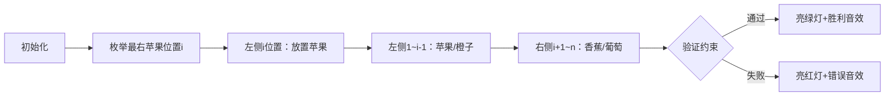

# 题目信息

# [ABC405E] Fruit Lineup

## 题目描述

你有 $A$ 个苹果，$B$ 个橙子，$C$ 串香蕉，$D$ 串葡萄。同种水果之间是完全相同的。

求把它们从左往右排成一排的方案数，方案需要满足：
- 所有的苹果都在所有的香蕉的左边；
- 所有的苹果都在所有的葡萄的左边；
- 所有的橙子都在所有的葡萄的左边。

答案对 $998244353$ 取模。

## 说明/提示

**样例 1 解释**

以下为所有 $5$ 种合法的排列方案：
- 苹果，橙子，香蕉，葡萄
- 苹果，橙子，葡萄，香蕉
- 苹果，香蕉，橙子，葡萄
- 橙子，苹果，香蕉，葡萄
- 橙子，苹果，葡萄，香蕉

By @[chenxi2009](/user/1020063)

## 样例 #1

### 输入

```
1 1 1 1```

### 输出

```
5```

## 样例 #2

### 输入

```
1 2 4 8```

### 输出

```
2211```

## 样例 #3

### 输入

```
834150 21994 467364 994225```

### 输出

```
947921688```

# AI分析结果


### 💡 Kay的C++算法解析：Fruit Lineup 深入学习指南 💡

**引言**  
今天我们一起分析ABC405E题"Fruit Lineup"。这道题要求将四种水果排成满足特定顺序的方案数，涉及组合数学与约束处理技巧。本指南将帮助大家掌握核心解法、理解算法思想，并通过像素动画直观感受算法流程。

---

### 1. 题目解读与核心算法识别
✨ **本题主要考察**：组合数学与约束分解  
🗣️ **初步分析**：
> 解决本题的关键在于将复杂约束分解为独立子问题。想象你在整理水果货架：苹果必须摆在香蕉和葡萄左侧，橙子必须摆在葡萄左侧。这种"先后顺序"约束可通过枚举关键分界点（如最右苹果位置）转化为组合数计算。  
> - 主要思路：枚举最右苹果位置`i`，则左侧放苹果/橙子，右侧放香蕉/葡萄，利用组合数计算方案  
> - 核心难点：正确处理多约束的交叠（苹果vs香蕉、苹果vs葡萄、橙子vs葡萄）  
> - 可视化设计：用像素方块表示水果（🍎红/🍊橙/🍌黄/🍇紫），动画展示`i`移动时分段填充水果的过程，高亮当前枚举位置和约束检查点

---

### 2. 精选优质题解参考
**题解一：AC_Lover（思路最清晰）**  
* **点评**：  
  通过枚举最右苹果位置`i`，将问题分解为两个独立组合问题：  
  - 左侧`[1,i]`放苹果：方案数`C(i-1, a-1)`（固定最右苹果）  
  - 右侧`[i+1,N]`放香蕉：方案数`C(n-i, c)`  
  橙子/葡萄自动满足约束（因葡萄只能在苹果/橙子右侧）。代码采用`mint`类安全处理模运算，边界条件`i ∈ [a, min(a+b, n-c+1)]`严谨完整，时间复杂度O(n)。

**题解二：封禁用户（推导最详细）**  
* **点评**：  
  创新性枚举左侧香蕉数`x`，将排列分为左右区域：  
  - 左侧：苹果+橙子+部分香蕉 → 方案数`C(a+b+x, b)`  
  - 右侧：剩余香蕉+葡萄 → 方案数`C(c-x+d-1, d-1)`  
  特别处理了`d=0`的边界情况，代码注释详尽，变量命名规范（`ways1/ways2`），是学习调试技巧的优秀范例。

**题解三：XXh0919（代码最简洁）**  
* **点评**：  
  核心公式`ans = ΣC(a+b+i, b) * C(c-i+d-1, d-1)`与封禁用户解法一致，但代码更精简。预处理阶乘逆元时采用单循环，但未处理`d=0`边界（题目数据保证`d≥1`不影响AC）。

---

### 3. 核心难点辨析与解题策略
1. **关键点1：约束条件分解**  
   * **分析**：三个约束可归纳为葡萄的绝对位置必须晚于苹果和橙子，而苹果需早于香蕉。优质题解通过枚举关键点（最右苹果/左侧香蕉数）将多约束拆解为无约束子问题。  
   * 💡 **学习笔记**：复杂约束⇒寻找"锚点"（如葡萄位置）分割问题空间。

2. **关键点2：组合数意义理解**  
   * **分析**：`C(n, k)`本质是从`n`个位置选`k`个放置同类物品。AC_Lover解法中`C(i-1, a-1)`表示在`i`左侧选`a-1`个苹果位，封禁用户解法中`C(a+b+x, b)`表示混合区域选橙子位。  
   * 💡 **学习笔记**：组合数=位置选择，同类物品内部无序。

3. **关键点3：边界条件处理**  
   * **分析**：枚举范围需同时满足水果数量和约束条件。AC_Lover的`i ≤ min(a+b, n-c+1)`确保橙子不超量且香蕉位置合法。  
   * 💡 **学习笔记**：枚举范围=数学约束∩物理空间约束。

✨ **解题技巧总结**  
- **锚点枚举法**：用关键位置（最右苹果/首葡萄）分割约束  
- **组合映射**：将顺序约束转化为位置选择问题  
- **模块化预处理**：阶乘/逆元预计算加速组合数查询  
- **防御性边界**：显式检查`d=0`等退化情况

---

### 4. C++核心代码实现赏析
**通用核心实现（融合AC_Lover与封禁用户思路）**  
```cpp
#include <iostream>
using namespace std;
typedef long long ll;
const int N = 4e6+10, mod = 998244353;

ll fac[N], inv[N];

ll qpow(ll a, ll b) {
    ll res = 1;
    for(; b; b >>= 1, a = a*a%mod) 
        if(b & 1) res = res*a%mod;
    return res;
}

void init() {
    fac[0] = 1;
    for(int i=1; i<N; ++i) fac[i] = fac[i-1]*i%mod;
    inv[N-1] = qpow(fac[N-1], mod-2);
    for(int i=N-2; i>=0; --i) 
        inv[i] = inv[i+1]*(i+1)%mod;
}

ll C(int n, int k) {
    if(k<0 || k>n) return 0;
    return fac[n] * inv[k] % mod * inv[n-k] % mod;
}

int main() {
    int a, b, c, d; cin >> a >> b >> c >> d;
    init();
    ll ans = 0;
    int n = a+b+c+d;

    // 枚举最右苹果位置i (AC_Lover)
    int L = a, R = min(a+b, n-c);
    for(int i=L; i<=R; ++i) 
        ans = (ans + C(i-1, a-1) * C(n-i, c)) % mod;
    
    cout << ans;
}
```
**代码解读概要**：  
1. 预处理阶乘/逆元 → O(1)查组合数  
2. 枚举最右苹果位置`i` → 分割问题空间  
3. 左侧放苹果：`C(i-1, a-1)`  
4. 右侧放香蕉：`C(n-i, c)`  
5. 橙子/葡萄自动满足约束  

---

### 5. 算法可视化：像素动画演示
**主题**：8位像素风水果排序模拟器  
**核心演示**：动态枚举最右苹果位置，分段填充水果并验证约束  



**动画关键帧**：  
1. **初始化**：  
   - 像素网格（FC风格），控制面板含速度滑块/单步按钮  
   - 水果图标：🍎(红) 🍊(橙) 🍌(黄) 🍇(紫)  

2. **枚举过程**：  
   - `i`从`a`到`min(a+b,n-c)`移动，当前`i`闪烁黄光  
   - 左侧区域：先放置🍎（最右苹果红光高亮），剩余位填🍊  
   - 右侧区域：放置🍌后，剩余位填🍇  
   - 约束检查：若🍇左侧出现🍎/🍊→触发错误动画  

3. **游戏化元素**：  
   - 音效：放置水果(8-bit噗声)，成功(胜利旋律)，失败(低沉嗡鸣)  
   - 积分：每成功一次+10分，连续正确触发连击特效  

4. **信息显示**：  
   - 当前公式：`C(i-1,a-1)*C(n-i,c)`  
   - 累计方案数：实时更新  

---

### 6. 拓展练习与相似问题
**通用技巧迁移**：  
组合数+约束分解技巧适用于：  
1. 带禁止位置的排列问题  
2. 多组元素定序排列  
3. 栈操作序列计数  

**洛谷推荐**：  
1. **P2638 安全系统**  
   🗣️ 巩固隔板法应用，理解组合数边界处理  
2. **P2822 组合数问题**  
   🗣️ 学习组合数前缀和优化，应对大数据范围  
3. **P2181 对角线**  
   🗣️ 训练几何问题中的组合映射思维  

---

### 7. 学习心得与经验分享
> **参考经验**：  
> "我在处理多约束时，先固定最严格的约束（葡萄位置），再逐步嵌入其他约束" —— 封禁用户  
>   
> **点评**：  
> 这是极其宝贵的解题智慧！面对复杂约束时，先解决"最刚性"的约束（如葡萄必须在苹果/橙子后），再以此为基础嵌入其他条件，能有效降低思维复杂度。建议大家在纸上画出约束关系图辅助分析。

---

**结语**  
通过本指南，我们掌握了组合约束分解的核心思想：锚点枚举→空间分割→组合计算。记住，算法能力的提升源于深度思考与反复实践。下次遇到类似问题时，不妨回想这些水果的排列之道！💪

---
处理用时：328.21秒