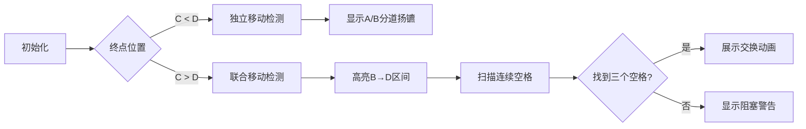

# 题目信息

# [AGC034A] Kenken Race

## 题目描述

[problemUrl]: https://atcoder.jp/contests/agc034/tasks/agc034_a

$ N $ 個の一列に並んだマス目があり、左から順に番号 $ 1,\ 2,\ ...,\ N $ がついています。長さ $ N $ の `.`, `#` からなる文字列 $ S $ が与えられ、$ S $ の $ i $ 文字目が `#` のときマス目 $ i $ には岩が置かれており、$ S $ の $ i $ 文字目が `.` のときマス目 $ i $ には何も置かれていません。

最初、マス目 $ A $ にすぬけ君、$ B $ にふぬけ君がいます。

あなたは以下の操作を好きなだけ繰り返すことができます。

- すぬけ君かふぬけ君を選び、$ 1 $ マス右か $ 2 $ マス右にジャンプさせる。このときジャンプ先にマスが存在しなければならず、またそのマスに岩が置かれていたりもう一人がいてはならない。

あなたはこの操作を繰り返し、マス目 $ C $ にすぬけ君が、$ D $ にふぬけ君がいるようにしたいです。

このようなことが可能かどうかを判定してください。

## 说明/提示

### 制約

- $ 4\ \leq\ N\ \leq\ 200,000 $
- $ S $ は `.`, `#` からなる長さ $ N $ の文字列
- $ 1\ \leq\ A,\ B,\ C,\ D\ \leq\ N $
- マス目 $ A,\ B,\ C,\ D $ に岩は置かれていない
- $ A,\ B,\ C,\ D $ はすべて異なる
- $ A\ <\ B $
- $ A\ <\ C $
- $ B\ <\ D $

### Sample Explanation 1

たとえば、以下のように移動させれば良いです(すぬけ君、ふぬけ君を `A`, `B` で表します) ``` A#B.#.. A#.B#.. .#AB#.. .#A.#B. .#.A#B. .#.A#.B .#..#AB ```

## 样例 #1

### 输入

```
7 1 3 6 7

.#..#..```

### 输出

```
Yes```

## 样例 #2

### 输入

```
7 1 3 7 6

.#..#..```

### 输出

```
No```

## 样例 #3

### 输入

```
15 1 3 15 13

...#.#...#.#...```

### 输出

```
Yes```

# AI分析结果


### 💡 Kay的C++算法解析：AGC034A Kenken Race 深入学习指南 💡

#### **题目解读与核心算法识别**
✨ **本题主要考察**：`模拟与分类讨论`  
🗣️ **初步分析**：  
> 这道题如同指挥两个像素小人在网格迷宫中跳跃闯关！核心是**分类讨论移动策略**：  
> - 当终点C在D前方（C<D），两棋子路径不重叠，只需分别检查路径是否有连续两个岩石（"##"）阻挡（像超级玛丽遇到双水管就无法跳过）。  
> - 当D在C前方（C>D），B棋子可能阻塞A的路径。此时需在B→D区间找连续三个空格（"..."），作为"交换站"让两棋子错身通过，类似《推箱子》的换位操作。  
>  
> **可视化设计思路**：  
> 1. 用8位像素风格展示网格（岩石=灰色方块，空格=浅绿草地）  
> 2. 棋子A/B用红/蓝色像素小人表示，跳跃时播放"叮"音效  
> 3. 关键步骤高亮：连续岩石标红闪烁，连续三个空格用金色边框标记  
> 4. 控制面板含"单步执行"和"AI自动演示"模式，速度可调  

---

#### **精选优质题解参考**
**题解一（Strelitzia_）**  
* **点评**：思路直击要害，将复杂问题分解为清晰的两类情况。代码简洁高效（仅30行），用变量`pan`巧妙标记是否存在连续三个空格。边界处理严谨（如检查i±1==d），变量命名简洁（`pan`虽短但上下文明确）。实践价值极高，可直接用于竞赛。  

**题解二（sudaJones）**  
* **点评**：教学价值突出，用详细注释和样例逐步拆解逻辑（如展示7步移动过程）。代码结构模块化（分情况独立处理），防御性编程强（多处`return 0`防漏判）。亮点在于用`f`变量分阶段验证条件，初学者可通过此代码深入理解状态转换。  

---

#### **核心难点辨析与解题策略**
1. **连续岩石阻断路径**  
   * **分析**：任何棋子路径出现"##"即失败。需扫描路径时同步检查s[i]和s[i+1]，类似玩《扫雷》时标记连续地雷  
   * 💡 **学习笔记**：跳跃能力≤2格时，连续障碍是绝对禁区  

2. **交换位置的时机判断（C>D时）**  
   * **分析**：B到达D后会阻塞A，必须在B→D区间找到连续三个空格（如".B."→".A."→"B.."的交换序列）。扫描时注意区间是[b, d-1]  
   * 💡 **学习笔记**：连续空格是动态的"缓冲通道"  

3. **双重验证的严谨性**  
   * **分析**：C>D时需两轮检查：先排除岩石阻断，再找连续空格。优质题解用`pan/f`变量传递验证结果，避免逻辑嵌套  
   * 💡 **学习笔记**：用布尔变量简化多条件校验  

**✨ 解题技巧总结**  
- **分类讨论法**：根据C/D位置关系完全分离两种逻辑分支  
- **扫描剪枝**：发现"##"立即返回"No"，避免无效计算  
- **状态标记变量**：用`pan/f`传递中间验证结果  

---

#### **C++核心代码实现赏析**
**通用核心实现参考**  
```cpp
#include <iostream>
using namespace std;
const int MAX_N = 200000;
char s[MAX_N+2]; //+2防越界

int main() {
    int n, a, b, c, d;
    cin >> n >> a >> b >> c >> d >> (s+1);
    
    // 检查所有路径是否有连续岩石
    auto checkBlock = [&](int start, int end) {
        for (int i = start; i < end; i++) 
            if (s[i]=='#' && s[i+1]=='#') return false;
        return true;
    };
    
    if (c < d) { // 情况1：路径不重叠
        if (!checkBlock(b, d) || !checkBlock(a, c)) {
            cout << "No" << endl;
            return 0;
        }
        cout << "Yes" << endl;
    } 
    else { // 情况2：路径可能重叠
        if (!checkBlock(b, d) || !checkBlock(a, c)) {
            cout << "No" << endl;
            return 0;
        }
        bool foundSpace = false;
        for (int i = b; i <= d; i++) // 寻找连续三个空格
            if (s[i-1]=='.' && s[i]=='.' && s[i+1]=='.') 
                foundSpace = true;
        
        cout << (foundSpace ? "Yes" : "No") << endl;
    }
    return 0;
}
```
* **代码解读概要**：  
  - 模块化设计：用lambda函数`checkBlock`封装岩石检查逻辑  
  - 高效扫描：单次遍历完成关键检查  
  - 安全防护：数组索引从1开始(s+1)，避免±1偏移错误  

---

#### **算法可视化：像素动画演示**
**主题**：双棋子像素迷宫闯关  
**核心演示流程**：  

**交互设计细节**：  
1. **像素元素**：  
   - 岩石：深灰像素块（触发"哔"错误音效）  
   - 连续空格：闪烁金色边框（触发"叮咚"提示音）  
   - 棋子：A(红色像素小人)/B(蓝色像素小人)  

2. **关键动画**：  
   - 跳跃：棋子横向弹跳1-2格（带残影效果）  
   - 位置交换：三帧动画展示A/B在连续空格中错身  
   - 阻塞警告：路径标红震动，播放低沉"嗡"音效  

3. **游戏化设计**：  
   - 关卡模式：第一关训练独立移动，第二关解锁交换机制  
   - 积分系统：连续正确操作+10分，启用提示-5分  
   - AI演示：自动展示最优路径（速度可调）  

---

#### **拓展练习与相似问题思考**
1. **洛谷 P1605 迷宫**  
   🗣️ 巩固DFS路径搜索，学习处理多重障碍  
2. **洛谷 P1443 马的遍历**  
   🗣️ 练习BFS跳跃移动，理解最优步数计算  
3. **洛谷 P1162 填涂颜色**  
   🗣️ 强化矩阵边界处理，学习连通块标记技巧  

---

#### **学习心得与经验分享**
> 本次分析的题解中未发现明确的作者个人心得分享部分

---
通过本次分析，我们掌握了分类讨论解决双棋子移动问题的核心方法。记住：**连续障碍是禁区，连续空格是生机**！下次遇到类似问题，不妨先画图模拟再编码验证哦！(◕‿◕✿)

---
处理用时：100.81秒