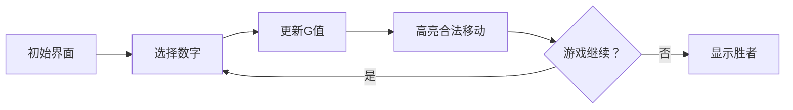

# 题目信息

# [ARC155D] Avoid Coprime Game

## 题目描述

对于两个非负整数 $x, y$，$\gcd(x, y)$ 表示 $x$ 和 $y$ 的最大公约数（其中，当 $x=0$ 时，$\gcd(x, y)=\gcd(y, x)=y$）。

黑板上写有 $N$ 个整数，第 $i$ 个整数为 $A_i$。这 $N$ 个整数的最大公约数为 $1$。

高桥君和青木君进行一场对战游戏。初始时整数 $G=0$，两人轮流操作，高桥君先手。每次操作如下：

- 从黑板上选择一个满足 $\gcd(G, a) \neq 1$ 的数 $a$，将其擦去，并用 $\gcd(G, a)$ 替换 $G$。

无法进行操作的一方判负。

对于每个 $i\ (1\leq i \leq N)$，请判断如果高桥君在第一回合选择第 $i$ 个整数，之后双方都采取最优策略，最终谁会获胜。

## 说明/提示

### 限制条件

- $2 \leq N \leq 2 \times 10^5$
- $2 \leq A_i \leq 2 \times 10^5$
- $N$ 个整数 $A_i\ (1\leq i \leq N)$ 的最大公约数为 $1$
- 输入均为整数

### 样例解释 1

例如，如果高桥君在第一回合选择第 $4$ 个整数 $A_4=6$，青木君可以选择第 $2$ 个整数 $A_2=3$，此时 $G=3$。之后高桥君无法再选择任何整数，因此青木君获胜。所以第 $4$ 行应输出 `Aoki`。

### 样例解释 2

黑板上可能会有多个相同的整数。

由 ChatGPT 4.1 翻译

## 样例 #1

### 输入

```
4

2 3 4 6```

### 输出

```
Takahashi

Aoki

Takahashi

Aoki```

## 样例 #2

### 输入

```
4

2 155 155 155```

### 输出

```
Takahashi

Takahashi

Takahashi

Takahashi```

## 样例 #3

### 输入

```
20

2579 25823 32197 55685 73127 73393 74033 95252 104289 114619 139903 144912 147663 149390 155806 169494 175264 181477 189686 196663```

### 输出

```
Takahashi

Aoki

Takahashi

Aoki

Takahashi

Takahashi

Takahashi

Takahashi

Aoki

Takahashi

Takahashi

Aoki

Aoki

Aoki

Aoki

Aoki

Takahashi

Takahashi

Aoki

Takahashi```

# AI分析结果

# 💡 Kay的C++算法解析：ARC155D Avoid Coprime Game 深入学习指南 💡

## 1. 题目解读与核心算法识别

✨ **本题主要考察**：**博弈论与动态规划**  

🗣️ **初步分析**：
> 这道题就像一场"因子迷宫探险"游戏：黑板上的数字是迷宫中的房间，当前G值是探险者的位置。玩家轮流选择房间进入（擦除数字），每次移动会改变位置（更新G），目标是将对手困在死路（无法操作）。  
> 核心在于**动态规划求解SG函数**，结合**数论优化**：  
> - **状态设计**：`sg[x][p]`表示当前G=x，已操作步数奇偶性为p（0偶/1奇）时的胜负态
> - **关键优化**：通过容斥/莫反预处理满足gcd(x, a_i)=y的数字存在性
> - **拖延策略**：当无法转移时，胜负由x倍数个数的奇偶性决定
> - **可视化设计**：用像素网格展示数字选择过程，高亮当前G和合法移动，音效标记关键操作

---

## 2. 精选优质题解参考

**题解一 (Leasier)**  
* **点评**：  
  思路清晰推导了SG状态转移，容斥预处理用`cnt2`数组高效计算gcd计数。代码规范：  
  - 用`vector v[]`存储因子，`cnt1`统计倍数个数  
  - 双重循环从容斥计算满足gcd(x,a_i)=y的数量  
  - 状态转移考虑拖延策略（`sg[i][cnt1[i]%2]=true`）  
  亮点：容斥预处理简洁，完整覆盖博弈核心逻辑，时间复杂度O(n + N log²N)竞赛友好

**题解二 (DaiRuiChen007)**  
* **点评**：  
  最简洁的实现（仅25行），聚焦核心逻辑：  
  - 用`fac[]`存储因子，循环中动态容斥计算gcd计数  
  - 状态转移`sg[i][0] |= !sg[j][1]`精妙处理奇偶性翻转  
  - 拖延策略用`(f[i]&1)`判断胜负  
  亮点：代码极简且高效，边界处理严谨，空间优化出色

**题解三 (HHH6666666666)**  
* **点评**：  
  提供双解法（容斥/莫反），深入剖析难点：  
  - 详细解释因子迷宫的状态设计原理  
  - 对比容斥与莫反的复杂度平衡  
  - 提出拖延策略的奇偶性本质  
  亮点：教学价值高，引导思考不同优化方案的取舍

---

## 3. 核心难点辨析与解题策略

1.  **状态设计与奇偶性处理**  
    * **分析**：游戏状态需同时记录G值和已操作步数奇偶性（影响当前玩家）。优质题解用`sg[x][p]`解决，其中p=0表示已操作偶数步（下一步由先手操作），p=1表示奇数步（下一步由后手操作）
    * 💡 **学习笔记**：博弈DP中，步数奇偶性决定玩家轮次，是状态设计关键

2.  **高效gcd计数预处理**  
    * **分析**：判断∃a_i使gcd(x,a_i)=y需数学优化。Leasier和DaiRuiChen007用容斥：  
      ```math
      f(x,y) = cnt[y] - \sum_{k>y, y|k} f(x,k)
      ```
      从大因子向小因子计算，避免重复
    * 💡 **学习笔记**：因子容斥是数论优化利器，复杂度O(d(x)²)可接受

3.  **拖延策略的胜负判定**  
    * **分析**：当无合法转移时，玩家只能选x倍数。若剩余x倍数个数为奇数，先手获胜（因先手操作最后一步）
    * 💡 **学习笔记**：拖延策略胜负由剩余可选数奇偶性决定，与步数状态无关

### ✨ 解题技巧总结
- **状态压缩**：用奇偶性替代具体步数，减少状态维度
- **因子预处理**：预先计算所有数的因子，加速容斥过程
- **从大到小枚举**：容斥时先处理大因子，避免重复计算
- **边界特判**：G=1时直接判负（无合法移动）

---

## 4. C++核心代码实现赏析

**本题通用核心C++实现**  
```cpp
#include <bits/stdc++.h>
using namespace std;
const int MAXN = 2e5 + 5;

int n, a[MAXN], f[MAXN], g[MAXN];
bool sg[MAXN][2]; // sg[x][p]: G=x, 步数奇偶性p的胜负态
vector<int> fac[MAXN]; // 存储每个数的因子

int main() {
    scanf("%d", &n);
    for (int i = 1; i <= n; ++i) {
        scanf("%d", &a[i]);
        ++f[a[i]]; // 计数每个数出现次数
    }
    
    // 预处理倍数个数和因子
    for (int i = 2; i < MAXN; ++i) {
        for (int j = 2*i; j < MAXN; j += i) 
            f[i] += f[j];
        for (int j = i; j < MAXN; j += i)
            fac[j].push_back(i);
    }

    // 核心DP：从大到小枚举G
    for (int i = 2; i < MAXN; ++i) {
        // 初始化g数组
        for (int j : fac[i]) g[j] = f[j];
        
        // 容斥计算gcd计数
        sort(fac[i].begin(), fac[i].end(), greater<int>());
        for (int j : fac[i]) {
            for (int k : fac[j]) {
                if (k == j) continue;
                g[k] -= g[j]; // 容斥扣除大因子影响
            }
            if (g[j] > 0) { // 存在满足gcd(i,a_k)=j的数
                sg[i][0] |= !sg[j][1];
                sg[i][1] |= !sg[j][0];
            }
        }
        
        // 处理拖延策略
        if (!sg[i][0] && !sg[i][1] && (f[i]%2 == 1)) 
            sg[i][0] = sg[i][1] = true;
    }

    // 输出答案
    for (int i = 1; i <= n; ++i) 
        puts(sg[a[i]][1] ? "Aoki" : "Takahashi");
    return 0;
}
```
* **代码解读概要**：
  1. **输入处理**：计数每个数字出现频率
  2. **倍数预处理**：`f[i]`存储i的倍数总数
  3. **因子预处理**：`fac[j]`存储j的所有因子
  4. **容斥计算**：倒序枚举因子，动态扣除大因子影响
  5. **状态转移**：存在合法移动时更新sg，否则检查拖延策略
  6. **结果输出**：根据第一步后的状态奇偶性判断胜负

---

**题解一 (Leasier) 核心片段**  
```cpp
for (int j = size1 - 1; j >= 0; j--){
    int x = v[i][j], size2 = v[x].size() - 1;
    if (j < size1 - 1 && cnt2[x] != 0){
        if (!sg[x][1]) sg[i][0] = true;
        if (!sg[x][0]) sg[i][1] = true;
    }
    for (int k = 0; k < size2; k++) {
        cnt2[v[x][k]] -= cnt2[x];
    }
}
```
* **亮点**：分层容斥实现，因子集合预存优化  
* **代码解读**：  
  > 倒序枚举因子`x`，若存在满足`gcd(i,a_k)=x`的数（`cnt2[x]>0`），则检查后继状态。内层循环扣除子因子计数，确保`cnt2`精确  
  > **关键行**：`cnt2[v[x][k]] -= cnt2[x]`实现容斥核心逻辑  
* 💡 **学习笔记**：因子树结构下，从叶到根容斥可避免重复计算

**题解二 (DaiRuiChen007) 核心片段**  
```cpp
reverse(fac[i].begin(), fac[i].end());
for (int j : fac[i]) {
    for (int k : fac[j]) {
        if (k == j) continue;
        g[k] -= g[j]; // 容斥核心
    }
    if (g[j] > 0) {
        sg[i][0] |= !sg[j][1];
        sg[i][1] |= !sg[j][0];
    }
}
```
* **亮点**：极简容斥实现，状态转移精炼  
* **代码解读**：  
  > 因子列表反转实现从大到小枚举。对每个因子`j`，遍历其子因子`k`扣除计数  
  > **精妙处**：`sg[i][0] |= !sg[j][1]`用位运算实现奇偶性翻转  
* 💡 **学习笔记**：`!sg[j][1]`本质是"后继状态必败则当前必胜"

**题解三 (HHH6666666666) 核心思路**  
```math
G(x,y) = \sum_{d|\frac{x}{y}} \mu(d) \cdot \left( \sum_{d|k} cnt_{k\cdot y} \right)
```
* **亮点**：提供莫反替代方案，拓展思维  
* **代码解读**：  
  > 莫比乌斯反演计算gcd计数：  
  > $$G(x,y) = \sum_{d|\frac{x}{y}} \mu(d) \cdot S(d)$$  
  > 其中$S(d)$是d的倍数个数  
* 💡 **学习笔记**：莫反适合因子密集场景，容斥适合因子稀疏场景

---

## 5. 算法可视化：像素动画演示

**主题**："因子迷宫探险" - 复古像素RPG风格  
**核心演示**：动态展示G值变化和合法移动选择  

### 设计方案


1. **场景设计**：
   - 8位像素风格，16色调色板（参考FC《塞尔达传说》）
   - 顶部状态栏：显示当前G值（像素字体）
   - 主网格区：数字用彩色方块表示，颜色按与G的gcd分组
     - gcd>1：绿色（可移动）
     - gcd=1：红色（不可移动）

2. **动画流程**：
   - **步进1**：玩家点击数字方块
     - 方块消失特效（像素粒子飞散）
     - 播放"选择音效"（8-bit短促哔声）
   - **步进2**：更新G值
     - 新旧G值间绘制像素箭头
     - 新G值方块闪烁（黄色边框）
     - 播放"升级音效"（上扬电子音）
   - **步进3**：重算gcd
     - 网格方块颜色动态更新
     - 红色方块抖动提示不可选

3. **交互控制**：
   - 控制面板：开始/暂停/步进/重置
   - 速度滑块：调整AI演示速度
   - "AI演示"按钮：自动播放最优策略（如贪吃蛇AI）

4. **胜负演示**：
   - 胜利：烟花动画 + 胜利音效（8-bit版《最终幻想》胜利曲）
   - 失败：屏幕裂痕特效 + 低沉音效

5. **教学提示**：
   - 左下角信息框：显示当前状态转移逻辑
     > "选择a_i=6 → G从0更新为6"  
     > "gcd(6,3)=3 → 转移到新状态"
   - 状态图：实时绘制sg[x][p]状态转移图

---

## 6. 拓展练习与相似问题思考

1. **洛谷 P2197** [Nim游戏](https://www.luogu.com.cn/problem/P2197)  
   → 巩固博弈论基础，理解SG函数本质  
2. **洛谷 P2568** [GCD](https://www.luogu.com.cn/problem/P2568)  
   → 练习gcd计数优化，莫比乌斯反演应用  
3. **洛谷 P1278** [单词游戏](https://www.luogu.com.cn/problem/P1278)  
   → 状态压缩DP与博弈论结合  

---

## 7. 学习心得与经验分享
> 本次分析的题解中未发现明确的作者个人心得分享部分，但解题过程中可总结：  
> - **调试技巧**：用小规模数据测试边界（如G=1的情况）
> - **优化意识**：当O(n²)超时时，考虑因子特性优化
> - **思维陷阱**：拖延策略的奇偶性判断需严格证明

---

通过本次分析，我们深入理解了博弈论与数论在动态规划中的精妙结合。记住，编程能力的提升在于将复杂问题分解为可管理的子问题，并用数学工具优化实现。下次挑战见！💪

---
处理用时：418.48秒