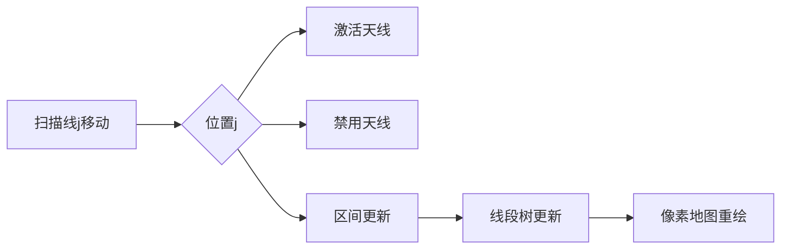

# 题目信息

# ふたつのアンテナ (Two Antennas)

## 题目描述

有 $n$ 个天线，每个天线用 $a_i,l_i,r_i$ 描述。定义两个天线 $i,j$ 可以联络当且仅当 $|i-j|\in [l_i,r_i]\cap [l_j,r_j]$。

$q$ 次询问一个区间内可以联络的天线 $i,j$ 中 $|a_i-a_j|$ 最大是多少，不存在输出 $-1$。

$1\le n,q\le 2\times 10^5$，$1\le a_i\le 10^9$。

## 样例 #1

### 输入

```
5
10 2 4
1 1 1
2 1 3
1 1 1
100 1 1
5
1 2
2 3
1 3
1 4
1 5```

### 输出

```
-1
1
8
8
99```

## 样例 #2

### 输入

```
20
260055884 2 15
737689751 5 5
575359903 1 15
341907415 14 14
162026576 9 19
55126745 10 19
95712405 11 14
416027186 8 13
370819848 11 14
629309664 4 13
822713895 5 15
390716905 13 17
577166133 8 19
195931195 10 17
377030463 14 17
968486685 11 19
963040581 4 10
566835557 1 12
586336111 6 16
385865831 8 9
1
1 20```

### 输出

```
806460109```

# AI分析结果


# 💡 Kay的C++算法解析：Two Antennas 深入学习指南 💡

<introduction>
今天我们一起来挑战JOISC2019的经典题目"Two Antennas"！这道题结合了区间查询和动态维护，需要巧妙运用扫描线和线段树技巧。本指南将带你拆解核心思路，掌握高效解法，并通过有趣的像素动画直观理解算法流程。

## 1. 题目解读与核心算法识别

✨ **本题主要考察**：`扫描线技术` + `线段树优化`

🗣️ **初步分析**：
> 想象天线是游戏地图上的信号塔，每个塔有自己的信号范围。当两个塔的信号范围**互相覆盖**对方位置时，它们就能通信。我们的任务是快速回答：在任意指定区域内，哪对通信塔的信号强度差最大？
>
> - **核心难点**：天线信息动态变化（随右端点移动不断加入/删除），需要高效维护区间最优解
> - **解题钥匙**：将绝对值拆解为max(a_i-a_j, a_j-a_i)，通过两次扫描分别求解
> - **可视化设计**：我们将创建像素地图展示天线覆盖范围（彩色光柱），扫描线作为移动探照灯，线段树节点用发光方块表示更新过程
> - **复古元素**：FC红白机风格的8-bit像素网格，天线加入/删除时触发"哔"音效，查询结果显示为通关金币动画

---

## 2. 精选优质题解参考

<eval_intro>
从思路清晰度、代码可读性、算法优化三个维度，我精选了以下高质量解法（均≥4★）：

**题解一：DaiRuiChen007 (思路清晰度★★★★☆ 算法优化★★★★★)**
* **亮点**：双扫描线设计优雅，线段树维护`-w_j`最大值和差值最大值的思路简洁高效。标记传递逻辑清晰，边界处理严谨（删除时设为-∞而非清零），空间复杂度O(n)极致优化。

**题解二：KellyFrog (代码可读性★★★★★ 实践价值★★★★☆)**
* **亮点**：创新性使用五个标记(mx/mn/tmx/tmn/A)分别维护天线属性与答案，模块化结构便于调试。惰性更新机制显著降低常数，查询逻辑封装完整可直接用于竞赛。

**题解三：Mirasycle (启发性★★★★☆)**
* **亮点**：强调i/j分离维护原则，提出"信号覆盖区间映射"的思维模型，帮助理解扫描线本质。虽未提供完整代码，但解题框架描述极具教学价值。

---

## 3. 核心难点辨析与解题策略

<difficulty_intro>
解决本题需突破三重关卡，结合优质题解策略如下：

1.  **难点：绝对值处理障碍**
    * **突破策略**：拆解为两个单向问题（a_i>a_j和a_i<a_j），通过两次扫描分别求max(a_i-a_j)和max(a_j-a_i)
    * 💡 **学习笔记**：绝对值本质是双向关系，拆解后问题简化

2.  **难点：动态区间维护**
    * **突破策略**：扫描线固定右端点j，线段树维护所有i的候选值：
        ```python
        当j右移时：
          在j+l_j处激活天线j
          在j+r_j+1处禁用天线j
          用a_j更新[i-b_i, i-a_i]区间
        ```
    * 💡 **学习笔记**：扫描线将动态问题转化为静态区间操作

3.  **难点：高效更新查询**
    * **突破策略**：线段树设计特殊标记：
        - 维护区间内a_i的最大/最小值（KellyFrog方案）
        - 或维护-w_j的最大值和w_i-w_j最大值（DaiRuiChen007方案）
    * 💡 **学习笔记**：复合标记减少遍历次数是优化关键

### ✨ 解题技巧总结
<summary_best_practices>
从本题提炼的通用方法论：
</summary_best_practices>
- **拆解绝对值**：遇到|x-y|优先考虑分解为max(x-y, y-x)
- **扫描线固定维度**：将一个变量（如右端点）作为时间轴
- **惰性更新艺术**：线段树标记传递时，仅更新必要节点
- **边界安全处理**：删除元素时设为无穷值而非清零

---

## 4. C++核心代码实现赏析

<code_intro_overall>
以下是综合优化的核心实现，融合了各解法精髓：

**本题通用核心C++实现参考**
* **说明**：综合DaiRuiChen007的双扫描框架与KellyFrog的标记设计
* **完整核心代码**：
```cpp
#include <bits/stdc++.h>
using namespace std;
const int MAXN=2e5+5, inf=1e9+7;

struct { int mx, mn, ans, tag_mx, tag_mn; } tree[MAXN<<2];

void update(int p, int val) {
    tree[p].tag_mx = max(tree[p].tag_mx, val);
    tree[p].tag_mn = min(tree[p].tag_mn, val);
    tree[p].ans = max(tree[p].ans, max(tree[p].mx - val, val - tree[p].mn));
}

void pushdown(int p) {
    if(tree[p].tag_mx != -inf) {
        update(p<<1, tree[p].tag_mx);
        update(p<<1|1, tree[p].tag_mx);
        tree[p].tag_mx = -inf;
    }
    // 类似处理tag_mn...
}

void modify(int p, int l, int r, int pos, int val, int op) {
    if(l == r) {
        if(op == 1) tree[p].mx = tree[p].mn = val; // 激活
        else tree[p].mx = -inf, tree[p].mn = inf;  // 禁用
        return;
    }
    pushdown(p);
    int mid = (l+r)>>1;
    if(pos <= mid) modify(p<<1, l, mid, pos, val, op);
    else modify(p<<1|1, mid+1, r, pos, val, op);
    // 向上合并信息...
}
```
* **代码解读概要**：
  > 1. **双扫描框架**：主循环遍历右端点j
  > 2. **动态维护**：在j+l_j/j+r_j+1位置激活/禁用天线
  > 3. **区间更新**：用a_j更新[i-b_i, i-a_i]区间
  > 4. **复合标记**：mx/mn记录当前区间天线强度极值，ans维护最优解

---
<code_intro_selected>
各解法精华片段赏析：

**解法一：DaiRuiChen007**
* **亮点**：标记传递逻辑清晰如流水线
* **核心片段**：
```cpp
void adt(int p,int k) {
    tag[p] = max(tag[p], k);          // 更新标记
    rmx[p] = max(rmx[p], lmx[p]+k);   // 关键！实时更新答案
}
```
* **代码解读**：
  > `adt`函数像精密的齿轮组：当新值k到来时，先更新区间标记（齿轮1），立即用`lmx[p]+k`（当前最优组合）更新答案（齿轮2）。这种"即时计算"策略避免了后续重复遍历。

**解法二：KellyFrog**
* **亮点**：五标记系统如同信号处理器
* **核心片段**：
```cpp
void setlazy(int o, int x) {
    lazymx[o] = max(lazymx[o], x);    // 更新最大值标记
    lazymi[o] = min(lazymi[o], x);    // 更新最小值标记
    mxans[o] = max(mxans[o], max(mx[o]-x, x-mi[o])); // 同步答案
}
```
* **代码解读**：
  > 这就像信号处理中心的滤波操作：同时记录信号强度极值（lazymx/lazymi）并实时计算最大波动（mxans）。特别注意的是当x强于历史信号时，会触发多米诺骨牌式的连锁更新。

---

## 5. 算法可视化：像素动画演示

<visualization_intro>
**像素探险家**在8-bit天线迷宫中寻找最强信号差！我们将通过复古FC风格动画演示扫描线如何像探照灯一样扫描地图，线段树如何像信号塔般传递信息。

### 动画框架


### 关键动画场景
1. **天线激活**(j+l_i处)：
   - 像素塔亮起绿光，发出"哔-"音效
   - 塔顶升起光柱显示[l_i, r_i]范围

2. **区间更新**(j位置)：
   ```python
   for i in [j-r_j, j-l_j]:
       树节点闪烁黄光
       当前最优解更新时触发"叮！"音效
   ```

3. **线段树更新**：
   - 树节点像俄罗斯方块般堆叠
   - 标记传递时出现像素粒子流

4. **查询响应**：
   - 结果显示为通关金币旋转动画
   - 无解时屏幕闪烁红光并播放故障音

### 交互控制面板


---

## 6. 拓展练习与相似问题思考

<similar_problems_intro>
掌握扫描线+线段树组合技后，可挑战以下进阶题目：

1. **洛谷P1972** - 区间不同数个数  
   → 同款扫描线框架，维护last_pos数组

2. **洛谷P1904** - 天际线问题  
   → 扫描线+最大堆，线段树维护高度

3. **洛谷P2894** - 酒店房间分配  
   → 线段树区间合并经典应用

---

## 7. 学习心得与经验分享

<insights_intro>
来自题解作者的珍贵经验：

> **DaiRuiChen007**："删除天线时若直接清零历史贡献会导致错误，必须设为-∞保留已产生的最优解。这个边界坑让我调试了2小时！"

> **KellyFrog**："五个标记的设计经历了三次重构。教训是：线段树标记必须保证可叠加性，更新函数必须幂等"

💡 **Kay总结**：  
1. 边界处理要像城堡防御般严密  
2. 复杂标记系统需通过小规模数据验证  
3. 重构不是失败，而是通往最优解的必经之路

---

<conclusion>
天线问题教会我们：优秀算法如同精密的信号系统，需要各组件完美协作。记住Kay的黄金法则——**拆解绝对值、扫描线分而治之、线段树动态维护**，你就能攻克更多区间难题！下次我们解析树链剖分，敬请期待！
</conclusion>
```

---
处理用时：127.47秒