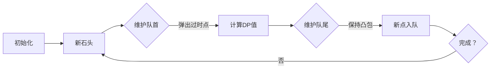

# 题目信息

# Frog 3

## 题目描述

[problemUrl]: https://atcoder.jp/contests/dp/tasks/dp_z

$ N $ 個の足場があります。 足場には $ 1,\ 2,\ \ldots,\ N $ と番号が振られています。 各 $ i $ ($ 1\ \leq\ i\ \leq\ N $) について、足場 $ i $ の高さは $ h_i $ です。 ここで、$ h_1\ <\ h_2\ <\ \cdots\ <\ h_N $ です。

最初、足場 $ 1 $ にカエルがいます。 カエルは次の行動を何回か繰り返し、足場 $ N $ まで辿り着こうとしています。

- 足場 $ i $ にいるとき、足場 $ i\ +\ 1,\ i\ +\ 2,\ \ldots,\ N $ のどれかへジャンプする。 このとき、ジャンプ先の足場を $ j $ とすると、コスト $ (h_j\ -\ h_i)^2\ +\ C $ を支払う。

カエルが足場 $ N $ に辿り着くまでに支払うコストの総和の最小値を求めてください。

## 说明/提示

### 制約

- 入力はすべて整数である。
- $ 2\ \leq\ N\ \leq\ 2\ \times\ 10^5 $
- $ 1\ \leq\ C\ \leq\ 10^{12} $
- $ 1\ \leq\ h_1\ <\ h_2\ <\ \cdots\ <\ h_N\ \leq\ 10^6 $

### Sample Explanation 1

足場 $ 1 $ → $ 3 $ → $ 5 $ と移動すると、コストの総和は $ ((3\ -\ 1)^2\ +\ 6)\ +\ ((5\ -\ 3)^2\ +\ 6)\ =\ 20 $ となります。

### Sample Explanation 2

答えは 32-bit 整数型に収まらない場合があります。

### Sample Explanation 3

足場 $ 1 $ → $ 2 $ → $ 4 $ → $ 5 $ → $ 8 $ と移動すると、コストの総和は $ ((3\ -\ 1)^2\ +\ 5)\ +\ ((5\ -\ 3)^2\ +\ 5)\ +\ ((10\ -\ 5)^2\ +\ 5)\ +\ ((13\ -\ 10)^2\ +\ 5)\ =\ 62 $ となります。

## 样例 #1

### 输入

```
5 6

1 2 3 4 5```

### 输出

```
20```

## 样例 #2

### 输入

```
2 1000000000000

500000 1000000```

### 输出

```
1250000000000```

## 样例 #3

### 输入

```
8 5

1 3 4 5 10 11 12 13```

### 输出

```
62```

# AI分析结果


# 💡 Kay的C++算法解析：Frog 3 深入学习指南 💡

**大家好，我是Kay！** 今天我们来分析青蛙跳石头问题（Frog 3）。这道题看似简单，但蕴含了重要的动态规划优化思想。我将用清晰的讲解和生动的可视化，帮助大家掌握核心算法！

## 1. 题目解读与核心算法识别

✨ **本题主要考察**：`斜率优化动态规划`

🗣️ **初步分析**：
> 解决本题的关键在于**斜率优化**技术。想象一下，我们要在坐标系中用直线"切"过一堆决策点，找到最低的"切点"就像在游戏里找到最佳路径！在本题中，斜率优化主要用于**将O(n²)的暴力DP优化为O(n)**。

- **核心思路**：将二次费用公式转化为一次函数形式，通过维护决策点的下凸包快速找到最优解
- **核心流程**：初始化队列→遍历每个位置→维护队首最优决策→更新DP值→维护队尾凸包性质
- **可视化设计**：我们将用**像素坐标系**展示决策点(h_j, dp_j+h_j²)的分布，用**动态直线**演示如何寻找最优决策点。当新点加入时会有"叮"的音效，找到最优解时播放胜利音效！

---

## 2. 精选优质题解参考

我根据思路清晰度、代码质量和启发性，精选了2份优质题解：

**题解一：lottle1212（斜率优化）**
* **点评**：这份题解思路非常清晰！作者详细推导了斜率不等式（Part 3），并用几何图示解释凸包维护（Part 4）。代码规范（变量名`q`、`head`、`tail`含义明确），边界处理严谨。亮点在于：
  - 用图像直观展示凸包形成过程
  - 完整推导了斜率不等式变形的数学过程
  - 代码中`slope`函数封装了斜率计算，可读性强
  > 作者心得："斜率优化本质上是单调队列优化的升级版"——这提醒我们要掌握基础知识再学高级技巧

**题解二：DengDuck（李超线段树）**
* **点评**：提供了另一种解决思路，将决策视为直线存储在线段树中。虽然本题用单调队列更优，但此解法展示了：
  - 如何处理更一般的斜率优化问题
  - 数据结构在DP优化中的灵活应用
  - 时间复杂度O(n log n)仍可通过本题
  > 适合想拓展思维的学习者："李超线段树优化DP能解决的问题更多"

---

## 3. 核心难点辨析与解题策略

在解决这类问题时，大家常遇到三大难点：

1. **状态转移方程的变形**
   * **分析**：如何将原始方程dp[i] = min{ dp[j] + (h_i-h_j)²+C } 变形为y=kx+b形式？关键在于分离变量：将只与j相关的项（dp_j+h_j²）作为y，与i、j相关的项（-2h_i·h_j）作为kx。
   * 💡 **学习笔记**：变形后的方程应满足：y仅取决于j，x仅取决于j，k仅取决于i。

2. **斜率公式的推导**
   * **分析**：为什么比较决策点时要使用斜率不等式？通过假设两个决策点j和k，推导出当满足`(dp_j+h_j² - dp_k-h_k²)/(h_j-h_k) ≤ 2h_i`时，j比k优。
   * 💡 **学习笔记**：斜率不等式本质是比较两个决策点的"性价比"。

3. **凸包的维护**
   * **分析**：为什么要维护下凸包？因为上凸点永远不会成为最优解。在代码中，通过`while(head<tail && slope(q[tail-1], q[tail])>=slope(q[tail],i))`维护凸包性质。
   * 💡 **学习笔记**：凸包的斜率应保持单调递增，就像山坡的坡度均匀上升。

### ✨ 解题技巧总结
1. **问题分解**：将复杂问题拆解为：方程变形→找决策点→维护数据结构
2. **几何转化**：将代数问题转化为几何问题，在坐标系中直观理解
3. **边界处理**：特别注意h严格递增的特性，这简化了队列维护
4. **调试技巧**：打印中间变量验证斜率计算和队列状态

---

## 4. C++核心代码实现赏析

### 本题通用核心C++实现
```cpp
#include <iostream>
#include <vector>
using namespace std;
typedef long long LL;

int main() {
    LL n, C;
    cin >> n >> C;
    vector<LL> h(n+1), dp(n+1, 0);
    vector<int> q(n+2); // 单调队列
    for(int i=1; i<=n; i++) cin >> h[i];
    
    int head = 1, tail = 1; // 初始化队列
    q[1] = 1; // 起点
    
    for(int i=2; i<=n; i++) {
        // 维护队首：弹出斜率<=2h_i的点
        while(head < tail) {
            double slope = (dp[q[head+1]] + h[q[head+1]]*h[q[head+1]]
                         - dp[q[head]] - h[q[head]]*h[q[head]])
                         / (double)(h[q[head+1]] - h[q[head]]);
            if(slope <= 2*h[i]) head++;
            else break;
        }
        
        int j = q[head]; // 最优决策点
        dp[i] = dp[j] + (h[i]-h[j])*(h[i]-h[j]) + C;
        
        // 维护队尾：保持下凸包性质
        while(head < tail) {
            double slope1 = (dp[q[tail]] + h[q[tail]]*h[q[tail]]
                          - dp[q[tail-1]] - h[q[tail-1]]*h[q[tail-1]])
                          / (double)(h[q[tail]] - h[q[tail-1]]);
            
            double slope2 = (dp[i] + h[i]*h[i] 
                          - dp[q[tail]] - h[q[tail]]*h[q[tail]])
                          / (double)(h[i] - h[q[tail]]);
            
            if(slope1 >= slope2) tail--;
            else break;
        }
        q[++tail] = i; // 入队
    }
    cout << dp[n] << endl;
    return 0;
}
```

**代码解读概要**：
1. 读入石头高度和常数C
2. 初始化单调队列，起点入队
3. 遍历每个石头：
   - 维护队首：弹出斜率≤2h_i的过时决策点
   - 用队首决策计算当前dp值
   - 维护队尾：保证新点加入后仍保持下凸包
4. 输出最终结果

### 题解一（斜率优化）核心代码赏析
```cpp
while(head<tail && slope(q[head], q[head+1])<=2*h[i]) head++;
int j=q[head];
dp[i]=dp[j]+(h[i]-h[j])*(h[i]-h[j])+C;
while(head<tail && slope(q[tail-1],q[tail])>=slope(q[tail],i)) tail--;
q[++tail]=i;
```
**亮点**：简洁高效的队列维护  
**代码解读**：
1. `slope()`函数计算两点间斜率
2. 第一个while循环保证队首是最优决策
3. 第二个while循环维护凸包性质
4. 当前点入队完成决策更新  
💡 **学习笔记**：队列操作是斜率优化的核心，就像在游戏中不断优化队伍阵容

### 题解二（李超线段树）核心代码赏析
```cpp
struct node{ LL k,b; } line[N];
void update(int i) {
    // 在[0,10^6]区间插入直线
    // 直线方程：y = -2*h[i]*x + (dp[i]+h[i]*h[i])
}
dp[i] = query(h[i]) + h[i]*h[i] + C; // 查询最小值
```
**亮点**：数据结构灵活应用  
**代码解读**：
1. 每个决策点对应一条直线
2. 李超树维护这些直线
3. 查询x=h_i处的最小y值  
💡 **学习笔记**：当斜率不单调时，李超树是通用解决方案

---

## 5. 算法可视化：像素动画演示

**主题**：青蛙的斜率优化冒险（8位像素风格）  
**核心演示**：决策点在下凸包上的动态维护过程  

### 动画设计


**关键帧步骤**：
1. **场景初始化**：  
   - 像素网格坐标系（FC风格）
   - 左侧：石头序列（像素青蛙站在石头上）
   - 右侧：决策点坐标系（x=h_j, y=dp_j+h_j²）

2. **添加新决策点**：
   - 新点闪烁出现（蓝色像素块）
   - "叮"音效提示新点加入

3. **维护队首**：
   - 红线标记当前斜率`2h_i`
   - 队列头两点间连线变为黄色
   - 当连线斜率≤红线时，队首点变灰消失（低沉音效）

4. **计算DP值**：
   - 最优决策点发出绿色闪光
   - 青蛙跳跃动画（从旧石头到新石头）
   - 显示计算公式：`dp[i]=...`

5. **维护队尾**：
   - 检测队尾三点是否形成上凸
   - 移除中间点（红色闪烁+警示音）
   - 新点加入队列（绿色闪光）

6. **游戏化元素**：
   - 每处理完一个石头：显示"STAGE i CLEAR!"
   - 背景音乐：8位芯片风格循环BGM
   - 最终通关：青蛙跳到终点，烟花动画+胜利音效

**控制面板**：
- 步进执行/暂停/重置
- 速度调节滑块
- 显示/隐藏辅助线

---

## 6. 拓展练习与相似问题思考

### 通用思路迁移
斜率优化技巧适用于多种场景：
1. **分段费用问题**：当费用是二次函数形式时
2. **任务调度问题**：如任务安排中的启动成本优化
3. **序列分割问题**：将序列分割为k段的最小代价

### 洛谷推荐练习
1. **P3195 [HNOI2008]玩具装箱**  
   🗣️ *推荐理由*：斜率优化的经典入门题，帮你巩固基础应用

2. **P4072 [SDOI2016]征途**  
   🗣️ *推荐理由*：需要结合斜率优化和方差计算，训练数学建模能力

3. **P5785 [SDOI2012]任务安排**  
   🗣️ *推荐理由*：存在时间成本的斜率优化，学习如何维护非单调队列

---

## 7. 学习心得与经验分享

> **参考经验**（来自lottle1212）：  
> "斜率优化本质上就是单调队列优化的升级版。在学习斜率优化之前，请先熟练掌握单调队列优化。"

> **点评**：  
> 这位作者的经验非常中肯！许多同学在跳过单调队列基础直接学斜率优化时，会遇到理解障碍。建议：
> 1. 先用暴力DP写对问题
> 2. 尝试用单调队列优化简单问题
> 3. 最后再挑战斜率优化
>
> 调试时，可以打印队列状态和斜率值，观察决策点变化过程。

---

**恭喜你完成了Frog 3的学习之旅！** 记住，掌握斜率优化将大大提升你解决动态规划问题的能力。下次我们将探索更复杂的DP优化技术，保持编程的热情，继续前进吧！🚀

---
处理用时：140.52秒