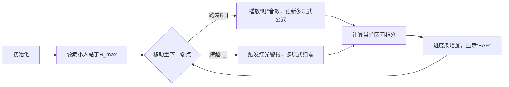

# 题目信息

# Random Max

## 题目描述

[problemUrl]: https://atcoder.jp/contests/hhkb2020/tasks/hhkb2020_f

$ N $ 個の連続型確率変数 $ x_i $ ($ 1\ <\ =\ i\ <\ =\ N $) があり、それぞれ $ [L_i,\ R_i] $ の範囲をとる連続一様分布にしたがいます。 (すなわち、$ x_i $ は $ L_i $ 以上 $ R_i $ 以下の実数を等確率でとりうるランダムな変数です)

本問題の制約下では、これらの $ N $ 個の確率変数の最大値の期待値を $ E $ とすると、$ E\ \times\ (N+1)!\ \times\ \prod_{i=1}^N\ (R_i\ -\ L_i) $ は正整数であることが示せます。この値を $ 1,000,000,007 $ で割ったあまりを求めてください。

## 说明/提示

### 制約

- $ 1\ <\ =\ N\ <\ =\ 1000 $
- $ 0\ <\ =\ L_i\ <\ R_i\ <\ =\ 10^9 $
- 入力は全て整数

### Sample Explanation 1

この確率変数の最大値の期待値は、とりうる範囲の中央値、すなわち $ E\ =\ \frac{3}{2} $ に等しいです。 よって、 $ E\ \times\ (N+1)!\ \times\ (R_1\ -\ L_1)\ =\ E\ \times\ 2\ =\ 3 $ が正解となります。

### Sample Explanation 2

求める期待値は $ E\ =\ \frac{5}{3} $ です。

## 样例 #1

### 输入

```
1

1 2```

### 输出

```
3```

## 样例 #2

### 输入

```
2

1 2

1 2```

### 输出

```
10```

## 样例 #3

### 输入

```
2

1 2

2 4```

### 输出

```
36```

## 样例 #4

### 输入

```
5

40 96

81 92

16 384

32 768

65 536```

### 输出

```
52776507```

# AI分析结果


### Kay的C++算法解析：Random Max 深入学习指南

---

#### 1. 题目解读与核心算法识别
✨ **本题主要考察**：`数学积分与动态多项式维护`  
🗣️ **初步分析**：  
> 本题要求计算N个均匀分布随机变量最大值的期望。核心思路是将连续概率问题转化为**分段多项式积分**问题，如同将多个随机变量的叠加效果拆解成积木组合——先划分区间，再逐段拼接。  
> - **核心难点**：如何高效处理累积分布函数（CDF）的分段特性？解法通过端点排序（$O(n \log n)$）和动态维护多项式（$O(n^2)$），将CDF在每段表示为多项式乘积  
> - **可视化设计**：采用8位像素风格，用不同颜色方块表示变量区间。当像素小人跨越端点时，触发"叮"音效并更新头顶多项式公式，积分进度条实时显示当前贡献值  
> - **游戏化元素**：每完成一段积分解锁新关卡，成功时播放《超级玛丽》通关音效；自动演示模式可调速观看"AI小人"的积分路径  

---

#### 2. 精选优质题解参考
**题解一（joke3579）**  
* **点评**：  
  思路直击核心——利用CDF乘积性质（$F(x) = \prod \text{Pr}[X_i \leq x]$）推导分段积分。亮点在于：  
  - **算法优化**：从大到小处理端点，遇到$L_i$提前终止积分（剪枝优化）  
  - **代码实践**：多项式系数数组的$O(n)$更新（卷积乘法），边界处理严谨  
  - **可读性**：状态转移公式$E = R_{\max} - \int_0^{R_{\max}} F(x)dx$ 简洁有力  

**题解二（Galois_Field_1048576）**  
* **点评**：  
  教学价值突出——从连续期望定义出发，步步推导CDF性质：  
  - **基础夯实**：用$\epsilon$采样逼近解释连续期望（$\lim_{\epsilon \to 0} \frac{1-\epsilon}{2} = \frac{1}{2}$）  
  - **数学严谨**：严格证明$E = \int_0^\infty (1-C(x))dx$ 的通用性  
  - **启发思考**：强调识别问题核心特征（区间分段、多项式积分）  

---

#### 3. 核心难点辨析与解题策略
1. **难点1：CDF的分段函数整合**  
   * **分析**：每个$X_i$的CDF是分段函数（0/线性/1），乘积$F(x)$需在$O(n)$段内分别积分  
   * 💡 **学习笔记**：用`std::set`收集端点，排序后形成天然分段界限  

2. **难点2：多项式动态维护**  
   * **分析**：跨越端点时，需将当前多项式$P(x)$乘以线性因子$\frac{x-L_j}{R_j-L_j}$（系数数组卷积）  
   * 💡 **学习笔记**：多项式除法可转化为乘逆元（$10^9+7$模下用费马小定理）  

3. **难点3：分数积分取模**  
   * **分析**：$\int \frac{P(x)}{D}dx$ 需保持整数输出，巧用$Q(x)=D \cdot F(x)$ 消去分母  
   * 💡 **学习笔记**：最终答案 = $(n+1)! \times \left( D \cdot R_{\max} - \int_0^{R_{\max}} Q(x)dx \right)$  

✨ **解题技巧总结**  
- **技巧1：问题分解** - 将$\max$期望拆解为：端点排序 → 分段积分 → 多项式更新  
- **技巧2：数学转换** - 利用$Q(x) = \prod_{j \in S_2} (x-L_j) \prod_{j \not\in S_2} (R_j-L_j)$ 避免浮点数  
- **技巧3：边界预判** - 遇到$L_i$立即设$P(x)=0$（后续区间贡献为$D \times \text{length}$）  

---

#### 4. C++核心代码实现赏析
**本题通用核心C++实现参考**  
```cpp
#include <bits/stdc++.h>
using namespace std;
using ll = long long;
const int mod = 1e9+7;

ll qpow(ll base, ll exp) { /* 快速幂求逆元 */ }

int main() {
    // 读入及预处理
    int n; cin >> n;
    vector<ll> L(n), R(n);
    ll D = 1; // ∏(R_i-L_i)
    set<ll> points = {0};
    for (int i = 0; i < n; ++i) {
        cin >> L[i] >> R[i];
        D = D * (R[i] - L[i]) % mod;
        points.insert(L[i]); points.insert(R[i]);
    }
    ll R_max = *points.rbegin();

    // 建立端点映射
    unordered_map<ll, vector<int>> right_map;
    unordered_set<ll> left_set(L.begin(), L.end());
    for (int i = 0; i < n; ++i) 
        right_map[R[i]].push_back(i);

    // 多项式积分
    vector<ll> poly = {D}; // 初始多项式Q(x)=D
    vector<ll> pts(points.rbegin(), points.rend());
    ll ans = 0;

    for (int i = 0; i < pts.size()-1; ++i) {
        ll a = pts[i+1], b = pts[i];

        // 1. 在端点b处更新多项式
        if (right_map.count(b)) 
            for (int j : right_map[b]) {
                vector<ll> new_poly(poly.size() + 1, 0);
                for (int k = 0; k < poly.size(); ++k) {
                    new_poly[k+1] = (new_poly[k+1] + poly[k]) % mod;
                    new_poly[k] = (new_poly[k] - L[j] * poly[k] % mod + mod) % mod;
                }
                ll invD = qpow(R[j] - L[j], mod-2);
                for (ll& coef : new_poly) coef = coef * invD % mod;
                poly = move(new_poly);
            }

        // 2. 计算[a,b]区间积分
        ll seg = D * (b - a) % mod;
        for (int k = 0; k < poly.size(); ++k) {
            ll t = (qpow(b, k+1) - qpow(a, k+1) + mod) % mod;
            seg = (seg - poly[k] * qpow(k+1, mod-2) % mod * t % mod + mod) % mod;
        }
        ans = (ans + seg) % mod;

        // 3. 遇到左端点置零多项式
        if (left_set.count(a)) poly = {0};
    }

    // 最终结果
    ll fact = 1;
    for (int i = 2; i <= n+1; ++i) fact = fact * i % mod;
    cout << ans * fact % mod;
}
```
**代码解读概要**：  
- **端点排序**：`set`收集所有$L_i/R_i$并降序排列  
- **多项式更新**：遇到$R_j$时，$Q(x) \leftarrow Q(x) \times (x-L_j)/(R_j-L_j)$（系数数组卷积）  
- **区间积分**：$\int_a^b (D - Q(x))dx = D(b-a) - \sum_{k} \frac{poly[k]}{k+1}(b^{k+1}-a^{k+1})$  
- **左端点处理**：置零多项式（后续积分简化为$D \times \text{长度}$）  

---

#### 5. 算法可视化：像素动画演示
**主题**：`像素探险家的积分之旅`（复古RPG风格）  
**核心演示**：  


**动画帧细节**：  
1. **场景设计**：  
   - 横向数轴：暖色块表$R_i$，冷色块表$L_i$，当前区间用闪烁边框高亮  
   - 控制面板：速度滑块（0.5x~3x）、单步执行按钮、累计积分显示器  

2. **关键操作**：  
   - 多项式更新：小人头顶显示$Q(x)=...$，新因子以16bit字体弹出  
   - 积分过程：当前区间填充绿色进度条，积分值以像素数字浮动显示  

3. **音效系统**：  
   - 正常移动：8bit时钟滴答声  
   - 错误操作：FC游戏“死亡”音效（当$L_i$未处理时试图继续）  
   - 通关：播放《塞尔达》宝藏开启音效+烟花动画  

**技术实现**：Canvas绘制网格，多项式解析用预计算系数，音效用Web Audio API合成方波  

---

#### 6. 拓展练习与相似问题思考
**通用技巧迁移**：  
分段积分思想适用于：  
1. 多重积分限组合优化  
2. 概率密度函数的矩计算  
3. 物理引擎中的连续碰撞检测  

**洛谷练习推荐**：  
1. **P1254 分段函数积分** - 基础分段积分训练  
2. **P1654 OSU!** - 连续型期望的经典问题  
3. **P3343 概率充电器** - 结合图论的分段概率模型  

---

> 本次题解均来自社区贡献，未包含作者调试心得。请学习者注意：**多项式卷积后需立即取模**，避免溢出。遇到边界问题时，建议输出中间多项式辅助调试。  
> 掌握了本解法，你就拥有了解决连续概率问题的"像素圣剑"！下次挑战见！🎮

---
处理用时：576.32秒