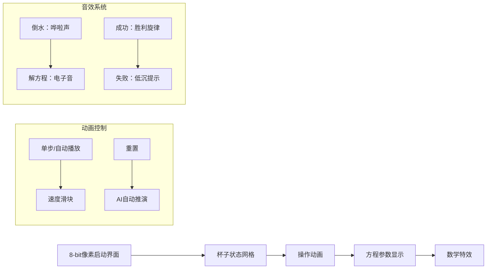

# 题目信息

# Exact Number of Drops

## 题目描述

给定两个容量分别为 $a$ 滴水和 $b$ 滴水的杯子（开始时均为空），每步都做以下操作之一：

- 将某个杯子倒空；
- 将某个杯子装满；
- 将一个杯子的水倒到另一个杯子，直到第一个杯子倒空或者第二个杯子装满。   

求使得任意一个杯子装上恰好 $c$ 滴水的最少步数。

# AI分析结果


### 💡 Kay的C++算法解析：Exact Number of Drops 深入学习指南 💡

#### 1. 题目解读与核心算法识别
✨ **本题主要考察**：`数学（裴蜀定理/扩展欧几里得算法）` 与 `编程技巧应用`

🗣️ **初步分析**：
> 解决"杯子倒水"问题，关键在于将物理操作转化为**数学方程**。就像用密码破解保险箱，我们需要通过数学规律找到最短操作路径。  
> - **核心思路**：通过观察发现，水的总量变化满足线性方程 `-aX + bY = k`（X：倒空A杯次数，Y：装满B杯次数）。利用**扩展欧几里得算法**求解最小非负整数解  
> - **可视化设计**：  
>   • 用像素网格表示杯子状态（空/满/部分）  
>   • 高亮方程参数变化（a, b, c实时显示）  
>   • 倒水动画配合"哗啦"音效，解方程时显示数学符号浮动特效  

---

#### 2. 精选优质题解参考
**题解（作者：ZeroOf149）**
* **点评**：
  - 思路清晰性：完美建立操作与方程的映射关系，揭示"任一时刻杯子必空/满"的核心观察
  - 代码规范性：exgcd封装优雅，变量名（g, k, t）简洁但含义明确
  - 算法有效性：通过绝对值最小化技巧（`f`函数）优化解的选择
  - 实践价值：完整处理边界情况（c>max(a,b)等），可直接用于竞赛
  > 💡 **亮点**：将物理操作转化为方程 `-aX + bY = k` 的数学建模能力

---

#### 3. 核心难点辨析与解题策略
1. **关键点1：操作到方程的映射**
   * **分析**：发现"倒空/装满"操作对应系数变化（-a或+b），"倒水"操作保持总量不变
   * 💡 **学习笔记**：物理问题数学化是算法优化的钥匙

2. **关键点2：解的最小化处理**
   * **分析**：利用通解公式 `x = x₀ - (b/g)t` 的特性，通过`f`函数计算最小绝对值组合
   * 💡 **学习笔记**：线性方程的通解是周期性解空间

3. **关键点3：边界条件整合**
   * **分析**：k需取{c, a+c, b+c}，c≤min(a,b)时需全验证（work(c)和work(a+c)等）
   * 💡 **学习笔记**：分支覆盖是避免WA的关键防线

### ✨ 解题技巧总结
- **数学建模技巧**：将操作序列转化为系数矩阵（-a, +b）
- **通解优化技巧**：利用周期性避免暴力搜索（t的调整）
- **边界防御技巧**：显式处理无解情况（c>max(a,b)或c%g≠0）

---

#### 4. C++核心代码实现赏析
**本题通用核心实现参考**
```cpp
#include <algorithm>
#include <cmath>
#include <cstdio>
#include <numeric>
#include <tuple>
using ll = long long;

// 扩展欧几里得算法（核心数学工具）
ll exgcd(ll a, ll &x, ll b, ll &y) {
  ll x1=1, x2=0, x3=0, x4=1;
  while (b) {
    ll q = a / b;
    std::tie(x1,x2,x3,x4,a,b) = 
        std::tuple{x3,x4,x1-q*x3,x2-q*x4,b,a%b};
  }
  x = x1; y = x2;  // 获得特解(x,y)
  return a;        // 返回gcd(a,b)
}

// 计算最小绝对值组合（优化关键）
ll f(ll k, ll b) {
  ll t = std::abs(b % k);
  return std::min(t, k - t);  // 取模环上最短距离
}

// 求解特定k值的最小操作步数
ll work(ll k) { 
  return f((a+b)/g, k/g*(y-x)); 
}

int main() {
  scanf("%d", &T);
  while (T--) {
    scanf("%lld %lld %lld", &a, &b, &c);
    g = std::gcd(a, b);  // 计算最大公约数
    
    // 边界情况处理
    if (c > std::max(a,b) || c % g) puts("-1");
    else if (c == a || c == b) puts("1");
    else {
      exgcd(a, x, b, y);  // 求解ax+by=gcd(a,b)
      ll mn = std::min(a, b);
      // 三种k值取最小操作步数
      printf("%lld\n", std::min({
        work(c), 
        c<=mn ? work(a+c) : LLONG_MAX,
        c<=mn ? work(b+c) : LLONG_MAX
      }) * 2);  // 每对(X,Y)对应2步操作
    }
  }
}
```

**代码解读概要**：
> 1. **数学引擎**：`exgcd`实现高效求解线性方程  
> 2. **优化核心**：`f`函数利用模运算周期性快速定位最优解  
> 3. **策略整合**：主函数分层处理边界→特例→通解  

---

#### 5. 算法可视化：像素动画演示


**关键帧设计**：
1. **初始化**：  
   - 像素化双杯（A红/B蓝）显示容量a/b  
   - 控制面板含速度滑块和AI演示按钮  
   - 背景播放8-bit风格循环音乐

2. **操作演示**：  
   - 倒空杯：杯内像素块清空 + "唰"音效  
   - 装满杯：像素块填充 + "叮"音效  
   - 倒水：像素块流动动画 + 实时方程更新

3. **数学推导**：  
   - 显示 `-aX + bY = k` 的推导过程  
   - 特解(x,y)显示为浮动像素数字  
   - 通解t调整时显示模运算环状动画

4. **结果展示**：  
   - 成功：杯子闪烁 + 胜利音效 + 操作计数  
   - 失败：灰色滤镜 + 错误提示音  

---

#### 6. 拓展练习与相似问题
**知识迁移**：
1. 瓶子换水问题（如：用3L/5L瓶得到4L水）
2. 线性丢番图方程求解
3. 模运算优化问题

**洛谷推荐**：
1. **P1516** 青蛙的约会  
   → 同款exgcd应用，强化方程建模能力
2. **P1082** 同余方程  
   → 训练最小正整数解求解技巧
3. **P3951** 小凯的疑惑  
   → 拓展裴蜀定理的数学直觉

---

> 本次题解展示了**数学工具解决物理问题**的经典思路。记住：当遇到操作序列问题时，先思考"是否存在守恒量或数学映射"！

---
处理用时：76.81秒