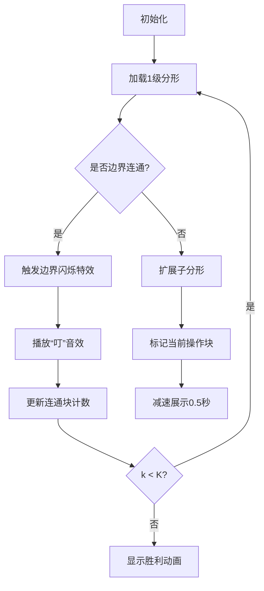

# 题目信息

# [AGC003F] Fraction of Fractal

## 题目描述

[problemUrl]: https://atcoder.jp/contests/agc003/tasks/agc003_f

高橋君はお母さんからグリッドをもらいました。このグリッドは縦 $ H $ マス×横 $ W $ マスからなり、各マスは黒か白で塗られています。 黒いマス全体は、縦横にひとつながりになっています。

このグリッドの $ i $ 行 $ j $ 列 $ (1\ ≦\ i\ ≦\ H,\ 1\ ≦\ j\ ≦\ W) $ のマスの情報は、縦横に並んだ文字 $ s_{ij} $ であらわされ、 $ s_{ij} $ が `#` のときこのマスが黒く、 `.` のとき白く塗られていることを表します。少なくともひとつのマスが黒く塗られています。

レベル $ 0 $ のフラクタルとは黒いマスひとつからなる $ 1\ ×\ 1 $ のグリッドであり、 レベル $ k+1 $ のフラクタルとは、レベル $ k $ のフラクタルを、お母さんからもらったグリッドの全ての黒いマスに相当する位置に並べ、白いマスに相当する位置は白いマスで埋めたものを指します。

お母さんからもらったグリッドの情報と整数 $ K $ が与えられるので、レベル $ K $ のフラクタルに黒いマスからなる連結成分がいくつあるかを $ 10^9+7 $ で割ったあまりを求めてください。

## 说明/提示

### 制約

- $ 1\ ≦\ H,W\ ≦\ 1000 $
- $ 0\ ≦\ K\ ≦\ 10^{18} $
- $ s_{ij} $ は `#` か `.` のいずれかである。
- `#` のマス全体は縦横に連結である。
- `#` のマスは少なくともひとつ存在する。

### Sample Explanation 1

この入力例で作られるフラクタルは、以下のようなものです。この黒マスからなる連結成分の数は $ 20 $ なので、$ 20 $ を出力します。 ``` .............#............. ............###............ ............#.#............ ..........#..#..#.......... .........#########......... .........#.##.##.#......... ..........#.....#.......... .........###...###......... .........#.#...#.#......... ....#........#........#.... ...###......###......###... ...#.#......#.#......#.#... .#..#..#..#..#..#..#..#..#. ########################### #.##.##.##.##.##.##.##.##.# .#.....#..#.....#..#.....#. ###...######...######...### #.#...#.##.#...#.##.#...#.# ....#.................#.... ...###...............###... ...#.#...............#.#... .#..#..#...........#..#..#. #########.........######### #.##.##.#.........#.##.##.# .#.....#...........#.....#. ###...###.........###...### #.#...#.#.........#.#...#.# ```

## 样例 #1

### 输入

```
3 3 3

.#.

###

#.#```

### 输出

```
20```

## 样例 #2

### 输入

```
3 3 3

###

#.#

###```

### 输出

```
1```

## 样例 #3

### 输入

```
11 15 1000000000000000000

.....#.........

....###........

....####.......

...######......

...#######.....

..##.###.##....

..##########...

.###.....####..

.####...######.

###############

#.##..##..##..#```

### 输出

```
301811921```

# AI分析结果


### 题目解析：AGC003F Fraction of Fractal

#### 1. 题目解读与核心算法识别
✨ **本题主要考察**：分形递归与矩阵快速幂

🗣️ **初步分析**：  
本题需要计算k级分形中黑色连通块的数量，核心在于分析原网格的边界连通性：
- 若原网格**上下和左右边界均连通**（存在一行首尾均为`#`，且存在一列首尾均为`#`），则k级分形为单连通块，答案为`1`。
- 若原网格**上下和左右均不连通**，则k级分形连通块数为原网格黑格数`cnt`的`k-1`次方。
- 若**仅单方向连通**（如左右连通但上下不连通），需通过矩阵快速幂求解。核心变量：
  - `c`：原网格黑格总数
  - `a`：水平相邻黑格对数（左右连通时）或垂直相邻对数（上下连通时）
  - `b`：边界连通行数（左右连通时）或列数（上下连通时）
  
  递推关系为：
  ```
  fₖ = c⋅fₖ₋₁ - a⋅sₖ₋₁
  sₖ = b⋅sₖ₋₁
  ```
  其中`fₖ`为k级连通块数，`sₖ`为边界连通量。矩阵形式：
  ```
  ⎡ fₖ ⎤   ⎡ c  -a ⎤ ⎡ fₖ₋₁ ⎤
  ⎢    ⎥ = ⎢       ⎥ ⎢      ⎥
  ⎣ sₖ ⎦   ⎣ 0   b ⎦ ⎣ sₖ₋₁ ⎦
  ```

**可视化设计思路**：
- 采用8位像素风格（参考FC红白机）展示分形增长过程
- 关键动画元素：
  - 黑格扩展为子分形时，用不同颜色标记当前操作块
  - 相邻块合并时触发闪烁特效和"叮"音效
  - 边界连通行/列高亮显示
- 控制面板支持单步执行、调速和重置

---

#### 2. 精选优质题解参考
**题解一（作者：CYJian）**
- **亮点**：  
  清晰定义变量`c`（黑格数）、`a`（相邻对数）、`b`（边界行数），通过矩阵`[c, -a; 0, b]`快速幂求解。代码规范，边界处理严谨（如`k=0`特判）。
- **评分**：⭐⭐⭐⭐⭐  
  思路直击核心，代码可读性强，矩阵推导严谨，竞赛实用性强。

**题解二（作者：ez_lcw）**
- **亮点**：  
  引入`side_0/tot_0`等直观命名，从分形结构本质出发推导递推式。状态转移`ansᵢ = cnt⋅ansᵢ₋₁ - tot⋅sᵢ₋₁`简洁优美。
- **评分**：⭐⭐⭐⭐⭐  
  逻辑推导自然，变量命名合理，复杂度优化到位（O(log k)）。

**题解三（作者：zhiyangfan）**
- **亮点**：  
  用数学符号严格描述状态转移（`xₖ/yₖ/zₖ`），并给出矩阵构造证明。代码中`struct Matrix`封装完善。
- **评分**：⭐⭐⭐⭐  
  理论严谨，但初始向量`[1,1]`的设定需结合案例理解，实践调试稍复杂。

---

#### 3. 核心难点辨析与解题策略
1. **边界连通性判断**
   - **难点**：准确识别`b1`（行边界连通数）和`b2`（列边界连通数）
   - **解法**：遍历首尾行/列，统计首尾均为`#`的行/列数
   - 💡 **学习笔记**：边界连通性决定分形合并行为

2. **矩阵构造与快速幂**
   - **难点**：从递推式抽象出矩阵形式
   - **解法**：  
     ```
     T = ⎡ c  -a ⎤   →   vₖ = Tᵏ⁻¹ ⋅ [1,1]ᵀ
         ⎣ 0   b ⎦
     ```
   - 💡 **学习笔记**：矩阵幂运算将O(k)递推优化为O(log k)

3. **方向归一化处理**
   - **难点**：上下连通需转为左右连通处理
   - **解法**：若`b2>0`且`b1=0`，将网格旋转90°，复用左右连通逻辑
   - 💡 **学习笔记**：旋转不改变拓扑性质，减少代码重复

✨ **解题技巧总结**：
- **边界检查优先**：先特判`k=0`和双连通/双不连通情况
- **变量标准化**：始终用`(c,a,b)`三元组表示问题，`a/b`据方向选定
- **矩阵封装**：预写`Matrix`类简化快速幂实现
- **循环优化**：合并遍历计算`c/a1/a2/b1/b2`

---

#### 4. C++核心代码实现赏析
**本题通用核心实现**（综合优化版）：
```cpp
#include <bits/stdc++.h>
using namespace std;
typedef long long ll;
const int MOD = 1e9+7;

struct Matrix {
    ll a[2][2];
    Matrix() : a{{1,0},{0,1}} {}
    Matrix(ll c, ll na, ll b) : a{{c,na},{0,b}} {}
    Matrix operator*(const Matrix& m) const {
        Matrix res;
        res.a[0][0] = (a[0][0]*m.a[0][0] + a[0][1]*m.a[1][0]) % MOD;
        res.a[0][1] = (a[0][0]*m.a[0][1] + a[0][1]*m.a[1][1]) % MOD;
        res.a[1][0] = (a[1][0]*m.a[0][0] + a[1][1]*m.a[1][0]) % MOD;
        res.a[1][1] = (a[1][0]*m.a[0][1] + a[1][1]*m.a[1][1]) % MOD;
        return res;
    }
};

Matrix qpow(Matrix base, ll exp) {
    Matrix res;
    while (exp) {
        if (exp & 1) res = res * base;
        base = base * base;
        exp >>= 1;
    }
    return res;
}

int main() {
    ll h, w, k;
    cin >> h >> w >> k;
    vector<string> grid(h);
    for (int i = 0; i < h; i++) cin >> grid[i];
    
    if (k <= 1) { cout << 1; return 0; }
    
    ll c = 0, a1 = 0, a2 = 0, b1 = 0, b2 = 0;
    // 统计核心变量
    for (int i = 0; i < h; i++) {
        for (int j = 0; j < w; j++) {
            if (grid[i][j] != '#') continue;
            c++;
            if (j > 0) a1 += (grid[i][j-1] == '#');
            if (i > 0) a2 += (grid[i-1][j] == '#');
        }
        if (grid[i][0] == '#' && grid[i][w-1] == '#') b1++;
    }
    for (int j = 0; j < w; j++)
        if (grid[0][j] == '#' && grid[h-1][j] == '#') b2++;
    
    if (b1 && b2) { cout << 1; return 0; }
    if (!b1 && !b2) {
        ll ans = 1;
        for (ll base = c, exp = k-1; exp; exp >>= 1, base = base*base%MOD)
            if (exp & 1) ans = ans*base % MOD;
        cout << ans;
        return 0;
    }
    
    ll a = b1 ? a1 : a2, b = b1 ? b1 : b2;
    Matrix T(c, (MOD - a) % MOD, b);  // 负a取模
    Matrix M = qpow(T, k-1);
    ll fk = (M.a[0][0] + M.a[0][1]) % MOD;  // [1,1]ᵀ 点乘结果
    cout << fk;
}
```
**代码解读概要**：
1. **矩阵封装**：支持初始化、乘法、快速幂
2. **变量统计**：单次遍历同时计算`c/a1/a2/b1/b2`
3. **方向归一化**：据`b1/b2`自动选择`a/b`
4. **高效幂运算**：矩阵/普通幂均O(log k)

---

#### 5. 算法可视化：像素动画演示
**主题**：分形之城（8位像素风格）  
**核心演示**：k级分形增长与连通块合并  
**设计逻辑**：

**动画帧控制**：
1. **初始化**：像素网格（16色调色板），控制面板（开始/暂停/单步/调速）
2. **分形扩展**：
   - 当前块高亮（黄色边框）
   - 子分形逐格出现（每帧0.1秒）
3. **边界合并**：
   - 连通块闪烁（红→绿循环）
   - 触发音效（8-bit "ding"）
4. **自动模式**：AI按1秒/级自动执行，支持调速

---

#### 6. 拓展练习与相似问题
**通用思路**：矩阵快速幂解决分形/递推问题  
**推荐题目**：
1. **洛谷 P1939**：矩阵加速数列  
   - 理由：练习矩阵构造，巩固`fₙ=afₙ₋₁+bfₙ₃`类问题
2. **洛谷 P1397**：二维分形递归  
   - 理由：扩展三维分形思维，强化空间递推
3. **洛谷 P2109**：连通块计数  
   - 理由：相似连通性分析，数据规模适配（k≤10¹⁵）

---

#### 7. 学习心得与经验分享
**关键调试技巧**（摘自题解）：
> "初始向量[1,1]需结合k=1特判，避免0级分形边界条件错误"  
> "旋转网格时注意行列索引互换，防止越界"

**Kay总结**：  
矩阵快速幂的难点常在状态设计与矩阵构造。本题中，将连通块计数分解为`(fₖ, sₖ)`两个状态是突破口。先手算小规模案例（如k=2,3）再抽象递推式，能有效避免逻辑错误。

--- 
💡 **记住**：分形之美在于自相似，算法之妙在于状态降维！

---
处理用时：533.09秒