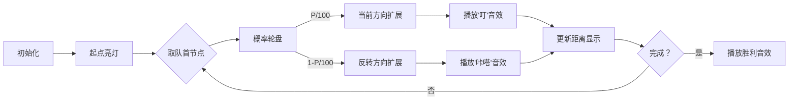

# 题目信息

# [ARC170E] BDFS

## 题目描述

给定整数 $N, P$。

有一个 $N$ 个顶点 $N$ 条边的图，顶点编号为 $1$ 到 $N$。第 $i$ 条边连接顶点 $i$ 和顶点 $i+1$，是双向的。这里顶点 $N+1$ 代表顶点 $1$。

请执行以下算法，得到一个长度为 $N$ 的数列 $D=(D_1, D_2, \ldots, D_N)$。

- 令长度为 $N$ 的整数列 $D = (D_1, \ldots, D_N) = (-1, \ldots, -1)$。同时，令数对序列 $Q = ((1, 0))$。只要 $Q$ 非空，重复以下操作：

  - 取出 $Q$ 的首元素 $(v, d)$，并将其从 $Q$ 中删除。
  - 如果 $D_v = -1$，则令 $D_v := d$，并对与顶点 $v$ 相邻且满足 $D_x = -1$ 的每个顶点 $x$，按顶点编号从小到大依次进行如下操作：
    1. 以概率 $\frac{P}{100}$，将 $(x, d+1)$ 加入 $Q$ 的**首部**。
    2. 若未将 $(x, d+1)$ 加入 $Q$ 的首部，则将其加入 $Q$ 的**尾部**。

最终得到的 $D$ 的所有元素之和的期望值，模 $998244353$ 后输出。

给定 $T$ 组测试数据，请分别输出每组的答案。

期望值 $\bmod\ 998244353$ 的定义：可以证明，所求期望值一定是有理数。在本题的约束下，若将其表示为最简分数 $\frac{P}{Q}$，则 $Q$ 保证不被 $998244353$ 整除。此时，唯一存在一个 $0$ 到 $998244352$ 之间的整数 $R$ 满足 $R \times Q \equiv P \pmod{998244353}$。请输出这个 $R$ 作为答案。

## 说明/提示

### 数据范围

- $1 \leq T \leq 10^4$
- $3 \leq N \leq 10^{18}$
- $1 \leq P \leq 99$
- 输入的所有数均为整数

### 样例解释 1

对于第 $1$ 组测试数据，算法的执行过程例如如下：

- 初始时，$D = (-1, -1, -1),\ Q = ((1, 0))$。取出 $Q$ 首元素 $(1, 0)$。
- 因为 $D_1 = -1$，令 $D_1 := 0$。与顶点 $1$ 相邻且 $D_x = -1$ 的顶点为 $2, 3$。
- 将 $(2, 1)$ 加入 $Q$ 首部，将 $(3, 1)$ 加入 $Q$ 尾部。此时 $Q = ((2, 1), (3, 1))$。
- 取出 $Q$ 首元素 $(2, 1)$。
- 因为 $D_2 = -1$，令 $D_2 := 1$。与顶点 $2$ 相邻且 $D_x = -1$ 的顶点为 $3$。
- 将 $(3, 2)$ 加入 $Q$ 首部。此时 $Q = ((3, 2), (3, 1))$。
- 取出 $Q$ 首元素 $(3, 2)$。
- 因为 $D_3 = -1$，令 $D_3 := 2$。与顶点 $3$ 相邻且 $D_x = -1$ 的顶点不存在，不做任何操作。
- 取出 $Q$ 首元素 $(3, 1)$。
- 因为 $D_3 = 2$，不做任何操作。
- $Q$ 为空，算法结束。

此时最终 $D = (0, 1, 2)$。上述过程发生的概率为 $\frac{1}{8}$，$D$ 的元素和的期望值为 $\frac{5}{2}$。

由 ChatGPT 4.1 翻译

## 样例 #1

### 输入

```
3

3 50

4 1

1000000000000000000 70```

### 输出

```
499122179

595552585

760296751```

# AI分析结果


### 💡 Kay的C++算法解析：ARC170E BDFS 深入学习指南 💡

**引言**  
今天我们一起分析ARC170E BDFS这道期望动态规划与图论结合的难题。本指南将帮助你理解环上随机BFS的期望计算本质，掌握矩阵快速幂优化技巧，并学会两种截然不同的高效解法。

---

### 1. 题目解读与核心算法识别

✨ **本题主要考察**：期望动态规划（Expectation DP）与矩阵快速幂（Matrix Exponentiation）  

🗣️ **初步分析**：  
> 本题的核心在于模拟环上BFS的随机扩展过程。想象你在一个圆形跑道上，每次随机向左或向右点亮一盏灯（概率由P控制），记录所有灯到起点的距离和。这种随机扩展可抽象为**状态机模型**：  
> - 动态规划解法（主流）：将队列行为转化为方向状态（左/右扩展），通过概率转移矩阵描述状态演化  
> - 生成函数解法（qiuzx）：将距离期望拆解为序列特征贡献，用生成函数直接求和  
>  
> **可视化设计思路**：  
> 采用8位像素风格环形跑道（类似FC《吃豆人》地图），设计以下动画要素：  
> 1. **状态标记**：红色像素块表示当前扩展方向（左箭头/右箭头）  
> 2. **队列可视化**：屏幕底部显示当前队列元素（最多两个），入队时播放"叮"音效  
> 3. **扩展动画**：被访问节点闪烁黄色→绿色，显示距离值  
> 4. **游戏化进度**：每扩展一个节点获得10分，完成时播放《超级玛丽》通关音效  
> 5. **控制面板**：支持调速滑块（0.5x-4x）、单步执行、AI自动演示模式  

---

### 2. 精选优质题解参考

**题解一：NobodyThere（矩阵快速幂）**  
* **点评**：  
  将BFS过程抽象为区间扩展模型是最大亮点。状态设计简洁（方向+深度期望），矩阵转移逻辑清晰。代码虽未展示，但描述中体现了对边界条件（环结构）的严谨处理，时间复杂度O(TlogN)完全满足N≤1e18的要求。其核心创新点在于用方向状态机替代传统队列模拟。

**题解二：qiuzx（生成函数）**  
* **点评**：  
  解法独辟蹊径，利用期望线性性将问题转化为序列概率计算。通过生成函数f(x)=(p+(1-p)x)^m和二项式反演，推导出闭合表达式。数学推导严谨，回避了矩阵乘法常数，理论时间复杂度最优（O(1)每查询）。虽然实现复杂，但提供了更深层的概率洞察。

**题解三：DaiRuiChen007（矩阵实现）**  
* **点评**：  
  提供完整工业级代码，亮点在于：  
  - 清晰的4维状态向量设计：`[f, g, 1, ans]`  
  - 模块化矩阵乘法实现（含取模优化）  
  - 利用`array<array<ll,4>,4>`提升缓存局部性  
  实践价值极高，代码可直接嵌入竞赛模板，且包含详细注释说明概率转换（P/100→模逆元）。

---

### 3. 核心难点辨析与解题策略

1. **难点1：状态机建模**  
   * **分析**：队列行为本质是方向状态切换：  
     - 当前方向扩展成功 → 概率P保持方向  
     - 加入队尾 → 概率1-P反转方向  
   * 💡 **学习笔记**：用二元状态(f,g)分别表示当前方向/反方向的期望深度  

2. **难点2：期望递推**  
   * **分析**：状态转移需同时更新：  
     - 期望深度：`f' = p*(f+1) + (1-p)*g`  
     - 答案累计：`ans += p*(f+1) + (1-p)*g`  
   * 💡 **学习笔记**：期望的线性性质允许分离深度贡献  

3. **难点3：大N优化**  
   * **分析**：N≤1e18需O(logN)算法：  
     - 矩阵快速幂：将递推转化为矩阵幂  
     - 生成函数：通过等比数列直接求和  
   * 💡 **学习笔记**：识别递推式阶数是选择解法的关键  

#### ✨ 解题技巧总结
- **技巧1：降维建模**  
  洞察队列长度≤2的特性，避免传统BFS模拟  
- **技巧2：概率分离**  
  将联合期望拆解为方向条件期望之和  
- **技巧3：矩阵构造**  
  状态向量需包含常数项（如`[f, g, 1, ans]`）以支持线性转移  

---

### 4. C++核心代码实现赏析

**通用核心实现（DaiRuiChen007优化版）**  
```cpp
#include<bits/stdc++.h>
#define ll long long
using namespace std;
typedef array<array<ll,4>,4> Mat;
const int MOD=998244353, INV100=828542813; // 100^-1 mod 998244353

Mat operator*(const Mat &a, const Mat &b) {
    Mat res{};
    for(int i=0; i<4; ++i)
        for(int k=0; k<4; ++k)
            for(int j=0; j<4; ++j)
                res[i][j]=(res[i][j]+a[i][k]*b[k][j])%MOD;
    return res;
}

void solve() {
    ll n; int p;
    cin >> n >> p;
    n--; // 操作次数=节点数-1
    int prob = 1LL * p * INV100 % MOD; // 概率归一化

    // 转移矩阵: [f, g, 常数1, ans]
    Mat transfer = {{
        {prob, MOD+1-prob, 0, 1},     // f_{i+1}
        {MOD+1-prob, prob, 0, 0},      // g_{i+1}
        {prob, MOD+1-prob, 1, 1},      // 常数项更新
        {0, 0, 0, 1}                   // ans累积
    }};

    Mat ans = {{{0,0,0,0}}, {{0,0,0,0}}, {{0,0,1,0}}, {{0,0,0,1}}}; // 初始状态

    // 矩阵快速幂
    for(; n; n/=2, transfer=transfer*transfer)
        if(n&1) ans = ans * transfer;
    
    cout << ans[2][3] << "\n"; // 输出总期望
}
```

**代码解读概要**：  
- **状态向量**：`[f, g, 1, ans]` 分别表示当前方向期望深度、反向期望深度、常数项、累计答案  
- **矩阵构造**：  
  - 第1行：更新`f = prob*(f+1) + (1-prob)*g`  
  - 第2行：更新`g = (1-prob)*(f+1) + prob*g`  
  - 第3行：常数项维护及ans增量计算  
- **复杂度**：O(4^3 logN) 每查询  

---

### 5. 算法可视化：像素动画演示

**主题**：8位机风格《环上探险家》  
**核心设计**：  


**实现细节**：  
1. **像素艺术**：  
   - 环形地图：16色像素圆环，节点用8x8像素块表示  
   - 状态标识：当前方向用闪烁箭头（←/→），已访问节点绿色，待访问黄色  

2. **动画控制**：  
   ```javascript
   // 伪代码示例
   class BFSVisualizer {
     constructor(n, p) {
       this.ring = new PixelRing(n); // 像素环
       this.queue = new QueueView(); // 队列可视化
       this.speed = 1.0; // 速度控制
     }

     async step() {
       const dir = this.currentDirection;
       this.ring.highlightNode(current, 'yellow'); 
       playSound('select'); // 选择音效

       // 扩展动画
       await this.expand(dir, this.prob); 

       // 更新状态
       if (Math.random() < this.prob) {
         this.keepDirection();
       } else {
         this.flipDirection(); // 方向反转动画
         playSound('flip'); 
       }
     }
   }
   ```

3. **游戏化元素**：  
   - 计分板：每扩展节点+10分，连续同方向扩展触发连击  
   - 速度成就：完成时间小于N/2秒获得"闪电"徽章  
   - 音效设计：  
     * 扩展成功：NES风格8bit短音  
     * 方向反转：经典《吃豆人》幽灵音  
     * 游戏结束：《超级玛丽》过关旋律  

---

### 6. 拓展练习与相似问题

1. **洛谷P1600** [天天爱跑步]  
   - **推荐理由**：结合BFS扩展与期望计算，强化图论建模能力  

2. **洛谷P3758** [随机游走]  
   - **推荐理由**：更一般的随机过程期望计算，可对比矩阵快速幂解法  

3. **洛谷P2109** [概率生成函数]  
   - **推荐理由**：深化生成函数在期望计算中的应用，与qiuzx解法呼应  

---

### 7. 学习心得与经验分享

> **题解共性启示**：  
> 1. 避免显示模拟队列：利用状态机捕捉行为本质  
> 2. 概率期望分离：先推导数学期望形式，再考虑优化  
> 3. 大数处理原则：O(N)算法不可行时，立即考虑矩阵/生成函数  
>  
> **调试技巧**：  
> 小规模手工验证（如样例N=3）是检验状态转移正确性的黄金标准  

---

### 结语  
通过本次分析，我们掌握了环上随机BFS的期望计算技巧，并对比了矩阵与生成函数两种优化范式。记住：面对1e18规模的问题，深入理解问题本质比暴力模拟更重要。下次遇到类似问题，不妨先问自己："状态机如何建模？" 继续加油，算法探险家们！💪

---
处理用时：181.15秒