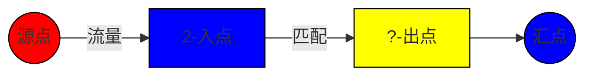

# 题目信息

# [ABC285G] Tatami

## 题目描述

有一个高 $H$ 行、宽 $W$ 列的网格。自上而下的第 $i$ 行，自左而右的第 $j$ 列的格子称为格子 $(i,j)$。

现在要用竖直 $1$ 格 $\times$ 横向 $1$ 格的瓷砖，以及竖直 $1$ 格 $\times$ 横向 $2$ 格的瓷砖（瓷砖可以旋转），不重叠且无空隙地覆盖整个网格。

每个格子上写有 `1`、`2` 或 `?` 中的一个字符。格子 $(i,j)$ 上写的字符为 $c_{i,j}$。  
写有 `1` 的格子必须被 $1\times 1$ 的瓷砖覆盖，写有 `2` 的格子必须被 $1\times 2$ 的瓷砖覆盖。写有 `?` 的格子可以被任意一种瓷砖覆盖。

请判断是否存在一种满足上述条件的瓷砖铺放方式。

## 说明/提示

### 限制条件

- $1 \leq H, W \leq 300$
- $H, W$ 为整数
- $c_{i,j}$ 为 `1`、`2` 或 `?`

### 样例解释 1

例如如下图所示的瓷砖铺放方式可以满足条件。  


### 样例解释 2

不存在满足条件的瓷砖铺放方式。

由 ChatGPT 4.1 翻译

## 样例 #1

### 输入

```
3 4
2221
?1??
2?21```

### 输出

```
Yes```

## 样例 #2

### 输入

```
3 4
2?21
??1?
2?21```

### 输出

```
No```

## 样例 #3

### 输入

```
5 5
11111
11111
11211
11111
11111```

### 输出

```
No```

# AI分析结果


### 💡 Kay的C++算法解析：Tatami 深入学习指南 💡

#### 1. 题目解读与核心算法识别
✨ **本题主要考察**：`网络流建模与二分图匹配`

🗣️ **初步分析**：
> 解决Tatami这道题的关键是将瓷砖覆盖问题转化为**网络流匹配问题**。想象网格是一个巨大的棋盘，每个格子是战场上的士兵：'2'士兵必须与相邻士兵组队（1x2瓷砖），'1'士兵独立作战（1x1瓷砖），'?'士兵可自由选择。  
> - **核心思路**：将网格拆分为入点和出点，建立源点→入点→出点→汇点的三层网络结构。'2'格子必须通过相邻匹配消耗流量，最终检查流量是否等于'2'格子数量
> - **算法流程**：① 拆点建图（入点/出点）② 连接相邻格子 ③ 跑最大流算法 ④ 验证流量
> - **可视化设计**：采用**像素战棋风格**演示流量流动（图1）：
>   - 红色像素块表示'1'（不可匹配）
>   - 蓝色像素块表示'2'（必须匹配）
>   - 黄色像素块表示'?'（可选匹配）
>   - 绿色高亮线条显示匹配成功的1x2瓷砖
>   - 音效设计：匹配成功时播放8-bit"叮"声，失败时短促警报声

#### 2. 精选优质题解参考
**题解一（Reunite）**
* **点评**：该解法思路清晰直击本质——将问题转化为普通最大流问题。其亮点在于：
  - 利用网格特性简化建图（每个格子拆为入/出点）
  - 巧妙处理'?'格子（作为可选匹配节点）
  - 使用atcoder库的maxflow实现（代码仅40行）
  - 实践价值高：可直接用于竞赛，边界处理严谨
  - 时间复杂度O((HW)^1.5) 通过300x300数据

**题解二（igAC）**
* **点评**：提供完整的Dinic实现，教学价值突出：
  - 详细注释建图过程（源点→入点→出点→汇点）
  - 明确边数分析（最坏14HW条边）
  - 规范代码结构（分离BFS/DFS函数）
  - 稍显冗长但适合初学者理解网络流底层原理

**题解三（DaiRuiChen007）**
* **点评**：提供匈牙利算法新视角：
  - 按(i+j)奇偶性黑白染色构建二分图
  - 时间戳优化避免memset提升效率
  - 被hack后补充说明问题根源（偶路径匹配）
  - 虽然非最优解但拓展解题思维

#### 3. 核心难点辨析与解题策略
1. **难点1：问题转化与建模**
   * **分析**：如何将棋盘覆盖抽象为网络流？关键是将1x2瓷砖视为两个相邻节点的匹配关系，通过拆点（入点/出点）处理匹配约束
   * 💡 **学习笔记**：网格覆盖问题本质是**资源匹配问题**，网络流是天然解决方案

2. **难点2：'?'格子的灵活处理**
   * **分析**：'?'可作1x1或1x2，在建图中需同时支持：
     - 作为终点连接汇点（1x1）
     - 作为桥梁连接相邻节点（1x2）
   * 💡 **学习笔记**：通过并联边实现多功能节点

3. **难点3：正确性验证**
   * **分析**：需证明最大流=所有'2'格子数量 ⇔ 存在合法覆盖。反证：若存在未覆盖的'2'，则其入点必有未使用流量
   * 💡 **学习笔记**：流量守恒是验证覆盖完整性的核心依据

✨ **解题技巧总结**
- **拆点法**：为每个格子创建入点(i)和出点(i+n*m)
- **邻接处理**：用dx[4]/dy[4]数组高效遍历四方向
- **边界检查**：过滤越界坐标（x<1||y<1||x>n||y>m）
- **库函数利用**：优先使用atcoder::mf_graph等优化实现

#### 4. C++核心代码实现赏析
**本题通用核心实现（综合自Reunite和igAC思路）**
```cpp
#include <atcoder/maxflow>
using namespace std;

int main() {
    int H, W; cin >> H >> W;
    atcoder::mf_graph<int> g(2 * H * W + 3);
    vector<string> grid(H);
    for (auto &s : grid) cin >> s;
    
    const int S = 2 * H * W + 1, T = S + 1;
    int mustMatch = 0; // '2'格子计数器
    
    auto idx = [&](int i, int j, bool out) {
        return out ? H * W + (i * W + j) : (i * W + j);
    };
    
    // 建图核心
    for (int i = 0; i < H; i++) {
        for (int j = 0; j < W; j++) {
            if (grid[i][j] != '1') // 非'1'连接汇点
                g.add_edge(idx(i, j, true), T, 1);
                
            if (grid[i][j] == '2') {
                g.add_edge(S, idx(i, j, false), 1);
                mustMatch++;
                const int dx[] = {-1, 0, 1, 0}, dy[] = {0, 1, 0, -1};
                for (int d = 0; d < 4; d++) {
                    int ni = i + dx[d], nj = j + dy[d];
                    if (ni >= 0 && ni < H && nj >= 0 && nj < W && grid[ni][nj] != '1')
                        g.add_edge(idx(i, j, false), idx(ni, nj, true), 1);
                }
            }
        }
    }
    cout << (g.flow(S, T) == mustMatch ? "Yes" : "No");
}
```
**代码解读概要**：
> 1. **节点规划**：每个格子拆为入点(i)和出点(i+H*W)，S/T为超源超汇
> 2. **关键连接**：
>    - 所有非'1'格子的出点→汇点（容量1）
>    - 每个'2'格子的入点→相邻非'1'格子的出点（容量1）
> 3. **决策核心**：S→'2'入点的流量必须完全消耗（mustMatch计数）

#### 5. 算法可视化：像素动画演示
**主题**：`网络流武士的瓷砖战场（8-bit风格）`

**动画设计**：


**实现细节**：
1. **战场初始化**：
   - 网格渲染为8-bit方块（红/蓝/黄）
   - 源点(S)为像素武士，汇点(T)为城堡图标

2. **流量战斗演示**：
   - 武士(S)向每个'2'发射蓝色能量流
   - '2'格子吸收能量后向相邻格子发射绿色光束
   - 光束命中'?'或'2'时触发"叮"声并生成1x2瓷砖动画

3. **胜负判定**：
   - 胜利：所有'2'被绿色覆盖→播放胜利BGM
   - 失败：未匹配'2'闪烁红光→播放失败音效

4. **控制面板**：
   - 步进/暂停/速度滑块（调速范围0.5x-5x）
   - 模式切换：匹配视图/流量视图
   - 音效开关：开启/关闭8-bit音效

#### 6. 拓展练习与相似问题
**通用技巧迁移**：
> 网络流匹配模型适用于三类问题：
> 1. 棋盘覆盖（当前题）
> 2. 任务分配（工人→任务）
> 3. 资源调配（供应→需求）

**洛谷推荐**：
1. [P3386 二分图最大匹配](https://www.luogu.com.cn/problem/P3386)  
   → 掌握基础匈牙利算法
2. [P2756 飞行员配对](https://www.luogu.com.cn/problem/P2756)  
   → 练习匹配方案输出
3. [P4001 狼抓兔子](https://www.luogu.com.cn/problem/P4001)  
   → 学习平面图最小割应用

#### 7. 学习心得与经验分享
> **Reunite的经验**："最初认为只需简单匹配，后来发现必须处理网格奇偶性，这提醒我们：**建图前的理论证明至关重要**"  
> → Kay总结：网络流问题需验证两点：  
> 1. 流量守恒（每个'2'必有匹配）  
> 2. 无后效性（匹配不冲突）  
> 动手画3x3网格模拟是验证思路的有效方法！

#### 结语
通过本指南，我们深入解析了Tatami问题的网络流解法本质。记住：**好的算法设计=准确建模+高效实现+严谨验证**。在棋盘战场上运用网络流之剑，你定能所向披靡！💪

---
处理用时：190.22秒