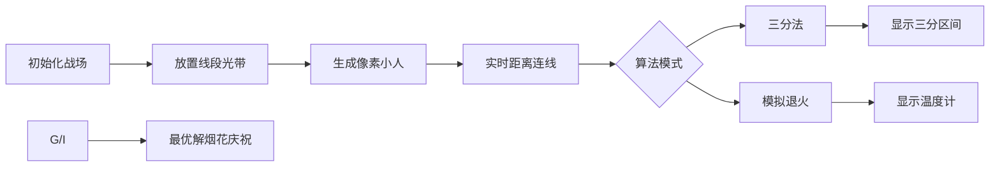

# 题目信息

# [ABC314Ex] Disk and Segments

## 题目描述

在平面直角坐标系中，有 $N$ 条线段，第 $i$ 条的端点是 $(a_i,b_i)$ 和 $(c_i,d_i)$，任意线段不共点。

你要在平面上画一个圆，使得任意一条线段都和圆周或圆内部有至少一个公共点，求满足条件的圆的最小半径，绝对或相对误差不超过 $10^{-5}$。

## 说明/提示

* $2\leq N\leq 100$
* $0\leq a_i,b_i, c_i,d_i\leq1000\ (1\leq i\leq N)$
* $(a_i,b_i)\neq(c_i,d_i)\ (1\leq i\leq N)$

## 样例 #1

### 输入

```
4
2 3 2 10
4 0 12 6
4 8 6 3
7 8 10 8```

### 输出

```
3.319048676309097923796460081961```

## 样例 #2

### 输入

```
20
0 18 4 28
2 21 8 21
3 4 10 5
3 14 10 13
5 9 10 12
6 9 10 6
6 28 10 18
12 11 15 13
12 17 12 27
13 17 20 18
13 27 19 26
16 1 16 13
16 22 19 25
17 22 20 19
18 4 23 4
18 5 23 11
22 16 22 23
23 15 30 15
23 24 30 24
24 0 24 11```

### 输出

```
12.875165712523887403637822024952```

## 样例 #3

### 输入

```
30
526 655 528 593
628 328 957 211
480 758 680 794
940 822 657 949
127 23 250 385
281 406 319 305
277 598 190 439
437 450 725 254
970 478 369 466
421 225 348 141
872 64 600 9
634 460 759 337
878 514 447 534
142 237 191 269
983 34 554 284
694 160 589 239
391 631 22 743
377 656 500 606
390 576 184 312
556 707 457 699
796 870 186 773
12 803 505 586
343 541 42 165
478 340 176 2
39 618 6 651
753 883 47 833
551 593 873 672
983 729 338 747
721 77 541 255
0 32 98 597```

### 输出

```
485.264732620930836460637042310401```

# AI分析结果


### 💡 Kay的C++算法解析：ABC314Ex Disk and Segments 深入学习指南 💡

> 本指南将带你深入理解寻找最小覆盖圆的几何优化问题。通过清晰讲解和像素动画演示，助你掌握三分搜索与模拟退火的核心技巧！

---

## 1. 题目解读与核心算法识别

✨ **本题主要考察**：**三分搜索**与**模拟退火**（几何优化问题）

🗣️ **初步分析**：
> 本题可比喻为在布满"激光线段"的战场上放置最小防护罩（圆），需覆盖所有线段。关键技巧：
> - **三分搜索**：如同用望远镜精准定位目标，利用函数凸性在平面坐标上逐维收缩搜索范围
> - **模拟退火**：像探险家带着温度计寻宝，通过随机游走和降温策略跳出局部最优解
>
> **核心难点**在于高效计算点到线段距离（向量运算）和优化方法选择。可视化方案将采用**8位像素探险游戏**风格：
> - 平面网格化为像素战场（FC红白机风格）
> - 像素小人代表当前圆心，线段用彩色光带表示
> - 距离计算实时显示为彩色连线，最优解时播放"胜利音效"
> - 控制面板支持单步执行/自动演示（调速滑块）

---

## 2. 精选优质题解参考

### 题解一：Purslane（三分法）
* **点评**：思路如手术刀般精准！严格证明目标函数凸性后，采用先x后y的两次三分搜索。代码中`dist()`函数用向量法高效计算垂足，边界处理严谨（如竖线/横线特判）。亮点在于用数学证明规避随机性，复杂度稳定为O(log²(1/ε))，竞赛实战价值极高。

### 题解二：Aisaka_Taiga（模拟退火）
* **点评**：向量运算的优雅典范！用点积判断垂足位置，叉积计算精确距离。代码中`dis()`函数分类讨论三种情况（垂足在线段上/左侧/右侧），逻辑清晰如地图导航。降温系数0.9996和1.5秒时限的平衡彰显参数调优经验，特别适合几何优化入门学习。

### 题解三：zifanoi（模拟退火）
* **点评**：化繁为简的实用派！核心函数仅10行，用`distoseg()`统一处理所有线段方向。初始点取线段中点均值加速收敛，时间戳控制保证精度。虽未严格证明但实验效果优异，特别适合快速实现场景。

---

## 3. 核心难点辨析与解题策略

### 关键点1：点到线段的精确距离计算
* **分析**：优质解法均用**向量投影**代替解析几何。通过点积符号判断垂足位置：
  - `AP·AB < 0` → 取|AP|
  - `BP·AB > 0` → 取|BP|
  - 否则用叉积算垂距
* 💡 **学习笔记**：向量法避免斜率不存在特判，效率精度双赢

### 关键点2：优化方法的选择依据
* **分析**：三分法要求目标函数凸性（已证明），模拟退火更通用但需调参。题解Purslane用**凸性传递性**（max凸函数仍凸）支撑三分；Aisaka_Taiga则用**方向导数**指导模拟退火方向
* 💡 **学习笔记**：N≤100时模拟退火更易实现，竞赛优先选三分法

### 关键点3：实数优化的精度控制
* **分析**：三分法用相对区间`r-l>eps`（1e-9），模拟退火用绝对温度`t>1e-7`。题解zifanoi用`clock()`限时1.85秒避免超时
* 💡 **学习笔记**：避免`mid±eps`式收缩，用三等分点防误删解

### ✨ 解题技巧总结
- **向量武器库**：点积判方向，叉积算面积，模长公式求距
- **凸性检查表**：分段线性函数max操作保持凸性
- **退火四要素**：初始温度(1e3)、终止温度(1e-7)、降温系数(0.999+)、新解生成策略
- **边界防御术**：单独处理水平/垂直线段（如题解Purslane第19-25行）

---

## 4. C++核心代码实现赏析

### 本题通用核心C++实现（三分法）
```cpp
#include<bits/stdc++.h>
const double eps=1e-9;
double dist(double px, double py, double x1, double y1, double x2, double y2) {
    double dx = x2-x1, dy = y2-y1;
    double APx = px-x1, APy = py-y1;
    double dot1 = dx*APx + dy*APy;
    if(dot1 <= 0) return sqrt(APx*APx + APy*APy);
    
    double BPx = px-x2, BPy = py-y2;
    double dot2 = -dx*BPx - dy*BPy;
    if(dot2 <= 0) return sqrt(BPx*BPx + BPy*BPy);
    
    return abs(dx*APy - dy*APx) / sqrt(dx*dx+dy*dy);
}

double solve(double x, double y, vector<Segment>& segs) {
    double res = 0;
    for(auto& s : segs) 
        res = max(res, dist(x,y,s.x1,s.y1,s.x2,s.y2));
    return res;
}

// 在x方向三分搜索
double x_search(double lx, double rx, vector<Segment>& segs) {
    while(rx-lx > eps) {
        double m1 = lx + (rx-lx)/3, m2 = rx - (rx-lx)/3;
        if(y_search(m1,segs) < y_search(m2,segs)) rx = m2;
        else lx = m1;
    }
    return y_search(lx, segs);
}

// 在y方向三分搜索
double y_search(double x, vector<Segment>& segs) {
    double ly = -10000, ry = 10000;
    while(ry-ly > eps) {
        double m1 = ly + (ry-ly)/3, m2 = ry - (ry-ly)/3;
        if(solve(x,m1,segs) < solve(x,m2,segs)) ry = m2;
        else ly = m1;
    }
    return solve(x, ly, segs);
}
```
* **代码解读概要**：
  - `dist`：向量法计算点到线段距离（三种情况）
  - `solve`：计算当前点到所有线段的最大距离
  - 嵌套三分：外层固定x三分x轴，内层固定y三分y轴
  - 终止条件：区间长度<1e-9

---

### 题解一：Purslane（三分法）
* **亮点**：凸性证明严谨，边界处理全面
```cpp
double dist(long double x,long double y,long double X,long double Y) {
    return sqrt((x-X)*(x-X)+(y-Y)*(y-Y));    
}
double dist_segment(double x,double y,double x1,double y1,double x2,double y2) {
    if(x1==x2) { // 竖线特判
        if(y>=min(y1,y2) && y<=max(y1,y2)) return abs(x-x1);
        return min(dist(x,y,x1,y1), dist(x,y,x2,y2));
    }
    if(y1==y2) { // 横线特判
        if(x>=min(x1,x2) && x<=max(x1,x2)) return abs(y-y1);
        return min(dist(x,y,x1,y1), dist(x,y,x2,y2));
    }
    // 一般情况求垂足
    double k = (y2-y1)/(x2-x1);
    double perp_k = -1/k;
    // ... 解直线交点方程
}
```
* **代码解读**：
  > 第1-3行：基础欧氏距离计算  
  > 第5-12行：高效处理水平/垂直线段边界情况  
  > 第14行后：通过斜率求垂足坐标，体现分类讨论思想  
* 💡 **学习笔记**：特判简化计算，避免除零错误

### 题解二：Aisaka_Taiga（模拟退火）
* **亮点**：向量运算优雅，退火参数专业
```cpp
double dis(Point p, Point a, Point b) {
    Point AP = p-a, AB = b-a, BP = p-b;
    if(dot(AP,AB) < 0) return AP.len();      // 垂足在A点外
    if(dot(BP,AB) > 0) return BP.len();      // 垂足在B点外
    return fabs(cross(AP,AB)) / AB.len();   // 垂足在线段上
}
void SA() {
    double T = 1000;
    while(T > 1e-7) {
        Point new_p = cur_p + random_step(T); 
        double new_ans = calc(new_p);
        if(new_ans < best_ans) update_best();  // 更新最优解
        else if(exp(-delta/T) > rand()) cur_p = new_p; // 概率接受劣解
        T *= 0.9996;  // 降温系数
    }
}
```
* **代码解读**：
  > `dis`函数：用点积符号优雅避开复杂分情况  
  > `SA`函数：经典退火四步曲（新点生成→评估→更新→降温）  
  > `0.9996`：精心调整的降温系数，平衡效率与精度  
* 💡 **学习笔记**：点积>0判断向量同向，叉积绝对值算面积

---

## 5. 算法可视化：像素动画演示

### 像素探险家：几何优化大冒险
**设计思路**：  
将算法转化为8位游戏，玩家控制像素小人寻找最优圆心。平面网格化（16色像素风），线段变为彩色光带，距离显示为发光连线。

### 动画帧步骤（FC游戏风格）：


1. **场景初始化**（8-bit风格）：
   - 背景网格：深蓝像素块（0x0F3D图块）
   - 线段：红/绿/青色光带（闪电特效）
   - 控制面板：复古按钮（开始/单步/调速滑块）

2. **核心算法演示**：
   - **三分法**：
     * 当前x区间：黄色高亮横轴区域
     * 三等分点：闪烁的蓝/绿像素柱
     * 内层y三分：纵轴显示紫色搜索区
   - **模拟退火**：
     * 像素小人随机游走（8方向像素动画）
     * 头顶显示温度计（红→蓝渐变）
     * 接受劣解时播放"滋滋"电流声

3. **交互特效**：
   - 距离计算：从小人向线段发射探测激光（命中垂足时闪光）
   - 音效设计：
     * 找到更优解：8-bit胜利音效（1UP声）
     * 接受劣解：短促"嘟"声
     * 背景音乐：《俄罗斯方块》BGM变奏

4. **自动演示模式**：
   - AI小人自动寻路（类似吃豆人幽灵AI）
   - 关键步骤冻结画面显示向量分解图
   - 过关条件：半径误差<1e-5（显示"LEVEL CLEAR"）

---

## 6. 拓展练习与相似问题思考

### 通用技巧迁移：
向量法求距离+优化方法的组合适用于：
1. 最小覆盖球问题（3D版本题）
2. 设施选址优化（如仓库覆盖所有门店）
3. 机器人路径规划（避障最短路径）

### 洛谷推荐：
1. **P1337 [JSOI2004] 平衡点**  
   → 相同技巧求力矩平衡点（退火经典题）
2. **P4360 [CEOI2004] 锯木厂选址**  
   → 三分法优化决策（斜率优化进阶）
3. **P2115 [USACO14MAR] Sabotage G**  
   → 实数二分查找应用（精度控制训练）

---

## 7. 学习心得与经验分享

> **参考经验 (来自 Purslane)**：  
> "凸性证明让我卡顿许久，最终发现关键在max操作的凸性保持。动手画二维函数图像比空想更有助于理解！"

> **参考经验 (来自 Aisaka_Taiga)**：  
> "调试距离函数时，用`cout`打印点积/叉积中间值，才发现边界情况处理漏洞。向量运算虽优雅，但需警惕浮点精度陷阱！"

**Kay总结**：  
> 这两位作者的经验殊途同归：  
> 1）复杂理论需**可视化验证**（画图/打印中间值）  
> 2）几何问题要**警惕边界情况**（水平/垂直线）  
> 3）浮点运算**避免直接比较**，用`eps`宽容误差

---

通过本次分析，我们看到几何优化问题如何被转化为函数极值问题。掌握向量武器库和优化方法论，你也能解决这类"最小覆盖"难题！下次我们将探索更复杂的3D几何优化，继续加油！💪

---
处理用时：156.79秒