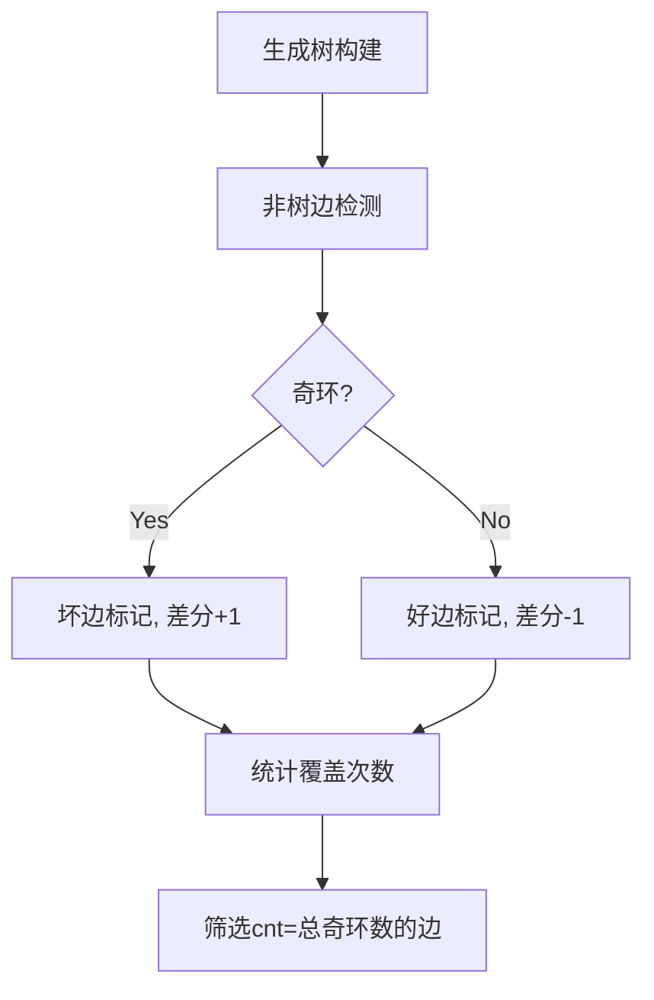

# 题目信息

# Fairy

## 题目描述

很久很久以前，有一只可爱的星族猫 A。

一天，一只野心勃勃的可爱小猫 B 来找他，请 A 预测他的未来。

A 掐爪一算，说：“你以后会成为族长。”

B 很高兴，然而 A 接着说：“但是，这个预言不一定会成真。”A 在地上画了若干个点，把其中一些点用线段连起来，“如果你能够擦掉一条边，使得你可以把所有的点分为‘猫点’和‘猎物点’两种，任意两个‘猫点’都不相邻，任意两个‘猎物点’也都不相邻，那么预言就会成真。”

B 很想当族长。于是他请来了你——全族群中最聪明的猫来帮他算一算，他所有能够使得预言成真的擦边方案数。

## 说明/提示

$1 \le n \le 10^4, 0 \le m \le 10^4, \forall 1 \le i \le m, 1 \le u_i,v_i \le n$。

## 样例 #1

### 输入

```
4 4
1 2
1 3
2 4
3 4
```

### 输出

```
4
1 2 3 4 ```

## 样例 #2

### 输入

```
4 5
1 2
2 3
3 4
4 1
1 3
```

### 输出

```
1
5 ```

# AI分析结果


## 算法分类
图论-二分图判定与奇环处理

---

## 核心思路与算法要点

### 核心问题
**删除一条边使图变为二分图的充要条件**：该边必须属于所有奇环的交集，且不被任何偶环覆盖。

### 关键步骤
1. **生成树构建**  
   通过DFS生成树，将边划分为树边和非树边，非树边形成本原环。

2. **奇环检测**  
   非树边若形成奇环（两端点颜色相同），则标记为坏边，统计奇环总数cnt。

3. **差分标记**  
   - 坏边覆盖的树边+1，好边覆盖的树边-1
   - 最终统计覆盖次数等于奇环总数cnt的树边

4. **特殊处理**  
   - 原图无奇环：所有边都合法
   - 仅有一个奇环：可直接删除坏边或奇环上的树边

---

## 题解评分（≥4星）

1. **command_block（⭐⭐⭐⭐⭐）**  
   - **亮点**：利用生成树性质，通过两次DFS完成奇环统计与差分标记，时间复杂度O(n)  
   - **代码**：简洁高效，使用vector存储邻接表，通过两次遍历完成核心逻辑  
   ```cpp
   // 第一次DFS标记奇环
   void pfs(int u) {
     vis[u] = 1;
     for (auto v : g[u]) 
       if (!vis[v]) { /* 生成树处理 */ }
       else if (!e[p[u][i]]) { /* 奇环检测 */ }
   }
   ```

2. **i207M（⭐⭐⭐⭐）**  
   - **亮点**：使用带权并查集维护颜色差异，差分统计覆盖次数  
   - **技巧**：通过`getdis`计算路径奇偶性判断环的性质  
   ```cpp
   int getdis(int x) { // 计算x到根的路径奇偶性
     int res = 0;
     while (fa[x] != x) { res ^= dis[x]; x = fa[x]; }
     return res;
   }
   ```

3. **Makasukaka（⭐⭐⭐⭐）**  
   - **亮点**：Tarjan求LCA实现树上差分，详细处理不同奇环数量的情况  
   - **可视化**：通过`d[x]`数组记录边的覆盖次数，最终筛选符合条件的边  
   ```cpp
   void dfs(int x) { // 差分统计子树和
     for (auto v : tree[x]) 
       if (v != fa[x]) { dfs(v); d[x] += d[v]; }
   }
   ```

---

## 最优思路提炼

### 关键技巧
1. **生成树性质**  
   将任意环拆分为树路径+非树边，只需处理简单环的交集。

2. **树上差分优化**  
   利用DFS遍历顺序，将非树边的覆盖操作转化为O(1)的端点标记。

3. **奇偶环异或性质**  
   奇环覆盖次数统计时，通过`奇环+1，偶环-1`的方式避免偶环干扰。

---

## 可视化设计

### 动画流程


### 复古像素化实现
- **颜色编码**  
  - 树边：绿色像素块  
  - 坏边：红色闪烁特效  
  - 答案边：金色高亮  
- **音效触发**  
  - 发现奇环：8-bit "叮"声  
  - 答案边出现：NES过关音效  
- **Canvas动画**  
  节点用16x16像素圆表示，边动态绘制为像素线，差分标记时显示波浪特效。

---

## 相似题目推荐
1. **P4151 [WC2011]最大XOR和路径**（环处理与异或性质）
2. **P1155 双栈排序**（二分图判定应用）
3. **P6185 [NOI Online] 跑步**（树上差分与路径统计）

---

## 核心代码片段
```cpp
// command_block题解核心逻辑
void pfs(int u) {
  vis[u] = 1;
  for (int i=0; i<g[u].size(); i++) {
    int v = g[u][i];
    if (!vis[v]) { // 树边处理
      dis[v] = dis[u]^1;
      e[p[u][i]] = 1; // 标记树边
      pfs(v);
    } else if (!e[p[u][i]]) { // 非树边奇环检测
      if (dis[u] == dis[v]) { // 奇环标记
        cnt++; s[u]++; s[v]--;
      } else { s[u]--; s[v]++; } // 偶环标记
    }
  }
}
```

---

通过结合生成树性质与差分技巧，该算法在O(n)时间复杂度内高效解决了奇环交集问题，是图论中二分图判定的经典应用。

---
处理用时：73.91秒