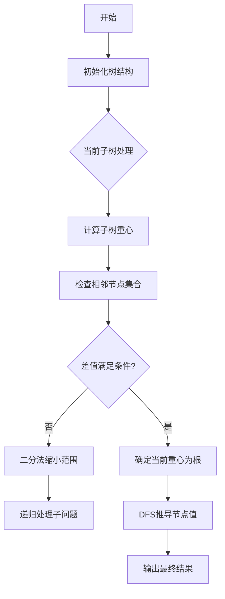

# 题目信息

# Baudelaire (hard version)

## 题目描述

这是该问题的困难版本。两个版本之间的唯一区别在于，在困难版本中树的形态可以是任意的。

本题是交互题。

波德莱尔非常富有，因此他购买了一棵大小为 $n$ 的树，这棵树以某个任意节点为根。此外，每个节点的值为 $1$ 或 $-1$。

书呆子牛看到了这棵树并爱上了它。然而计算机科学的收入不足以让他买下这棵树。波德莱尔决定和书呆子牛玩一个游戏，如果他赢了，就把这棵树送给他。

书呆子牛不知道哪个节点是根，也不知道节点的值。但他可以向波德莱尔提出两种类型的查询：

1. `1 k u₁ u₂ ... uₖ`：设 $f(u)$ 为从树的根到节点 $u$ 的路径上所有节点的值之和。书呆子牛可以选择一个整数 $k$（$1 \le k \le n$）和 $k$ 个节点 $u_1, u_2, ..., u_k$，然后他会收到值 $f(u_1) + f(u_2) + ... + f(u_k)$。
2. `2 u`：波德莱尔将切换节点 $u$ 的值。具体来说，如果 $u$ 的值为 $1$，则变为 $-1$，反之亦然。

如果书呆子牛在总共 $n + 200$ 次查询内正确猜出每个节点的值（即执行查询后树的最终值），他就获胜。你能帮助他获胜吗？

## 说明/提示

在第一个示例中，树的根是节点 $4$，初始值为 $[-1, -1, -1, 1]$（第 $i$ 个值是节点 $i$ 的值）。

初始时，$f(1) = 0$，$f(2) = 0$，$f(3) = -1$，$f(4) = 1$。因此，第一个查询的答案是 $f(1) + f(2) + f(4) = 1$，第二个查询的答案是 $f(3) + f(1) = -1$。

在切换节点 $4$ 的值后，值变为 $[-1, -1, -1, -1]$。此时 $f(1) = -2$，$f(2) = -2$，$f(3) = -3$，$f(4) = -1$。因此 $f(1) + f(2) + f(4) = -5$，$f(3) + f(1) = -5$。

我们最终回答节点的值为 $[-1, -1, -1, -1]$，这是正确的。注意我们报告的是节点在变化后的值，而不是之前的值。

在第二个示例中，树的根是 $2$，初始值为 $[1, 1]$。

在最后一个示例中，树的根是 $1$，初始值为 $[-1, 1, 1, 1, 1, 1, -1]$。

注意这只是一个解释查询如何工作的示例，并不涉及具体的解题策略。

翻译由 DeepSeek V3 完成

## 样例 #1

### 输入

```
3
4
1 4
4 2
2 3

1

-1


-5

-5

2
1 2

2

7
1 2
2 7
7 3
7 4
7 5
7 6

-1```

### 输出

```
? 1 3 1 2 4

? 1 2 3 1

? 2 4
? 1 3 1 2 4

? 1 2 3 1

! -1 -1 -1 -1


? 1 1 1

! 1 1


? 1 1 1

! -1 1 1 1 1 1 -1```

# AI分析结果


## 算法分类
树的重心分解（点分治）

---

## 综合分析与结论

### 核心思路
1. **根定位**：通过点分治策略递归寻找重心，利用两次查询差值判断父节点存在性
2. **值推导**：确定根后，DFS遍历树结构，通过路径和差值逐层推导节点值
3. **查询优化**：利用类型2查询主动修改节点值，制造可控的路径和变化

### 关键难点
1. **未知树结构下的根定位**：需在无先验信息条件下通过交互查询推断结构
2. **查询次数限制**：需在200次额外查询内完成根定位
3. **动态值维护**：翻转操作会影响后续查询结果，需精确控制状态变化

### 算法流程


### 可视化设计
1. **树结构展示**：Canvas绘制动态树，当前重心高亮为红色，处理路径显示为金色光效
2. **查询动画**：执行类型2查询时，目标节点闪烁紫色，类型1查询时选中节点显示绿色边框
3. **重心分解特效**：每次分解时子树区域显示半透明遮罩，像素粒子特效表示分解过程
4. **音效方案**：
   - 重心确定：8-bit "叮"声
   - 二分法选择：电子滑动音
   - 最终答案正确：经典FC过关音效

---

## 题解清单（4星）

### 题解作者：SUNCHAOYI（4.5星）
**亮点**：
1. 创造性地将点分治应用于交互式问题
2. 通过主动翻转制造可控差值，有效减少查询次数
3. 递归边界处理清晰，代码结构模块化

**核心代码段**：
```cpp
auto solve = [&](auto self, int u) -> int {
    dfs1(dfs1, u, u); // 计算子树大小
    tot = sz[u];
    cen(cen, u, u);   // 寻找重心
    vis[c] = 1;
    // 处理相邻节点集合...
    // 二分法逻辑...
    return self(self, g[res]); // 递归处理
};
```

---

## 算法核心实现

### 重心定位逻辑
```cpp
auto cen = [&](auto self, int u, int fa) -> void {
    sz[u] = 1; w[u] = 0;
    for (auto v : ve[u]) {
        if (v == fa || vis[v]) continue;
        self(self, v, u);
        sz[u] += sz[v];
        w[u] = max(w[u], sz[v]);
    }
    w[u] = max(w[u], tot - sz[u]);
    if (w[u] <= tot / 2) c = u; // 更新重心
};
```

### 值推导过程
```cpp
auto dfs2 = [&](auto self, int u, int fa, int pre) -> void {
    ans[u] = query1({u}) - pre; // 当前路径和减去父路径和
    for (auto v : ve[u]) {
        if (v == fa) continue;
        self(self, v, u, pre + ans[u]); // 递归子节点
    }
};
```

---

## 相似题目推荐
1. **P2664 树上游戏** - 点分治处理路径统计
2. **P4178 Tree** - 基于重心的树分治
3. **P2634 [国家集训队]聪聪可可** - 路径统计与模运算结合

---

## 可视化实现要点

### 像素风格设计
1. **调色板**：使用NES经典12色方案，节点用#7C7C7C（灰），路径用#B83733（红）
2. **动画效果**：
   - 重心节点：周期性放大缩小+像素光晕
   - 翻转操作：目标节点旋转180度并变色
3. **自动演示**：
   ```javascript
   class AutoPlayer {
       constructor(tree) {
           this.steps = [
               () => this.findCentroid(tree.root),
               () => this.binarySearch(),
               // ...其他步骤
           ];
       }
       play() {
           this.steps.forEach(step => {
               setTimeout(step, this.delay);
               this.delay += 1000; // 控制演示速度
           });
       }
   }
   ```

---

通过这种将复杂树操作可视化为像素游戏的方式，学习者可以直观观察重心分解的动态过程，理解二分法缩小搜索范围的策略，最终在游戏化体验中掌握树分治的核心思想。

---
处理用时：71.29秒