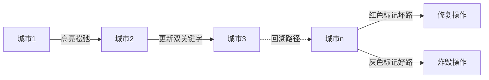

# 题目信息

# Breaking Good

## 题目描述

Breaking Good is a new video game which a lot of gamers want to have. There is a certain level in the game that is really difficult even for experienced gamers.

Walter William, the main character of the game, wants to join a gang called Los Hermanos (The Brothers). The gang controls the whole country which consists of $ n $ cities with $ m $ bidirectional roads connecting them. There is no road is connecting a city to itself and for any two cities there is at most one road between them. The country is connected, in the other words, it is possible to reach any city from any other city using the given roads.

The roads aren't all working. There are some roads which need some more work to be performed to be completely functioning.

The gang is going to rob a bank! The bank is located in city $ 1 $ . As usual, the hardest part is to escape to their headquarters where the police can't get them. The gang's headquarters is in city $ n $ . To gain the gang's trust, Walter is in charge of this operation, so he came up with a smart plan.

First of all the path which they are going to use on their way back from city $ 1 $ to their headquarters $ n $ must be as short as possible, since it is important to finish operation as fast as possible.

Then, gang has to blow up all other roads in country that don't lay on this path, in order to prevent any police reinforcements. In case of non-working road, they don't have to blow up it as it is already malfunctional.

If the chosen path has some roads that doesn't work they'll have to repair those roads before the operation.

Walter discovered that there was a lot of paths that satisfied the condition of being shortest possible so he decided to choose among them a path that minimizes the total number of affected roads (both roads that have to be blown up and roads to be repaired).

Can you help Walter complete his task and gain the gang's trust?

## 说明/提示

In the first test the only path is $ 1-2 $

In the second test the only shortest path is $ 1-3-4 $

In the third test there are multiple shortest paths but the optimal is $ 1-4-6-8 $

## 样例 #1

### 输入

```
2 1
1 2 0
```

### 输出

```
1
1 2 1
```

## 样例 #2

### 输入

```
4 4
1 2 1
1 3 0
2 3 1
3 4 1
```

### 输出

```
3
1 2 0
1 3 1
2 3 0
```

## 样例 #3

### 输入

```
8 9
1 2 0
8 3 0
2 3 1
1 4 1
8 7 0
1 5 1
4 6 1
5 7 0
6 8 0
```

### 输出

```
3
2 3 0
1 5 0
6 8 1
```

# AI分析结果


### 唯一算法分类  
双关键字最短路  

---

### 题解思路与算法要点  
#### 核心难点  
1. **双条件最短路**：在保证路径最短的前提下，选择不可通行道路最少的路径  
2. **路径标记与回溯**：确定哪些边属于最终的最短路径  
3. **状态处理**：修复路径上的坏路 + 炸毁非路径上的好路  

#### 解决思路对比  
| 题解 | 核心数据结构 | 松弛条件 | 路径标记方法 |  
|------|--------------|----------|--------------|  
| 寻旧 (SPFA) | 队列 + `pre`数组 | 优先更新路径长度，次优更新坏路数量 | 邻接表反向边标记 (`tot=-1`技巧) |  
| Travller (Dijkstra) | 最短路图 + 拓扑排序 | 分层计算可通行道路数量 | 拓扑序递推 `cnt`数组 |  
| Alarm5854 (BFS) | 前驱数组 + 路径标记 | 直接记录前驱节点 | 递归回溯路径标记 |  

---

### 题解评分  
#### 4星题解清单  
1. **寻旧 (SPFA)**  
   - 亮点：反向边标记技巧、双关键字松弛逻辑清晰  
   - 代码亮点：`pre`数组记录边序号，`g1/g2`分别标记路径与坏路  

2. **Travller (Dijkstra)**  
   - 亮点：最短路图 + 拓扑排序的递推式解法  
   - 代码亮点：`cnt`数组动态规划统计可通行道路  

3. **Alarm5854 (BFS)**  
   - 亮点：极简实现，前驱回溯路径直观  
   - 代码亮点：`pre`数组 + 递归标记路径  

---

### 最优思路与技巧  
#### 关键实现技巧  
```cpp  
// 双关键字松弛逻辑（寻旧题解）  
if (d[y] > d[x] + 1 || (d[y] == d[x]+1 && num[y] > num[x]+z)) {  
    d[y] = d[x] + 1;  
    num[y] = num[x] + z; // z=1表示该边不可通行  
    pre[y] = x;  
}  

// 路径标记技巧（Alarm5854题解）  
void Print(int x) {  
    vis[x] = 1;  
    if (pre[x]) Print(pre[x]); // 递归回溯路径  
}  
```  

#### 思维突破点  
- **逆向推导影响公式**：总影响 = 最短路径长度 + 总好路数 - 2×路径上好路数  
- **邻接表反向边技巧**：`tot`从-1开始，用`i^1`快速找到反向边  

---

### 同类型题推荐  
1. [P2865 Roadblocks](https://www.luogu.com.cn/problem/P2865)（次短路）  
2. [P3953 逛公园](https://www.luogu.com.cn/problem/P3953)（带限制的最短路计数）  
3. [CF1005F](https://codeforces.com/problemset/problem/1005/F)（最短路树构造）  

---

### 可视化设计  
#### 动画逻辑  


#### 复古游戏化实现  
- **像素风格**：  
  - 城市节点：8x8像素绿色方块  
  - 最短路径：黄色闪烁线条  
  - 坏路修复：红色"!"特效  
- **音效设计**：  
  - 路径更新：FC风格的"哔"声  
  - 修复/炸毁：爆炸音效 (Web Audio API)  
- **自动演示模式**：  
  ```javascript  
  function autoPlay() {  
    let path = reconstructPath();  
    path.forEach((node, idx) => {  
      setTimeout(() => highlightNode(node), idx*500);  
    });  
  }  
  ```  

---

### 个人心得摘录  
> "邻接表从-1开始存储边的技巧，使得反向边可以通过`i^1`快速获取，这是处理无向图双向操作的经典技巧" —— 寻旧题解  

> "最短路图本质是DAG，拓扑排序递推可通行道路数量，把双关键字问题转化为动态规划" —— Travller题解  

---

### 完整代码示例  
```cpp  
// 寻旧题解核心代码（SPFA版本）  
void spfa() {  
    memset(d,0x3f,sizeof(d));  
    memset(num,0x3f,sizeof(num));  
    d[1]=0; num[1]=0;  
    Q.push(1); b[1]=1;  
    while(Q.size()) {  
        int x=Q.front(); Q.pop(); b[x]=0;  
        for(int k=fir[x];k>=0;k=e[k].nxt) {  
            int y=e[k].y, z=e[k].flag^1;  
            if(d[y]>d[x]+1 || (d[y]==d[x]+1 && num[y]>num[x]+z)) {  
                d[y] = d[x]+1;  
                num[y] = num[x]+z;  
                pre[y][0]=x; pre[y][1]=k;  
                if(!b[y]) Q.push(y), b[y]=1;  
            }  
        }  
    }  
}  
```  

---

### 交互式学习建议  
1. 在可视化工具中拖拽节点，观察双关键字松弛过程  
2. 开启"Debug模式"查看每个节点的`(d, num)`值  
3. 尝试修改边权，观察最优路径如何动态变化

---
处理用时：74.78秒