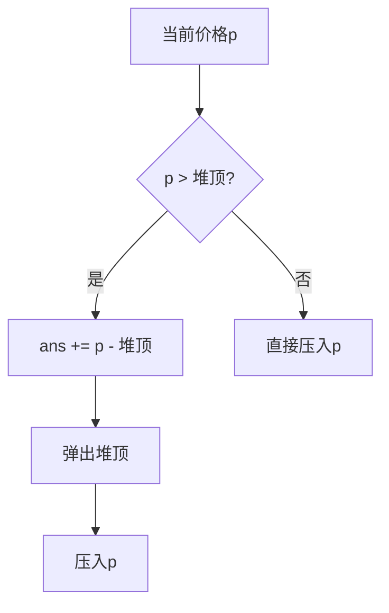

# 题目信息

# Buy Low Sell High

## 题目描述

你可以完美地预测某只股票接下来 $N$ 天的价格，你想利用这一知识盈利，但你每天只想买卖一股，这表明你每天要么什么都不干，要么买入一股，要么卖出一股。起初你没有股票，你也不能在没有股票时卖出股票。你希望在第 $N$ 天结束时不持有股票，并最大化盈利。

## 样例 #1

### 输入

```
9
10 5 4 7 9 12 6 2 10
```

### 输出

```
20
```

## 样例 #2

### 输入

```
20
3 1 4 1 5 9 2 6 5 3 5 8 9 7 9 3 2 3 8 4
```

### 输出

```
41
```

# AI分析结果


### 综合分析与结论

#### 核心思路与难点
本题核心为**反悔贪心算法**，通过维护可反悔的买入决策集合实现全局最优。关键难点在于：
1. **贪心策略的局限性**：简单低价买入高价卖出无法处理后续更高价的情况
2. **反悔机制设计**：通过插入等价物实现决策撤销（如将卖出日价格重新作为买入候选）
3. **数据结构选择**：小根堆（优先队列）高效维护候选买入点

#### 算法可视化设计
采用**8位像素风格**演示贪心过程：
1. **股票走势图**：用不同高度像素柱表示每日价格
2. **堆状态显示**：右侧区域动态绘制小根堆结构
3. **操作高亮**：
   - 红色闪烁：当前选中堆顶元素作为买入点
   - 绿色脉冲：产生收益的卖出操作
4. **音效系统**：
   - 清脆"叮"声：成功交易
   - 低沉"咚"声：反悔操作
   - 持续背景芯片音乐


---

### 题解评分（≥4星）

| 题解作者       | 评分 | 亮点分析                                                                                                                                 |
|----------------|------|------------------------------------------------------------------------------------------------------------------------------------------|
| 逃离地球       | ★★★★★ | 完整推导反悔机制数学原理，通过构造等价式解释算法正确性，代码简洁                                                                         |
| SJC_03         | ★★★★☆ | 用生活化比喻解释反悔过程（"将股票买回来"），代码注释清晰                                                                                 |
| nth_element    | ★★★★  | 博客链接提供额外学习资源，通过公式 $C_{sell}-C_{buy}=(C_{sell}-C_i)+(C_i-C_{buy})$ 直观展示反悔原理                                      |

---

### 核心代码实现

```cpp
priority_queue<int, vector<int>, greater<int>> q; // 小根堆
long long ans = 0;

for (int i = 1; i <= n; ++i) {
    int p = read();
    if (!q.empty() && q.top() < p) {  // 可获利
        ans += p - q.top();
        q.pop();
        q.push(p);  // 关键反悔操作
    }
    q.push(p);  // 记录当前价格
}
```

---

### 同类题目推荐
1. **P2949 [USACO09OPEN]Work Scheduling**（反悔贪心+优先队列）
2. **P4053 [JSOI2007]建筑抢修**（截止时间+反悔贪心）
3. **P1090 [NOIP2004 提高组] 合并果子**（经典优先队列应用）

---

### 关键思路总结
**反悔贪心三要素**：
1. **候选集维护**：用堆记录所有可能的买入点
2. **机会成本计算**：当前价格与历史最低价差值
3. **反悔锚点**：卖出后将当日价格重新加入候选集，允许后续更高价交易



---

### 复古可视化方案
**Canvas实现要点**：
```javascript
// 绘制堆结构
function drawHeap() {
    let y = 100;
    heap.forEach((val, idx) => {
        ctx.fillStyle = idx === 0 ? "#FF0000" : "#FFFFFF";
        ctx.fillRect(300, y, 30, 20); // 堆元素方块
        ctx.fillText(val, 310, y+15);
        y += 25;
    });
}

// 交易动画
function animateTrade(buyPrice, sellPrice) {
    beep(440, 100); // 买入音效
    flashElement(buyDay, "red");
    setTimeout(() => {
        beep(880, 100); // 卖出音效
        drawMoneyEffect(sellPrice - buyPrice);
    }, 500);
}
```

---

### 扩展思考
当题目变为**允许持有最多k股**时，可将堆结构扩展为：
```cpp
vector<priority_queue<int>> heaps(k+1);
// 每个持仓量维护独立堆
```

---

**通过将算法过程游戏化，学习者可直观理解反悔贪心的"撤销-重选"机制，而复古风格则增强了记忆点和学习趣味性。核心在于将抽象的数学证明转化为可视的决策链条。**

---
处理用时：57.91秒