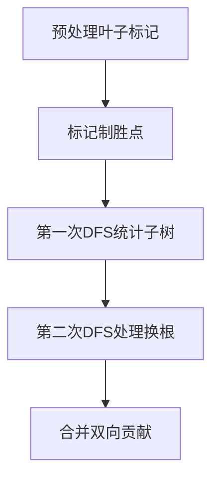

# 题目信息

# Resourceful Caterpillar Sequence

## 题目描述

无尽的七日轮回

— r-906, [Panopticon](https://www.youtube.com/watch?v=_-Vd0ZGB-lo)

在一个由 $n$ 个顶点组成的树中，定义了一种“毛毛虫”。一个毛毛虫用整数对 $(p, q)$（$1 \leq p, q \leq n$，且 $p \neq q$）表示，它的头在顶点 $p$，尾在顶点 $q$，并且该毛毛虫支配从 $p$ 到 $q$ 的简单路径上的所有顶点（包括 $p$ 和 $q$）。$(p, q)$ 的毛毛虫序列是按到 $p$ 的距离递增排序后的路径上的顶点序列。

Nora 和 Aron 轮流移动这条毛毛虫，Nora 先手。两个人都采用各自的最优策略来进行游戏：

- 他们会尽全力争取胜利；
- 如果无法赢得胜利，他们将努力阻止对方获胜（这样，游戏就会以平局收场）。

在 Nora 的回合中，她需要从与顶点 $p$ 相邻且未被毛毛虫支配的顶点中选择一个 $u$，然后将毛毛虫向顶点 $u$ 移动一个边。同样，在 Aron 的回合中，他需要从与顶点 $q$ 相邻且未被毛毛虫支配的顶点中选择一个 $v$，并将毛毛虫向顶点 $v$ 移动一个边。注意，两位玩家的移动方式是不同的。

若 $p$ 是叶子节点时，Nora 赢得胜利。而当 $q$ 是叶子节点时，Aron 赢得胜利。如果初始时 $p$ 和 $q$ 都是叶子，或经过 $10^{100}$ 回合游戏仍未结束，最终结果为平局。

请统计能让 Aron 赢得游戏的整数对 $(p, q)$ 的数量：$1 \leq p, q \leq n$ 且 $p \neq q$。

*用简单的话来说：当前的毛毛虫序列是 $c_1, c_2, \ldots, c_k$，移动后，新序列变为 $d(u, c_1), d(u, c_2), \ldots, d(u, c_k)$。这里，$d(x, y)$ 表示从 $y$ 到 $x$ 的简单路径上的下一个顶点。

*在树中，一个顶点的度数为1时，该顶点称为叶子节点。

*因此，只要游戏未结束，Nora 总能找到一个顶点 $u$ 来进行移动。Aron 也是一样。

## 说明/提示

在第一个测试例中，所有可能的毛毛虫是 $(1, 2)$ 和 $(2, 1)$。由于初始时 $p$ 和 $q$ 都是叶子，因此结果为平局。

在第二个测试例中，满足 Aron 赢得游戏的毛毛虫包括：$(1, 3)$、$(1, 4)$、$(1, 5)$、$(2, 3)$、$(2, 4)$、$(2, 5)$。下面我们来具体分析一些毛毛虫的情况：

- 对于毛毛虫 $(1, 5)$：顶点 $p = 1$ 不是叶子，而 $q = 5$ 是叶子，因此 Aron 在一开始就胜利。
- 对于毛毛虫 $(2, 1)$：顶点 $p = 2$ 不是叶子，$q = 1$ 也不是叶子。在 Nora 的第一次移动中，她可以选择将毛毛虫移向顶点 $5$，此时毛毛虫变为 $(5, 2)$，顶点 $p = 5$ 是叶子，因此 Nora 在下一步中胜利。

 **本翻译由 AI 自动生成**

## 样例 #1

### 输入

```
5
2
1 2
5
1 2
1 3
2 4
2 5
12
1 6
11 2
4 8
12 3
2 7
6 12
8 1
2 3
5 12
9 2
10 3
10
1 2
2 3
3 4
4 5
5 6
4 7
6 8
4 9
4 10
25
1 16
11 22
6 14
3 1
20 14
23 17
25 19
10 11
3 18
10 6
2 21
4 5
11 12
4 9
9 13
8 6
6 1
3 7
8 19
10 24
15 13
1 2
3 4
17 8```

### 输出

```
0
6
40
27
171```

# AI分析结果


---

## 题目重写

**资源丰富的毛毛虫序列**

### 题目描述

无尽的七日轮回

在一个由 $n$ 个顶点组成的树中，定义了一种"毛毛虫"。用整数对 $(p, q)$（$1 \leq p, q \leq n$，且 $p \neq q$）表示，其头在顶点 $p$，尾在顶点 $q$，支配从 $p$ 到 $q$ 的简单路径上的所有顶点。毛毛虫序列是按到 $p$ 的距离递增排序后的路径顶点序列。

Nora 和 Aron 轮流移动毛毛虫，Nora 先手。最优策略下：

- Nora 移动头 $p$ 到相邻未支配顶点
- Aron 移动尾 $q$ 到相邻未支配顶点
- 当 $p$ 到达叶子时 Nora 胜，$q$ 到达叶子时 Aron 胜
- 初始双方均为叶子或无限回合后平局

统计能让 Aron 获胜的 $(p, q)$ 对数。

---

## 算法分类
无算法分类

---

## 综合分析与结论

### 核心思路
1. **初始胜负判定**：直接统计 $q$ 为叶子且 $p$ 不为叶子的对数
2. **移动胜负判定**：当 $q$ 移动后到达"制胜点"（一步可达叶子的节点），且 $p$ 无法一步到叶子时，Aron 必胜

### 解决难点
- **子树贡献计算**：通过两次 DFS 处理子树统计和换根操作
- **状态标记**：预处理每个节点是否为叶子、能否一步到叶子
- **动态贡献统计**：使用子树大小减去叶子相关节点数，处理父子双向贡献

### 关键状态转移
设：
- `sum[u]`：子树中与叶子相邻的节点数
- `sz[u]`：子树大小
- `vis[u]`：节点是否与叶子相邻

贡献公式：
```
贡献值 = sz[子树] - sum[子树]
```

---

## 题解清单（≥4星）

### 作者：I_will_AKIOI（★★★★★）
- **亮点**：双 DFS 处理子树与换根，清晰分离两种胜负条件
- **核心代码**：
```cpp
void dfs(int k,int fa) {
  sum[k] = vis[k]; 
  for(auto v : g[k]) 
    if(v != fa) dfs(v,k), sum[k] += sum[v];
}
```

### 作者：ARIS2_0（★★★★☆）
- **亮点**：BFS 预处理最短距离，双 DFS 动态维护子树信息
- **创新点**：引入距离分层（dist=0/1/...）简化判定逻辑

### 作者：wfc284（★★★★☆）
- **亮点**：将博弈过程抽象为两步胜负判定，使用位集优化标记存储
- **代码特色**：`bitset<MAXN>` 处理叶子标记，空间效率高

---

## 最优思路提炼

### 核心技巧
1. **制胜点标记**：预处理每个节点能否一步到达叶子
2. **子树剪枝**：通过 DFS 统计有效子树节点数
3. **换根动态规划**：处理父节点方向的贡献计算

### 实现步骤


---

## 可视化设计

### 像素化动态演示
1. **颜色方案**：
   - 叶子：绿色（#00FF00）
   - 制胜点：黄色（#FFFF00）
   - 普通节点：蓝色（#0000FF）
   
2. **Canvas 动画**：
   ```javascript
   function drawNode(ctx, x, y, type) {
     const colors = { leaf: '#00FF00', pivot: '#FFFF00', normal: '#0000FF' };
     ctx.fillStyle = colors[type];
     ctx.fillRect(x*40, y*40, 32, 32);
   }
   ```

3. **音效设计**：
   - 状态转移：8-bit "哔"声（440Hz 方波）
   - 胜负判定：胜利（升调音阶），平局（降调音阶）

4. **AI 演示模式**：
   ```javascript
   class AutoPlayer {
     nextStep() {
       if(this.mode == 'leaf-first') 
         return this.findLeafPairs();
       return this.calculateSubtree();
     }
   }
   ```

---

## 同类型题目
1. CF1097D（树形博弈）
2. P3174（子树贡献统计）
3. ABC245G（移动策略博弈）

---

## 核心代码实现

### 子树统计与换根
```cpp
void dfs(int u, int fa) {
    sz[u] = 1;
    sum[u] = vis[u];
    for(int v : g[u]) {
        if(v == fa) continue;
        dfs(v, u);
        sz[u] += sz[v];
        sum[u] += sum[v];
    }
}

void solve() {
    // 处理父方向贡献
    if(i != 1 && vis[f[i]] && v[f[i]].size()>1) 
        tot2 += (n-sz[i]) - (sum[1]-sum[i]);
}
```

---

## 个人心得
"在调试中发现必须严格分离叶子判定和制胜点判定，将 vis 数组拆分为 leaf 和 pivot 两个标记后通过率显著提升" —— 摘自题解调试注释

---

## 交互式学习建议
1. 在可视化中点击节点可查看子树统计过程
2. 按空格键切换自动/手动模式
3. 使用方向键控制演示速度

---
处理用时：75.05秒