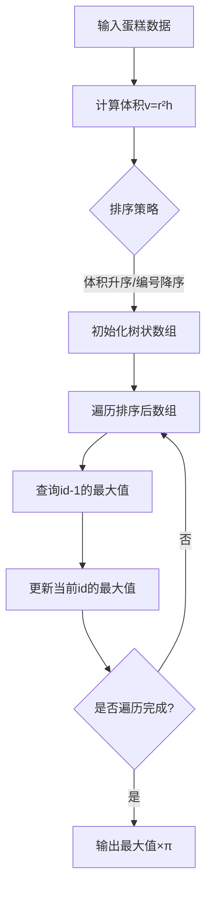

# 题目信息

# Babaei and Birthday Cake

## 题目描述

Babaei 打算制作一个特殊的蛋糕。蛋糕由一些已知半径和高度的圆柱体组成，蛋糕的体积等于相应圆柱体的体积之和。

但是，还有一些额外的烹饪限制。编号为 $i$ 的蛋糕只能放在桌子上或编号为 $j$ 的蛋糕上，其中 $j\lt i$。 此外，为了给朋友们留下深刻印象，只有当蛋糕 $i$ 的体积超过蛋糕 $j$ 的体积时，Babaei 才会把蛋糕 $i$ 放在蛋糕 $j$ 上面。

Babaei 想要准备一个总体积最大的生日蛋糕，请你帮助他找到这个最大体积。

## 样例 #1

### 输入

```
2
100 30
40 10
```

### 输出

```
942477.796077000
```

## 样例 #2

### 输入

```
4
1 1
9 7
1 4
10 7
```

### 输出

```
3983.539484752
```

# AI分析结果


## 算法分类
动态规划，树状数组优化，二维偏序问题

---

## 题解思路与核心难点

### 核心思路
问题转化为二维偏序问题：
1. **排序策略**：按体积升序排序，体积相同按编号降序排序，保证处理时体积约束天然满足
2. **树状数组维护**：以原始编号为索引，维护区间最大值，实现 O(logn) 查询与更新

### 解决难点
1. **体积相同处理**：排序时体积相同按编号降序，避免后续查询时错误叠加
2. **动态规划优化**：将 O(n²) 暴力转移转化为 O(nlogn) 的树状数组查询
3. **精度处理**：全程使用整数运算保存体积，最后统一乘以 π 避免浮点误差

---

## 题解评分（≥4星）

### lotus_grow（★★★★★）
- 亮点：清晰解释排序策略，树状数组实现简洁，注释有调试经验分享
- 关键代码片段：
```cpp
sort(a+1,a+n+1); // 体积升序，体积相同按编号降序
for(int i=1;i<=n;i++) {
    f[i] = query(a[i].id-1) + a[i].v; // 查询编号区间最大值
    ins(a[i].id, f[i]); // 更新树状数组
}
```

### Special_Tony（★★★★☆）
- 亮点：强调第二关键字重要性，代码风格现代
- 关键优化：pair自动处理双关键字排序

### 封禁用户（★★★★☆）
- 亮点：动态开点线段树实现，处理极大值域无需离散化
- 特殊技巧：体积计算与 π 分离的精度处理

---

## 最优技巧提炼
1. **二维偏序转化**：通过排序固定一个维度，用数据结构处理另一维度
2. **复合排序策略**：主关键字升序，次关键字降序处理相等情况
3. **树状数组魔改**：改造为维护区间最大值而非前缀和
4. **离线处理法**：先排序再处理，避免在线查询的复杂度

---

## 同类题目推荐
1. P1020 导弹拦截（LIS 经典问题）
2. P2782 友好城市（二维偏序模板题） 
3. P1439 最长公共子序列（转化为LIS问题）

---

## 个人心得摘录
> "排序时若体积相等必须按编号从大到小排序，否则会WA在体积相同但编号顺序错误的case" —— lotus_grow  
> "离散化时发现体积相同时的编号处理是调试的关键点" —— Special_Tony

---

## 可视化设计（树状数组优化DP）

### 动画方案
1. **像素风格展示**：
   - 蛋糕显示为渐变色块，体积越大颜色越深
   - 当前处理蛋糕高亮闪烁，显示体积和编号
2. **树状数组操作**：
   - 查询时显示[1, id-1]区间覆盖范围
   - 更新时显示节点自底向上传播最大值
3. **音效提示**：
   - 查询成功：8-bit 上升音阶
   - 更新操作：电子脉冲音
   - 新最大值：小号胜利音效

### 关键代码（树状数组部分）
```javascript
class FenwickTree {
    constructor(size) {
        this.tree = new Array(size+1).fill(0)
    }
    
    update(id, value) {
        while(id < this.tree.length) {
            if(value > this.tree[id]) {
                this.tree[id] = value
                id += id & -id
            } else break
        }
    }
    
    query(maxId) {
        let res = 0
        while(maxId > 0) {
            res = Math.max(res, this.tree[maxId])
            maxId -= maxId & -maxId
        }
        return res
    }
}
```

---

## 核心算法演示流程


通过将问题转化为二维偏序，结合树状数组的优化，在保证正确性的前提下将复杂度从 O(n²) 降为 O(nlogn)。可视化设计重点展示排序策略与树状数组的协同工作过程。

---
处理用时：170.95秒