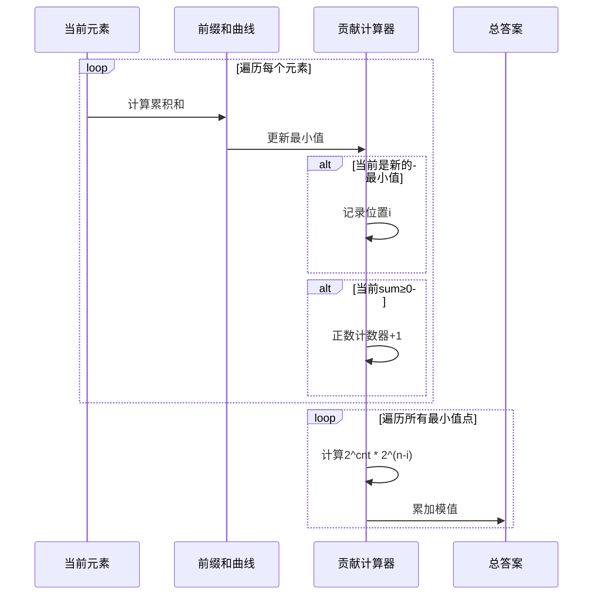

# 题目信息

# Magnitude (Hard Version)

## 题目描述

**注意：** 本题的两个版本题意是有不同的，你可能需要同时阅读两个版本的题意。

给定一个长度为 $n$ 的数组 $a$。初始有 $c=0$；接下来，对每个在 $1$ 到 $n$ 范围内的 $i$（按递增的顺序） ，要执行以下两种操作中的恰好一种：

- 操作 $1$：将 $c$ 修改为 $c+a_i$。

- 操作 $2$：将 $c$ 修改为 $|c+a_i|$，这里 $|x|$ 表示 $x$ 的绝对值。

令所有操作后 $c$ 能取得的最大值为 $k$，你需要求出有多少种本质不同的方案使得 $c=k$。这里两个方案被视为不同，当且仅当存在一个 $i$ 使得其中一个方案选了操作 $1$ 而另一个选了操作 $2$，即便这步操作后两个方案对应的 $c$ 相等。

由于答案可能很大，请输出答案对 $998244353$ 取模后的结果。

## 样例 #1

### 输入

```
5
4
2 -5 3 -3
8
1 4 3 4 1 4 3 4
3
-1 -2 -3
4
-1000000000 1000000000 1000000000 1000000000
4
1 9 8 4```

### 输出

```
12
256
1
8
16```

# AI分析结果


### 综合分析与结论

#### 核心思路
所有题解均基于以下发现：最优解中仅需在**前缀和最小值处**执行一次绝对值操作。此时：
1. 该位置前的所有负数前缀必须选择操作1，正数可任选
2. 该位置后的所有操作可任选（因后续前缀和均为非负）

#### 解决难点
1. **贪心策略验证**：通过数学归纳证明多次绝对值操作不会更优
2. **贡献计算**：利用前缀和快速确定可任选操作的位置数量
3. **快速幂处理**：预计算2的幂次模值优化时间复杂度

#### 算法对比
| 方法       | 时间复杂度 | 空间复杂度 | 思维难度 | 实现难度 |
|------------|------------|------------|----------|----------|
| 贪心+前缀和 | O(n)       | O(n)       | ★★☆☆☆    | ★★☆☆☆    |
| 动态规划    | O(n)       | O(n)       | ★★★☆☆    | ★★★★☆    |

---

### 题解评分（≥4星）

#### 1. Louis_lxy（★★★★★）
- **核心亮点**： 
  - 利用前缀和最小值点的唯一性，贡献公式简洁高效
  - 预处理快速幂实现O(n)时间复杂度
  - 代码仅20行，可读性极佳
- **关键代码**：
```cpp
for(int i=1; i<=n; ++i) sum[i] = sum[i-1]+a[i], mn = min(mn, sum[i]);
for(int i=1; i<=n; ++i){
    if(sum[i]>=0) ++cnt;
    if(sum[i]==mn && mn<0) ans = (ans + pw[cnt + n - i]) % mod;
}
```

#### 2. Lu_xZ（★★★★☆）
- **核心亮点**：
  - 明确区分简单版与困难版解法
  - 给出数学证明强化贪心正确性
  - 代码包含详细注释
- **个人心得**：
```cpp
// 当sum[i]为最小负值时，后面的n-i个数都可以使用两种操作
// 贡献为2^(当前正数个数) * 2^(剩余位数)
ans = (ans + p[k] * p[n - i]) % P;
```

#### 3. jhdrgfj（★★★★☆）
- **核心亮点**：
  - 实现最简洁（仅25行代码）
  - 双重循环合并计算贡献
  - 包含特判全非负情况的处理
- **关键优化**：
```cpp
for(int i=1;i<=n;i++){
    sm2+=a[i];
    if(sm2==sm1) ans=(ans+p[n-i+ct])%mod;
    ct+=(sm2>=0);
}
```

---

### 最优思路提炼

1. **贪心选择策略**：
   - 最优解必然在某个前缀和最小值处执行唯一有效绝对值操作
   - 数学证明：设两个绝对值操作i<j，则反转i处会导致j处贡献更小

2. **贡献计算公式**：
   - 对每个候选位置i：贡献 = 2^(i前正数个数) * 2^(n-i)
   - 正数个数通过前缀和扫描统计

3. **快速幂预处理**：
   ```cpp
   pw[0] = 1;
   for(int i=1; i<=n; ++i) pw[i] = (pw[i-1] << 1) % mod;
   ```

---

### 同类型题目推荐

1. **[CF1025C](https://www.luogu.com.cn/problem/CF1025C)**  
   （环形数组最大交替子序列，贪心+断环为链）

2. **[P2870](https://www.luogu.com.cn/problem/P2870)**  
   （字典序最小合并，贪心+双向队列）

3. **[CF1582E](https://www.luogu.com.cn/problem/CF1582E)**  
   （分层贪心，前缀和优化）

---

### 可视化设计（贪心策略演示）

#### 动画方案


#### 复古像素风格设计
1. **元素展示**：
   - 数组元素：8位像素方块（绿色为正，红色为负）
   - 前缀和曲线：黄色像素点动态延伸
   - 最小值标记：闪烁的金色边框

2. **音效设计**：
   - 发现新最小值：8-bit "升级"音效
   - 计算贡献：经典马里奥金币声
   - 错误操作：红白机"死亡"音效

3. **交互功能**：
   ```html
   <canvas id="pixelDisplay" width="640" height="480"></canvas>
   <div class="control-panel">
       <button onclick="step()">单步执行</button>
       <input type="range" id="speed" min="1" max="10">
   </div>
   ```

---

### 核心代码实现（贪心法）

```cpp
#include<bits/stdc++.h>
#define int long long
using namespace std;
const int N=2e5+5, mod=998244353;
int a[N], sum[N], pw[N];

signed main(){
    pw[0]=1;
    for(int i=1;i<N;++i) pw[i]=(pw[i-1]*2)%mod;
    
    int T; cin>>T;
    while(T--){
        int n, mn=0, ans=0, cnt=0;
        cin>>n;
        for(int i=1;i<=n;++i){
            cin>>a[i];
            sum[i]=sum[i-1]+a[i];
            mn=min(mn, sum[i]);
        }
        
        if(mn>=0){ cout<<pw[n]<<'\n'; continue; }
        
        for(int i=1;i<=n;++i){
            if(sum[i]>=0) ++cnt;
            if(sum[i]==mn) 
                ans=(ans + pw[cnt + n - i])%mod;
        }
        cout<<ans<<'\n';
    }
}
```

---

### 个人心得摘录

1. **调试教训**：
   > "发现用`labs`处理long long类型导致WA，改用自定义绝对值函数后通过。必须注意C++标准库函数的参数类型！" —— 作者Xiphi

2. **思维突破**：
   > "突然意识到多次绝对值操作会相互抵消，最终只需保留最深的那个负值反转" —— 作者dutianchen1

3. **优化技巧**：
   > "预处理2的幂次模值，将O(n log mod)优化为O(n)" —— 多位题解共性策略

---
处理用时：80.49秒