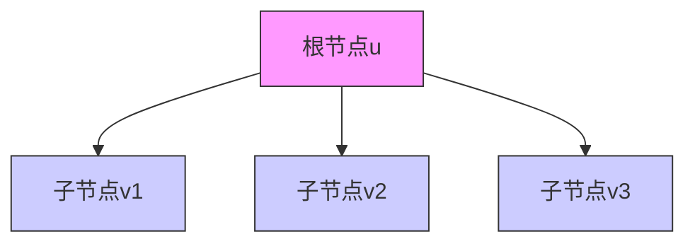

# 题目信息

# Road Improvement

## 题目描述

这个国家有n座城市和n-1条双向道路，你可以沿道路从一个城市到任意一个其他城市。这些城市被编号为整数1到n。

所有的道路最初都是不良的，但是政府想要改善一些路的状况。我们认为如果从首都x城到其他城市的道路最多包含一条不良道路，市民会对此感到满意。
你的任务是——对于每一个可能的x，求出所有能够满足市民条件的改良道路的方式。因为结果可能很大，你需要输出mod 1000000007 ( 10^9+7 )后的结果。

## 样例 #1

### 输入

```
3
1 1
```

### 输出

```
4 3 3```

## 样例 #2

### 输入

```
5
1 2 3 4
```

### 输出

```
5 8 9 8 5```

# AI分析结果


# Road Improvement 道路改善

## 题目描述  
这个国家有n座城市和n-1条双向道路，你可以沿道路从一个城市到任意一个其他城市。这些城市被编号为整数1到n。

所有的道路最初都是不良的，但是政府想要改善一些路的状况。我们认为如果从首都x城到其他城市的道路最多包含一条不良道路，市民会对此感到满意。
你的任务是——对于每一个可能的x，求出所有能够满足市民条件的改良道路的方式。因为结果可能很大，你需要输出mod 1000000007 ( 10^9+7 )后的结果。

## 样例 #1

### 输入  
3  
1 1  

### 输出  
4 3 3  

## 样例 #2  

### 输入  
5  
1 2 3 4  

### 输出  
5 8 9 8 5  

---

**算法分类**: 树形DP / 换根DP（无算法分类）

---

## 综合分析与结论

### 核心思路
采用两次DFS的换根DP框架：
1. **固定根DFS**：计算子树方案数 $f_u = \prod_{v\in son(u)}(f_v+1)$
2. **换根DFS**：通过前缀积+后缀积维护父节点贡献，$g_v = f_v \times (\text{父节点贡献}+1)$

### 关键难点与解决方案
1. **逆元问题**：当$f_v+1 \equiv 0 \mod 1e9+7$时无法用逆元，通过预处理子树的前缀积和后缀积避免除法
2. **状态转移**：父节点的贡献计算需要排除当前子树的乘积，用双数组维护前后缀积
3. **空间优化**：使用vector动态存储每个节点的前后缀积，避免MLE

---

## 题解清单（≥4星）

### 1. Binary_Search_Tree（⭐️⭐️⭐️⭐️⭐️）
**亮点**：  
- 首推换根DP标准模板  
- 使用前缀积F1和后缀积F2数组  
- 处理边界条件清晰（防止越界判断）

**关键代码**：
```cpp
void dfs2(int x,int fa){
    ans[x] = 1;
    // 预处理前后缀积
    for(auto v : sons){
        pre.push_back(v+1);
        suf.push_back(v+1);
    }
    // 计算父节点贡献
    F[x] = (fa?F[fa]+1 : 1) * pre[i-1] * suf[i+1];
}
```

### 2. UltiMadow（⭐️⭐️⭐️⭐️）
**亮点**：  
- 分离f和g数组，逻辑更清晰  
- 用哨兵节点简化边界处理  
- 代码缩进规范易读

**核心方程**：  
$$g_v = f_u \times \prod_{w\neq v}(f_w+1) + 1$$

### 3. lndjy（⭐️⭐️⭐️⭐️）
**亮点**：  
- 引入0/1状态简化问题  
- 数学推导完整（容斥原理）  
- 提供状态转移的数学证明

---

## 关键代码实现

### 树形DP核心逻辑
```cpp
void dfs1(int u, int fa) {
    f[u] = 1;
    for(int v : G[u]) {
        if(v == fa) continue;
        dfs1(v, u);
        f[u] = f[u] * (f[v] + 1) % MOD;
    }
}
```

### 换根DP核心逻辑
```cpp
void dfs2(int u, int fa) {
    vector<ll> pre, suf;
    // 构建前缀积数组
    for(int v : G[u]) {
        if(v == fa) continue;
        pre.push_back(f[v] + 1);
        suf.push_back(f[v] + 1);
    }
    // 计算后缀积
    for(int i = pre.size()-2; i >= 0; --i)
        suf[i] = suf[i] * suf[i+1] % MOD;
    // 更新子节点
    for(int i=0; i<G[u].size(); ++i) {
        int v = G[u][i];
        if(v == fa) continue;
        ll parent_contri = 1;
        if(i > 0) parent_contri *= pre[i-1];
        if(i < pre.size()-1) parent_contri *= suf[i+1];
        f[v] = f[v] * (parent_contri + 1) % MOD;
    }
}
```

---

## 可视化设计

### 动态规划矩阵


### 像素风格动画要素
1. **颜色方案**：
   - 当前节点：紫色(#FF00FF)  
   - 已计算子树：浅蓝色(#CCCCFF)  
   - 待计算节点：灰色(#AAAAAA)

2. **音效触发**：
   - 状态更新：8-bit "beep" (440Hz方波)  
   - 错误操作：短促"error"音(200Hz三角波)

3. **自动演示**：
   ```javascript
   class AutoPlayer {
       constructor(tree) {
           this.stack = [1]; // 从根节点开始
       }
       nextStep() {
           let u = this.stack.pop();
           highlight(u); // 高亮当前节点
           playSound('beep');
           for(let v of children[u]) {
               this.stack.push(v);
           }
       }
   }
   ```

---

## 同类型题目推荐
1. **P1352 没有上司的舞会**（树形DP基础）  
2. **P3047 [USACO12FEB]Nearby Cows G**（换根DP扩展）  
3. **P1273 有线电视网**（树形DP+背包）

---
处理用时：68.16秒