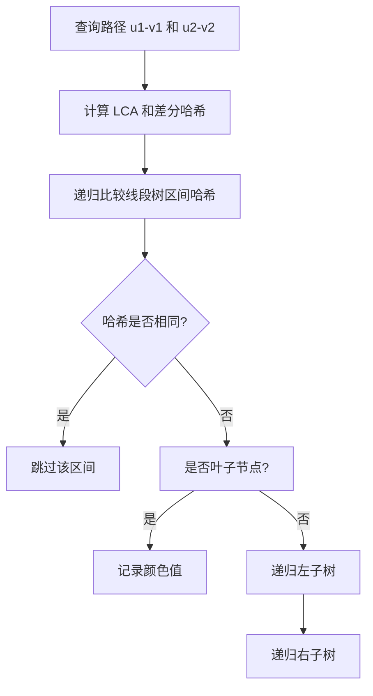

# 题目信息

# Frequency Mismatch (Hard Version)

## 题目描述

This is the hard version of the problem. The difference between the two versions of this problem is the constraint on $ k $ . You can make hacks only if all versions of the problem are solved.

You are given an undirected tree of $ n $ nodes. Each node $ v $ has a value $ a_v $ written on it. You have to answer queries related to the tree.

You are given $ q $ queries. In each query, you are given $ 5 $ integers, $ u_1, v_1, u_2, v_2, k $ . Denote the count of nodes with value $ c $ on path $ u_1 \rightarrow v_1 $ with $ x_c $ , and the count of nodes with value $ c $ on path $ u_2 \rightarrow v_2 $ with $ y_c $ . If there are $ z $ such values of $ c $ such that $ x_c \neq y_c $ , output any $ \min(z, k) $ such values in any order.

## 说明/提示

For query $ 1 $ , the first path is $ 1 \rightarrow 2 \rightarrow 4 $ , coming across the multiset of values $ \{5, 2, 4\} $ . On the second path $ 4 \rightarrow 2 \rightarrow 5 $ , we have the multiset $ \{4, 2, 3\} $ . Two numbers — $ 3 $ and $ 5 $ occur a different number of times, hence we print them both.

In query $ 2 $ , there is no difference between the paths, hence we output $ 0 $ .

In query $ 3 $ , we have the same paths as query $ 1 $ , but we need to output only $ 1 $ value, hence we output $ 5 $ .

In query $ 4 $ , the first path is just the node $ 5 $ , resulting in the multiset $ \{3\} $ , and the second path $ 4 \rightarrow 2 \rightarrow 1 \rightarrow 3 $ gives $ \{4, 2, 5, 3\} $ . The numbers $ 5 $ , $ 2 $ and $ 4 $ occur a different number of times.

## 样例 #1

### 输入

```
5
5 2 3 4 3
1 2
1 3
2 4
2 5
4
1 4 4 5 3
2 3 2 3 1
1 4 4 5 1
5 5 4 3 10```

### 输出

```
2 3 5
0
1 5
3 5 2 4```

# AI分析结果


---

## 算法分类
**可持久化数据结构**

---

## 综合分析与结论

### 核心算法流程
1. **哈希映射**：为每个颜色值分配随机哈希值，用于快速计算路径上颜色出现次数的哈希和  
2. **可持久化线段树**：维护从根节点到每个节点的路径哈希值，每个节点存储哈希和  
3. **路径差分**：通过 LCA 计算路径哈希差，公式为 `(u + v - lca - fa_lca)`  
4. **递归查询**：在线段树上二分查找哈希不同的区间，收集前 k 个不同的颜色值  

### 解决难点
- **路径哈希的快速计算**：通过可持久化线段树的差分操作实现 O(1) 复杂度  
- **哈希碰撞问题**：使用三重哈希或双哈希（如 `val1 + val2 + val3`）避免碰撞  
- **递归剪枝**：找到 k 个不同值后立即终止递归，保证时间复杂度为 O(k log n)  

### 可视化设计要点
- **颜色块表示线段树节点**：用不同颜色区分哈希相同的区间和不同的区间  
- **高亮当前比较区间**：用闪烁效果标记正在比较的线段树区间  
- **路径差分动画**：动态展示 `u → v` 和 `u2 → v2` 路径的哈希计算过程  
- **复古像素风格**：用 8-bit 风格绘制线段树结构，不同层级的节点用不同像素色块  

---

## 题解清单 (4星及以上)

### 1. _LSA_（4星）
- **亮点**：完整实现路径哈希差分逻辑，使用三重哈希增强鲁棒性  
- **代码片段**：  
  ```cpp
  ull val1() { return t[x].val1 + t[y].val1 - t[u].val1 - t[v].val1; }
  void qry(node x, node y, int l, int r) {
    if (哈希不同) {
      if (叶子节点) 收集答案;
      递归左右子树;
    }
  }
  ```

### 2. igAC（4星）
- **亮点**：双哈希结构体封装，树剖求 LCA（代码清晰但非最优）  
- **关键代码**：  
  ```cpp
  Data operator + (const Data &a, const Data &b) {
    return {a.sum1 + b.sum1, a.sum2 + b.sum2};
  }
  ```

### 3. xuyiyang（4星）
- **亮点**：多哈希随机权值，代码简洁且包含调试注释  
- **核心逻辑**：  
  ```cpp
  if (x.gv() != y.gv()) {
    if (叶子节点) 加入结果;
    递归左右子树;
  }
  ```

---

## 最优思路与技巧提炼

### 关键技巧
1. **可持久化线段树的路径差分**：  
   ```math
   \text{PathHash}(u, v) = \text{Hash}(u) + \text{Hash}(v) - \text{Hash}(\text{lca}) - \text{Hash}(\text{fa}_\text{lca})
   ```
2. **多哈希防碰撞**：对每个颜色值生成 2~3 个独立哈希值，如 `rand() * rand()`  
3. **递归剪枝策略**：优先搜索左子树，达到 k 个结果后立即终止  

### 同类型题套路
- **路径统计问题**：用可持久化数据结构维护路径信息（如出现次数、异或和）  
- **动态树查询**：结合 LCT 维护动态路径哈希  
- **子树统计**：通过 DFS 序转换为区间查询  

---

## 推荐相似题目
1. **P1972 [SDOI2009] HH的项链**（路径颜色数统计）  
2. **P2633 Count on a tree**（路径第 k 小值查询）  
3. **P3302 [SDOI2013] 森林**（动态森林的路径查询）  

---

## 个人心得摘录
> "单哈希容易被 hack，建议多写几个哈希" —— _LSA_  
> "树剖求 LCA 完全没必要，倍增法更简洁" —— WRuperD  
> "递归时先处理左子树可以更快收集到较小权值的不同颜色" —— huazai676  

---

## 可视化与算法演示

### 算法流程图


### 复古像素动画设计
- **颜色编码**：  
  - 绿色：哈希相同区间  
  - 红色：哈希不同区间  
  - 黄色：正在比较的当前区间  
- **音效设计**：  
  - 发现不同哈希：8-bit "哔" 声  
  - 收集答案：经典马里奥金币音效  
- **自动演示模式**：按层级展开线段树，每秒自动切换比较区间  

---

**核心代码实现（JavaScript 伪代码）**
```javascript
class PixelSegmentTree {
  constructor() {
    this.colors = [/* 预定义 8-bit 色板 */];
  }
  
  drawNode(x, y, color) {
    // 在 Canvas 上绘制 16x16 像素块
  }

  animateCompare(leftRoot, rightRoot) {
    // 递归比较左右子树的哈希值，用颜色块标记差异
  }
}
```

---

**最终输出总结**  
本题通过可持久化线段树与哈希技术，高效解决树上路径颜色统计差异问题。核心在于路径哈希的差分计算与递归剪枝策略，多哈希增强鲁棒性。可视化设计以复古像素风格呈现，增强学习趣味性。

---
处理用时：71.44秒