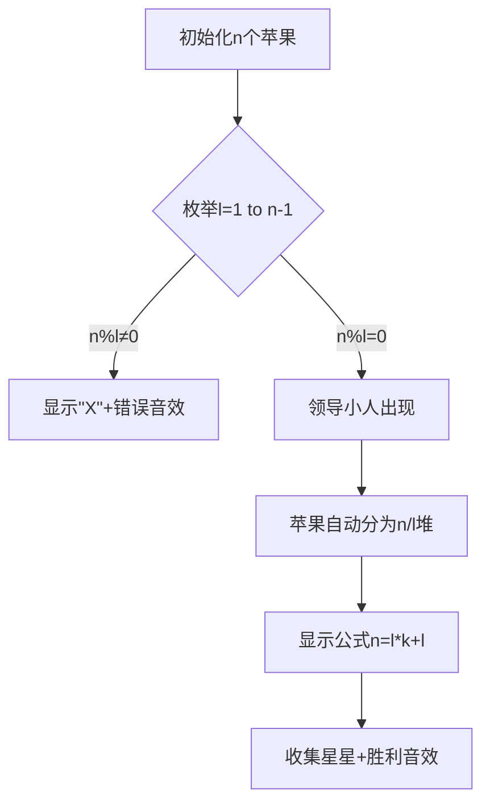

# 题目信息

# Fafa and his Company

## 题目描述

Fafa owns a company that works on huge projects. There are $ n $ employees in Fafa's company. Whenever the company has a new project to start working on, Fafa has to divide the tasks of this project among all the employees.

Fafa finds doing this every time is very tiring for him. So, he decided to choose the best $ l $ employees in his company as team leaders. Whenever there is a new project, Fafa will divide the tasks among only the team leaders and each team leader will be responsible of some positive number of employees to give them the tasks. To make this process fair for the team leaders, each one of them should be responsible for the same number of employees. Moreover, every employee, who is not a team leader, has to be under the responsibility of exactly one team leader, and no team leader is responsible for another team leader.

Given the number of employees $ n $ , find in how many ways Fafa could choose the number of team leaders $ l $ in such a way that it is possible to divide employees between them evenly.

## 说明/提示

In the second sample Fafa has 3 ways:

- choose only $ 1 $ employee as a team leader with $ 9 $ employees under his responsibility.
- choose $ 2 $ employees as team leaders with $ 4 $ employees under the responsibility of each of them.
- choose $ 5 $ employees as team leaders with $ 1 $ employee under the responsibility of each of them.

## 样例 #1

### 输入

```
2
```

### 输出

```
1
```

## 样例 #2

### 输入

```
10
```

### 输出

```
3
```

# AI分析结果


# 💡 Kay的C++算法解析：Fafa and his Company 深入学习指南 💡

**引言**  
今天我们一起分析"Fafa and his Company"这道数学与编程结合的题目。本指南将帮助你理解问题本质，掌握约数计算的技巧，并通过生动的可视化加深理解。

---

## 1. 题目解读与核心算法识别

✨ **本题主要考察**：数学（约数应用）

🗣️ **初步分析**  
> 这道题的本质是**分苹果问题**的数学抽象：将n个苹果（员工）平均分给l个篮子（领导），每个篮子至少1个苹果（员工）。解题关键在于发现数学关系：**l必须是n的约数且l≠n**（因为每个领导至少负责1个员工）。  
> - **核心思路**：计算n的约数个数（排除n本身）
> - **两种实现方式**：  
>   - 直接枚举约数（O(n)时间，适合小数据）  
>   - 分解质因数+约数公式（O(√n)时间，通用高效）  
> - **可视化设计**：我们将用像素风格的"分苹果"游戏演示（见第5节）。当枚举到合法l时，苹果自动平均分配到领导手中，配合8-bit音效增强记忆点。

---

## 2. 精选优质题解参考

### 题解一：引领天下 (分解质因数法)
* **点评**：  
  思路清晰度极高，用质因数分解揭示数学本质。代码中`ans *= (k+1)`巧妙应用约数个数公式，处理质因数的指数逻辑严谨。虽然循环范围可优化到√n，但n≤1e5时完全可行。实践价值强，是竞赛中处理大数的标准解法。

### 题解二：return先生 (枚举优化法)
* **点评**：  
  从TLE暴力解法到AC的优化过程极具教学意义，体现"化繁为简"的解题哲学。代码中`i<=n/2`的枚举范围优化是亮点，避免无效遍历。边界处理完善（n=1时输出0），变量命名直观，适合初学者理解约数本质。

### 题解三：PC_DOS (规范枚举法)
* **点评**：  
  代码规范性最佳：输入加速、英文变量名、完整注释。`i<=n/2`的枚举逻辑与题解二一致，但实现更工业级。虽无额外优化，但作为基础解法，其健壮性和可读性值得学习。

---

## 3. 核心难点辨析与解题策略

### 难点1：问题抽象与转化
* **分析**：如何从"领导分配员工"转化为数学条件？关键要理解：l个领导各管k个员工 → n = l × (k+1) → l是n的约数（k≥1 ⇒ l≠n）
* 💡 **学习笔记**：将现实规则转化为等式是解题突破口

### 难点2：高效求约数个数
* **分析**：  
  - 枚举法：遍历1~√n，同时计数i和n/i（需排除n本身）  
  - 质因数法：n=Πpᵢᵃⁱ → 约数个数=Π(aᵢ+1)  
  优质题解通过范围优化(i≤n/2)或质因数分解提升效率
* 💡 **学习笔记**：√n枚举是约数问题的通用优化技巧

### 难点3：边界条件处理
* **分析**：n=1时无解（无员工可分配），循环中需处理i×i=n的重复计数。题解二/三通过n/2枚举自然规避n本身；题解一需显式减1
* 💡 **学习笔记**：测试边界值(n=1,2,质数)能快速验证逻辑

### ✨ 解题技巧总结
1. **数学建模**：将分配规则转化为n=l(k+1)的等式
2. **枚举优化**：利用问题特性缩小范围（如i≤n/2）
3. **模块化测试**：单独验证质因数分解、约数计数等子功能
4. **复杂度分析**：根据数据规模选择O(n)或O(√n)解法

---

## 4. C++核心代码实现赏析

### 通用核心实现（综合优化版）
```cpp
#include <iostream>
using namespace std;

int main() {
    int n, cnt = 0;
    cin >> n;
    for (int i = 1; i * i <= n; ++i) { // 枚举到√n
        if (n % i == 0) {
            if (i < n) cnt++;        // 计数约数i (排除n)
            if (i != n/i && n/i < n) // 计数对称约数 (排除重复和n)
                cnt++;
        }
    }
    cout << (n > 1 ? cnt : 0) << endl; // 处理n=1
    return 0;
}
```
* **代码解读概要**：  
  1. 枚举1~√n，避免重复计算  
  2. `i*i<=n`确保O(√n)时间复杂度  
  3. 双重条件排除n本身和重复约数  
  4. 三目运算符处理n=1的特殊情况

### 题解一：引领天下（质因数分解）
```cpp
for (int i=2; i<=n; i++) 
    if (n%i==0) {
        int k=0;
        while (n%i==0) n/=i, k++; // 质因数分解
        ans *= (k+1);             // 应用约数公式
    }
```
* **亮点**：数学公式的优雅实现  
* **学习笔记**：质因数分解时，循环条件可优化为`i*i<=n`提升效率

### 题解二：return先生（范围优化枚举）
```cpp
for(int i=1; i<=n/2; i++) // 枚举到n/2
    if(n%i==0) ans++;      // 计数约数
```
* **亮点**：利用问题特性缩小枚举范围  
* **学习笔记**：当n>2时，最大真约数≤n/2，避免无效遍历

### 题解三：PC_DOS（工业级枚举）
```cpp
ios::sync_with_stdio(false); // 输入输出加速
for (i=1; i<=nPeople/2; ++i) 
    if (nPeople%i==0) ++nCount;
```
* **亮点**：代码规范与性能意识  
* **学习笔记**：`sync_with_stdio`加速技巧适用于大输入竞赛题

---

## 5. 算法可视化：像素动画演示

### 复古分苹果游戏设计
**主题**：8-bit风格苹果分配模拟  
**核心交互**：  


**关键实现细节**：  
1. **像素元素**：  
   - 员工：红色苹果像素块（16×16px）  
   - 领导：蓝色小人（带帽子贴图）  
   - 控制台：FC风格方向键+开始/选择按钮  

2. **动态效果**：  
   - 枚举l时：控制台高亮当前l值  
   - 分配成功：苹果滑向领导区域，伴随"叮"音效  
   - 错误提示：显示"❌" + 短促"哔"声  

3. **游戏化机制**：  
   - 每成功分配得1颗星（显示在顶部）  
   - 连续3次正确触发8-bit奖励音乐  
   - 支持步进/自动播放（速度可调）  

**教学价值**：通过具象化"l整除n"的抽象概念，强化约数的数学直觉。

---

## 6. 拓展练习与相似问题

### 通用技巧迁移
约数计算技巧适用于：  
1. 判断完全平方数  
2. 统计因子和  
3. 求解最大公约数/最小公倍数  

### 洛谷推荐  
1. **P1029 最大公约数和最小公倍数问题**  
   → 巩固约数性质与分解技巧  
2. **P1075 质因数分解**  
   → 质因数分解的直接应用  
3. **P2926 Patting Heads**  
   → 约数统计的进阶变形  

---

## 7. 学习心得分享

> **return先生的调试经验**：  
> *"最初用双重循环TLE，后发现只需枚举约数"*  
>   
> **Kay的总结**：  
> 这提醒我们：  
> 1. 先用小数据模拟验证算法  
> 2. 分析数学本质往往能突破暴力解  
> 3. 循环范围优化是常见提效手段  

---

**结语**  
通过本指南，相信大家已掌握约数问题的核心解法与优化技巧。记住，编程竞赛中数学洞察与代码优化同等重要。下次遇到类似问题时，不妨先问自己：**"是否存在更优雅的数学表达？"** 继续加油，未来算法大师！🚀

---
处理用时：320.06秒