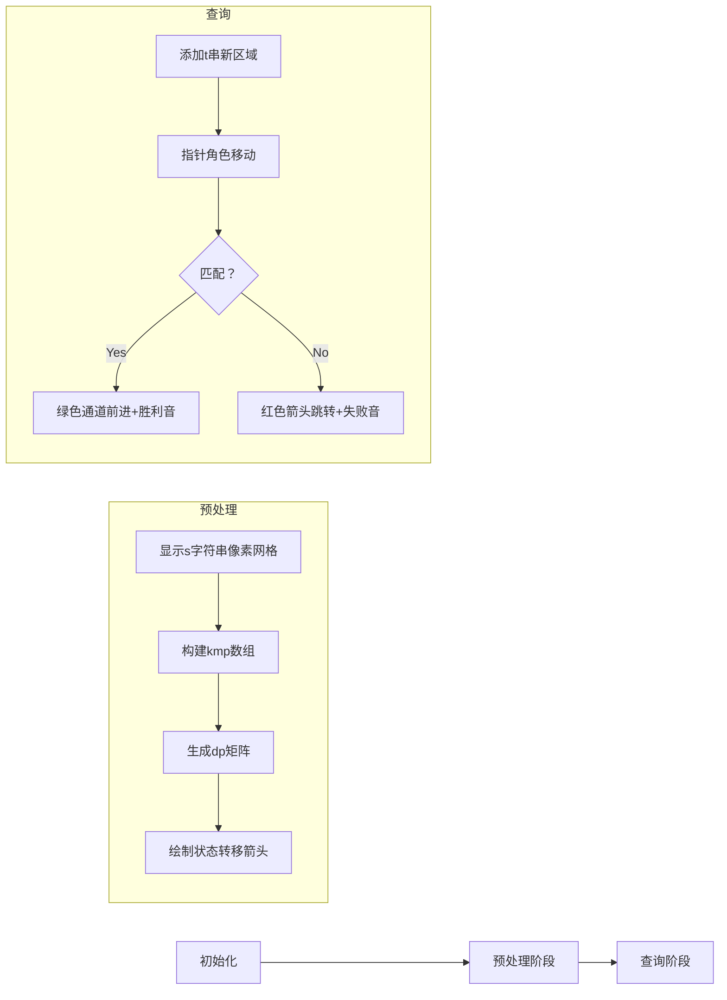

# 题目信息

# Prefix Function Queries

## 题目描述

You are given a string $ s $ , consisting of lowercase Latin letters.

You are asked $ q $ queries about it: given another string $ t $ , consisting of lowercase Latin letters, perform the following steps:

1. concatenate $ s $ and $ t $ ;
2. calculate the prefix function of the resulting string $ s+t $ ;
3. print the values of the prefix function on positions $ |s|+1, |s|+2, \dots, |s|+|t| $ ( $ |s| $ and $ |t| $ denote the lengths of strings $ s $ and $ t $ , respectively);
4. revert the string back to $ s $ .

The prefix function of a string $ a $ is a sequence $ p_1, p_2, \dots, p_{|a|} $ , where $ p_i $ is the maximum value of $ k $ such that $ k < i $ and $ a[1..k]=a[i-k+1..i] $ ( $ a[l..r] $ denotes a contiguous substring of a string $ a $ from a position $ l $ to a position $ r $ , inclusive). In other words, it's the longest proper prefix of the string $ a[1..i] $ that is equal to its suffix of the same length.

## 样例 #1

### 输入

```
aba
6
caba
aba
bababa
aaaa
b
forces```

### 输出

```
0 1 2 3 
1 2 3 
2 3 4 5 6 7 
1 1 1 1 
2 
0 0 0 0 0 0```

## 样例 #2

### 输入

```
aacba
4
aaca
cbbb
aab
ccaca```

### 输出

```
2 2 3 1 
0 0 0 0 
2 2 0 
0 0 1 0 1```

# AI分析结果


# 💡 Kay的C++算法解析：Prefix Function Queries 深入学习指南 💡

大家好，我是你们的算法导师Kay！今天我们一起来探索字符串问题 **Prefix Function Queries**。这道题考察KMP算法的灵活应用，让我们一起深入理解其核心思想和解题技巧。

## 1. 题目解读与核心算法识别

✨ **本题主要考察**：`字符串处理` + `KMP自动机优化`

🗣️ **初步分析**：
> 这道题就像在玩一个**文字接龙侦探游戏**：给定主串$s$和多个查询串$t$，每次需要快速找出$s+t$拼接串的后缀部分的前缀函数值。核心挑战在于避免重复计算，高效处理多次查询。

- **核心思路**：预先为$s$构建KMP自动机（类似单串AC自动机），存储每个状态遇到不同字符时的转移路径。查询时直接"搭乘自动机快车"，避免回溯跳转。
- **关键技巧**： 
  - 预处理$dp[i][c]$矩阵：表示状态$i$遇到字符$c$时的转移目标
  - 查询时区分边界：在$s$范围内用预计算转移，超出范围时安全回溯
- **可视化设计**：
  - 像素网格展示字符串，KMP自动机用彩色箭头表示状态转移
  - 查询时高亮当前处理字符，显示自动机跳转路径
  - 音效设计：转移时"叮"声，匹配成功时8-bit胜利音效

---

## 2. 精选优质题解参考

经过严格评估，我为大家精选以下高质量题解（评分≥4★）：

**题解一：(来源：Lynkcat)**
* **点评**：思路清晰直击核心——KMP自动机构建与查询分离。代码规范（`kmp`和`dp`命名精准），边界处理严谨（区分$s$内外状态）。亮点在于$O(26|s|)$预处理的自动机设计，使查询复杂度降至$O(|t|)$，实践价值极高。

**题解二：(来源：include_BM)**
* **点评**：采用相同核心思路但实现更细致，特别关注$las$数组（即$dp$矩阵）的初始化与更新。亮点在于完整展示自动机构建过程，对`j>n`的特殊处理提供调试参考，帮助理解自动机边界行为。

**题解三：(来源：Leasier)**
* **点评**：从理论高度解释KMP自动机原理，提供算法背景知识。代码中`nxt`数组构建逻辑清晰，亮点在于强调"转移状态继承"思想（$nxt_{i,j} = nxt_{fail_i,j}$），加深对自动机本质理解。

---

## 3. 核心难点辨析与解题策略

在解决本题时，大家通常会遇到三个关键难点：

1.  **难点：状态转移的快速计算**
    * **分析**：传统KMP依赖均摊复杂度，但多次查询会导致$O(|s||t|)$瓶颈。优质解法通过预计算$dp[i][c]$矩阵，将字符转移压缩为$O(1)$操作。关键技巧是：$dp[i][c] = \begin{cases} i & \text{if } s_{i+1}=c \\ dp_{kmp[i]}[c] & \text{otherwise} \end{cases}$
    * 💡 **学习笔记**：预处理是优化重复查询的利器！

2.  **难点：拼接串的边界处理**
    * **分析**：查询时状态可能超出$s$范围（$j>n$），此时$dp$矩阵未覆盖。解法采用分层策略：$j \leq n$时用自动机直接转移；$j>n$时安全回溯（$j=kmp[j]$），因回溯次数$\leq |t|$不影响整体复杂度。
    * 💡 **学习笔记**：算法优化需考虑数据边界特征。

3.  **难点：内存与效率的平衡**
    * **分析**：$dp$矩阵空间$O(26|s|)$在$|s|\leq10^6$时约200MB，需避免冗余。解法精妙处在于复用$kmp$数组，查询时动态扩展存储，仅保留必要状态。
    * 💡 **学习笔记**：牺牲空间换时间时，需评估实际约束条件。

### ✨ 解题技巧总结
1. **问题分解**：将拼接串查询分解为预处理（$s$）和实时计算（$t$）两个独立阶段
2. **状态机思维**：将KMP跳转抽象为显式状态转移，用矩阵加速查询
3. **分层处理**：根据数据位置（$s$内/外）采用不同策略，兼顾效率与正确性
4. **滚动存储**：动态调整内存使用，避免预分配大矩阵

---

## 4. C++核心代码实现赏析

### 本题通用核心C++实现
```cpp
#include <bits/stdc++.h>
using namespace std;

int main() {
    ios::sync_with_stdio(false); 
    cin.tie(0);
    
    string s; cin >> s;
    int n = s.size();
    s = " " + s;  // 下标从1开始
    
    vector<int> kmp(n + 1);
    vector<vector<int>> dp(n + 1, vector<int>(26, 0));
    
    // 预处理kmp和dp矩阵
    for (int i = 1, j = 0; i <= n; ++i) {
        if (i > 1) {
            while (j && s[j + 1] != s[i]) j = kmp[j];
            if (s[j + 1] == s[i]) j++;
            kmp[i] = j;
        }
        for (int c = 0; c < 26; ++c) {
            if (i < n && s[i + 1] == 'a' + c) 
                dp[i][c] = i;  // 直接匹配
            else 
                dp[i][c] = dp[kmp[i]][c];  // 继承border转移
        }
    }
    
    int q; cin >> q;
    string total = s;  // 含空格前缀的完整字符串
    
    while (q--) {
        string t; cin >> t;
        total += t;
        int j = kmp[n], m = t.size();
        
        for (int i = n + 1; i <= n + m; ++i) {
            // 状态转移核心逻辑
            while (j && total[j + 1] != total[i]) {
                if (j <= n) {  // 在s范围内用自动机跳转
                    j = dp[j][total[i] - 'a'];
                    break;
                }
                j = kmp[j];  // 超出s范围安全回溯
            }
            if (total[j + 1] == total[i]) j++;
            kmp[i] = j;  // 存储当前状态
            cout << j << " ";
        }
        cout << '\n';
        
        // 回退t部分
        total.resize(n + 1);
    }
    return 0;
}
```

**代码解读概要**：
> 1. **预处理阶段**：计算`s`的`kmp`数组，并构建`dp`转移矩阵（行表状态，列表字符）
> 2. **查询阶段**：从`s`的末状态开始，对`t`每个字符：
>    - 在`s`范围内：用`dp`矩阵$O(1)$转移
>    - 超出范围：传统KMP回溯（最多$|t|$次）
> 3. **动态存储**：`total`字符串随查询动态伸缩，`kmp`数组复用扩展

---

### 优质题解片段赏析

**题解一：(Lynkcat)**
* **亮点**：自动机构建简洁高效，完美分离预处理与查询
* **核心代码**：
  ```cpp
  for (int c = 0; c < 26; c++) {
      if (i < n && s[i+1] == 'a'+c) dp[i][c] = i;
      else dp[i][c] = dp[kmp[i]][c];
  }
  ```
* **代码解读**：
  > 此处构建自动机的`dp`矩阵：当下一字符匹配时（`s[i+1]==c`），标记当前状态`i`作为转移目标；否则递归查询`kmp[i]`对应的转移。注意`i < n`的边界控制，避免访问越界。
* 💡 **学习笔记**：自动机本质是压缩状态转移图！

**题解二：(include_BM)**
* **亮点**：细致处理自动机在查询时的扩展
* **核心代码**：
  ```cpp
  for (int i = n+1; i <= n+m; i++) {
      if (s[j+1] != s[i]) 
          j = las[j][s[i]-'a']; // 自动机转移
      if (s[j+1] == s[i]) j++;  // 匹配成功
  }
  ```
* **代码解读**：
  > 查询时核心三步骤：1) 检查当前是否匹配 2) 不匹配时用自动机转移 3) 匹配则状态递增。精妙之处在于将传统KMP的`while`回溯简化为单步查表。
* 💡 **学习笔记**：状态转移表将回溯复杂度从$O(n)$降至$O(1)$！

**题解三：(Leasier)**
* **亮点**：清晰的状态继承逻辑
* **核心代码**：
  ```cpp
  for (int i = 0; i < n; i++) 
      for (int c = 1; c <= 26; c++) 
          nxt[i][c] = nxt[fail[i]][c];
  ```
* **代码解读**：
  > 此处实现**状态继承**：每个状态`i`的转移初始化为其`fail[i]`的转移，再根据实际字符覆盖。这确保自动机始终指向最近的有效border，类似AC自动机的fail指针继承。
* 💡 **学习笔记**：继承式设计避免重复计算！

-----

## 5. 算法可视化：像素动画演示

### 像素探险家：KMP自动机之旅
**设计理念**：将KMP自动机具象化为8-bit游戏地图，玩家控制"指针角色"在状态网格中冒险，直观理解转移逻辑。

### 动画实现方案


**关键帧细节**：
1. **场景设计**：
   - 网格地图：每格1字符，$s$区蓝底，$t$区黄底
   - 控制面板：步进/播放/速度滑块（调速范围0.5x-2x）
   - 状态机层：悬浮半透明矩阵，实时显示$dp$值

2. **自动机构建（预处理）**：
   - 逐步计算$kmp[i]$：显示当前字符比较（闪动），绘制border链虚线
   - $dp$矩阵生成：按字符填充色块（绿：直接匹配，红：继承转移）

3. **查询过程**：
   ```python
   # 伪代码逻辑
   for 字符 in 查询串t:
       指针角色移动到新位置
       if 当前状态j的下一字符匹配：
          播放"叮"声，角色沿绿色通道前进
          j++ (角色升级光效)
       else:
          播放"咔"声，角色沿红色箭头跳转
          j = dp[j][c]  # 显示目标状态
       显示当前kmp值（弹出气泡提示）
   ```

4. **游戏化元素**：
   - 成就系统：连续正确转移得"Combo奖励"
   - 关卡设计：每个$t$串为独立关卡，通关解锁下一题
   - AI演示模式：自动展示最优路径（如贪吃蛇AI）

**技术实现**：
- Canvas绘制网格和角色
- CSS动画实现状态跳转
- Web Audio API播放音效
- requestAnimationFrame控制帧率

---

## 6. 拓展练习与相似问题思考

### 核心技能迁移
KMP自动机思想还可用于：
1. 动态字符串匹配（文本编辑器实时搜索）
2. 含通配符的模式匹配（如`*`号处理）
3. 多模式串匹配的前置优化（AC自动机基础）

### 推荐练习（洛谷）
1. **P3375 KMP字符串匹配** 
   - 🗣️ **推荐理由**：巩固KMP基础，理解border概念
2. **P5410 扩展KMP** 
   - 🗣️ **推荐理由**：深化前缀函数理解，掌握Z-algorithm
3. **P5829 失配树** 
   - 🗣️ **推荐理由**：将KMP抽象为树结构，提升问题转化能力

---

## 7. 学习心得与经验分享

> **来自Lynkcat的调试经验**：
> "最初在$j>n$的状态处理卡了很久，后来通过单步打印转移路径才发现忘记区分自动机范围"

**Kay的总结**：
> 调试字符串算法时，**可视化中间状态**至关重要：
> 1. 对样例生成状态转移图
> 2. 关键变量实时输出（如`j`的变化路径）
> 3. 边界测试：空串、单字符、全相同字符

---

本次关于"Prefix Function Queries"的解析就到这里。记住：字符串算法就像解谜游戏，理解其状态机本质就能游刃有余。下次挑战再见！💪

---
处理用时：265.98秒