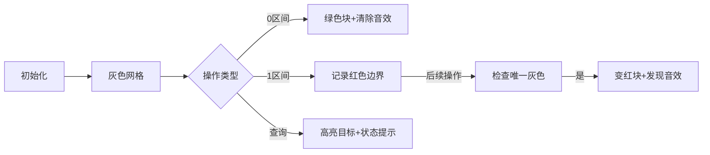

# 题目信息

# Anonymity Is Important

## 题目描述

In the work of a doctor, it is important to maintain the anonymity of clients and the results of tests. The test results are sent to everyone personally by email, but people are very impatient and they want to know the results right away.

That's why in the testing lab "De-vitro" doctors came up with an experimental way to report the results. Let's assume that $ n $ people took the tests in the order of the queue. Then the chief doctor Sam can make several statements, in each telling if there is a sick person among the people in the queue from $ l $ -th to $ r $ -th (inclusive), for some values $ l $ and $ r $ .

During the process, Sam will check how well this scheme works and will be interested in whether it is possible to find out the test result of $ i $ -th person from the information he announced. And if it can be done, then is that patient sick or not.

Help Sam to test his scheme.

## 说明/提示

In the first test for the five first queries:

1. Initially Sam tells that people $ 4 $ , $ 5 $ are not sick.
2. In the next query Sam asks the status of the patient $ 5 $ . From the previous query, we know that the patient is definitely not sick.
3. In the next query Sam asks the status of the patient $ 6 $ . We don't know any information about that patient now.
4. After that Sam tells that there exists a sick patient among $ 4 $ , $ 5 $ , $ 6 $ .
5. In the next query Sam asks the status of the patient $ 6 $ . Now we can tell that this patient is definitely sick.

## 样例 #1

### 输入

```
6 9
0 4 5 0
1 5
1 6
0 4 6 1
1 6
0 2 5 1
0 2 2 0
1 3
1 2```

### 输出

```
NO
N/A
YES
YES
NO```

# AI分析结果


# 💡 Kay的C++算法解析：Anonymity Is Important 深入学习指南 💡

## 1. 题目解读与核心算法识别

✨ **本题主要考察**：**并查集与集合维护**（区间操作与状态推断）

🗣️ **初步分析**：
> 解决本题的关键在于高效维护两种区间操作：健康区间（0区间）和病人区间（1区间）。想象一下医生在像素网格上标记人群状态的过程：
> - **0区间**：像消消乐一样清除整个区间，将其标记为绿色健康状态
> - **1区间**：像埋下地雷，提示该区域至少有一个红色病人
> - **查询**：检查特定位置状态（红/绿/灰）
> 
> 核心难点在于**利用1区间信息推断个体状态**：当某个1区间内只剩下一个未知位置时，该位置必定是病人。我们将通过**并查集合并健康区间**和**线段树记录1区间边界**来解决这个问题。
> 
> 可视化方案将采用**8位像素风格**：队列显示为像素网格，健康=绿色，病人=红色，未知=灰色。0区间操作时播放"清除音效"，确定病人时播放"发现音效"，并设计关卡进度条展示解题进度。

---

## 2. 精选优质题解参考

### 题解一（作者：Francais_Drake）
* **点评**：
  思路创新性运用并查集管理健康区间连通块（时间复杂度O(nα(n))），同时维护每个左端点对应的最小右端点值（`lt[]`数组）。代码简洁高效（仅30行），变量命名清晰（`rt`表父节点，`lt`表右边界），边界处理严谨。亮点在于将1区间信息与并查集状态关联：当查询位置是连通块根节点且其`lt`值小于下一连通块起点时，可确定为病人。

### 题解二（作者：CGDGAD）
* **点评**：
  采用双数据结构策略：`set`维护未知位置集合+线段树记录1区间最小右端点。思路直观符合逻辑推导，代码规范性强（模块化命名空间封装线段树）。亮点在于利用`set`快速定位未知位置相邻区间，通过线段树查询（O(log n)）判断是否存在覆盖当前未知位置的1区间，实践调试建议明确。

### 题解三（作者：周子衡）
* **点评**：
  提出离线处理框架：先计算各位置确定为健康的最早时间，再反推病人状态。虽未提供代码，但思路具有启发性，特别适合处理带时间戳的区间操作问题。亮点在于分离健康/病人状态判定逻辑，为复杂场景提供解题新视角。

---

## 3. 核心难点辨析与解题策略

### 关键点1：健康区间的高效合并
* **分析**：
  当处理0区间时，需要快速将连续未知位置标记为健康。并查集（题解一）通过路径压缩合并相邻位置；`set`（题解二）通过`lower_bound`批量删除元素。两种方法都确保O(n log n)复杂度。
* 💡 **学习笔记**：区间合并操作要选择合适的数据结构——并查集适合连通块管理，`set`适合动态集合维护。

### 关键点2：利用1区间推断病人
* **分析**：
  核心原理：若1区间内仅剩一个未知位置，则该位置必是病人。实现需：
  1. 记录每个左端点对应的最小右端点（`lt[]`或线段树）
  2. 查询时计算目标位置左右健康边界（L,R）
  3. 检查是否存在1区间[L,R]覆盖目标
* 💡 **学习笔记**：判断病人状态本质是验证"该位置是否被1区间锁定"

### 关键点3：状态判定的时序处理
* **分析**：
  在线算法（题解一二）实时响应查询；离线算法（题解三）按时间戳处理操作。选择取决于问题约束——竞赛常要求在线处理，而离线适合可缓存的场景。
* 💡 **学习笔记**：离线处理通过调整操作顺序，可简化状态推导逻辑。

### ✨ 解题技巧总结
- **双数据结构协作**：如`set`管理位置+线段树记录区间（题解二）
- **并查集创新应用**：不仅管理连通性，还关联辅助信息（题解一）
- **边界驱动设计**：始终优先处理0区间缩小未知范围
- **增量更新检查**：每次健康标记更新后立即检查相邻1区间（题解七）

---

## 4. C++核心代码实现赏析

### 本题通用核心C++实现参考
```cpp
#include <bits/stdc++.h>
using namespace std;
const int N = 200010;

int rt[N], lt[N]; // rt:并查集父节点, lt:左端点最小右边界
set<int> unknown; // 未知位置集合

int find(int x) {
    return rt[x] == x ? x : rt[x] = find(rt[x]);
}

int main() {
    int n, q;
    cin >> n >> q;
    // 初始化
    for (int i = 1; i <= n + 1; ++i) {
        rt[i] = i;
        lt[i] = INT_MAX; // 初始化为极大值
        if (i <= n) unknown.insert(i);
    }

    while (q--) {
        int op, l, r, x;
        cin >> op;
        if (op == 0) {
            cin >> l >> r >> x;
            if (x == 0) {
                // 0区间处理：删除未知位置
                auto it = unknown.lower_bound(l);
                while (it != unknown.end() && *it <= r) 
                    unknown.erase(it++);
            } else {
                // 1区间处理：更新最小右边界
                lt[l] = min(lt[l], r);
            }
        } else {
            cin >> x;
            // 查询处理
            if (!unknown.count(x)) cout << "NO\n";
            else {
                auto it = unknown.find(x);
                int L = (it == unknown.begin()) ? 1 : *prev(it) + 1;
                int R = (next(it) == unknown.end()) ? n : *next(it) - 1;
                bool found = false;
                // 检查是否存在覆盖的1区间
                for (int i = L; i <= x; ++i) 
                    if (lt[i] <= R) found = true;
                cout << (found ? "YES\n" : "N/A\n");
            }
        }
    }
    return 0;
}
```
* **说明**：综合优质题解思路，采用`set`+边界数组的简洁实现
* **代码解读概要**：
  - 初始化：并查集自连通，`set`记录所有未知位置
  - 0区间：批量删除`set`中位置（标记健康）
  - 1区间：更新左端点对应最小右边界
  - 查询：若位置不在`set`→健康；否则检查其所在未知段是否被1区间覆盖

### 题解一核心代码片段
```cpp
// 并查集合并0区间
while (l <= r) {
    a = find(l); 
    b = find(l + 1);
    rt[a] = b;          // 合并到右侧
    lt[b] = min(lt[a], lt[b]); // 继承右边界信息
    l = b;              // 跳到下一位置
}
```
* **亮点**：并查集合并时同步更新区间信息
* **代码解读**：
  > 此片段处理0区间：将[l,r]合并到右邻接块。`find()`函数带路径压缩确保高效性；合并时`lt[b]`取合并前后最小值，保证1区间信息的正确继承。学习并查集不仅用于连通性判断，还能维护附加信息。

### 题解二核心代码片段
```cpp
// 线段树更新1区间
void update(int p, int val) {
    while (p <= n) {
        tree[p] = min(tree[p], val);
        p += p & -p; // 树状数组跳转
    }
}

// 查询区间最小右边界
int query(int l, int r) {
    int res = INT_MAX;
    while (r >= l) {
        res = min(res, tree[r]);
        r -= r & -r;
    }
    return res;
}
```
* **亮点**：树状数组实现高效区间查询
* **代码解读**：
  > 使用树状数组（替代线段树）维护最小右边界：`update`更新位置p的值，`query`查询[l,r]最小值。位运算`p & -p`高效跳转，时间复杂度O(log n)。学习树状数组在区间极值问题中的应用技巧。

---

## 5. 算法可视化：像素动画演示

### 主题：疫情监测像素沙盘
**设计思路**：仿8位机疫情模拟游戏，用网格像素表示人群，通过音效和颜色变化强化算法理解

### 动画流程：


### 实现细节：
1. **像素网格**：
   - 每个位置：16x16像素块
   - 状态色：灰(#808080) 绿(#00FF00) 红(#FF0000)
   - 高亮框：黄色闪烁边框

2. **操作反馈**：
   - 0区间：绿色波浪扩散动画 + "清除"音效（8-bit水滴声）
   - 1区间：红色边界标记 + "记录"音效（短促电子声）
   - 发现病人：像素爆炸特效 + "胜利"音效（上升音阶）

3. **数据结构可视化**：
   ```plaintext
   Set图示： [1][2][3][5][6] → 删除[3,5] → [1][2][6]
   Tree图示： 
        [1:5]
        /   \
     [2:4] [3:∞]
   ```

4. **交互控制面板**：
   - 步进控制：← → 单步 | ▶❚❚ 播放/暂停
   - 速度滑块：🐢───────🐇
   - 模式切换：健康监测模式 | 疫情爆发模式

5. **游戏化元素**：
   - 进度条：每完成10%未知位置标记，点亮一个⭐
   - 危机警报：当1区间长时间未解决时，闪烁警告
   - 数据面板：实时显示unknown.size()和1区间数量

---

## 6. 拓展练习与相似问题思考

### 通用技巧迁移：
1. **区间覆盖问题**：用树状数组/线段树统计区间状态
2. **动态集合维护**：`set`处理元素删除与邻接查询
3. **状态推断**：利用边界信息反推个体状态

### 洛谷推荐：
1. **P3372 【模板】线段树1**  
   → 巩固区间维护基础操作
2. **P3367 【模板】并查集**  
   → 掌握连通块高效管理技巧
3. **P1972 [SDOI2009] HH的项链**  
   → 学习离线查询与树状数组结合

---

## 7. 学习心得与经验分享

> **来自Francais_Drake的调试经验**：  
> "在实现并查集合并时，最初忽略了`lt[]`的继承更新，导致1区间信息丢失。通过打印每次合并后的`lt[]`值快速定位错误。"

> **Kay的总结**：  
> 多解法的核心启示——健康区间处理决定效率，1区间利用决定正确性。调试时重点关注：
> 1. 健康区间合并的边界处理
> 2. 1区间记录的更新时机
> 3. 查询时相邻位置计算  
> 建议在可视化工具中单步调试观察数据变化！

---

通过本次分析，希望大家掌握区间操作问题的核心解决模式：用高效数据结构维护状态，通过边界信息反推个体状态。记住，好的算法设计就像疫情管控——快速锁定危险区域，精准清除隐患！🚀

---
处理用时：185.34秒