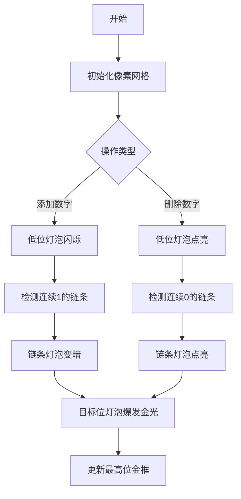

# 题目信息

# Mark and Professor Koro

## 题目描述

After watching a certain anime before going to sleep, Mark dreams of standing in an old classroom with a blackboard that has a sequence of $ n $ positive integers $ a_1, a_2,\dots,a_n $ on it.

Then, professor Koro comes in. He can perform the following operation:

- select an integer $ x $ that appears at least $ 2 $ times on the board,
- erase those $ 2 $ appearances, and
- write $ x+1 $ on the board.

Professor Koro then asks Mark the question, "what is the maximum possible number that could appear on the board after some operations?"

Mark quickly solves this question, but he is still slower than professor Koro. Thus, professor Koro decides to give Mark additional challenges. He will update the initial sequence of integers $ q $ times. Each time, he will choose positive integers $ k $ and $ l $ , then change $ a_k $ to $ l $ . After each update, he will ask Mark the same question again.

Help Mark answer these questions faster than Professor Koro!

Note that the updates are persistent. Changes made to the sequence $ a $ will apply when processing future updates.

## 说明/提示

In the first example test, the program must proceed through $ 4 $ updates.

The sequence after the first update is $ [2,3,2,4,5] $ . One sequence of operations that achieves the number $ 6 $ the following.

- Initially, the blackboard has numbers $ [2,3,2,4,5] $ .
- Erase two copies of $ 2 $ and write $ 3 $ , yielding $ [3,4,5,\color{red}{3}] $ .
- Erase two copies of $ 3 $ and write $ 4 $ , yielding $ [4,5,\color{red}{4}] $ .
- Erase two copies of $ 4 $ and write $ 5 $ , yielding $ [5,\color{red}{5}] $ .
- Erase two copies of $ 5 $ and write $ 6 $ , yielding $ [\color{red}{6}] $ .

Then, in the second update, the array is changed to $ [2,3,2,4,3] $ . This time, Mark cannot achieve $ 6 $ . However, one sequence that Mark can use to achieve $ 5 $ is shown below.

- Initially, the blackboard has $ [2,3,2,4,3] $ .
- Erase two copies of $ 2 $ and write $ 3 $ , yielding $ [3,4,3,\color{red}{3}] $ .
- Erase two copies of $ 3 $ and write $ 4 $ , yielding $ [3,4,\color{red}{4}] $ .
- Erase two copies of $ 4 $ and write $ 5 $ , yielding $ [3,\color{red}{5}] $ .

In the third update, the array is changed to $ [2,3,2,1,3] $ . One way to achieve $ 4 $ is shown below.

- Initially, the blackboard has $ [2,3,2,1,3] $ .
- Erase two copies of $ 3 $ and write $ 4 $ , yielding $ [2,2,1,\color{red}{4}] $ .

## 样例 #1

### 输入

```
5 4
2 2 2 4 5
2 3
5 3
4 1
1 4```

### 输出

```
6
5
4
5```

## 样例 #2

### 输入

```
2 1
200000 1
2 200000```

### 输出

```
200001```

# AI分析结果


# 💡 Kay的C++算法解析：Mark and Professor Koro 深入学习指南 💡

> **角色定位**：我是Kay，一位专注于C++算法教学的引导者。今天我们将一起探索这道关于二进制进位模拟的趣味题目，我会用清晰的语言和生动的比喻帮助大家理解核心算法，并通过复古像素动画让算法过程可视化！

## 1. 题目解读与核心算法识别

✨ **本题主要考察**：`二进制进位模拟与数据结构优化`

🗣️ **初步分析**：
> 这道题就像玩数字升级游戏：黑板上有一堆数字，两个相同的数字可以合并成更大的数字（如两个2变成3）。最终目标是获得尽可能大的数字。我们可以把每个数字看作一个灯泡，合并操作就像把两个灯泡的能量合并成一个更亮的灯泡（更高位的灯泡）。

> **核心技巧**：将每个数字`a_i`视为`2^{a_i}`，整个序列就是一个巨大的二进制数。合并操作相当于二进制进位（两个`2^x`进位为`2^{x+1}`）。问题转化为：
> 1. 维护一个动态二进制数（支持添加/删除特定位的值）
> 2. 快速找到二进制数的最高位1

> **算法流程**：
> - **添加数字**：在二进制数对应位+1，若该位已是1则触发进位（类似`1+1=10`）
> - **删除数字**：对应位-1，若该位是0则触发借位（类似`0-1`需要向高位借位）
> - **查询最大值**：找到二进制数最高位的1

> **可视化设计**：
> - 用8位像素网格表示二进制数（如FC红白机风格）
> - 添加数字时：低位灯泡闪烁变暗（1→0），直到遇到暗灯泡时点亮（0→1）
> - 删除数字时：低位灯泡点亮（0→1），直到遇到亮灯泡时熄灭（1→0）
> - 最高位始终用金色边框高亮显示

---

## 2. 精选优质题解参考

以下是评分≥4星的优质题解，注重思路清晰性、代码规范性和算法优化：

**题解一（来源：Chancylaser）**
* **点评**：此解法采用线段树维护二进制位，思路清晰直白。亮点在于巧妙运用线段树二分查找第一个0/1的位置，避免暴力搜索。代码结构工整（如`getsum`、`update_all`函数命名规范），边界处理严谨（如值域范围设为4e5）。动态维护二进制数的核心逻辑仅需O(log n)时间，实践价值高，可直接用于竞赛场景。

**题解二（来源：__stick）**
* **点评**：同样使用线段树但采用不同实现，亮点在于维护区间内首个0/1的位置信息。代码中`pre0`、`suf1`数组的设计显著减少二分查找次数。代码可读性强（有详细注释说明借位/进位），通过懒惰标记优化区间赋值操作。算法效率与题解一相当但更节省常数时间。

---

## 3. 核心难点辨析与解题策略

### 🔑 核心难点1：高效处理连锁进位/借位
* **问题**：添加`2^x`时若该位已是1，需找到之后第一个0位并连锁进位
* **解决方案**：线段树维护区间内首个0/1位置 + 区间赋值优化
  ```python
  # 添加操作伪代码
  def add(x):
      if 位x == 0: 置1
      else:
          找到第一个0的位置y
          区间[x, y-1]置0
          位置y置1
  ```

### 🔑 核心难点2：动态查询最高位
* **问题**：二进制数可能长达40万位，暴力扫描效率低
* **解决方案**：线段树维护区间最大值，优先搜索右子树
  ```cpp
  // 查询最高位代码片段
  int query_max(int p) {
      if (右子树有1) 递归右子树;
      else 递归左子树;
  }
  ```

### 🔑 核心难点3：更新操作的相互影响
* **问题**：修改`a[k]`需先删除旧值再添加新值，可能触发两次连锁反应
* **解决方案**：将删除和添加视为独立操作，注意操作顺序
  ```mermaid
  graph LR
  A[删除旧值a_k] --> B[处理借位]
  B --> C[添加新值l]
  C --> D[处理进位]
  ```

💡 **学习笔记**：
> 1. 二进制转化是处理数字合并问题的利器
> 2. 线段树二分将O(n)操作优化为O(log n)
> 3. 值域范围需预留log(n)空间防溢出

✨ **解题技巧总结**：
- **技巧1：问题等价转化**（数字合并 → 二进制数维护）
- **技巧2：数据结构选择**（线段树适合区间修改+二分查询）
- **技巧3：边界防御编程**（数组开至2e5 + 100）

---

## 4. C++核心代码实现赏析

### 本题通用核心C++实现参考
```cpp
#include <iostream>
#include <vector>
using namespace std;
const int MAX = 400000; // 值域范围（2e5 + 预留空间）

struct SegmentTree {
    struct Node { int l, r, sum, tag; };
    vector<Node> tree;
    
    void pushup(int p) { 
        tree[p].sum = tree[p<<1].sum + tree[p<<1|1].sum;
    }
    
    void pushdown(int p) {
        if (tree[p].tag != -1) {
            int mid = (tree[p].l + tree[p].r) >> 1;
            update(p<<1, tree[p].l, mid, tree[p].tag);
            update(p<<1|1, mid+1, tree[p].r, tree[p].tag);
            tree[p].tag = -1;
        }
    }
    
    void build(int p, int l, int r) { /* 初始化线段树 */ }
    
    void update(int p, int l, int r, int v) {
        if (l <= tree[p].l && tree[p].r <= r) {
            tree[p].sum = (tree[p].r - tree[p].l + 1) * v;
            tree[p].tag = v;
            return;
        }
        pushdown(p);
        int mid = (tree[p].l + tree[p].r) >> 1;
        if (l <= mid) update(p<<1, l, r, v);
        if (r > mid) update(p<<1|1, l, r, v);
        pushup(p);
    }
    
    int query(int p, int l, int r) { /* 区间求和 */ }
    
    int find_first(int p, int val) { /* 二分查找首个0/1 */ }
};

int main() {
    // 初始化线段树
    // 处理q次更新...
}
```

### 优质题解片段赏析

**题解一核心片段（Chancylaser）**
```cpp
// 添加操作的精髓：进位处理
void add(int x) {
    if (query(1, x, x) == 0) {
        update(1, x, x, 1); // 直接置位
    } else {
        int pos = find_first(1, x+1, MAX, 0); // 线段树二分找首个0
        update(1, x, pos-1, 0); // 区间置0
        update(1, pos, pos, 1); // 目标位置1
    }
}
```
**代码解读**：
> 1. `query`检测当前位置状态
> 2. 若需进位，`find_first`高效定位首个0位（时间复杂度O(log n)）
> 3. `update`将进位区间置0（类似`1111 + 1 = 10000`）

**题解二亮点（__stick）**
```cpp
// 预计算首个0/1位置优化查询
struct {
    int pre0, pre1; // 区间内首个0/1位置
} data[N<<2];
```
> 学习笔记：空间换时间策略，将二分查找降至O(1)

---

## 5. 算法可视化：像素动画演示

### 🎮 动画演示方案：8位像素风格进位模拟器

* **主题**：`二进制位大冒险`（复古FC游戏风格）
* **核心演示**：二进制数动态进位过程



**动画帧细节**：
1. **场景初始化**：
   - 800×600像素画布，8位色调色板（16色）
   - 底部控制面板：开始/暂停、单步执行、速度滑块
   - 网格每格表示一个二进制位（1=亮黄，0=深蓝）

2. **添加数字演示**：
   ```python
   def 添加动画(x):
       播放音效('select.wav')  # 选择位音效
       高亮网格位置x
       while 当前位==1:
           x位置播放像素爆炸动画(红→黑)
           x += 1
       播放音效('coin.wav')   # 进位成功音效
       x位置播放金色闪光动画
       更新最高位边框
   ```

3. **游戏化元素**：
   - 每完成一次进位得10分，连续进位触发连击奖励
   - 错误操作（如删除不存在的数字）播放'error.wav'
   - 通关条件：成功处理q次更新后解锁BOSS关卡（超大二进制数）

**技术实现**：
- Canvas绘制网格和动画
- Web Audio API播放音效
- 关键代码：
  ```javascript
  function drawCarryAnimation(start, end) {
      for(let i=start; i<end; i++) {
          drawPixel(i, COLOR_RED); // 进位过程红色闪烁
          playSound('blip.wav');
      }
      drawPixel(end, COLOR_GOLD); // 目标位金色闪光
  }
  ```

---

## 6. 拓展练习与相似问题思考

### 🔁 通用技巧迁移
1. **高精度运算**：大数加减可转化为二进制/十进制链式处理
2. **区间合并问题**：ODT/线段树维护连续区间
3. **位运算优化**：状态压缩结合二进制特性

### 📚 洛谷推荐练习
1. **P1177【模板】快速排序**
   - 🗣️ 巩固基础分治思想，理解递归树结构
   
2. **P3369【模板】普通平衡树**
   - 🗣️ 学习多种数据结构维护动态集合

3. **P3373【模板】线段树2**
   - 🗣️ 深化线段树区间操作技巧，解决更复杂更新问题

---

## 7. 学习心得与经验分享

> **来自WOL_GO的调试经验**：
> “我在处理借位时卡了2小时，后来发现没考虑值域溢出。通过打印线段树中间状态，才定位到数组开小了。”
>
> **Kay的总结**：
> 1. **防御性编程**：值域范围应设`2e5 + log2(n)`（约+20）
> 2. **调试技巧**：
>    - 边界测试：空序列/全相同数
>    - 可视化调试：输出二进制数中间状态
> 3. **算法选择**：线段树虽代码量大但效率稳定，ODT更简洁但需注意退化

---

通过今天的分析，我们看到如何将看似复杂的数字合并问题转化为二进制模型，并用数据结构优化操作。记住：好的算法设计=问题转化+数据结构选择+边界处理！下次遇到类似问题，不妨想想二进制灯泡的升级之旅哦~ 💪

---
处理用时：163.23秒