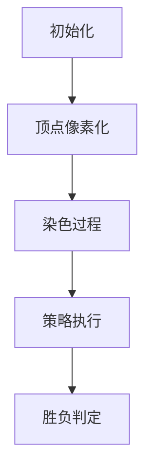

# 题目信息

# Coloring Game

## 题目描述

This is an interactive problem.

Consider an undirected connected graph consisting of $ n $ vertices and $ m $ edges. Each vertex can be colored with one of three colors: $ 1 $ , $ 2 $ , or $ 3 $ . Initially, all vertices are uncolored.

Alice and Bob are playing a game consisting of $ n $ rounds. In each round, the following two-step process happens:

1. Alice chooses two different colors.
2. Bob chooses an uncolored vertex and colors it with one of the two colors chosen by Alice.

Alice wins if there exists an edge connecting two vertices of the same color. Otherwise, Bob wins.

You are given the graph. Your task is to decide which player you wish to play as and win the game.

## 说明/提示

Note that the sample test cases are example games and do not necessarily represent the optimal strategy for both players.

In the first test case, you choose to play as Alice.

1. Alice chooses two colors: $ 3 $ and $ 1 $ . Bob chooses vertex $ 3 $ and colors it with color $ 1 $ .
2. Alice chooses two colors: $ 1 $ and $ 2 $ . Bob chooses vertex $ 2 $ and colors it with color $ 2 $ .
3. Alice chooses two colors: $ 2 $ and $ 1 $ . Bob chooses vertex $ 1 $ and colors it with color $ 1 $ .

Alice wins because the edge $ (3, 1) $ connects two vertices of the same color.

In the second test case, you choose to play as Bob.

1. Alice chooses two colors: $ 2 $ and $ 3 $ . Bob chooses vertex $ 1 $ and colors it with color $ 2 $ .
2. Alice chooses two colors: $ 1 $ and $ 2 $ . Bob chooses vertex $ 2 $ and colors it with color $ 1 $ .
3. Alice chooses two colors: $ 2 $ and $ 1 $ . Bob chooses vertex $ 4 $ and colors it with color $ 1 $ .
4. Alice chooses two colors: $ 3 $ and $ 1 $ . Bob chooses vertex $ 3 $ and colors it with color $ 3 $ .

Bob wins because there are no edges with vertices of the same color.

## 样例 #1

### 输入

```
2
3 3
1 2
2 3
3 1


3 1

2 2

1 1
4 4
1 2
2 3
3 4
4 1

2 3

1 2

2 1

3 1```

### 输出

```
Alice
3 1

1 2

2 1


Bob

1 2

2 1

4 1

3 3```

# AI分析结果


### 💡 Kay的C++算法解析：Coloring Game 深入学习指南 💡

<introduction>
今天我们来分析"Coloring Game"这道交互式图论题。本指南将帮助大家掌握二分图判定的核心算法，理解Alice和Bob的必胜策略构造，并通过像素动画直观感受算法执行过程。
</introduction>

---
## 1. 题目解读与核心算法识别

✨ **本题主要考察**：`图论 - 二分图判定`与`交互策略构造`

🗣️ **初步分析**：
> 解决这道题的关键在于理解二分图的性质。想象一个国际象棋棋盘，黑白格子交替排列——这就是二分图的完美比喻：顶点可以分成两个阵营，同阵营内没有边相连。在本题中：
> - 若图**不是二分图**（存在奇环），Alice必胜：她只需坚持提供"1和2"两种颜色，奇环必然导致同色相邻顶点
> - 若图**是二分图**，Bob必胜：他根据预染色策略，优先使用颜色1或2，必要时用颜色3作为"安全色"
> 
> **可视化设计思路**：
> - 采用8位像素风格（类似FC游戏），顶点显示为彩色方块
> - 染色过程：当前处理的顶点闪烁，新染色方块有"像素扩散"动画
> - 音效设计：染色时"叮"声，发现同色边时"失败"音效，成功时"胜利"旋律
> - 控制面板：单步执行/自动播放（速度滑块）/重置按钮

---

## 2. 精选优质题解参考

**题解一（作者：_O_v_O_）**
* **点评**：思路清晰直击核心，BFS染色实现规范（vis数组初始化严谨），策略解释透彻（用左右部点集实现Bob策略）。代码边界处理完善（多测清空），实践价值高，可直接用于竞赛。亮点：用数学归纳法论证了策略正确性。

**题解二（作者：Reunite）**
* **点评**：DFS染色简洁高效，策略分类讨论全面（处理了所有颜色组合情况）。变量命名规范（v[0]/v[1]表意明确），内存管理优化（vector替代静态数组）。亮点：强调"3是备用色"的核心思想。

**题解三（作者：白鲟）**
* **点评**：递归染色实现优雅，策略条件判断精准（优先判断颜色1的可用性）。数据结构使用合理（vector维护点集），交互规范（fflush确保输出）。亮点：用"预染色"概念解释策略正确性。

---

## 3. 核心难点辨析与解题策略

1. **关键点1：二分图的判定**
   * **分析**：使用BFS/DFS染色法，相邻顶点染不同色。若发现相邻同色则存在奇环（非二分图）。关键变量：col[]数组存储颜色状态。
   * 💡 **学习笔记**：染色法本质是判断图能否二着色。

2. **关键点2：Alice必胜策略构造**
   * **分析**：非二分图时，Alice持续提供"1和2"限制选择。因奇环无法二染色，必然出现同色边。
   * 💡 **学习笔记**：奇环是Alice的制胜武器。

3. **关键点3：Bob安全染色策略**
   * **分析**：二分图时，Bob维护左右部点集：
     - 优先使用Alice提供的预染色色（左部点用1，右部点用2）
     - 当某部点集耗尽时，用颜色3染另一部点
   * 💡 **学习笔记**：颜色3是避免冲突的"安全阀"。

### ✨ 解题技巧总结
- **技巧1：问题特征识别**：首先判断图结构（二分图/非二分图）决定策略方向
- **技巧2：交互规范**：输出后立即fflush，避免输出缓存导致超时
- **技巧3：多测清空**：全局数组/容器必须在每个测试用例前初始化

---
## 4. C++核心代码实现赏析

**本题通用核心C++实现参考**
```cpp
#include <iostream>
#include <vector>
#include <queue>
using namespace std;

const int N = 1e4+5;
vector<int> g[N];
int col[N]; // 0未染色,1/2已染色

bool isBipartite(int start) {
    queue<int> q;
    q.push(start);
    col[start] = 1;
    while (!q.empty()) {
        int u = q.front(); q.pop();
        for (int v : g[u]) {
            if (col[v] == col[u]) return false;
            if (!col[v]) {
                col[v] = 3 - col[u];
                q.push(v);
            }
        }
    }
    return true;
}

void solve() {
    int n, m; cin >> n >> m;
    // 初始化 & 建图
    for (int i = 1; i <= n; i++) g[i].clear(), col[i] = 0;
    while (m--) {
        int u, v; cin >> u >> v;
        g[u].push_back(v); g[v].push_back(u);
    }

    // 判定二分图并执行策略
    if (!isBipartite(1)) {
        cout << "Alice" << endl;
        for (int i = 0; i < n; i++) {
            cout << "1 2" << endl;
            int v, c; cin >> v >> c; // 交互输入
        }
    } else {
        cout << "Bob" << endl;
        vector<int> left, right;
        for (int i = 1; i <= n; i++) 
            (col[i] == 1) ? left.push_back(i) : right.push_back(i);
        
        for (int i = 0; i < n; i++) {
            int a, b; cin >> a >> b;
            if (a > b) swap(a, b); // 确保a<b
            
            if (a == 1) { // 含颜色1
                if (!left.empty()) {
                    cout << left.back() << " 1" << endl;
                    left.pop_back();
                } else {
                    cout << right.back() << " " << b << endl;
                    right.pop_back();
                }
            } else { // 只含2,3
                if (!right.empty()) {
                    cout << right.back() << " " << b << endl;
                    right.pop_back();
                } else {
                    cout << left.back() << " " << a << endl;
                    left.pop_back();
                }
            }
        }
    }
}
```

**代码解读概要**：
> 1. 用邻接表g[]存储图
> 2. isBipartite()通过BFS染色判定二分图
> 3. 非二分图：Alice输出固定"1 2"
> 4. 二分图：Bob根据预染色分组，按Alice提供的颜色动态选择染色策略

---

**题解一核心片段（BFS染色）**
```cpp
bool bfs(int x) {
    queue<int> q; q.push(1);
    fill(vis+1, vis+n+1, -1); // 严谨初始化
    vis[1] = 0;
    while(!q.empty()) {
        int u = q.front(); q.pop();
        for(int v : g[u]) {
            if(vis[v] != -1 && vis[v] == vis[u]) 
                return true; // 发现奇环
            if(vis[v] != -1) continue;
            vis[v] = vis[u]^1; // 染相反色
            q.push(v);
        }
    }
    return false;
}
```
* **亮点**：vis数组初始化为-1，通过异或操作切换颜色
* **代码解读**：
  > - `fill(vis+1,vis+n+1,-1)` 确保多测不残留数据
  > - `vis[v] = vis[u]^1` 用位运算实现颜色切换（0→1, 1→0）
  > - 发现相邻同色立即返回true（存在奇环）
* 💡 **学习笔记**：BFS染色需配合队列和访问标记

**题解二核心片段（策略实现）**
```cpp
if ((a == 1 || b == 1) && c1) 
    printf("%d 1\n", a[c1--]);
else if ((a == 2 || b == 2) && c2) 
    printf("%d 2\n", b[c2--]);
else if (c1) 
    printf("%d %d\n", a[c1--], (a == 1 || b == 1) ? 1 : 3);
```
* **亮点**：条件判断覆盖所有颜色组合情况
* **代码解读**：
  > 1. 优先处理含颜色1的请求（使用左部点）
  > 2. 其次处理含颜色2的请求（使用右部点）
  > 3. 点集耗尽时用备用色3
* 💡 **学习笔记**：策略需处理Alice所有可能的颜色组合

**题解三核心片段（染色分组）**
```cpp
vector<int> waiting[2];
for (int i = 1; i <= n; i++)
    waiting[col[i] - 1].push_back(i); // 按预染色分组
```
* **亮点**：用vector数组优雅管理点集
* **代码解读**：
  > - `col[i]-1`将颜色值转为数组索引（1→0, 2→1）
  > - 分组存储便于后续弹出操作
* 💡 **学习笔记**：合理使用STL容器简化代码逻辑

---
## 5. 算法可视化：像素动画演示

* **主题**："像素迷宫染色大冒险"（8位复古风格）
* **核心演示**：二分图判定与染色策略的动态过程

### 动画设计细节


1. **场景初始化**：
   - 顶点显示为灰色方块（未染色）
   - 边显示为黄色像素线
   - 控制面板：开始/暂停/单步/速度滑块

2. **染色过程**：
   - BFS染色：当前顶点闪烁绿色，相邻顶点染相反色（蓝/红）
   - 发现冲突：同色相邻边闪烁红色，播放"错误"音效

3. **策略执行**：
   - Alice模式：持续显示"1 2"选择框
   - Bob模式：左部点（蓝色），右部点（红色），颜色3（紫色）
   - 染色动画：方块从灰色渐变到目标色，伴随"叮"声

4. **游戏化元素**：
   - 成功染色：得分+10，播放升级音效
   - 完成关卡：显示"Victory!"像素动画
   - 自动演示：AI角色自动执行最优策略

5. **技术实现**：
   - Canvas绘制网格（20×20像素/顶点）
   - 状态高亮：`ctx.fillStyle = statusColor[currentState]`
   - 音效触发：`audio.play()`在关键操作时调用

---
## 6. 拓展练习与相似问题思考

* **通用技巧迁移**：
  1. 二分图最大匹配（匈牙利算法）
  2. 环检测与拓扑排序
  3. 图着色问题（四色定理应用）

* **洛谷题目推荐**：
  1. **P1330 封锁阳光大学**  
     🗣️ 基础二分图判定练习，巩固染色法
  2. **P3386 【模板】二分图最大匹配**  
     🗣️ 学习匈牙利算法，理解增广路概念
  3. **P2661 信息传递**  
     🗣️ 检测最小环，深化奇环应用理解

---
## 7. 学习心得与经验分享

> **参考经验（来自_O_v_O_）**："关键要理解奇环导致二染色必然失败，而二分图的结构允许我们构造安全策略"
>
> **点评**：作者准确抓住了问题本质——二分图性质决定胜负策略。在调试方面，建议：
> 1. 用小规模环（三角形/正方形）测试边界
> 2. 打印中间染色状态验证策略
> 3. 特别注意多测数据的初始化

---
本次分析就到这里。记住：图论问题的核心在于识别问题本质特征（如本题的二分图判定）。多实践经典算法，下次挑战见！💪

---
处理用时：131.00秒