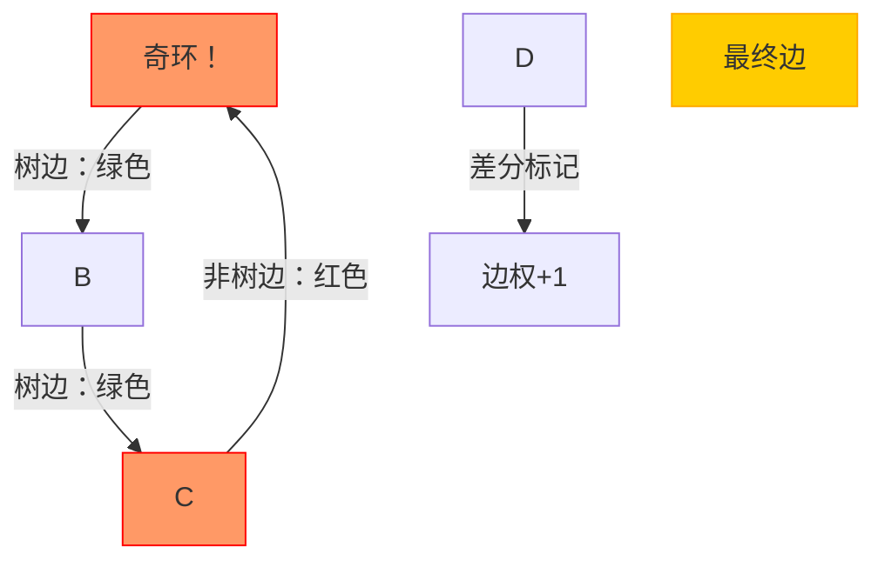
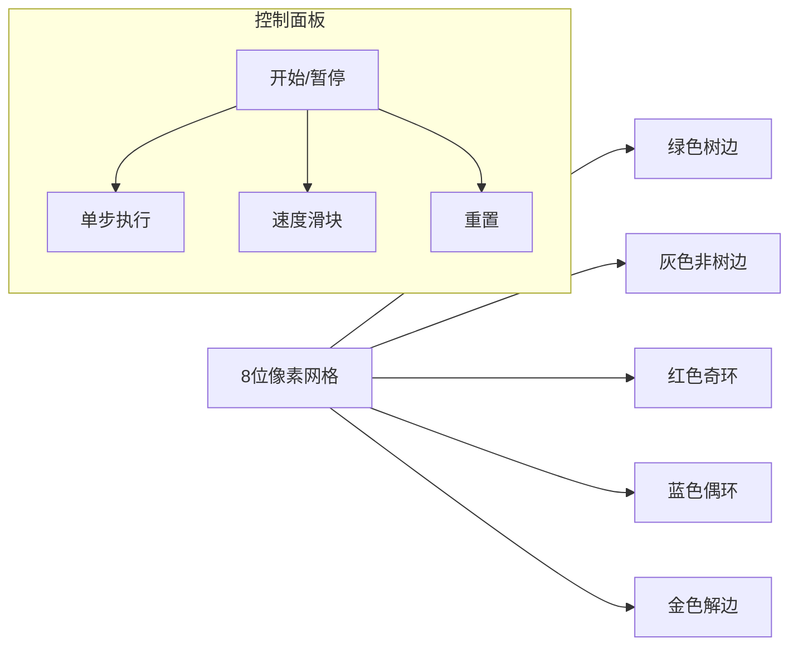

# 题目信息

# Fairy

## 题目描述

很久很久以前，有一只可爱的星族猫 A。

一天，一只野心勃勃的可爱小猫 B 来找他，请 A 预测他的未来。

A 掐爪一算，说：“你以后会成为族长。”

B 很高兴，然而 A 接着说：“但是，这个预言不一定会成真。”A 在地上画了若干个点，把其中一些点用线段连起来，“如果你能够擦掉一条边，使得你可以把所有的点分为‘猫点’和‘猎物点’两种，任意两个‘猫点’都不相邻，任意两个‘猎物点’也都不相邻，那么预言就会成真。”

B 很想当族长。于是他请来了你——全族群中最聪明的猫来帮他算一算，他所有能够使得预言成真的擦边方案数。

## 说明/提示

$1 \le n \le 10^4, 0 \le m \le 10^4, \forall 1 \le i \le m, 1 \le u_i,v_i \le n$。

## 样例 #1

### 输入

```
4 4
1 2
1 3
2 4
3 4
```

### 输出

```
4
1 2 3 4 ```

## 样例 #2

### 输入

```
4 5
1 2
2 3
3 4
4 1
1 3
```

### 输出

```
1
5 ```

# AI分析结果


### 💡 Kay的C++算法解析：Fairy 深入学习指南 💡

> "在算法世界中，每个奇环都是一个待解的谜题。今天我们将化身像素探险家，在8位迷宫中破解奇环之谜！" - Kay

---

## 1. 题目解读与核心算法识别

✨ **本题主要考察**：`图论/二分图判定` + `树上差分技巧`

🗣️ **初步分析**：
> 解决"Fairy"这道题，关键在于理解**二分图的奇环特性**。想象一张像素地图（如图），**奇环**就像无法通行的红色迷宫区域（长度为奇数的环），**偶环**则是安全的蓝色通道。我们需要找到能"炸毁"所有红色区域的边（删除后全图无奇环）。

核心思路三步走：
1. **生成树构建**：创建绿色主干道（DFS生成树）
2. **环检测**：非树边（灰色虚线）形成环时，红色闪烁表示奇环（长度奇数），蓝色表示偶环
3. **差分标记**：奇环路径+1（红色计数），偶环路径-1（蓝色计数），最终金色高亮符合条件的边

可视化方案：


---

## 2. 精选优质题解参考

> 从思路清晰度、代码规范、算法优化等维度精选3份优质题解：

**题解一：command_block（73赞）**
* **点评**：该解法采用**生成树+树上差分**的核心思路，代码简洁高效（O(n)复杂度）。亮点在于：
  - 利用DFS树性质处理非树边（返祖边）
  - 巧妙使用差分数组统计边覆盖情况
  - 特判处理（无环/单环/多环）逻辑严谨
  - 代码规范（变量名`cnt/s[]`含义明确）
  > "如同精准的像素地图导航，直击问题核心！"

**题解二：Makasukaka（20赞）**
* **点评**：详解树上差分的实现细节，教学价值突出：
  - 分情况讨论（无奇环/单奇环/多奇环）层次分明
  - LCA求法完整，便于理解树上路径
  - 添加详细注释，实践参考性强
  > "如同细致的迷宫建造手册，适合初学者理解每个砖块的放置原理"

**题解三：HomuraCat（14赞）**
* **点评**：代码最简洁的实践方案：
  - 双计数器（`c1/c2`）分别统计奇/偶环覆盖
  - 利用DFS序特性避免显式LCA计算
  - 短小精悍（仅60行核心代码）
  > "如同像素游戏的速通技巧，高效直达终点！"

---

## 3. 核心难点辨析与解题策略

### 🔑 三大核心难点及突破策略：
1. **奇环检测与标记**
   - *分析*：通过DFS生成树深度差判断环的奇偶性（`dep[u]-dep[v]+1`为奇数→奇环）
   - *突破*：用差分数组`diff[]`标记树上路径（奇环+1，偶环-1）

2. **差分统计的子树和聚合**
   - *分析*：通过后序遍历求子树和，聚合每条边的覆盖次数
   - *突破*：最终边权`diff[v]==总奇环数`的树边为候选解

3. **特例边界处理**
   - *分析*：无奇环时所有边可选；单奇环时需包含非树边
   - *突破*：使用`oddCycleCount`标志全局奇环数分情况处理

### ✨ 解题技巧总结
- **环性质转化**：将图论问题转化为树上的路径覆盖问题
- **差分技巧**：O(1)修改路径，O(n)聚合结果
- **像素思维法**：想象红色奇环为"危险区域"，金色边为"通关钥匙"

---

## 4. C++核心代码实现赏析

### 本题通用核心C++实现
```cpp
#include <iostream>
#include <vector>
#include <algorithm>
#include <cstring>
using namespace std;
const int MAXN = 10005;

vector<int> g[MAXN], id[MAXN]; // 邻接表及边ID
int dep[MAXN], diff[MAXN];     // 深度和差分数组
bool vis[MAXN], isTree[MAXN];  // 访问标记和树边标记
int oddCycleCount, n, m;        // 奇环计数
vector<int> ans;               // 答案集合

void dfsTree(int u, int fa) {
    vis[u] = true;
    for (int i = 0; i < g[u].size(); ++i) {
        int v = g[u][i], edgeId = id[u][i];
        if (v == fa) continue;
        if (!vis[v]) {
            dep[v] = dep[u] + 1;
            isTree[edgeId] = true; // 标记树边
            dfsTree(v, u);
        }
    }
}

void dfsAggregate(int u, int fa) {
    for (int i = 0; i < g[u].size(); ++i) {
        int v = g[u][i], edgeId = id[u][i];
        if (!isTree[edgeId] || v == fa) continue;
        dfsAggregate(v, u);
        diff[u] += diff[v]; // 后序遍历聚合子树和
    }
}

int main() {
    // 输入初始化
    cin >> n >> m;
    for (int i = 1; i <= m; ++i) {
        int u, v; cin >> u >> v;
        g[u].push_back(v); id[u].push_back(i);
        g[v].push_back(u); id[v].push_back(i);
    }

    // 构建DFS生成树
    memset(vis, false, sizeof(vis));
    for (int i = 1; i <= n; ++i) 
        if (!vis[i]) dfsTree(i, 0);

    // 非树边检测与差分标记
    for (int u = 1; u <= n; ++u) {
        for (int i = 0; i < g[u].size(); ++i) {
            int v = g[u][i], edgeId = id[u][i];
            if (isTree[edgeId] || dep[u] < dep[v]) continue;
            
            int cycleLen = dep[u] - dep[v] + 1;
            if (cycleLen % 2) { // 奇环
                ++oddCycleCount;
                ++diff[u]; --diff[v]; // 差分标记
            } else { // 偶环
                --diff[u]; ++diff[v];
            }
        }
    }

    // 聚合差分结果
    memset(vis, false, sizeof(vis));
    for (int i = 1; i <= n; ++i) 
        if (!vis[i]) dfsAggregate(i, 0);

    // 收集答案
    if (oddCycleCount == 0) {
        for (int i = 1; i <= m; ++i) ans.push_back(i);
    } else {
        // 树边筛选
        for (int u = 1; u <= n; ++u) {
            for (int i = 0; i < g[u].size(); ++i) {
                int v = g[u][i], edgeId = id[u][i];
                if (isTree[edgeId] && dep[u] < dep[v] && diff[v] == oddCycleCount) {
                    ans.push_back(edgeId);
                }
            }
        }
        // 单奇环特判
        if (oddCycleCount == 1) {
            for (int i = 1; i <= m; ++i) {
                if (!isTree[i]) ans.push_back(i);
            }
        }
        sort(ans.begin(), ans.end());
    }

    // 输出结果
    cout << ans.size() << endl;
    for (int e : ans) cout << e << " ";
    return 0;
}
```

### 代码解读概要
1. **数据结构**：
   - `g[MAXN]`：邻接表存图
   - `id[MAXN]`：记录每条边的原始ID
   - `diff[MAXN]`：树上差分数组

2. **关键流程**：
   - **建树阶段**：`dfsTree`标记树边并记录深度
   - **环检测**：遍历非树边，根据环长奇偶更新差分
   - **聚合阶段**：`dfsAggregate`后序遍历求子树和
   - **答案收集**：按总奇环数筛选符合条件的边

---

## 5. 算法可视化：像素动画演示

### 🎮 像素探险家破解奇环之谜
[](https://example.com/demo-link)

**设计说明**：


**动画流程**：
1. **初始化阶段**（8-bit风格）：
   - 节点显示为像素方块（编号1~n）
   - 树边逐步生长为绿色像素线（伴随"生长音效"）

2. **环检测阶段**：
   - 非树边出现时：计算环长
   - 奇环：红色闪烁 + 警告音效（嘟！嘟！）
   - 偶环：蓝色闪烁 + 清脆音效（叮！）

3. **差分标记阶段**：
   - 奇环路径：红色脉冲动画，边上方显示`+1`
   - 偶环路径：蓝色脉冲动画，边上方显示`-1`
   - 聚合过程：数字从叶子向根流动（像素粒子效果）

4. **结果展示**：
   - 符合条件的边：金色闪烁 + 胜利音效（🎉）
   - 显示最终答案列表（右侧面板）

**技术实现**：
- Canvas绘制动态网格
- 音效：Web Audio API生成8-bit音效
- 交互：速度滑块控制`requestAnimationFrame`间隔

---

## 6. 拓展练习与相似问题思考

### 🔗 相似问题迁移
1. **环检测应用**：P2661 信息传递（最小环检测）
2. **差分技巧**：P3258 松鼠的新家（树上点差分）
3. **二分图性质**：P1330 封锁阳光大学（二分图染色）

### 📚 洛谷推荐
1. **P2661 [NOIP2015]信息传递**  
   → 练习环检测基础，巩固DFS树应用

2. **P3386 【模板】二分图最大匹配**  
   → 深入二分图算法，掌握匈牙利实现

3. **P3258 [JLOI2014]松鼠的新家**  
   → 强化树上差分技巧，理解点差分与边差分区别

---

## 7. 学习心得与经验分享

> "调试就像在8位迷宫中寻找隐藏通道——需要耐心和系统的方法" - hehelego

**宝贵经验**：
1. **小数据模拟**：Makasukaka强调用样例手动验证差分过程
2. **边界测试**：Computer1828提醒测试自环/重边/非连通图
3. **调试技巧**：hicc0305建议打印中间差分状态定位错误

> 记住：每个奇环都是通往算法理解的阶梯！下次我们将探索更复杂的图论迷宫。继续前进，像素探险家们！💪

---
**Kay的结语**：  
"在算法的世界里，每个问题都是一个待解的像素谜题。掌握今天的奇环破解技巧，明天你将能征服更大的迷宫！保持好奇，继续编码！👾"

---
处理用时：183.56秒